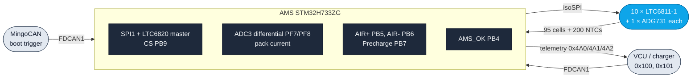
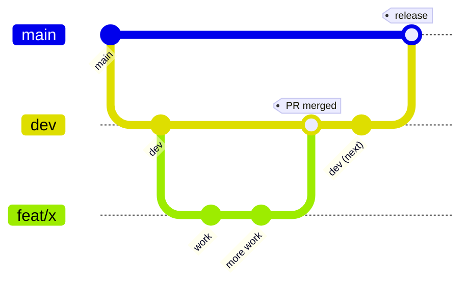

# IFS08 - CE_AMS

Embedded firmware for the **Accumulator Management System (AMS)** of the
IFS08, developed on STM32H733ZGTx with FreeRTOS (CMSIS-RTOS v2) and
C++17 application code on a CubeMX-generated HAL.

## What this firmware does

The AMS is the thing that decides whether the high-voltage pack is
allowed to be live. It monitors every cell (95 cells = 5 BMS_LITE
modules × 19, plus 200 NTC channels), drives the two AIRs and the
precharge contactor, decides when precharge is complete, runs the
per-cell balancing FETs, and holds the shutdown circuit closed through
`AMS_OK`. It reads the pack over isoSPI (an LTC6820 master driving a
daisy chain of 10 LTC6811-1 monitors, 2 per module) and talks to the
rest of the car over FDCAN1.

Three things are worth knowing before you read anything else:

- **`AMS_OK` is the AMS's *leg* of the shutdown circuit, not a sensor of
  it.** The firmware drives PB4; it never reads the SDC back. And the
  AMS_OK latch is in **hardware** — a self-holding relay plus an
  `RST_BMS` button the driver cannot reach — so firmware can never pulse
  it low and recover. Once it drops, only a physical reset press brings
  it back; a reboot will not.
- **Fault response is not a single tick.** The 10 ms supervisor drives
  the relays inline, but the four cell voltage/temperature range
  predicates and the BMS-stale predicate are debounced over 25
  consecutive ticks (≈ 250 ms) so a torn read of the lock-free cell
  snapshot cannot latch a spurious `Error`. Stacked on the 200 ms
  voltage poll that is ≈ 460 ms worst case, sized against a < 500 ms
  budget. Immediate-danger predicates (module offline, current
  over-limit, VCU stale, forced error) latch on the first tick.
- **The DC-link discharge interlock is half-built, on purpose.** The
  bleed relay is normally-closed and wired into the SDC with no software
  control: opening the SDC drains the link, but closing it again stops
  the discharge part-way and strands the link at an unpredictable
  voltage. The AMS cannot restart it (see the `AMS_OK` latch above), so
  it publishes the two facts only it can see — `0x021`
  `ACU_discharge_interlock` (`fsm_in_start`, `tsms`) — and refuses to
  leave `Start` while the ECU reports `discharge_engaged` in `0x100`
  byte 2 bit 0. **The ECU half exists**, on `IFS08-CE-ECU` `dev`: it
  consumes `0x021`, drives a coil-interrupt relay, and sends `0x100` at
  DLC 3 — so `ecu_discharge_capable` latches and both re-arm blocks are
  live. **It has never run end to end.** Each side is verified only by
  its own host tests; the two have never met on a bus. Note also that
  ECU `main` predates the feature and still sends DLC 2, in which case
  the bit reads 0 and the AMS behaves exactly as it did before.

The same firmware runs in **two contexts**, locked at arming time: **Car**
(pack in the vehicle, VCU present) and **Charger** (pack on the charging
station, VCU absent, an operator `0x101` charge request instead). The
operator arms either one with the **TSMS** master switch (PF9, held level)
plus a momentary **DASH_CHG** press (PF10, rising edge).

New here? Start with [`docs/ONBOARDING.md`](docs/ONBOARDING.md).



### Cadences

Everything below is a `constexpr` in
[`Core/Inc/app/ams_config.hpp`](Core/Inc/app/ams_config.hpp) — that file,
not this table, is the source of truth. If you change one, redo the
fault-response arithmetic above; the comments there carry it.

| What | Period | Constant |
|---|---|---|
| Safety supervisor (inside `MainTask`) | 10 ms | `SafetyPeriodMs` |
| FSM step (inside `MainTask`) | 20 ms | `StatePeriodMs` |
| Pack-current ADC sample | 50 ms | `CurrentPeriodMs` |
| Relay / `AMS_OK` GPIO read-back `0x4A4` | 100 ms | `RelayStatusPeriodMs` |
| Cell-voltage poll (ADCV + RDCVA..D) | 200 ms | `BmsPollVoltMs` |
| Temperature sweep (20 mux channels × 10 ICs) | 250 ms | `BmsPollTempMs` |
| SD log sample | 250 ms | `LogSamplePeriodMs` |
| Telemetry `0x4A0`/`0x4A1`/`0x4A2` | 500 ms | `TelemetryPeriodMs` |
| IWDG1 timeout | ~100 ms | `MX_IWDG1_Init` in `main.c` (prescaler 32, reload 100) |

Seven threads are created in `main()`: `MainTask` (the CubeMX thread is
still named `SafetyTask`) is the only `osPriorityRealtime` one and owns
safety + FSM + relays + telemetry on one timeline. `App_InitTask` runs
once and exits; `AcuCanTask`, `CurrentSensorTask`, `BmsPollTask` and
`SdLoggerTask` are the producers; `defaultTask` is an idle CMSIS
placeholder. Full table with priorities and stacks:
[`docs/ARCHITECTURE.md`](docs/ARCHITECTURE.md) §3.

---

## Build

CMake end-to-end — there is no CubeIDE/Eclipse-managed makefile. Two
targets: the cross-compiled firmware image and the host-side test binary.

```bash
# 1. Host unit + SIL tests. No hardware needed — start here.
cmake -B build-tests -S tests/unit
cmake --build build-tests
ctest --test-dir build-tests --output-on-failure

# 2. Firmware (cross-compile, arm-none-eabi-gcc 14.x)
cmake -B build -DCMAKE_TOOLCHAIN_FILE=cmake/gcc-arm-none-eabi.cmake
cmake --build build
arm-none-eabi-size build/AMS.elf
python3 scripts/check_flash_layout.py build/AMS.elf   # must PASS before flashing

# 3. HIL bench build — auto-wipes the sticky ErrorLatch on every boot.
#    Never flash this onto the car. Details: docs/HIL_BUILD.md
cmake -B build-hil -DCMAKE_TOOLCHAIN_FILE=cmake/gcc-arm-none-eabi.cmake \
                   -DAMS_HIL_CLEAR_ERROR_LATCH=ON
cmake --build build-hil
```

`ctest` prints `1/1 Test ... Passed` — that is the single Unity *runner*,
not the case count. For the real total run the binary directly:

```bash
./build-tests/ams_unit_tests    # ends with "473 Tests 0 Failures 0 Ignored"
```

`CMakePresets.json` also offers Ninja-based `Debug` / `Release` presets
that already point at the cross toolchain, but they put the image at
`build/<preset>/AMS.elf`, not `build/AMS.elf` — adjust the paths above if
you use them. CI uses the plain form.

Prerequisites: `arm-none-eabi-gcc` 14.x (CI pins `14.2.Rel1`), CMake
≥ 3.22, Python 3 for `scripts/check_flash_layout.py`.

### Why the flash-layout check exists

The image links at **`0x08020000`**, not at the reset vector. Sector 0
(`0x08000000`–`0x0801FFFF`) belongs to the CAN bootloader and sector 7 is
its NVM; the app owns sectors 1–6 (768 KB). An image that spills into
either region bricks the CAN update path — the only way firmware gets
onto a board. `scripts/check_flash_layout.py` asserts the `.isr_vector`
LMA is exactly `0x08020000` and that nothing lands outside the app
region. CI runs it on every firmware build and again at release.

### CI

[`.github/workflows/build-tests.yml`](.github/workflows/build-tests.yml)
runs three jobs — firmware cross-compile (+ the flash-layout guard), the
host Unity suite, and a "DBC matches code" check that regenerates
`docs/dbc/ams.dbc` from the code-first CAN descriptors and diffs it
against the committed file. It triggers on pushes to `feat/**`, `fix/**`,
`dev`, `main`, and on PRs into `dev`. **A branch named anything else
(`chore/…`, `docs/…`) gets no CI on push** — it is only checked once you
open the PR.

A separate `dbcinator` bot regenerates the DBC on every PR and pushes it
back onto the branch, so you normally do not have to.

---

## Repo layout

```
Core/Inc/app/, Core/Src/app/   hand-written C++17 application code
Core/Inc/can/                  code-first CAN DSL; messages/*.def are the
                               single source of truth for every frame layout
Core/Src/main.c, freertos.c    CubeMX-owned — never hand-edit outside
                               USER CODE BEGIN/END blocks
Drivers/, Middlewares/, FATFS/ CubeMX-generated HAL / FreeRTOS / FatFs
cmake/                         toolchain files + the CubeMX source list
tests/unit/                    host Unity + SIL suite (no hardware, no RTOS)
tools/                         dbc_dump.cpp (DBC generator), bms_monitor.py
scripts/                       check_flash_layout.py
docs/                          everything in the table below
AMS.ioc                        CubeMX project — regenerating rewrites main.c
```

Application code is invoked from CubeMX's thread bodies in `main.c`
through `extern "C"` `ams_*_task_run` trampolines, each inside a
`USER CODE BEGIN Start<Name>Task` block. Anything you put in a
CubeMX-generated file outside such a block is wiped the next time someone
opens `AMS.ioc`.

Hardware artefacts (schematics, layouts, gerbers) are **not** in this
repo — `/pcb/` and `/pcbs/` are gitignored on purpose. They live in the
PCB repos; ask the hardware lead for the connector pinout.

---

## Documentation

New to the project? Read [`docs/ONBOARDING.md`](docs/ONBOARDING.md)
first — it sequences everything below.

| Document | What it covers | When to read |
|---|---|---|
| [`docs/ONBOARDING.md`](docs/ONBOARDING.md) | Day-1 guide: what the AMS is, toolchain setup, a guided reading order, where everything lives. | **Start here.** |
| [`docs/GLOSSARY.md`](docs/GLOSSARY.md) | Every domain term — AIR, SDC, TSMS, DASH_CHG, precharge, isoSPI, PEC, ACU, VCU, pit-diag, … | Keep open while reading anything else. |
| [`docs/ARCHITECTURE.md`](docs/ARCHITECTURE.md) | The as-built reference: safety invariants, task table, data flow, FSM, boot sequence, memory budget, C++ rules, file layout. | First deep read. Everything assumes §1 (invariants) and §3 (tasks). |
| [`docs/FSM_OVERVIEW.md`](docs/FSM_OVERVIEW.md) | Gate-by-gate safety FSM: states, the Car/Charger mode lock, TSMS/DASH_CHG inputs, per-state transitions, on-wire byte values. | Before changing the FSM or writing bench tests for it. |
| [`docs/DEEP_DIVE.md`](docs/DEEP_DIVE.md) | End-to-end walkthrough — every task, service and subsystem mapped to source. | When you want the whole picture in one pass. |
| [`docs/BMS_LTC6811.md`](docs/BMS_LTC6811.md) | LTC6811 / LTC6820 / ADG731 wire protocol, register groups, cell + NTC slot maps, PEC15, balancing. | Before touching `Core/{Inc,Src}/app/{ltc6811,ltc6820,bms_*,balance_*,open_wire}.*`. |
| [`docs/CAN_MAP.md`](docs/CAN_MAP.md) | The FDCAN1 wire protocol — vehicle, charger, pit-diag, boot trigger. The app is FDCAN1-only; the bootloader is a separate sector-0 image that brings up its own CAN. | Before touching anything CAN-side. |
| [`docs/COMMISSIONING.md`](docs/COMMISSIONING.md) | Bench + on-vehicle calibration of every `COMMISSION`-tagged constant in `ams_config.hpp`. | Before flashing the first time, and any time you move a threshold. |
| [`docs/COMMISSIONING_CHECKLIST.md`](docs/COMMISSIONING_CHECKLIST.md) | One-page sign-off sheet: every `COMMISSION` constant with default, units, what to measure, tick-boxes. | The record for the bench commissioning session. |
| [`docs/FMEA.md`](docs/FMEA.md) | Failure modes, their detection path, and the open risks nobody has closed yet. | Before arguing that a fault "can't happen". |
| [`docs/HIL_BUILD.md`](docs/HIL_BUILD.md) | The `AMS_HIL_CLEAR_ERROR_LATCH` build flag — what it does, why, and why it must never reach a flight build. | When setting up the HIL bench rig. |
| [`ROADMAP.md`](ROADMAP.md) | Phase plan + branch status. Generated from `.github/roadmap.yaml`; never hand-edit. | When you want to know what shipped. |
| [`CONTRIBUTING.md`](CONTRIBUTING.md) | Branch / PR / label conventions, "how to add a CAN frame" and "how to add a task" recipes, C++ rules. | Before you open your first PR. |
| [`CLAUDE.md`](CLAUDE.md) | Fast orientation + the doc/comment conventions this repo enforces. | Skim it before writing docs or comments. |

The HIL acceptance plan — the living bench-test matrix that gates a
`dev → main` release — and the Pi Pico LTC6820/LTC6811 emulator live
**outside this repo**. Ask the HIL owner for the current locations rather
than trusting a link here.

---

## Getting started

1. Install Git (or [GitHub Desktop](https://desktop.github.com/) if you
   have never used Git). If Git is new to you, work through the
   [Git tutorial](https://git-scm.com/docs/gittutorial) or the
   [Atlassian one](https://www.atlassian.com/git/tutorials/) first.
2. Clone the repository:
   - SSH: `git@github.com:isc-fs/IFS08-CE-AMS.git`
   - HTTPS: `https://github.com/isc-fs/IFS08-CE-AMS.git`
3. A fresh clone leaves you on **`main`** (the repo's default branch, and
   the production one). Switch before doing anything: `git checkout dev`.
   All work branches off `dev`.
4. Install `arm-none-eabi-gcc` 14.x and CMake ≥ 3.22.
5. Run the host test build (step 1 under [Build](#build)). If `473 Tests
   0 Failures` comes out, your toolchain is good — you can do most
   logic work from here without touching hardware.
6. Read [`docs/ONBOARDING.md`](docs/ONBOARDING.md), then
   [`docs/ARCHITECTURE.md`](docs/ARCHITECTURE.md) §1 (safety invariants)
   and §3 (task table) before changing any firmware code.

---

## How we work with this repository

Two permanent branches:

- **`main`** — production. Only validated code that can be flashed onto
  the car. Never work directly on it.
- **`dev`** — integration. Everyone's work lands here through a PR from a
  feature branch. Never commit directly to it either.



Work branches are `feat/<slug>` (new functionality) or `fix/<slug>` (bug
fix), cut from `dev`, merged into `dev` by PR, then deleted. Pushing one
opens a tracking issue automatically, which becomes the branch's
permanent record once the PR closes it.

The full rules — branch naming and the numbering caveat, commit message
format, what a PR needs before review, labels, and the recipes for adding
a CAN frame / an LTC command / a task — are in
[`CONTRIBUTING.md`](CONTRIBUTING.md). Read it before your first PR.

### Releases

`dev → main` is a *release*, not a routine merge: it happens only after
the HIL acceptance plan is green on the same firmware SHA. The release
itself is cut by pushing a `v*` tag onto the resulting merge commit;
[`.github/workflows/release.yml`](.github/workflows/release.yml) then
cross-compiles, re-verifies the `0x08020000` entry point, re-runs the
tests, regenerates the DBC from the tagged sources, and publishes
`AMS.elf` / `AMS.bin` / `AMS.hex` / `ams.dbc` as GitHub Release assets.
The DBC is regenerated at the tag on purpose, so a consumer downloading
the image and the database from one release knows they describe the same
wire bytes. The version string comes from the `VERSION` file; bump it in
its own commit before tagging.

---

*ISC Racing Team — IFS08 Car Electronics*
