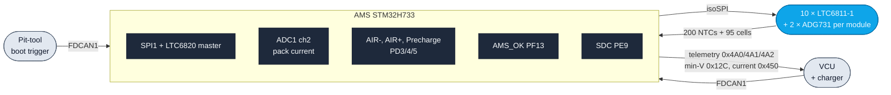
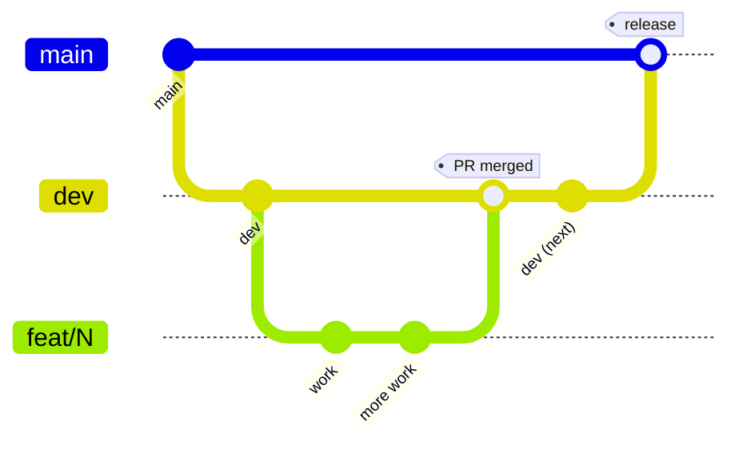

# IFS08 - CE_AMS

Embedded firmware for the **Accumulator Management System (AMS)** of the
IFS08, developed on STM32H733ZGTx with FreeRTOS (CMSIS-RTOS v2) and
C++17 application code.

## What this firmware does

In one paragraph: the AMS monitors every cell in the high-voltage pack
(95 cells across 5 BMS_LITE modules), drives the AIRs and precharge
relay, decides when it's safe to leave the pre-charge state, runs the
balancing FETs while charging, and shuts the pack down within ~10 ms
the moment any safety threshold is crossed. It talks to the VCU over
FDCAN1 and to the BMS over isoSPI (LTC6820 → daisy-chained LTC6811-1
monitors). There is one realtime-priority safety supervisor that
overrides everything else.



The pack-monitoring loop runs at **250 ms** (cell voltages, ADCV + 4×
RDCV*), the temperature sweep at **500 ms** (20-channel mux on each
of the 10 LTCs, 200 NTCs total), the safety supervisor at **10 ms**,
the FSM at **20 ms**, and the watchdog timeout is **~100 ms**.

---

## Documentation

Read in this order:

| Document | What it covers | When to read |
|---|---|---|
| [`docs/ARCHITECTURE.md`](docs/ARCHITECTURE.md) | Safety invariants, task layout, data-flow + FSM mermaid diagrams, boot sequence, memory budget, file layout. | First. Everything else assumes you've read §1 (safety invariants) and §3 (task table). |
| [`docs/BMS_LTC6811.md`](docs/BMS_LTC6811.md) | LTC6811 / LTC6820 / ADG731 wire protocol, register groups, cell + NTC slot maps, PEC15, balancing CFGR layout. | Before touching anything under `Core/{Inc,Src}/app/{ltc6811,ltc6820,bms_*,balance_*}.{h,hpp,cpp}`. |
| [`docs/CAN_MAP.md`](docs/CAN_MAP.md) | Vehicle / charger / boot-trigger CAN wire protocol on FDCAN1 (FDCAN2 is bootloader-only since v1.2.0). | Before touching anything CAN-side. |
| [`docs/COMMISSIONING.md`](docs/COMMISSIONING.md) | Bench + on-vehicle calibration of every `COMMISSION`-tagged constant in `ams_config.hpp`. | Before flashing the first time, and any time you adjust a threshold. |
| [`docs/HIL_TESTS.md`](docs/HIL_TESTS.md) | Hardware-in-the-loop test plan. 60+ tests in 6 blocks. Defines the v1.1.0-bootloader and v1.2.0-ltc6811 acceptance gates. | Before signing off a release tag. |
| [`docs/HIL_STUB.md`](docs/HIL_STUB.md) | The `AMS_BMS_HIL_STUB` build flag — what it disables, when to use it, why it must never reach a flight build. | When setting up a bench-only test rig that doesn't have a real LTC chain attached. |
| [`ROADMAP.md`](ROADMAP.md) | Auto-generated phase plan + branch status badges. | When you want to know what's next or what shipped. |
| [`CONTRIBUTING.md`](CONTRIBUTING.md) | Branch / PR / label conventions, "how to add a CAN frame" / "how to add a new task" recipes, C++ rules. | Before you open your first PR. |

## Build

The build system is **CubeMX-generated CMake** (no Eclipse-managed
makefile). Two targets: the cross-compiled firmware image and the
host-side unit-test binary. CI exercises both on every push.

```bash
# Firmware (cross-compile)
cmake -B build -DCMAKE_TOOLCHAIN_FILE=cmake/gcc-arm-none-eabi.cmake
cmake --build build
# Output: build/AMS.elf — flash via stm32-can-bootloader or ST-Link SWD.

# Host unit tests (~95 tests, ~0.5 s)
cmake -B build-tests -S tests/unit
cmake --build build-tests
ctest --test-dir build-tests --output-on-failure

# HIL stub build (bench rig with no LTC chain attached; details: docs/HIL_STUB.md)
cmake -B build-hil -DCMAKE_TOOLCHAIN_FILE=cmake/gcc-arm-none-eabi.cmake \
                   -DCMAKE_CXX_FLAGS="-DAMS_BMS_HIL_STUB=1"
cmake --build build-hil
```

Both regular builds run on every push and PR via
[`.github/workflows/build-tests.yml`](.github/workflows/build-tests.yml).

Pre-flight check: `scripts/check_flash_layout.py build/AMS.elf` must
PASS before any image is flashed onto a real board (sector 0 reserved
for the bootloader; the script catches any image that lands there).

---

## Getting started

1. Create a GitHub account if you don't have one yet.
2. Download and install [GitHub Desktop](https://desktop.github.com/) (beginner) or [Git CLI](https://git-scm.com/book/en/v2/Getting-Started-Installing-Git) (advanced).

   - If this is your first time using GitHub Desktop, make sure to read the [User Manual](https://help.github.com/desktop/guides/).
   - If this is your first time using Git, start with a tutorial. There are many available online:
     - [Git Tutorial](https://git-scm.com/docs/gittutorial)
     - [Atlassian Git Tutorial](https://www.atlassian.com/git/tutorials/)
   - Keep a copy of [GitHub's Git Cheat Sheet](https://services.github.com/kit/downloads/github-git-cheat-sheet.pdf) handy as a reference.

3. Clone this repository to your machine:
   - SSH: `git@github.com:isc-fs/IFS08-CE-AMS.git`
   - HTTPS: `https://github.com/isc-fs/IFS08-CE-AMS.git`
4. Install the cross-compiler (`arm-none-eabi-gcc 14.x`) and CMake ≥ 3.22.
5. Run the host unit-test build (`cmake -B build-tests -S tests/unit && cmake --build build-tests && ctest --test-dir build-tests`). If that passes you have a working toolchain.
6. Read [`docs/ARCHITECTURE.md`](docs/ARCHITECTURE.md) §1 (safety invariants) and §3 (task table) before changing any firmware code.

---

## How we work with this repository

### Main branches

The repository has two permanent branches:

**`main`** is the production branch. It contains only validated code
that can be flashed onto the car. Never work directly on it.

**`dev`** is the development branch. It is the integration point
where everyone's work comes together. Never work directly on it
either — all changes arrive through a feature branch.



### Feature branches

All work — whether a new feature or a bug fix — is done on a
**feature branch** created from `dev`. When the work is ready, a
Pull Request is opened toward `dev`, reviewed, merged, and the
branch is deleted.

There are two branch types, each with its own independent numeric
counter. Every branch name carries a short kebab-case title after
the number so its purpose is visible at a glance:

```
feat/<n>-<short-title>   →  new functionality  (feat/1-frame-layout, feat/2-isotp, ...)
fix/<n>-<short-title>    →  bug fix            (fix/1-wrp-race,      fix/2-crc-pad,  ...)
```

The short title should be 2–4 lowercase words joined by dashes. The
`feat` and `fix` counters are independent: `feat/2-…` and `fix/2-…`
can exist at the same time with no conflict.

### Tracking branch history

Feature branches are deleted after merging to keep the repository
clean. The history of each branch is preserved in **GitHub Issues**.

Every branch has one associated issue. The issue carries a **label**
(`feat` or `fix`) and its title includes the full branch name, for
example: `[feat/3-can-broadcast] Add CAN broadcast for mission state`.
When the branch is merged and deleted, the issue is closed —
becoming a permanent record of all the work done.

To see which branches are currently active: filter issues by label
and status `open`.
To browse the full history: filter by label and status `closed`.
The number for the next branch of each type is the last closed issue
of that type plus one.

> Example: if the last closed issue with label `feat` is
> `[feat/4-…] ...`, the next feature branch will be
> `feat/5-<your-title>`.

---

## Automation

The repository includes a GitHub Actions workflow that manages
tracking issues automatically. No setup is required — it works for
every developer as soon as they create a branch.

### Automatic issue creation

When a `feat/*` or `fix/*` branch is pushed to GitHub, the workflow
automatically opens an issue with:

- A title that mirrors the branch name — `[feat/N-short-title]` or `[fix/N-short-title]`
- The correct label (`feat` or `fix`)
- A template with sections for describing the work and adding notes
- The name of the developer who created the branch

### Wrong number warning

If the branch number is not the next expected one (either too low or
too high), the issue will display a warning indicating the correct
number and asking the developer to delete and recreate the branch
with the right name.

### Auto-fill description from first commit

When the developer makes their first commit and pushes it, the
workflow automatically updates the *"What does this branch do?"*
section of the issue with that commit message.

- If the developer manually edits the issue before pushing their first commit, the workflow will not overwrite the description.
- The description is only updated once — subsequent commits do not modify the issue.

### Auto-close linked issues on PR merge

When a PR merges into `dev`, the `close-on-dev-merge` workflow scans
the PR body for `Closes #N` (or `Fixes #N`, `Resolves #N`) and closes
each referenced issue with a back-link to the merging PR.

The workflow handles comma-separated lists: `Closes #75, #76, #77`
closes all three. `Closes #1 and #2`, `Fixes #4, and #5`, and the
repeated form `Closes #75, Closes #76` are all accepted.

---

## Step-by-step workflow

### 1. Create the branch

```bash
# Make sure you are on an up-to-date dev
git checkout dev
git pull origin dev

# Create your branch using the next available number for its type
# (last closed issue of that type + 1) plus a short kebab-case title
git checkout -b feat/5-frame-layout    # or fix/3-wrp-race, etc.
```

> To find the right number: go to **Issues → filter by label `feat` or `fix` → sort by newest** and read the last number.

### 2. Push the branch

```bash
git push origin feat/5-frame-layout
```

The tracking issue will be opened automatically on GitHub within seconds.

### 3. Work and commit

```bash
# Make your changes and commit with a clear, descriptive message
git add .
git commit -m "short description of what this commit does"

# Push the changes
git push origin feat/5-frame-layout
```

The message of your **first commit** will be used to automatically
fill in the issue description.

### 4. Open a Pull Request

When the work is ready, open a Pull Request on GitHub from your
branch toward `dev`. In the PR description write `Closes #<issue>`
so the issue closes automatically when the PR is merged. For
multiple referenced issues, `Closes #75, #76, #77` is supported.

Before requesting a review, check that:
- The code compiles with no errors or warnings
- Host unit tests still pass (`ctest --test-dir build-tests`)
- The image still fits the flash budget (`scripts/check_flash_layout.py build/AMS.elf`)
- You have tested the change on the bench if applicable
- The PR targets `dev`, not `main`

### 5. Review and merge

Another team member will review the PR. Once approved, it is merged
into `dev` and the branch is deleted. The issue will be closed as a
permanent record.

### 6. Merging into main

When `dev` holds a set of validated changes that are ready for the
car, a responsible team member opens a Pull Request from `dev` into
`main`. This only happens after full firmware validation
([`docs/HIL_TESTS.md`](docs/HIL_TESTS.md) acceptance gate green on
the same firmware SHA).

---

*ISC Racing Team — IFS08 Car Electronics*
