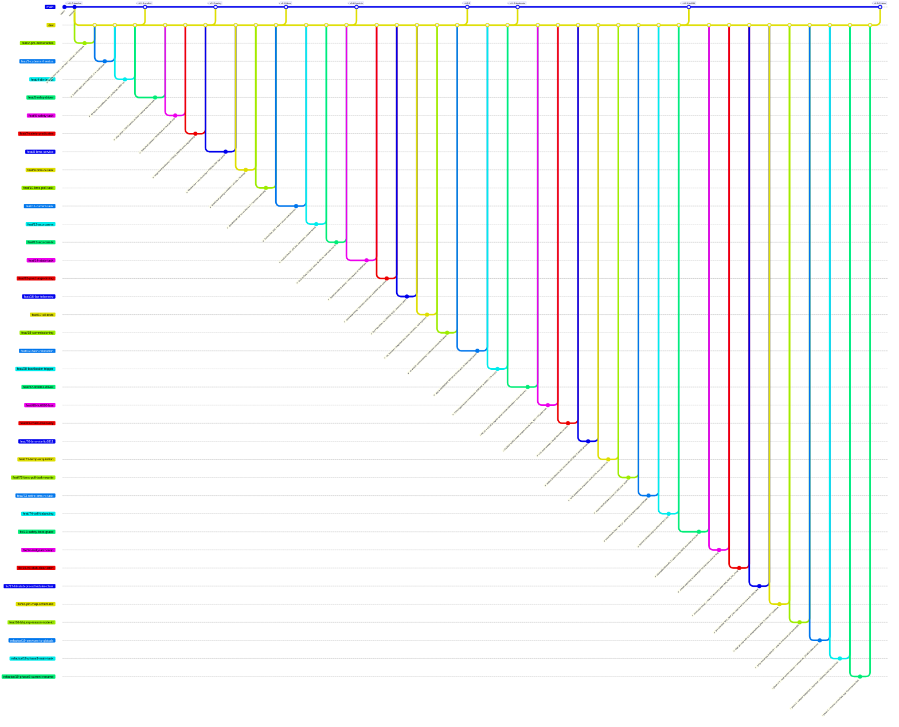

<!--
  Auto-generated from .github/roadmap.yaml by
  .github/scripts/render_roadmap.py. Do not edit this file directly —
  changes will be overwritten on the next run of the `Render ROADMAP`
  workflow. Edit the YAML or close / reopen a tracking issue instead.
-->

# AMS roadmap

Refactor roadmap for the IFS08-CE Accumulator Management System (AMS).
We are porting the legacy bare-metal AMS firmware (originally living in
`isc-fs/IFS08-CE/AMS`) to a FreeRTOS-based architecture in this dedicated
repository, targeting the STM32H733ZGTx.

Each phase is a cluster of feat branches cut from `dev`; a milestone tag
on `main` closes the phase once every branch in it has merged. Branch
status badges (✅ / 🔄 / 🔜) are derived from each branch's tracking
issue state in GitHub Issues.

**v1.0.0** is tagged at the end of Phase 5 — the AMS is feature-complete
for vehicle commissioning. **v1.1.0** at the end of Phase 6 makes the
image bootloader-compatible (lives in flash sectors 1..6 and can be
flashed in-system via [stm32-can-bootloader](https://github.com/isc-fs/stm32-can-bootloader)).
Subsequent work (charger profiles, balancing tuning, telemetry over
CAN-FD) lives outside the v1 scope.

## Phase summary

| Phase | Title | Branches | Milestone tag |
|:---:|---|---|---|
| 1 | Project bootstrap | ✅ done `feat/2-pm-deliverables` · ✅ done `feat/3-cubemx-freertos` · ✅ done `feat/4-dir-layout` | `v0.1.0-scaffold` |
| 2 | Safety supervisor | ✅ done `feat/5-relay-driver` · ✅ done `feat/6-safety-task` · ✅ done `feat/7-safety-predicates` | `v0.2.0-safety` |
| 3 | BMS communications | ✅ done `feat/8-bms-service` · ✅ done `feat/9-bms-rx-task` · ✅ done `feat/10-bms-poll-task` | `v0.3.0-bms` |
| 4 | Current + accumulator CAN | ✅ done `feat/11-current-task` · ✅ done `feat/12-acu-can-rx` · ✅ done `feat/13-acu-can-tx` | `v0.4.0-pack-io` |
| 5 | State machine + integration | ✅ done `feat/14-state-task` · ✅ done `feat/15-precharge-timing` · ✅ done `feat/16-fan-telemetry` · ✅ done `feat/17-sil-tests` · ✅ done `feat/18-commissioning` | `v1.0.0` |
| 6 | Bootloader integration | ✅ done `feat/19-flash-relocation` · ✅ done `feat/20-bootloader-trigger` | `v1.1.0-bootloader` |
| 7 | LTC6811-1 BMS migration | 🔜 planned `feat/67-ltc6811-driver` · 🔜 planned `feat/68-ltc6820-bus` · ✅ done `feat/69-chain-discovery` · ✅ done `feat/70-bms-via-ltc6811` · ✅ done `feat/71-temp-acquisition` · ✅ done `feat/72-bms-poll-task-rewrite` · ✅ done `feat/73-retire-bms-rx-task` · ✅ done `feat/74-cell-balancing` | `v1.2.0-ltc6811` |
| 8 | Simplification refactor | ✅ done `fix/13-safety-boot-grace` · ✅ done `fix/14-iwdg-latch-loop` · ✅ done `fix/15-hil-stub-clear-latch` · ✅ done `fix/17-hil-stub-pre-scheduler-clear` · ✅ done `fix/18-pin-map-schematic` · ✅ done `feat/16-bl-jump-reason-node-id` · 🔜 planned `refactor/19-services-to-globals` · 🔜 planned `refactor/19-phase3-main-task` · 🔜 planned `refactor/19-phase5-current-rename` | `v1.3.0-flatten` |
| — | Workflow polish _(sidequest)_ | ✅ done `feat/1-autoclose-on-dev-merge` · ✅ done `fix/1-workflow-titled-branches` | — |

## Branch diagram

---

## How this file is maintained

- **Source of truth**: [`.github/roadmap.yaml`](.github/roadmap.yaml)
- **Renderer**: [`.github/scripts/render_roadmap.py`](.github/scripts/render_roadmap.py)
- **Workflow**: [`.github/workflows/roadmap.yml`](.github/workflows/roadmap.yml)

The workflow runs on every push to `dev`. If any branch status changed
(a tracking issue was closed, the YAML was edited, a new branch was
added) it regenerates this file and auto-commits with the message
`chore: regenerate ROADMAP.md [skip ci]`.
