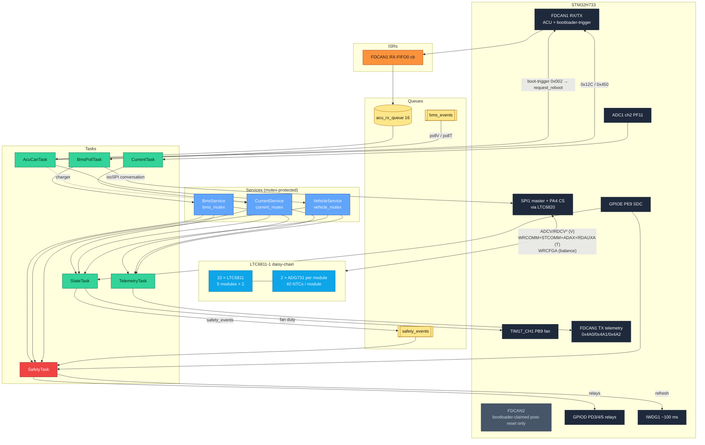
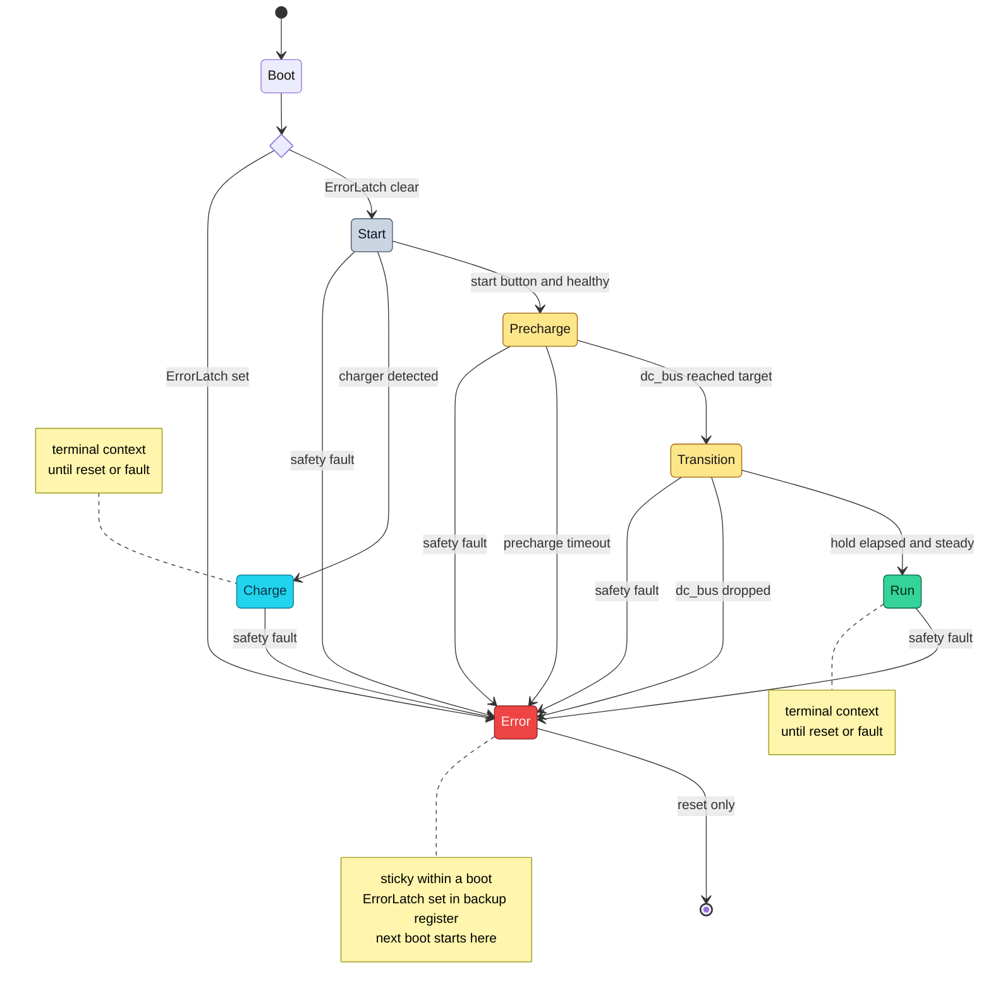
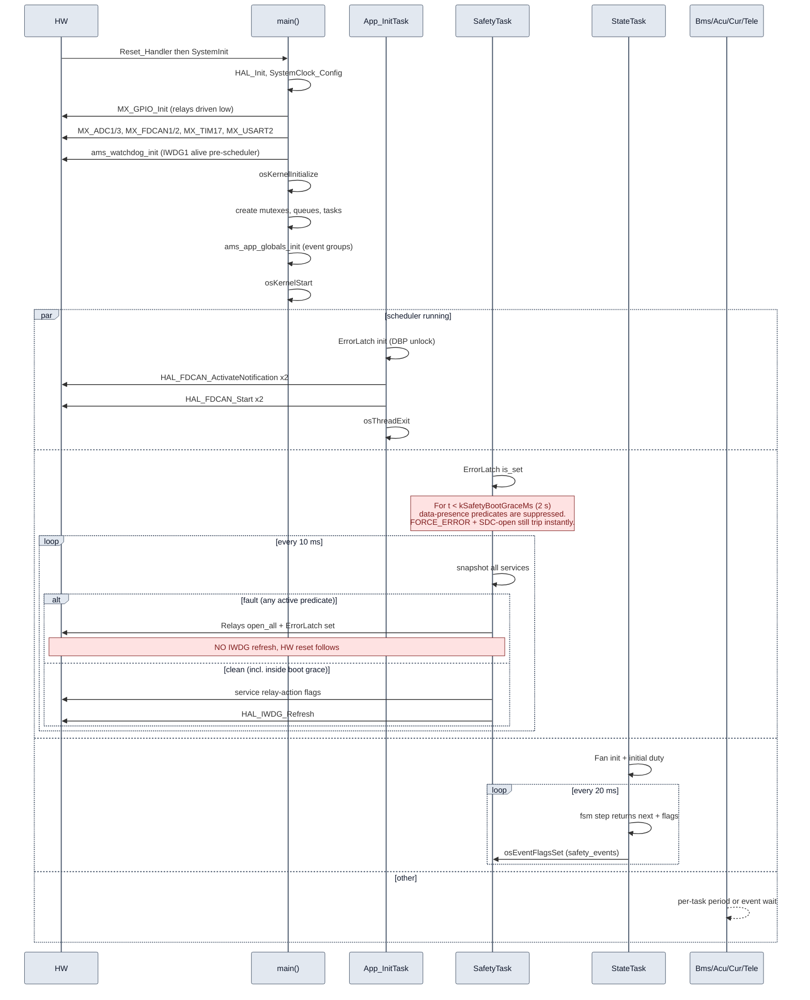

# AMS firmware architecture

Target hardware: STM32H733ZGTx (Cortex-M7 @ 264 MHz core, 1 MB Flash,
~1 MB RAM). RTOS: FreeRTOS via CMSIS-RTOS v2 (1000 Hz tick).
Language: C++17 for application code (no exceptions, no RTTI, no
thread-safe statics) on top of CubeMX-generated C for the HAL/RTOS
boilerplate.

This document is the **as-built** reference. The reverse-engineered
legacy protocol is in [`CAN_MAP.md`](CAN_MAP.md); the bench /
on-vehicle calibration procedure is in
[`COMMISSIONING.md`](COMMISSIONING.md).

---

## 1. Safety invariants

Everything else exists to enforce these:

1. **If the pack is unsafe, AIRs open within one safety period
   (10 ms).** "Unsafe" = any of the predicates in
   [`Core/Inc/app/safety_predicates.hpp`](../Core/Inc/app/safety_predicates.hpp).
2. **Relays default to open** on any reset, fault, or uninitialised
   state. CubeMX-generated `MX_GPIO_Init` writes `PIN_RESET` to
   PD3 / PD4 / PD5 **before** configuring them as outputs.
3. **No single stuck task can prevent an AIR open.** `SafetyTask`
   runs at `osPriorityRealtime`, has direct GPIO write access via
   `ams::Relays`, and owns the watchdog refresh.
4. **The watchdog is fed only on `SafetyTask`'s clean path.** A
   stuck supervisor → IWDG timeout (≈100 ms) → hardware reset →
   relays default open.
5. **ERROR is latched across resets** via `RTC->BKP1R` (magic
   `0xA115EE51`). Cleared only by full backup-domain power loss.
   `BKP0R` is reserved for the bootloader's boot-request handshake
   (`0xB00710AD`); the two registers must never share a word.
6. **Shared sensor state has one writer.** Each domain has its own
   mutex; readers `snapshot()` under the lock and work off a copy.
7. **Boot-grace window suppresses data-presence predicates for
   `kSafetyBootGraceMs` (2 s) after `osKernelStart`.** At t = 0 every
   service's `last_*_tick` is 0; without a grace the first SafetyTask
   iteration would fault on freshness and withhold the watchdog
   refresh, triggering an IWDG reset within ~100 ms — a latch-loop
   the chip cannot escape. The window covers BmsPollTask's first
   voltage poll (250 ms), CurrentTask's first ADC sample (50 ms),
   and AcuCanTask's first VCU 0x100 (uncontrolled but typically
   present). **Immediate-safety predicates stay active during the
   grace**: `FORCE_ERROR` and SDC-open still trip instantly. Only
   data-dependent predicates wait. See
   [`safety_predicates.hpp`](../Core/Inc/app/safety_predicates.hpp)
   line 48 and the inline comment on `kSafetyBootGraceMs` in
   [`ams_config.hpp`](../Core/Inc/app/ams_config.hpp).

> The HIL bench rig uses the `AMS_BMS_HIL_STUB` build flag to
> deliberately violate invariants 5 and parts of 1 / 7 (the BMS-
> side predicates). It is **never compiled into a flight build**.
> Full semantics in [`HIL_STUB.md`](HIL_STUB.md); a flight-release
> SHA check that proves the flag is absent is documented there too.

---

## 2. Build model

CubeMX 6.16 generates a **CMake-based** project (not Eclipse-managed-
make). The boundary between generated and hand-written code:

```mermaid
flowchart LR
    subgraph Gen["CubeMX-owned (regenerated from AMS.ioc)"]
        G1[Core/Src/main.c<br/>Core/Src/freertos.c<br/>Core/Src/stm32h7xx_*.c]
        G2[Drivers/STM32H7xx_HAL_Driver/]
        G3[Middlewares/Third_Party/FreeRTOS/]
        G4[cmake/stm32cubemx/CMakeLists.txt]
    end
    subgraph Hand["Hand-written (lives forever)"]
        H1[Core/Inc/app/*.hpp + *.h]
        H2[Core/Src/app/*.cpp]
        H3[CMakeLists.txt<br/>top-level, edited once]
        H4[tests/unit/<br/>host CMake + Unity]
    end
    Gen -. "USER CODE BEGIN ... END blocks<br/>call ams_*_task_run trampolines" .-> Hand

    classDef gen  fill:#fde68a,stroke:#a16207,color:#1c1917
    classDef hand fill:#34d399,stroke:#065f46,color:#052e16
    class G1,G2,G3,G4 gen
    class H1,H2,H3,H4 hand
```



C++ code never modifies the generated `main.c`. Instead it provides
`extern "C"` trampolines (`ams_safety_task_run`,
`ams_state_task_run`, etc.) that the CubeMX-preserved
`USER CODE BEGIN … END` blocks call. Every regen keeps the
trampolines.

Cross-compile uses `arm-none-eabi-gcc 14.x`; host tests use the
system toolchain (Clang on macOS, GCC on Linux/CI).

---

## 3. Task architecture

9 tasks total (incl. CMSIS-RTOS-mandated `defaultTask` and the
FreeRTOS timer-service daemon). All declared in
[`AMS.ioc`](../AMS.ioc) so CubeMX regenerates them every time.

| Task | Priority (enum / value) | Period | Stack (words) | Implementation |
|---|---|---|---|---|
| `App_InitTask` | High (40) | once | 512 | [`app_init_task.cpp`](../Core/Src/app/app_init_task.cpp) |
| `SafetyTask` | Realtime (48) | 10 ms | 512 | [`safety_task.cpp`](../Core/Src/app/safety_task.cpp) |
| `StateTask` | High (40) | 20 ms | 1024 | [`state_task.cpp`](../Core/Src/app/state_task.cpp) |
| `BmsPollTask` | Normal (24) | 250 ms / 500 ms (isoSPI poll) | 256 | [`bms_poll_task.cpp`](../Core/Src/app/bms_poll_task.cpp) |
| `AcuCanTask` | AboveNormal (32) | mixed (RX event + 250/500 ms TX; also dispatches the boot-trigger frame on FDCAN1) | 512 | [`acu_can_task.cpp`](../Core/Src/app/acu_can_task.cpp) |
| `CurrentTask` | AboveNormal (32) | 50 ms | 256 | [`current_task.cpp`](../Core/Src/app/current_task.cpp) |
| `TelemetryTask` | Low (8) | 500 ms | 512 | [`telemetry_task.cpp`](../Core/Src/app/telemetry_task.cpp) |
| `defaultTask` | Low (8) | — | 128 | (placeholder, CMSIS) |
| Timer service | Normal | callback-driven | 256 | FreeRTOS daemon |

`BmsPollTask` owns the LTC6811 isoSPI conversation end-to-end —
ADCV/RDCV[A-D] every 250 ms and the 20-channel WRCOMM/STCOMM/ADAX/
RDAUXA sweep every 500 ms. The legacy `BmsRxTask` was retired in
v1.2.0 (#73) once the BMS data path moved off FDCAN2; the
bootloader-trigger frame it used to dispatch now rides on FDCAN1
and is handled inside `AcuCanTask`.

`SafetyTask` is the only Realtime-priority task in the system. Its
period of 10 ms is the hard contract: worst-case latency from
"sensor reads out of range" to "AIRs open" is bounded by
`producer_period + 10 ms + GPIO_write < 15 ms`.

---

## 4. Data flow



**Legend** — hardware (slate, FDCAN2 dimmed because the app no longer
drives it) · LTC6811 chain + ADG731 mux (cyan) · ISRs (orange) ·
queues & event groups (amber) · services (blue) · tasks (green) ·
`SafetyTask` (red, the only realtime-priority task in the system).

Arrows are direction of value flow; mutex / queue producers always
go through the labelled primitive. The only direct GPIO writes
happen in `SafetyTask` (relays + watchdog) and `App_InitTask`
(one-shot driver bring-up + LTC chain wakeup / length discovery).

The BMS transport is now isoSPI end-to-end; see
[`BMS_LTC6811.md`](BMS_LTC6811.md) for the LTC6811-1 wire protocol,
register-group layout, daisy-chain semantics, PEC15 rules, and the
ADG731 channel mapping that drives the temperature sweep.

---

## 5. Finite state machine

Six states. Transitions live in pure code at
[`state_machine.hpp`](../Core/Inc/app/state_machine.hpp) so they're
unit-tested in isolation; `StateTask` is the thin wrapper that
calls `fsm::step()` at 20 ms cadence and posts the returned
relay-action flags to `safety_events`.

**Two mutually exclusive contexts:**

- **Run** = pack is installed in the car. Entered via the
  `Start → Precharge → Transition → Run` path on the start button.
- **Charge** = pack is removed from the car and on the charging
  station. Entered via `Start → Charge` on charger detection.

The two are decided **once per power cycle** at `Start` and cannot
flip at runtime — a pack physically cannot move between car and
charger while the AMS is alive. If `charger_detected` toggled in
`Run` it would indicate an electrical fault (CAN noise, miswired
charger); the FSM ignores it and the predicate set catches any real
current anomaly.



**Legend** — idle (slate) · bring-up (amber) · running (green) ·
charging (cyan) · error (red).

Edge-transition relay actions:

| Transition | `safety_events` bits set |
|---|---|
| Start → Precharge | `kCloseAirN`, `kClosePrecharge` |
| Start → Charge | `kCloseAirN`, `kCloseAirP` |
| Precharge → Transition | `kCloseAirP`, `kOpenPrecharge` |
| any → Error | `kForceError`, `kOpenAirN`, `kOpenAirP`, `kOpenPrecharge` |

**Key properties:**

- **ERROR is sticky within a boot.** Even if the underlying fault
  clears, the FSM stays in `Error` until reset. `ErrorLatch::set()`
  fires on every `Error` entry so the next boot also starts in
  `Error` until backup-domain power is cycled.
- **Predicate-fault evaluation runs first** on every step, so any
  fault from any state preempts the normal transition.
- **AIR / Precharge actions are requests, not direct writes.** The
  FSM posts `kClose*` / `kOpen*` bits on `safety_events`; SafetyTask
  consumes them on the clean path (faulted path ignores them — safety
  wins).

---

## 6. Boot sequence



`App_InitTask` self-deletes once peripheral bring-up is done; its
TCB and stack return to the heap.

---

## 7. Shared state

Three domain services. Each is a singleton wrapping a struct
guarded by one mutex. Single-writer per service; many readers.

| Service | Mutex | Writer | Readers |
|---|---|---|---|
| [`BmsService`](../Core/Inc/app/bms_service.hpp) | `bms_mutexHandle` | `BmsPollTask` (LTC6811 isoSPI sweeps; `update_from_ltc_response` + `update_temperature`) | Safety, State, AcuCan TX, BalanceController, Telemetry |
| [`CurrentService`](../Core/Inc/app/current_service.hpp) | `current_mutexHandle` | `CurrentTask` (ADC), `AcuCanTask` (charger flag) | Safety, State, AcuCan TX, BmsPoll, Telemetry |
| [`VehicleService`](../Core/Inc/app/vehicle_service.hpp) | `vehicle_mutexHandle` | `AcuCanTask` | Safety, State, Telemetry |

`BmsState` shape (current, post-#71):

| Field | Type | Notes |
|---|---|---|
| `cell_mV` | `uint16_t [5][19]` | 95 cells; populated by `update_from_ltc_response`. |
| `cell_tempC` | `int16_t [5][40]` | 200 NTC slots; populated by `update_temperature`. Ctor-initialised to 25 °C so unpopulated channels don't dominate `max_tempC`. |
| `pack_voltage_mV`, `min/max_cell_mV`, `min/max/avg_tempC` | summaries | recomputed inside the same mutex after every write. |
| `last_rx_tick[5]` | `uint32_t` | advances only on a poll where BOTH LTCs of the module passed PEC. |
| `module_online_mask` | `uint8_t` | sticky (once-online); compared against `kAllModulesMask`. |
| `ltc_online_mask` | `uint16_t` | non-sticky per-cycle per-IC PEC-OK mask (10 bits). |

Mutex access goes through
[`ScopedMutex`](../Core/Inc/app/scoped_mutex.hpp) RAII. No raw
`osMutexAcquire` calls anywhere in app code.

---

## 8. Inter-task signalling

Three primitives, nothing else.

**Queues** ([`AMS.ioc`](../AMS.ioc) `FREERTOS.Queues01`):

| Queue | Depth | Item | Producer | Consumer |
|---|---:|---|---|---|
| `acu_rx_queue` | 16 | `CanFrame` | FDCAN1 RX ISR | AcuCanTask |
| `acu_tx_queue` | 16 | `CanFrame` | (reserved) | (reserved) |

`bms_rx_queue` was retired in v1.2.0 (#73) along with `BmsRxTask` —
the BMS no longer talks over CAN, and the bootloader-trigger frame
that used to share FDCAN2 with the BMS bus now rides on FDCAN1
(handled inline inside `AcuCanTask`).

`acu_tx_queue` is declared in the .ioc but currently unused —
`AcuCanTask` is the sole producer on FDCAN1 TX and calls HAL
directly. Kept declared so a future task could publish through
the queue without an .ioc round-trip.

**Event groups** (managed by
[`app_globals.cpp`](../Core/Src/app/app_globals.cpp) because
CubeMX 6.16 doesn't emit them from .ioc):

| Group | Bit | Set by | Cleared by |
|---|---|---|---|
| `safety_events` | `kForceError` | StateTask (Error entry), App_InitTask (chain-length mismatch on boot) | SafetyTask (latch + reset only) |
|  | `kCloseAirN/AirP/Precharge` | StateTask | SafetyTask (consume on action) |
|  | `kOpenAirN/AirP/Precharge` | StateTask | SafetyTask (consume on action) |
| `bms_events` | `kPollVDue` | osTimer 250 ms | BmsPollTask (ADCV + RDCV[A-D] over isoSPI) |
|  | `kPollTDue` | osTimer 500 ms | BmsPollTask (20-channel ADG731 mux sweep) |

---

## 9. Memory budget (as built)

| Region | Used | Capacity | % used | Notes |
|---|---:|---:|---:|---|
| FLASH | ~78 KB | 768 KB | ~10 % | app region only (sectors 1..6). Sector 0 reserved for the bootloader, sector 7 for BL NVM + app metadata. Cross-compile run summary on each CI build reports the exact byte count. |
| DTCMRAM | ~46 KB | 128 KB | ~36 % | stacks, TCBs, BSS, FreeRTOS heap_4. |
| ITCMRAM | 0 B | 64 KB | 0 % | unused. |
| RAM_D1/D2/D3 | 0 B | — | — | unused. |

The 768 KB ceiling is enforced both at link time (`STM32H733XG_FLASH.ld`
`FLASH` region is sized for the app range) and in CI (the
[`check_flash_layout.py`](../scripts/check_flash_layout.py) step in
`build-tests.yml` rejects any image that lands in sector 0 or
overflows sector 6).

FreeRTOS heap (`configTOTAL_HEAP_SIZE = 32 768`): ~14.7 KB used,
~18 KB free. Newlib reentrant structs account for ~1 KB. Three
load-bearing tasks (`App_InitTask`, `SafetyTask`, `StateTask`) were
originally planned as `Static` allocation; CubeMX UI workflow makes
that brittle, so they ship `Dynamic` for now. Heap has enough
headroom that this is fine; revisitable post-commissioning.

---

## 10. C++ rules

Compiler flags (top-level [`CMakeLists.txt`](../CMakeLists.txt)):

```cmake
-std=c++17
-fno-exceptions
-fno-rtti
-fno-threadsafe-statics
-fno-use-cxa-atexit
-Wall -Wextra -Wpedantic
```

**Required patterns:**

- One service / task per `.hpp` + `.cpp` pair, named
  `<thing>_service` or `<thing>_task`.
- Singletons via `static` local in `instance()`. Construction order
  controlled by explicit `init()` calls from `App_InitTask`.
- Task entry points are `extern "C"` trampolines that call
  `Singleton::instance().run()`.
- `enum class` for state types (`fsm::State`, `CanBus`).
- `constexpr` for every threshold, ID, period — collected in
  [`ams_config.hpp`](../Core/Inc/app/ams_config.hpp). Anything
  needing on-vehicle tuning is tagged `COMMISSION` (see
  [`COMMISSIONING.md`](COMMISSIONING.md)).
- `ScopedMutex` always — no raw `osMutexAcquire`.
- No `new` / `delete` in steady state. FreeRTOS allocates at task /
  queue / event-group creation only.

**Banned:** `std::string`, `std::vector`, `<iostream>`, `<thread>`,
heap allocation after `osKernelStart`.

---

## 11. Testing

Two layers, both in [`tests/unit/`](../tests/unit/) (the SIL
"scenarios" are pure-FSM multi-step tests; they don't need a
separate harness):

| Layer | Files | Coverage |
|---|---|---|
| Unit (single-step) | `test_bms_service`, `test_current_service`, `test_vehicle_service`, `test_safety_predicates`, `test_state_machine`, `test_bootloader`, `test_ltc6811_decode`, `test_telemetry_encoders`, `test_balance_controller` | ~95 tests: LTC6811 PEC15 + register decoders + chain-length walker, ADG731 channel packing, balancing policy, BMS / current / vehicle service decode + freshness, ADC scaling, each safety predicate in isolation, each FSM transition, telemetry encoders, boot-trigger frame matcher |
| SIL (multi-step) | `test_sil_scenarios` | 5 scenarios: nominal startup, precharge timeout, BMS dropout, charger path, SDC sticky |

**~95 / ~95 PASS on every push** via
`.github/workflows/build-tests.yml`, which also cross-compiles the
firmware with `arm-none-eabi-gcc` and reports flash/RAM sizes in
the run summary.

The pure-logic separation (FSM, predicates, decoders, scaling) is
the key design decision that keeps the test surface large without
mocking HAL or FreeRTOS — only `osMutexAcquire/Release` and the
mutex-handle externs are stubbed in
[`tests/unit/mocks/`](../tests/unit/mocks/).

---

## 12. File layout

```
IFS08-CE-AMS/
├── AMS.ioc                          # CubeMX (source of truth for HW)
├── CMakeLists.txt                   # firmware build (CMake)
├── README.md
├── ROADMAP.md                       # auto-generated, do not edit
├── CONTRIBUTING.md
├── STM32H733XG_FLASH.ld
├── startup_stm32h733xx.s
├── Core/
│   ├── Inc/                         # CubeMX-owned C headers
│   │   ├── FreeRTOSConfig.h, main.h, stm32h7xx_*.h
│   │   └── app/                     # HAND-WRITTEN
│   │       ├── acu_can_task.h
│   │       ├── ams_config.hpp       # ALL constexpr (incl. LTC/NTC tunables)
│   │       ├── ams_events.hpp       # event-group bits
│   │       ├── app_globals.h
│   │       ├── app_init_task.h
│   │       ├── balance_controller.hpp  # pure-logic balancing policy (#74)
│   │       ├── bms_poll_task.h
│   │       ├── bms_service.hpp
│   │       ├── bootloader.hpp
│   │       ├── can_frame.{h,hpp}
│   │       ├── current_service.hpp
│   │       ├── current_task.h
│   │       ├── error_latch.hpp
│   │       ├── fan.hpp
│   │       ├── ltc6811.hpp          # pure-logic LTC6811 wire layer (#67)
│   │       ├── ltc6820.hpp          # SPI/CS isoSPI master wrapper (#68)
│   │       ├── relay_driver.hpp
│   │       ├── safety_predicates.hpp
│   │       ├── safety_task.{h,hpp}
│   │       ├── scoped_mutex.hpp
│   │       ├── state_machine.hpp
│   │       ├── state_task.h
│   │       ├── telemetry_task.h
│   │       ├── vehicle_service.hpp
│   │       └── watchdog.{h,hpp}
│   ├── Src/
│   │   ├── main.c, freertos.c       # CubeMX-owned; USER CODE blocks
│   │   │                              call ams_*_task_run trampolines
│   │   ├── stm32h7xx_*.c, sysmem.c, syscalls.c
│   │   ├── stm32h7xx_hal_timebase_tim.c
│   │   └── app/                     # HAND-WRITTEN
│   │       ├── acu_can_task.cpp     # also dispatches boot-trigger on FDCAN1
│   │       ├── app_globals.cpp
│   │       ├── app_init_task.cpp
│   │       ├── bms_poll_task.cpp    # LTC6811 isoSPI driver (V + T + balance)
│   │       ├── bms_service.cpp
│   │       ├── bootloader.cpp
│   │       ├── can_isr.cpp           # HAL_FDCAN_RxFifo0Callback (FDCAN1 only)
│   │       ├── current_service.cpp
│   │       ├── current_task.cpp
│   │       ├── error_latch.cpp
│   │       ├── fan.cpp
│   │       ├── firmware_info.cpp
│   │       ├── ltc6811.cpp           # PEC15 + register-group decoders + WRCFGA
│   │       ├── ltc6820.cpp           # HAL_SPI wrapper, wakeup, STCOMM
│   │       ├── relay_driver.cpp
│   │       ├── safety_task.cpp
│   │       ├── state_task.cpp
│   │       ├── telemetry_task.cpp
│   │       ├── vehicle_service.cpp
│   │       └── watchdog.cpp
│   └── Startup/startup_stm32h733zgtx.s
├── Drivers/                          # STM32H7 HAL + CMSIS
├── Middlewares/Third_Party/FreeRTOS/
├── cmake/
│   ├── gcc-arm-none-eabi.cmake       # toolchain file
│   ├── starm-clang.cmake
│   └── stm32cubemx/CMakeLists.txt    # regenerated by CubeMX
├── docs/
│   ├── ARCHITECTURE.md               # this file
│   ├── BMS_LTC6811.md                # isoSPI BMS wire protocol
│   ├── CAN_MAP.md                    # vehicle / ACU CAN protocol
│   ├── COMMISSIONING.md              # bench / on-vehicle calibration
│   ├── HIL_STUB.md                   # AMS_BMS_HIL_STUB build flag (bench only)
│   └── HIL_TESTS.md                  # bench acceptance plan
├── tests/
│   └── unit/
│       ├── CMakeLists.txt            # host CMake (FetchContent Unity)
│       ├── mocks/                    # cmsis_os2 stub for host
│       ├── test_*.cpp                # 44 tests
│       └── unity_runner.cpp
└── .github/
    ├── roadmap.yaml                  # phase plan
    ├── scripts/render_roadmap.py
    └── workflows/
        ├── branch-issue.yml
        ├── build-tests.yml           # CI: cross-compile + host tests
        ├── close-on-dev-merge.yml
        └── roadmap.yml
```

---

## 13. Where to start reading

Different entry points by goal:

- **Adding a new CAN frame**:
  [`CONTRIBUTING.md`](../CONTRIBUTING.md) § "Adding a new CAN frame".
  Declare the ID in `ams_config.hpp`, write encode/decode + unit
  tests, update `CAN_MAP.md`.
- **Adding a new task**:
  [`CONTRIBUTING.md`](../CONTRIBUTING.md) § "Adding a new task".
  Touches `AMS.ioc` (`Tasks01` line), one `<task>.h` C-callable
  header, one `<task>.cpp` implementation, one `main.c` USER CODE
  trampoline.
- **Modifying SafetyTask / predicates / relays**: this is the
  `safety-critical` review bar. Read § 1 and § 5 of this file; then
  follow [`CONTRIBUTING.md`](../CONTRIBUTING.md) § "Modifying the
  safety supervisor".
- **Bringing up new hardware**:
  [`COMMISSIONING.md`](COMMISSIONING.md).
- **Working on the LTC6811 / isoSPI path**:
  [`BMS_LTC6811.md`](BMS_LTC6811.md) is the source of truth for the
  wire protocol, cell + temp mappings, PEC15, and balancing.
- **Setting up a bench rig with no real BMS chain**:
  [`HIL_STUB.md`](HIL_STUB.md) explains the `AMS_BMS_HIL_STUB` build
  flag and how to verify a flight image isn't stub-built.

---

## 14. Cross-reference to ECU

For team members coming from
[`isc-fs/IFS08-CE-ECU`](https://github.com/isc-fs/IFS08-CE-ECU):

| ECU pattern | AMS equivalent | Reason for delta |
|---|---|---|
| `g_in` + `g_inMutex` (single shared struct) | 3 services, 3 mutexes | Distinct domains; finer locking |
| `ControlTask` 10 ms | `StateTask` 20 ms + `SafetyTask` 10 ms | Safety split out at higher priority |
| `CanRxTask` 5 ms single bus | `AcuCanTask` (FDCAN1 only) | BMS moved off CAN onto isoSPI in v1.2.0 (#67–#74); `BmsRxTask` retired (#73). |
| `CanTxTask` drains queue | Merged into `AcuCanTask` / `BmsPollTask` | Fewer context switches |
| legacy AMS CAN polling on FDCAN2 | LTC6811-1 isoSPI broadcast (ADCV / RDCV[A-D] / WRCOMM / ADAX / RDAUXA / WRCFGA) via LTC6820 master on SPI1 | Hardware swap to BMS_LITE in v1.2.0; protocol details in [`BMS_LTC6811.md`](BMS_LTC6811.md). |
| (none) | `SafetyTask` realtime + watchdog discipline | AMS has direct safety output |
| `AppRuntime_*Step` factoring | Pure helpers (`fsm::step`, `safety::evaluate_fault`, `adc_to_mA`, `classify`) | Larger host-testable surface |
| C only | C++ for app, C for CubeMX-owned | Legacy AMS was already C++; classes simplify mutex/service patterns |
