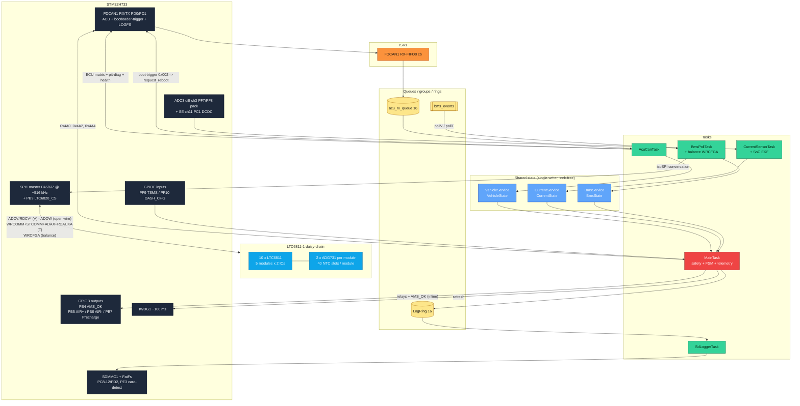
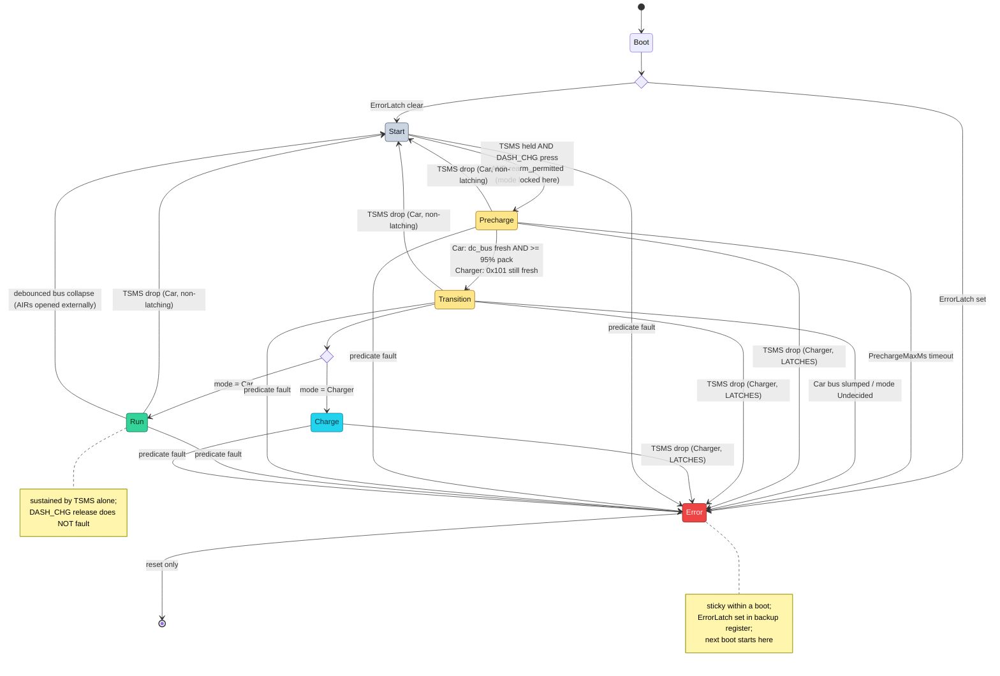

# AMS firmware architecture

Target hardware: STM32H733ZGTx (Cortex-M7 @ 528 MHz core, 264 MHz
AHB/HCLK, 1 MB Flash, 128 KB DTCM + 320/32/16 KB AXI/SRAM domains).
RTOS: FreeRTOS via CMSIS-RTOS v2 (1000 Hz tick).
Language: C++17 for application code (no exceptions, no RTTI, no
thread-safe statics) on top of CubeMX-generated C for the HAL/RTOS
boilerplate.

**What the box does.** It measures 95 series cells and 200 NTCs over an
isoSPI LTC6811-1 chain, measures pack current on an ADC, decides whether
the accumulator is safe, and expresses that decision through four GPIO
outputs: AIR−, AIR+, precharge, and `AMS_OK`. `AMS_OK` is the AMS's own
element of the shutdown circuit (SDC) — everything else in this document
exists to decide when that pin may be HIGH.

This document is the **as-built** reference. The vehicle CAN protocol is
in [`CAN_MAP.md`](CAN_MAP.md); the gate-by-gate FSM walkthrough is in
[`FSM_OVERVIEW.md`](FSM_OVERVIEW.md); the bench / on-vehicle calibration
procedure is in [`COMMISSIONING.md`](COMMISSIONING.md).

---

## 1. Safety invariants

Everything else exists to enforce these:

1. **An unsafe pack opens the AIRs, and the response time is a
   *budget*, not a single tick.** `MainTask` runs every 10 ms
   (`SafetyPeriodMs`), evaluates
   [`safety_predicates.hpp`](../Core/Inc/app/safety_predicates.hpp), and
   drives the contactor GPIOs inline in the same iteration. But two
   branch classes exist and they behave differently:

   - **Immediate** (latch on the first tick that sees them):
     `ForceError`, `BmsModuleOffline`, `TempSensorDisconnected`,
     `CellOpenWire`, `CurrentSensorFault`, `CurrentStale`,
     `CurrentOverLimit`, `VcuStale`, `ChargerStale`.
   - **Debounced**: the four cell voltage / temperature *range* reasons
     (`CellFaultConfirmTicks` = 25 ≈ 250 ms) and `BmsStale`
     (`BmsStaleConfirmTicks` = 25 ≈ 250 ms).

   The debounce exists because a cell physically cannot leave its valid
   window for one 10 ms tick and return; a single sub-threshold sample is
   a torn read of the lock-free `BmsState` snapshot or an unsettled first
   poll, and must not latch a sticky ERROR. The confirm window is sized to
   span **more than one** 200 ms voltage poll, so a transient that clears
   on the next poll never reaches the count. The arithmetic that has to
   stay true: one poll to observe (200 ms) + confirm (250 ms) + one tick
   (10 ms) ≈ 460 ms, inside the < 500 ms FS response budget. **If you
   change `BmsPollVoltMs` or `CellFaultConfirmTicks`, redo that sum.**

   `CurrentOverLimit` has no debounce at all — its smoothing is the IIR
   filter feeding it (τ ≈ 800 ms), so the trip time is set by how far the
   current is over the limit. See `CurrentMaxMa` in
   [`ams_config.hpp`](../Core/Inc/app/ams_config.hpp) for the trip-time
   table.

2. **Relays default to open** on any reset, fault, or uninitialised
   state. CubeMX-generated `MX_GPIO_Init` writes `PIN_RESET` to
   PB4 (`AMS_OK`) / PB5 (AIR+) / PB6 (AIR−) / PB7 (precharge)
   **before** configuring them as outputs. The pack is therefore
   electrically isolated for the entire window between reset and the
   first task running, and the SDC is held open across it.

3. **No single stuck task can prevent an AIR open.** `MainTask` is the
   only `osPriorityRealtime` thread, has direct GPIO write access via
   `ams::Relays`, and owns the watchdog refresh. The same task owns FSM
   step, predicate evaluation, relay drive, `AMS_OK`, and telemetry
   emission — one timeline, no cross-task race. Every producer task runs
   at a strictly lower priority, so none of them can preempt it.

4. **The watchdog is fed only on `MainTask`'s clean path** (and on the
   latched-fault path; see invariant 5). A stuck supervisor → IWDG
   timeout → hardware reset → relays default open. IWDG1 is configured
   prescaler 32 / reload 100 on the ~32 kHz LSI, i.e. ≈ 100 ms, and is
   started by `MX_IWDG1_Init()` **before** `osKernelStart`, so the
   pre-scheduler window is covered too.

5. **ERROR is latched across resets** in RTC backup register `BKP1R`
   (magic `0xA115EE51`). It survives every **warm** reset (software /
   `NVIC_SystemReset`, IWDG, reset pin) — so a fault that watchdog-resets
   the chip comes back up in `Error`.

   This carrier has **no VBAT**, so the backup domain is powered only
   from VDD: a full LV **power-cycle** (or a brown-out collapsing VDD)
   clears the latch. That is **accepted by design** — a deliberate
   power-cycle is the manual reset, and a *persistent* fault re-latches on
   the next post-grace evaluation. The latch is **not** flash-backed; do
   not rely on it surviving a power-off.

   Backup-register map — no two owners share a word:

   | Reg | Owner | Meaning |
   |---|---|---|
   | `BKP0R` | bootloader | boot-request magic `0xB00710AD` |
   | `BKP1R` | AMS app | `ErrorLatch` magic `0xA115EE51` |
   | `BKP2R` | AMS app | jump reason (`'JUMP'`/`'FAUT'`/`'MANU'`) |
   | `BKP3R` | AMS app | last-fault sentinel (HardFault / stack overflow / malloc fail) |

   Once latched, `MainTask` keeps refreshing the watchdog — the relays are
   already open and the latch persists, so staying alive is safe and lets
   an operator read telemetry instead of watching the node self-reset in a
   100 ms loop.

6. **Shared sensor state has one writer per service.** Single-writer /
   many-reader contract — Cortex-M7 32-bit aligned loads/stores are
   atomic. Multi-field reads can briefly observe a mid-update snapshot,
   but the predicates and telemetry are tolerant of one-cycle staleness:
   the worst case is one extra predicate evaluation that corrects on the
   next 10 ms iteration. No mutex is taken anywhere in app code. See § 7.

7. **A boot-grace window suppresses data-presence predicates for
   `SafetyBootGraceMs` (2000 ms) after `osKernelStart`.** At t = 0 every
   service's `last_*_tick` is 0; without a grace the first `MainTask`
   iteration would fault on freshness and withhold the watchdog refresh,
   triggering an IWDG reset within ~100 ms. The window must cover the
   longest service warm-up: BmsPollTask's first voltage poll (200 ms),
   CurrentSensorTask's first ADC sample (50 ms), and AcuCanTask's first
   VCU `0x100` (uncontrolled, but typically present on the vehicle bus).

   The grace suppresses only the **data-presence / freshness / range**
   predicates. Two things are unaffected: a sticky `ErrorLatch` from a
   prior boot still boots into `Error`, and the reserved hard force-error
   hook — `force_error_set` in
   [`safety_task.cpp`](../Core/Src/app/safety_task.cpp), currently a
   `constexpr false` with **no live setter** — still evaluates from t = 0.

8. **The AMS does not sense the SDC line. It IS part of it.** There is no
   SDC-feedback input on this daughterboard; the AMS contributes the
   `AMS_OK` output (PB4, active-high) and driving it LOW opens the
   shutdown circuit. `MainTask` drives it on every 10 ms tick from the
   pure predicate `safety::ams_ok_asserted(now, latched)`:

   - HIGH only once the boot grace has passed **and** no ERROR is latched;
   - LOW during grace — the data-presence predicates are suppressed there,
     so the SDC must not be enabled against unverified inputs;
   - LOW the instant a fault latches.

   **Dropping `AMS_OK` is not reversible in software.** The AMS's leg of
   the SDC is a self-holding relay with a physical reset button the driver
   cannot reach, so once the firmware pulls PB4 low the loop stays open
   until someone presses that button — driving the pin HIGH again does not
   restore it. `AMS_OK` is therefore **health-only**: never a temporary
   interlock, never driven by an operator input. It also sits upstream of
   TSMS, so dropping it on a TSMS release would open the upstream element
   and reclosing TSMS could no longer restore the loop. See § 5 for how
   that one hardware fact shapes the whole FSM.

9. **Every unrecoverable landing opens the contactors before it spins.**
   `vApplicationStackOverflowHook` (`configCHECK_FOR_STACK_OVERFLOW = 2`)
   and `vApplicationMallocFailedHook` in `Core/Src/freertos.c` open all
   relays, set the `ErrorLatch`, capture post-mortem state, and spin — so
   the IWDG resets the node within ~100 ms with the latch set and the next
   boot comes up in `Error`, observable over CAN.

   The four Cortex-M fault handlers in `Core/Src/stm32h7xx_it.c`
   (HardFault, MemManage, BusFault, UsageFault) call `ams_fault_landing()`,
   which opens the relays and *then* stamps `BKP3R` with the
   `config::LastFault` reason for the next boot's health frame (`0x6CA`
   byte 7). Relays first is deliberate: these handlers never return, so
   until the watchdog fires — nominally ~100 ms, but the LSI is ±47 %, so
   up to ~190 ms at the slow corner — whatever the contactors were doing
   when the fault hit is what they keep doing. A fault taken in `Run` would
   otherwise hold AIR+ and AIR− closed across a live pack with no firmware
   executing.

   Both calls are safe from fault context: the relay open is a bare
   `HAL_GPIO_WritePin` → BSRR transaction and the stamp is a
   backup-register write. Neither blocks, allocates, or takes a lock.
   Unlike the FreeRTOS hooks these handlers do **not** set the `ErrorLatch`
   — it is an RTC-domain read-modify-write, which is not something to
   attempt from a fault whose cause is unknown. The `BKP3R` sentinel is
   what makes the crash visible on the next boot instead.

> The HIL bench rig drives a real LTC6820/LTC6811 chain via a Pi Pico
> emulator, so flight and bench run the **same BMS path** — same isoSPI
> traffic, same PEC validation, same predicate inputs. The only HIL-only
> build flag is `AMS_HIL_CLEAR_ERROR_LATCH`, which auto-wipes the sticky
> `ErrorLatch` on boot so a faulted bench session starts clean. It is
> **never compiled into a flight build**. Detail in
> [`HIL_BUILD.md`](HIL_BUILD.md).

---

## 2. Build model

CubeMX 6.17 generates a **CMake-based** project (not Eclipse-managed-
make). The boundary between generated and hand-written code:

```mermaid
flowchart LR
    subgraph Gen["CubeMX-owned (regenerated from AMS.ioc)"]
        G1[Core/Src/main.c<br/>Core/Src/freertos.c<br/>Core/Src/stm32h7xx_*.c]
        G2[Drivers/STM32H7xx_HAL_Driver/]
        G3[Middlewares/Third_Party/FreeRTOS/]
        G4[FATFS/ + cmake/stm32cubemx/CMakeLists.txt]
    end
    subgraph Hand["Hand-written (lives forever)"]
        H1[Core/Inc/app/*.hpp + *.h<br/>Core/Inc/can/ CAN DSL]
        H2[Core/Src/app/*.cpp]
        H3[CMakeLists.txt<br/>top-level]
        H4[tests/unit/<br/>host CMake + Unity]
    end
    Gen -. "USER CODE BEGIN ... END blocks<br/>call ams_*_task_run trampolines" .-> Hand

    classDef gen  fill:#fde68a,stroke:#a16207,color:#1c1917
    classDef hand fill:#34d399,stroke:#065f46,color:#052e16
    class G1,G2,G3,G4 gen
    class H1,H2,H3,H4 hand
```



C++ code never modifies the generated `main.c`. Instead it provides
`extern "C"` trampolines (`ams_safety_task_run`, `ams_bms_poll_task_run`,
…) that the CubeMX-preserved `USER CODE BEGIN … END` blocks call. Every
regen keeps the trampolines. **Anything you must put in a CubeMX-owned
file has to sit inside a USER CODE block** — code outside one is wiped on
the next regen.

Cross-compile uses `arm-none-eabi-gcc` (14.x on CI); host tests use the
system toolchain (Clang on macOS, GCC on Linux/CI).

The image links at `0x08020000`, not at the reset vector: flash sector 0
belongs to the CAN bootloader. `Core/Src/main.c` sets `SCB->VTOR` to that
address before `HAL_Init` so the right vector table is in effect even when
the image is flashed without a prior bootloader jump.

---

## 3. Task architecture

**Seven threads are created in `main()`** — six application tasks plus the
CMSIS `defaultTask` — alongside the FreeRTOS timer-service daemon.
CubeMX emits task, queue, and mutex creation directly into `main()`, not
into an `MX_FREERTOS_Init` function. Two things it does *not* emit are
created by app code: the event groups (`ams_app_globals_init` in
[`app_globals.cpp`](../Core/Src/app/app_globals.cpp)) and the two BMS poll
timers (inside `BmsPollTask` itself).

| Thread | Priority (enum / value) | Cadence | Stack (words) | Implementation |
|---|---|---|---|---|
| `App_InitTask` | High (40) | once, then self-deletes | 512 | [`app_init_task.cpp`](../Core/Src/app/app_init_task.cpp) |
| `MainTask` *(CubeMX thread name is still "SafetyTask")* | Realtime (48) | 10 ms fixed (`osDelayUntil`) | 512 | [`safety_task.cpp`](../Core/Src/app/safety_task.cpp) |
| `AcuCanTask` | AboveNormal (32) | RX-queue drain with a deadline-computed timeout; TX matrix at 50 / 100 / 250 ms | 512 | [`acu_can_task.cpp`](../Core/Src/app/acu_can_task.cpp) |
| `CurrentSensorTask` | AboveNormal (32) | 50 ms fixed (`osDelayUntil`) | 256 | [`current_task.cpp`](../Core/Src/app/current_task.cpp) |
| `BmsPollTask` | Normal (24) | event-driven: voltage poll 200 ms, temp sweep 250 ms | 1024 | [`bms_poll_task.cpp`](../Core/Src/app/bms_poll_task.cpp) |
| `SdLoggerTask` | Low (8) | 50 ms drain, or on a diag semaphore | 1024 | [`sd_logger_task.cpp`](../Core/Src/app/sd_logger_task.cpp) |
| `defaultTask` | Low (8) | `osDelay(1)` forever | 128 | CMSIS placeholder, does nothing |
| Timer service | (FreeRTOS daemon) | callback-driven | — | raises `PollVDue` / `PollTDue` |

The priority ordering is the safety argument, not a convenience:
`MainTask` above every producer means a slow LTC sweep, a CAN burst, or an
SD stall can delay *data* but can never delay the AIR-open decision.

### MainTask body

One timeline, tick-gated cadences
([`safety_task.cpp`](../Core/Src/app/safety_task.cpp)):

```cpp
for (;;) {
    osDelayUntil(last_wake += 10);                 // SafetyPeriodMs
    snapshot bms / current / vehicle               // once, reused all pass
    dc_bus_fresh = last_dc_bus_tick != 0 && age <= VcuStaleMs
    read TSMS (PF9 level) and DASH_CHG (PF10); latch the DASH_CHG rising edge
    fault = error_latched || debounce(evaluate_fault_detail(...))
    if (fault) {
        if (!error_latched) { record reason/detail; open relays; AMS_OK low;
                              set ErrorLatch; state = Error }
        refresh watchdog                           // stay alive for diagnosis
    } else {
        update the DC-bus-collapse debounce (Run + Car only)
        every 20 ms (StatePeriodMs):
            lock Car/Charger mode if this step leaves Start
            out = fsm::step(...); apply_relay_actions(out.safety_flags) inline
            clear the DASH_CHG edge; on entering Error, persist ErrorLatch;
            on returning to Start, clear the mode lock
        refresh watchdog
    }
    drive AMS_OK  = ams_ok_asserted(now, error_latched)     // every 10 ms
    every 500 ms: emit telemetry 0x4A0 / 0x4A1 / 0x4A2      // TelemetryPeriodMs
    every 100 ms: emit 0x4A4 relay/AMS_OK GPIO read-back    // RelayStatusPeriodMs
    every 250 ms: push a LogRecord into the lock-free ring   // LogSamplePeriodMs
}
```

Three details that are easy to miss and are load-bearing:

- **`AMS_OK` is driven outside the fault/clean branch**, on every single
  iteration, so it can never be left stale by a branch that returned early.
- **The FSM output bitmask is consumed inline** by the same task that
  produced it. There is no event-flag ping-pong and therefore no window in
  which the FSM has decided something the relays have not yet done.
- **On a fault tick the FSM step is skipped entirely.** The relays are
  already open from the latch path, and `fsm::step`'s any-state→`Error`
  branch is a backstop that normal operation never reaches.

The SD log push is a bounded ~630 B struct copy into a wait-free ring at
4 Hz. It never blocks and never faults — a full ring (card stalled, log
being pulled) simply drops the record.

### BmsPollTask body

Owns the LTC6811 isoSPI conversation end-to-end: it is the **single owner
of the bus**, so there is no bus mutex and no producer/consumer queue.
Two periodic timers set event-group bits and the task waits on them:

- `PollVDue` (200 ms) → quiesce balancing → ADCV + RDCVA/B/C/D (retried up
  to `VoltPollRetries` extra times) → optional two-pass ADOW open-wire scan
  → restore balancing → `maybe_run_balance_update()` every
  `BalanceUpdatePolls` (4) cycles.
- `PollTDue` (250 ms) → 20-channel ADG731 mux sweep (WRCOMM + STCOMM +
  ADAX + RDAUXA per channel).

**The quiesce-before-measure rule.** Before every voltage conversion the
task writes an all-zero DCC mask and waits `BalanceQuiesceMs`, then
restores the previous mask afterwards. The LTC6811's own `DCP = 0` bit is
*not* sufficient here: BMS_LITE does not bleed through the LTC's internal
S-pin switch but through an external PMOS whose gate RC is ~100 µs, and
per LTC6811 Table 53 `DCP = 0` suppresses discharge only on the cell being
measured and its immediate neighbours. Bleed current returns through the
harness, not the board, so ~179 mA across 50–200 mΩ of tap/connector
impedance displaces the shared tap node by 9–36 mV — the bled cell reads
low, both neighbours read high — against a 50 mV balancing threshold. If
the quiesce cannot be proven (both WRCFGA attempts fail) the poll still
publishes the voltages, because starving the safety predicates is worse
than a noisy reading, but the **balance selector skips that cycle** rather
than ranking cells on its own artifact.

**The sweep yields.** A temperature sweep pauses after any channel if
`PollVDue` is pending and resumes immediately after, bounding the voltage
poll's jitter to ~one channel (~3 ms) instead of a whole sweep. That bound
is the precondition that makes the tight `BmsStaleMs` (350 ms) safe from
nuisance trips.

**The chain can fall asleep.** An LTC6811 enters `T_SLEEP` (~2 s) after
its last valid command and then ignores everything except a CS wake-pulse
train. After two consecutive failed polls the task re-wakes and
reconfigures the chain before each subsequent attempt — retrying every
poll, not once, so the chain is back on the first poll after a disturbance
clears.

### AcuCanTask body

Not purely RX-driven. Each pass it computes the nearest TX deadline, waits
on `acu_rx_queue` with exactly that timeout, then:

1. dispatches the received frame — pit-diag command first, then the
   bootloader trigger (`0x002` + 4-byte magic), then LOGFS ISO-TP, then
   `VehicleService::update_from_frame`;
2. pumps any in-flight LOGFS reply, leaving `DiagTxReservedSlots` (6 of
   16) TX FIFO slots free so a multi-minute log pull can never silently
   black out flight telemetry;
3. polls FDCAN1 Bus-Off and recovers (see § 8);
4. runs the ECU TX matrix — 50 ms currents, 100 ms
   ok-precharge / discharge-interlock / per-module V, 250 ms per-module
   temps + SoC;
5. emits the ungated firmware-health frame at 1 Hz, and the pit-diag scan
   at 1 Hz when armed.

The bootloader-trigger check runs **before** the LOGFS check because the
two share an ID once the AMS is node `0x02`; the trigger demands DLC 4 and
an exact payload, which no ISO-TP frame can produce.

### Why MainTask is realtime

`MainTask` is the only Realtime-priority task in the system. Its 10 ms
period is the hard contract: for the **immediate** predicates listed in
invariant 1, worst-case latency from "sensor reads out of range" to "AIRs
open" is `producer_period + 10 ms + GPIO_write`. The producer tasks all
run at strictly lower priority, so they cannot preempt it and cannot
stretch that bound.

For the **debounced** predicates the bound is deliberately larger and is
justified by physics rather than by scheduling — see invariant 1 for the
arithmetic and the reason a cell V/T excursion cannot be a one-tick event.

---

## 4. Data flow



**Legend** — hardware (slate) · LTC6811 chain + ADG731 mux (cyan) · ISRs
(orange) · queues, event groups and rings (amber) · shared state (blue) ·
tasks (green) · `MainTask` (red, the only realtime-priority task).

Arrows are direction of value flow.

**Who may write a safety GPIO.** `MainTask` (relays + `AMS_OK` + watchdog),
`App_InitTask` (one-shot `Relays::open_all()` if LTC chain discovery
fails), `Bootloader::request_reboot` (opens all relays before resetting
into the bootloader), and the FreeRTOS stack-overflow / malloc-failed
hooks (`ams_relays_open_all_c`). Every one of those paths only ever moves
the system *toward* open. `AcuCanTask` reads TSMS / DASH_CHG / `AMS_OK`
for telemetry but never writes them.

**Design consequences worth knowing:**

- **No service mutexes.** Single-writer / many-reader → atomic 32-bit
  accesses. `bms_mutex` / `current_mutex` / `vehicle_mutex` are still
  declared and created by CubeMX in `main()` from the `.ioc`, but no app
  code acquires them. Removing them needs an `.ioc` pass.
- **No `safety_events` consumer.** The FSM output bitmask is consumed
  inline by `MainTask`. The handle is still created in
  `ams_app_globals_init` alongside `bms_events`, but nothing reads or
  writes it. The *bit definitions* in
  [`ams_events.hpp`](../Core/Inc/app/ams_events.hpp) survive because
  `fsm::Output::safety_flags` reuses the same layout.
- **FDCAN2 is gone from the `.ioc` entirely.** The app is FDCAN1-only.
  The one residue is `MX_GPIO_Init` still setting PB13 to `AF9_FDCAN2`.
  The bootloader initialises its own peripherals after a reset.
- **The firmware drives no fan output.** There is no fan pin in the pin
  map and no timer peripheral configured, so there is no PWM and no GPIO
  drive — accumulator cooling is not under firmware control.

The BMS transport is isoSPI end-to-end; see
[`BMS_LTC6811.md`](BMS_LTC6811.md) for the LTC6811-1 wire protocol,
register-group layout, daisy-chain semantics, PEC15 rules, open-wire
detection, and the ADG731 channel mapping that drives the temperature
sweep.

---

## 5. Finite state machine

Six states. Transitions live in pure code at
[`state_machine.hpp`](../Core/Inc/app/state_machine.hpp) so they are
unit-tested in isolation; `MainTask` calls `fsm::step()` every 20 ms on its
10 ms cadence and consumes the returned relay-action bitmask inline.

### Operator inputs and the two run contexts

The FSM is driven by **two GPIO inputs** plus CAN-derived state. Both are
active-high with a pull-down configured on the carrier, read by `MainTask`
every 10 ms:

| Input | Pin | Kind | Role |
|---|---|---|---|
| **TSMS** | PF9 | **held level** (master switch) | Gates `Start → Precharge`; **sustains** every energised state. Its drop de-energises to `Start` **without latching** in Car mode — see below for the Charger exception. Also published on `0x021` as the AMS's view of whether the shutdown circuit is complete. |
| **DASH_CHG** | PF10 | **momentary press** (rising edge) | One press = one action. With TSMS, drives `Start → Precharge`. `MainTask` edge-detects PF10 at 10 ms and latches the rising edge until the 20 ms FSM step consumes it, so a press landing between FSM steps is never lost; a level held from boot fires no edge (`prev` is seeded from the live level). |

The two terminal contexts:

- **Run** = pack installed in the car, reached via
  `Start → Precharge → Transition → Run`.
- **Charge** = pack on the charging station, reached via the **same**
  `Start → Precharge → Transition → Charge` path. There is no direct
  `Start → Charge` edge. The difference is which branch `Transition`
  takes, decided by the **mode locked at `Start → Precharge`**.

#### Mode lock (Car vs Charger)

At the exact tick `Start → Precharge` fires, `MainTask` captures an
immutable `Mode` (`Undecided`/`Car`/`Charger`) from two freshness checks:

```cpp
mode = (charge_req_fresh && !vcu_fresh) ? Mode::Charger : Mode::Car;
```

- `vcu_fresh` — a VCU `0x100` heartbeat within `VcuFreshMs` (1000 ms).
  Looser than `VcuStaleMs` (200 ms) so a slow VCU bring-up is not
  misclassified as a charger.
- `charge_req_fresh` — an operator `0x101` charge-mode request (magic
  `43 48 52 47`, "CHRG") within `ChargeReqFreshMs` (1000 ms). The charger
  tool re-emits it at ≥ 2 Hz while connected.

So: VCU present → **Car**. VCU absent **and** a fresh charge request →
**Charger**. VCU absent with **no** charge request → **Car**, which then
faults on `VcuStale` — the fail-safe for a dead-VCU car; it never silently
charges. A stray `0x101` while the VCU is live cannot flip a running car
into Charger.

The lock is **cleared on any return to `Start`**, so a re-arm re-locks the
mode and re-runs precharge from scratch.

#### The re-arm gate (DC-link discharge interlock)

`Start → Precharge` is additionally gated on `fsm::rearm_permitted`. The
problem it solves: opening the shutdown circuit de-energises the discharge
relay (normally-closed), so a bleed resistor connects and the DC link
drains — but closing the SDC again re-energises the relay and the
**discharge stops part-way**, stranding charge on the link. Arming into
that residue is a no-op precharge: `dc_bus ≥ 95 % of pack` is already true
on entry, the FSM leaves `Precharge` on the next step, and the resistor
never carries meaningful current. That 95 % check is the AMS's only
evidence that the precharge resistor and contactor work; satisfied by
residual charge it proves nothing.

The AMS **cannot** fix this itself: the discharge relay has no software
control, and `AMS_OK` latches in *hardware* (self-holding relay plus an
`RST_BMS` button the driver cannot reach), so the AMS can never pulse its
own leg of the SDC low. The ECU can, via a normally-closed relay in series
with the discharge relay coil — but the ECU cannot observe either fact it
needs. So the AMS publishes them on `0x021 ACU_discharge_interlock`
(`fsm_in_start`, `tsms`) and consumes the ECU's answer from `0x100`
byte 2 bit 0 (`discharge_engaged`).

`rearm_permitted` refuses for two independent reasons:

- `discharge_engaged` — the ECU says the bleed is connected across the
  link. Closing a contactor now would put pack current through a
  transient-rated resistor. Hard interlock, honoured whatever the voltage
  reads.
- `dc_bus_V > DcBusDischargedV` (60 V, absolute volts — it is the
  touch-safe DC limit, and it does not scale with pack voltage). Only
  enforced once `ecu_discharge_capable` is latched, i.e. once an `0x100`
  with DLC ≥ 3 has been seen. Enforcing it against an ECU that cannot
  drain a stranded link would brick the car rather than protect it.

A **stale** `0x100` blocks on the second reason but not the first: an
unknown voltage is not a discharged one, while an unknown bleed state is
better handled by the AMS's normal fault path than by refusing to arm
forever.

Charger mode is exempt — the inverter is not in the charge loop and
`dc_bus_V` is VCU-only, so gating it would make Charger unarmable.

A blocked attempt **holds in `Start` and consumes the press.** Consuming
it is deliberate: carrying the press would let an attempt made while the
link was live arm the car by itself seconds later, when the discharge
finally completes and nobody is expecting it.

> **HONEST GAP: the firmware on both sides exists; nothing else about this
> is proven.** The AMS side — publish `0x021`, decode `0x100` byte 2 bit 0,
> gate the `Start → Precharge` edge on `rearm_permitted` — is implemented
> and host-tested. The ECU firmware half is implemented on
> `IFS08-CE-ECU` `dev`: it combines `0x021` with its own DC-link
> measurement, drives the coil-interrupt output, and sends `0x100` at
> DLC 3 so `ecu_discharge_capable` latches.
>
> Three things are still open, and any one of them makes the protection
> absent rather than partial:
>
> - **The relay itself.** Whether the normally-closed relay is physically
>   in series with the discharge relay coil is an electronics question
>   neither firmware repo can answer. The ECU source flags the same
>   uncertainty about its output's reset-state pull.
> - **The pairing has never run.** Each side is verified only by its own
>   host tests. Matching `.def` files prove layout agreement, not
>   semantic agreement.
> - **ECU `main` still sends DLC 2**, where `ecu_discharge_capable` never
>   latches and `rearm_permitted` returns `true` on every Car arm.
>
> Treat the stranded-link case as unmitigated on the vehicle, and
> re-validate this section against a bench rather than against either
> repository.

#### Precharge completion is mode-specific

`Precharge` is **bounded** by `PrechargeMaxMs` (5000 ms): if it does not
complete in time the FSM latches `Error` and opens every contactor,
capping how long the precharge resistor is held closed for *any* stuck
cause. What "complete" means depends on the locked mode:

- **Car** — `precharge_target_reached`: the inverter DC-link must reach
  `dc_bus_V ≥ PrechargeRatio (95 %) × pack_voltage`, **and the `0x100`
  reading must be fresh** (`dc_bus_fresh`, held to `VcuStaleMs` = 200 ms).
  Freshness is part of the criterion, not advisory: `VehicleState` holds
  the *last received* `dc_bus_V`, so a dead VCU does not zero it — it
  **freezes** it. Frozen at pack voltage it satisfies the 95 % test
  forever, including after the link has actually bled to zero, where
  closing AIR+ means full pack voltage across the contactor with nothing
  limiting the inrush. `VcuStale` cannot save you here: it is gated on
  `vcu_required` (false in `Start`, so the value may already be arbitrarily
  old at the press) and needs 200 ms, while the FSM steps every 20 ms — the
  transition would fire on the frozen reading roughly ten steps before the
  fault could reopen the AIRs.
- **Charger** — there is no VCU `dc_bus_V` during a charge and the charger
  soft-starts its own output, so there is nothing to voltage-gate on.
  The proceed is gated on the `0x101` charge request **still being fresh**
  (the charger's "connected and ready" signal). The single DASH_CHG press
  was the human "go"; the still-fresh `0x101` authorises closing AIR+. If
  `0x101` goes stale first, `Precharge` holds and hits the timeout →
  `Error`, rather than closing AIR+ into a disconnected charger.

**Charger skips the precharge resistor entirely.** The charger
voltage-matches its output to the pack before asserting `0x101`, so
closing AIR+ onto it has no inrush. The precharge contactor sits in
*parallel* with AIR+, so closing it while the charger sources current
would route the full charge current through the transient-rated resistor.
Charger therefore closes only AIR− on entry to `Precharge`, and AIR+ on
the proceed.

`Transition` is a **one-step passthrough**, not a dwell: the contactor
swap (`CloseAirP | OpenPrecharge`) was already emitted on the
`Precharge → Transition` edge, and this step commits to `Run`/`Charge` on
the locked mode. A Car-only "bus still up" guard re-checks
`precharge_target_reached`, so a failed contactor swap lands in `Error`
rather than energising the tractive system on a slumped bus (Charger skips
it — no `dc_bus_V`).



**Legend** — idle (slate) · bring-up (amber) · running (green) ·
charging (cyan) · error (red).

Edge-transition relay actions (bits in `Output::safety_flags`, consumed
inline by `MainTask` via `apply_relay_actions`):

| Transition | bits set in `Output::safety_flags` |
|---|---|
| Start → Precharge, **Car** (or `Undecided`) | `CloseAirN`, `ClosePrecharge` |
| Start → Precharge, **Charger** | `CloseAirN` only — the resistor never enters the charge loop |
| Precharge → Transition | `CloseAirP`, `OpenPrecharge` |
| Transition → Run / Charge | _(none — the contactor swap already happened on the edge above)_ |
| TSMS drop, Car (any energised state) → Start | `OpenAirN`, `OpenAirP`, `OpenPrecharge` (no `ForceError`) |
| Run → Start on bus collapse | `OpenAirN`, `OpenAirP`, `OpenPrecharge` (no `ForceError`) |
| any → Error | `ForceError`, `OpenAirN`, `OpenAirP`, `OpenPrecharge` |

**Key properties:**

- **`Run` / `Charge` are sustained by TSMS alone.** DASH_CHG is a
  momentary press — low for most of `Run`/`Charge` — so it is **not**
  level-checked there. Level-checking it would fault instantly the moment
  the operator released the button.
- **A TSMS drop in Car mode is a non-latching de-energise, not a fault.**
  It applies to *every* energised state (`Precharge`, `Transition`, `Run`),
  opens all contactors, returns to `Start`, and never touches `AMS_OK`.
  This is load-bearing for the FS rule that the driver must be able to stop
  and restart the tractive system from the cockpit unaided: if a TSMS drop
  latched `Error` it would drop `AMS_OK`, opening the upstream SDC relay,
  and reclosing TSMS could no longer restore the loop without a reset.
- **A TSMS drop in Charger mode LATCHES `Error`.** This is the deliberate
  exception. The scrutineering sheet forbids re-activating the charger
  output once the shutdown circuit has opened, so re-energising the charge
  path requires a full reset. Attributed on pit-diag as
  `FaultReason::ChargerTsmsOpen` (15) rather than the generic
  `FsmError` (12).
- **`Charge` also has its own staleness fault.** Once locked to Charger,
  a `0x101` silent for `ChargerStaleMs` (1000 ms) latches
  `FaultReason::ChargerStale` — the mirror of `VcuStale` on the charge
  side, so an unplugged charger stops the charge instead of leaving the
  AIRs closed.
- **AIRs opened externally → `Run` de-energises to `Start`.** A cockpit SDC
  shutdown opens the AIRs without the AMS sensing it, but the VCU keeps
  reporting `dc_bus_V`. A **sustained** collapse below `BusCollapsePercent`
  (50 %) of the cell-sum, debounced over `BusCollapseConfirmTicks` (20 ≈
  200 ms) in Car mode, means the contactors are physically open while the
  FSM still thinks it is in `Run`. Falling back to `Start` (non-latching,
  `AMS_OK` untouched) makes a re-arm re-run precharge instead of reclosing
  AIR+ onto a discharged DC-link when the shutdown is released. Car/`Run`
  only — Charge has no `dc_bus_V` and the charger soft-starts.
- **ERROR is sticky within a boot.** Even if the underlying fault clears,
  the FSM stays in `Error` until reset. `ErrorLatch::set()` fires on every
  `Error` entry, so the next boot also starts in `Error` (see invariant 5
  for what clears it).
- **The FSM consumes an already-debounced fault decision.** `MainTask` is
  the single fault authority: it runs the predicate set, applies the
  debounces, and passes the result in as `predicate_fault`. The FSM does
  **not** re-run the predicates — doing so bypassed the debounce. On a
  fault tick `MainTask` latches and skips the FSM step entirely; the
  any-state→`Error` branch inside `fsm::step` is a kept backstop.
- **`AMS_OK` (PB4) tracks the live safety state**, driven separately every
  10 ms (§ 1, invariant 8) — never by the FSM, never by TSMS.

---

## 6. Boot sequence

```mermaid
%%{init: {'theme':'base','themeVariables':{
  'actorBkg':'#e2e8f0','actorBorder':'#475569','actorTextColor':'#0f172a',
  'noteBkgColor':'#fee2e2','noteBorderColor':'#7f1d1d','noteTextColor':'#7f1d1d',
  'sequenceNumberColor':'#0f172a'
}}}%%
sequenceDiagram
  participant HW
  participant main as main()
  participant init as App_InitTask
  participant Main as MainTask
  participant aux as Bms/Acu/Cur/SdLog

  HW->>main: Reset_Handler then SystemInit
  main->>main: SCB->VTOR = 0x08020000 (before HAL_Init)
  main->>main: HAL_Init, SystemClock_Config
  main->>HW: MX_GPIO_Init (PB4..PB7 written LOW, then configured as outputs)
  main->>HW: MX_FDCAN1, MX_USART2, MX_ADC3, MX_SPI1
  main->>HW: MX_IWDG1_Init (IWDG running pre-scheduler)
  main->>HW: MX_FATFS_Init (SDMMC1 init deliberately NOT auto-called)
  main->>main: osKernelInitialize + create mutexes, queues, 7 threads
  main->>main: ams_app_globals_init (event groups)
  main->>main: osKernelStart

  par scheduler running
    init->>init: ErrorLatch::init (DBP unlock)
    init->>init: fw_health capture_reset_cause + latch_boot_fault (BKP3)
    Note over init: Under -DAMS_HIL_CLEAR_ERROR_LATCH:<br/>clear ErrorLatch (bench only)
    init->>HW: FDCAN1 ConfigGlobalFilter (std->FIFO0, extended REJECTED)
    init->>HW: ActivateNotification + HAL_FDCAN_Start
    init->>HW: LTC6820 configure + wakeup + RDCFGA chain discovery
    alt PEC-clean segments != LtcChainLength
      init->>HW: ErrorLatch::set + Relays::open_all
    end
    init->>init: osThreadExit (TCB + stack returned to heap)
  and
    Main->>Main: ErrorLatch::init
    Main->>Main: boot in Error if ErrorLatch::is_set (relays open, AMS_OK low)
    Note over Main: For t < SafetyBootGraceMs (2 s)<br/>data-presence/freshness/range predicates suppressed<br/>and AMS_OK is held LOW.<br/>A sticky ErrorLatch still boots into Error.
    loop every 10 ms (osDelayUntil)
      Main->>Main: snapshot bms/current/vehicle; read TSMS/DASH_CHG
      alt fault detected
        Main->>HW: latch (Relays::open_all + AMS_OK low + ErrorLatch::set)
        Main->>HW: HAL_IWDG_Refresh (stay alive for diagnosis)
      else clean path
        Main->>Main: every 20 ms: fsm::step -> apply relay actions inline
        Main->>HW: HAL_IWDG_Refresh
      end
      Main->>HW: drive AMS_OK every tick
      Main->>HW: 0x4A0/0x4A1/0x4A2 @500 ms, 0x4A4 @100 ms, LogRecord @250 ms
    end
  and aux
    aux-->>aux: BmsPoll V 200 ms / T 250 ms (+ balance WRCFGA)<br/>CurrentSensor 50 ms ADC + SoC EKF<br/>AcuCan RX drain + TX matrix<br/>SdLogger lazy mount + 50 ms drain
  end
```

Note the ordering that matters: the LTC chain-discovery failure path
latches `ErrorLatch` and opens the relays **before** `MainTask` can ever
leave `Start`. A missing or PEC-noisy module makes the pack unsafe to
drive — you cannot reason about cell voltages you cannot observe — so the
node boots into `Error` and refuses to leave it.

`MX_SDMMC1_SD_Init` is deliberately *not* auto-called from `main()`; the
logger configures and mounts the card lazily, so an absent or broken card
cannot brick the node at boot.

---

## 7. Shared state

Three domain services. Each is a singleton wrapping a plain struct read
through a copying `snapshot()`. **Single-writer / many-reader**, lock-free.

| Service | Writer | Readers |
|---|---|---|
| [`BmsService`](../Core/Inc/app/bms_service.hpp) | `BmsPollTask` (`update_from_ltc_response`, `update_temperature`, `update_open_wire`) | MainTask, AcuCanTask, CurrentSensorTask (SoC), BalanceController |
| [`CurrentService`](../Core/Inc/app/current_service.hpp) | `CurrentSensorTask` (`update_from_adc`, `update_dcdc_from_adc`) | MainTask, AcuCanTask, CurrentSensorTask (SoC) |
| [`VehicleService`](../Core/Inc/app/vehicle_service.hpp) | `AcuCanTask` (`update_from_frame`: VCU `0x100`, charge request `0x101`, balance override `0x103`, per-module balance `0x104`) | MainTask, BmsPollTask (balance commands), AcuCanTask (pit-diag) |

Concurrency model: Cortex-M7 32-bit aligned loads/stores are atomic. A
multi-field `snapshot()` from a non-writer task can briefly observe a
mid-update mix — the predicates and telemetry are tolerant of one-cycle
staleness, and the fault-detail byte even has a sentinel
(`NoOffendingModule` = 0xFF) that makes a torn read *visible* on pit-diag
rather than silently misattributed.

### `BmsState` shape

| Field | Type | Notes |
|---|---|---|
| `cell_mV` | `uint16_t [5][19]` | 95 cells. Ctor-seeded to 3700 mV — a plausible mid-range value — so a not-yet-polled module cannot read 0 mV and trip `CellUnderVoltage`. Hygiene only; the authoritative guard is `first_full_poll_done`. |
| `cell_tempC` | `int16_t [5][40]` | 200 NTC slots. Ctor-seeded to `NtcNoReading` (INT16_MIN), **not** to a plausible temperature: a comfortable-looking seed makes an unpopulated or mis-muxed channel report room temperature forever, defeating every threshold built on `max_tempC`. A sentinel keeps "no data" distinguishable from "cool". |
| `pack_voltage_mV`, `min`/`max_cell_mV`, `min`/`max`/`avg_tempC` | summaries | recomputed in `recompute_summaries_` after every write; sentinels are skipped. |
| `valid_temp_channels` | `uint16_t` | how many temp channels produced a real conversion. With 0, the min/max temps are sentinels and mean "no thermal data". |
| `vmin_module`, `vmax_module`, `tmax_module` | `[5]` | per-module aggregates feeding the ECU TX matrix and the fault-detail byte. |
| `temp_disconnect_mask` | `uint8_t` | bit m: module m has a channel that read valid once and is now open past the debounce → `TempSensorDisconnected`. |
| `tap_fault_mask` | `uint8_t` | bit m: module m has an adjacent cell pair straddling a displaced shared tap. Those pairs feed the tap-immune pair *average* to the safety aggregates so a measurement artifact cannot false-trip OV/UV. Raw `cell_mV` is left untouched for pit-diag. |
| `cell_open_mask`, `cell_open_cells[5]` | `uint8_t`, `uint32_t` | ADOW-confirmed open cell-sense conductors → `CellOpenWire`, which faults in **any** state. Written only when `CellOpenWireCheck` is on. |
| `last_rx_tick[5]` | `uint32_t` | advances only on a poll where BOTH LTCs of the module passed PEC. |
| `module_online_mask` | `uint8_t` | **Not sticky.** Re-derived every update from `last_rx_tick` freshness against `BmsStaleMs`, so it means "currently responding". Compared against `AllModulesMask` (0x1F). |
| `ltc_online_mask` | `uint16_t` | per-cycle per-IC PEC-OK mask (10 bits, LSB = chain index 0). The source `module_online_mask` is derived from. |
| `first_full_poll_done` | `bool` | sticky once every module has reported PEC-clean at least once. Gates the cell V/T *range* predicates so a partially-populated state at the grace edge cannot trip them. Never cleared. |

### The `extern "C" volatile` mirrors

Alongside the services there is a small set of single-byte / single-word
globals used for cross-TU publication without a snapshot copy. They follow
the same single-writer contract, and an 8-bit `volatile` read on Cortex-M7
is atomic:

| Symbol | Writer | Consumers |
|---|---|---|
| `g_state_telemetry` | MainTask | AcuCanTask (`0x020`, pit-diag), BmsPollTask (balance gate) |
| `g_mode_locked_telemetry` | MainTask | AcuCanTask (pit-diag) |
| `g_tsms_telemetry` | MainTask | AcuCanTask (`0x021` discharge interlock) |
| `g_fault_reason_telemetry`, `g_fault_detail_telemetry` | MainTask | AcuCanTask (pit-diag `0x6C0[6]/[7]`), BmsPollTask (`is_cell_data_fault`) |
| `g_soc_percent` | CurrentSensorTask | AcuCanTask (`0x130`) |
| `g_ltc_pec_err_count[10]`, poll timing, balance/quiesce counters | BmsPollTask / BmsService | AcuCanTask (pit-diag) |

`g_fault_reason_telemetry` is not merely diagnostic: `BalanceController`
reads it, because a latched cell-data fault (`CellOpenWire`,
`CellOverVoltage`, `CellUnderVoltage`) means the very voltages the balance
selector ranks are untrustworthy.

### The datalogging ring

`MainTask` pushes a `LogRecord` into a wait-free ring
([`log_ring.hpp`](../Core/Inc/app/log_ring.hpp), depth
`LogRingCapacity` = 16, power-of-two required) every 250 ms;
`SdLoggerTask` drains it every 50 ms. Producer-side is never blocking and
never faults — this is the one place where a *dropped* datum is the
correct outcome.

---

## 8. Inter-task signalling

**Queues** (declared in [`AMS.ioc`](../AMS.ioc) `FREERTOS.Queues01`,
created in `main()`):

| Queue | Depth | Item | Producer | Consumer |
|---|---:|---|---|---|
| `acu_rx_queue` | 16 | `CanFrame` | FDCAN1 RX-FIFO0 ISR | AcuCanTask |
| `acu_tx_queue` | 16 | `CanFrame` | (declared, unused) | (declared, unused) |

`acu_tx_queue` exists in the `.ioc` but nothing uses it — `AcuCanTask` and
`MainTask` are the sole FDCAN1 TX producers and call
`HAL_FDCAN_AddMessageToTxFifoQ` directly.

**Event groups** (created by
[`app_globals.cpp`](../Core/Src/app/app_globals.cpp), because CubeMX 6.17
does not emit them from the `.ioc`):

| Group | Bit | Set by | Consumed by |
|---|---|---|---|
| `bms_events` | `PollVDue` | `osTimer`, `BmsPollVoltMs` = 200 ms | BmsPollTask (quiesce → ADCV + RDCV[A-D] → ADOW → restore → balance) |
| | `PollTDue` | `osTimer`, `BmsPollTempMs` = 250 ms | BmsPollTask (20-channel ADG731 mux sweep, resumable) |
| `safety_events` | — | nobody | nobody (handle created, never used) |

Both timers are created and started inside `ams_bms_poll_task_run`, not in
`main()`. Note the mid-sweep re-arm: when a temperature sweep yields to a
due voltage poll it re-sets `PollTDue` itself so it resumes immediately
after.

**Other primitives:** the lock-free `LogRing` (§ 7), and one semaphore
inside `SdLoggerTask` that lets an incoming LOGFS request wake the logger
early instead of waiting out a 50 ms drain period.

**FDCAN1 Bus-Off recovery** is owned by `AcuCanTask`. Each loop pass it
reads `HAL_FDCAN_GetProtocolStatus` (a cheap PSR read) and, if the M_CAN
has latched Bus-Off (sustained TX errors → `CCCR.INIT` set → both TX and
RX halted, no self-clear), issues a `HAL_FDCAN_Stop`/`Start` to rejoin —
at most once per `FdcanBusOffRetryMs` (100 ms). The spacing matters: the
M_CAN's automatic recovery rejoins only after 128 × 11 consecutive
recessive bits (~2.8 ms of idle bus at 500 kbps), so restarting it every
poll would mean the node never finishes rejoining. A `Stop`/`Start`
timeout latches `hfdcan1.State = ERROR`, after which every later
Stop/Start silently no-ops, so the recovery forces `State` back to `READY`
— without that unwedge the bus would stay permanently deaf.

The pure rate-limit policy is host-tested in
[`can_busoff_recovery.hpp`](../Core/Inc/app/can_busoff_recovery.hpp). This
is a **robustness** path, not a safety predicate: it keeps telemetry, the
VCU heartbeat RX, and the CAN boot-trigger alive across a transient bus
fault, while a genuinely dead bus still fails safe (Car-mode `VcuStale`
latches ERROR on schedule). It runs outside `MainTask`, so it cannot
affect the AIR-open path (invariants 1 and 3).

---

## 9. Memory budget

Snapshot of a current `dev` build; reproduce with
`arm-none-eabi-size -A build/AMS.elf`, and CI reports the exact byte count
in every run summary.

| Region | Used | Capacity | % used | Notes |
|---|---:|---:|---:|---|
| FLASH | ~150 KB | 768 KB | ~20 % | `text` + `data` as reported by `arm-none-eabi-size`. App region only (sectors 1..6). |
| DTCMRAM | ~95 KB | 128 KB | ~74 % | `.data` + `.bss` + `_user_heap_stack`. **64 KB of this is the FreeRTOS heap** (`ucHeap`), leaving ~26 KB of ordinary BSS. |
| RAM_D1 (AXI) | 512 B | 320 KB | <1 % | `.sd_dma` — the SDMMC IDMA cannot reach DTCM, so the SD bounce buffer lives here. |
| ITCMRAM / RAM_D2 / RAM_D3 | 0 B | 64 / 32 / 16 KB | 0 % | unused. |

Flash layout is enforced twice: at link time
(`STM32H733XG_FLASH.ld` sizes `FLASH` as `ORIGIN = 0x08020000`,
`LENGTH = 768K`) and in CI, where
[`check_flash_layout.py`](../scripts/check_flash_layout.py) rejects any
image that lands in sector 0 (the bootloader), overflows into sector 7
(bootloader NVM + app metadata), or whose `.isr_vector` does not start
exactly at `0x08020000` — the bootloader jumps to `*(0x08020004)`.

The FreeRTOS heap (`configTOTAL_HEAP_SIZE` = 65 536) backs every task TCB
and stack (`BmsPollTask` and `SdLoggerTask` are 1024 words each), the
queues, and the event groups. All threads ship `Dynamic` allocation: the
CubeMX UI workflow for `Static` is brittle enough that it has not been
worth the churn, and there is headroom. Watch the DTCM figure though — at
~74 % it is the tightest region, and the datalog ring alone
(`LogRingCapacity` × ~630 B) is ~10 KB of it.

---

## 10. C++ rules

Firmware compile options — see the top-level
[`CMakeLists.txt`](../CMakeLists.txt) and
[`cmake/gcc-arm-none-eabi.cmake`](../cmake/gcc-arm-none-eabi.cmake):

```cmake
set(CMAKE_CXX_STANDARD 17)   # CMAKE_CXX_STANDARD_REQUIRED ON
-Wall -fdata-sections -ffunction-sections
-fno-exceptions -fno-rtti -fno-threadsafe-statics -fno-use-cxa-atexit
```

The host test build ([`tests/unit/CMakeLists.txt`](../tests/unit/CMakeLists.txt))
adds `-Wextra -Wpedantic` on top. Since the pure-logic headers are
compiled by both, that is where the stricter warnings actually bite —
which is a decent reason to keep new logic header-only and host-tested.

**Required patterns:**

- One service / task per `.hpp` + `.cpp` pair, named `<thing>_service` or
  `<thing>_task`. Pure-logic modules (FSM, predicates, balancing, SoC,
  encoders, ISO-TP, open-wire) are **header-only** so the host build gets
  them for free.
- Singletons via a `static` local in `instance()`. Construction order is
  controlled by explicit `init()` calls from `App_InitTask`.
  (`-fno-threadsafe-statics` means there is no hidden guard mutex — first
  touch must not race.)
- Task entry points are `extern "C"` trampolines that call into the
  implementation TU.
- `enum class` for state types (`fsm::State`, `fsm::Mode`,
  `safety::FaultReason`, `CanBus`). `FaultReason` values are a **wire
  contract** on pit-diag: append only, never renumber.
- `constexpr` for every threshold, ID and period, collected in
  [`ams_config.hpp`](../Core/Inc/app/ams_config.hpp). Anything needing
  on-vehicle tuning is tagged `COMMISSION` (see
  [`COMMISSIONING.md`](COMMISSIONING.md)).
- **Single-writer per shared struct.** No mutexes in app code. If you find
  yourself wanting one, the ownership design is wrong — talk to the safety
  reviewer.
- No `new` / `delete` in steady state. FreeRTOS allocates at task / queue /
  event-group / timer creation only.

**Banned:** `std::string`, `std::vector`, `<iostream>`, `<thread>`, heap
allocation after `osKernelStart`.

---

## 11. Testing

Everything lives in [`tests/unit/`](../tests/unit/) and runs on the host
under Unity. There is no separate SIL harness — the multi-step "scenario"
tests are pure-FSM sequences.

| Area | Test files |
|---|---|
| Safety core | `test_safety_predicates`, `test_state_machine`, `test_sil_scenarios` |
| Services | `test_bms_service`, `test_current_service`, `test_vehicle_service` |
| BMS / isoSPI | `test_ltc6811_decode`, `test_open_wire`, `test_ntc_table`, `test_balance_controller` |
| Estimation | `test_soc_estimator` |
| CAN wire format | `test_telemetry_encoders`, `test_acu_tx_encoders`, `test_pit_diag_emitter`, `test_dsl_parity`, `test_dsl_dbc_consistency`, `test_can_busoff_recovery`, `test_bootloader` |
| Diag / LOGFS / datalogging | `test_isotp`, `test_diag_proto`, `test_diag_dispatch`, `test_logfs_server`, `test_datalogging`, `test_log_rotation`, `test_crc32` |
| Health | `test_fw_health` |

Coverage worth knowing about: PEC15 and the chain-length walker, ADG731
channel packing, the balancing policy including the adjacency spread and
hysteresis, service decode + freshness (including the `0x101` magic gate
and both balance dead-mans), ADC scaling, each safety predicate in
isolation (including the cell V/T debounce, the `BmsStale` debounce, and
the Car-only `VcuStale` gate), every FSM transition (DASH_CHG momentary
edge, Charger `0x101`-fresh proceed, `PrechargeMaxMs` timeout,
`rearm_permitted`, the Charger TSMS latch), and the code-first CAN DSL's
parity with the generated DBC.

**Running them:** `ctest` reports `1/1 Test ... Passed`, because there is
one Unity *runner* binary. Run `./build-tests/ams_unit_tests` directly to
see the real assertion total and which case failed.

The full host suite plus an `arm-none-eabi-gcc` cross-compile runs on
every push via `.github/workflows/build-tests.yml`, which also runs
`check_flash_layout.py` and reports flash/RAM sizes in the run summary.

The pure-logic separation is the design decision that keeps the test
surface large without mocking the HAL or FreeRTOS: only
`osMutexAcquire`/`osMutexRelease` and the three mutex-handle externs are
stubbed, in [`tests/unit/mocks/`](../tests/unit/mocks/) — and even those
are vestigial, since no app code takes a mutex any more.

---

## 12. File layout

```
IFS08-CE-AMS/
├── AMS.ioc                          # CubeMX (source of truth for HW)
├── CMakeLists.txt                   # firmware build (CMake)
├── CMakePresets.json
├── VERSION                          # semver consumed by firmware_info.cpp
├── README.md / CONTRIBUTING.md / CLAUDE.md
├── ROADMAP.md                       # auto-generated, do not edit
├── STM32H733XG_FLASH.ld
├── Core/
│   ├── Inc/
│   │   ├── FreeRTOSConfig.h, main.h, stm32h7xx_*.h   # CubeMX-owned
│   │   ├── can/                     # HAND-WRITTEN code-first CAN DSL
│   │   │   ├── can_dsl.hpp, can_codecs.hpp
│   │   │   └── messages/*.def       # one file per frame -> DBC + encoders
│   │   └── app/                     # HAND-WRITTEN
│   │       ├── ams_config.hpp       # ALL constexpr thresholds/IDs/periods
│   │       ├── ams_events.hpp       # event-group + safety_flags bits
│   │       ├── state_machine.hpp    # pure FSM
│   │       ├── safety_predicates.hpp# pure fault evaluator + debounces
│   │       ├── relay_driver.hpp     # contactors + AMS_OK
│   │       ├── bms_service.hpp / current_service.hpp / vehicle_service.hpp
│   │       ├── balance_controller.hpp  # pure balancing policy
│   │       ├── soc_estimator.hpp    # Coulomb count + OCV anchor + EKF (telemetry only)
│   │       ├── open_wire.hpp        # pure ADOW open-conductor detector
│   │       ├── ntc_table.hpp        # NTC R-T lookup (generated from CSV)
│   │       ├── ltc6811.hpp / ltc6820.hpp   # wire layer / isoSPI master
│   │       ├── telemetry_encoders.hpp, acu_tx_encoders.hpp, pit_diag_emitter.hpp
│   │       ├── can_busoff_recovery.hpp     # pure Bus-Off rate-limit policy
│   │       ├── isotp.hpp, diag_proto.hpp, diag_dispatch.hpp, logfs_server.hpp
│   │       ├── log_record.hpp, log_ring.hpp, log_rotation.hpp, crc32.hpp
│   │       ├── bootloader.hpp, error_latch.hpp, fw_health.hpp, watchdog.hpp
│   │       ├── can_frame.{h,hpp}, app_globals.h, scoped_mutex.hpp (orphaned)
│   │       └── *_task.h / safety_task.hpp  # C-callable trampoline headers
│   ├── Src/
│   │   ├── main.c, freertos.c       # CubeMX-owned; USER CODE blocks only
│   │   ├── stm32h7xx_*.c, sysmem.c, syscalls.c
│   │   └── app/                     # HAND-WRITTEN
│   │       ├── safety_task.cpp      # MainTask (safety + FSM + telemetry + log)
│   │       ├── bms_poll_task.cpp    # LTC6811 isoSPI driver (V + T + ADOW + balance)
│   │       ├── acu_can_task.cpp     # RX dispatch + ECU TX matrix + pit-diag + LOGFS
│   │       ├── current_task.cpp     # ADC3 pack + DCDC, SoC EKF
│   │       ├── sd_logger_task.cpp   # microSD CSV logger + LOGFS server
│   │       ├── app_init_task.cpp, app_globals.cpp, can_isr.cpp
│   │       ├── bms_service.cpp, current_service.cpp, vehicle_service.cpp
│   │       ├── ltc6811.cpp, ltc6820.cpp, relay_driver.cpp
│   │       ├── bootloader.cpp, error_latch.cpp, fw_health.cpp
│   │       └── firmware_info.cpp, watchdog.cpp
│   └── Startup/startup_stm32h733zgtx.s
├── FATFS/                            # CubeMX FatFs glue (App/ + Target/)
├── Drivers/                          # STM32H7 HAL + CMSIS
├── Middlewares/Third_Party/FreeRTOS/
├── cmake/
│   ├── gcc-arm-none-eabi.cmake       # toolchain file
│   ├── starm-clang.cmake
│   └── stm32cubemx/CMakeLists.txt    # regenerated by CubeMX
├── docs/
│   ├── ONBOARDING.md                 # START HERE — Day-1 guide + reading order
│   ├── GLOSSARY.md                   # domain terms (AIR, SDC, TSMS, isoSPI, PEC, …)
│   ├── ARCHITECTURE.md               # this file — as-built reference
│   ├── DEEP_DIVE.md                  # end-to-end codebase walkthrough
│   ├── FSM_OVERVIEW.md               # gate-by-gate safety FSM reference
│   ├── BMS_LTC6811.md                # isoSPI BMS wire protocol
│   ├── CAN_MAP.md                    # vehicle / ACU CAN protocol
│   ├── COMMISSIONING.md              # bench / on-vehicle calibration
│   ├── COMMISSIONING_CHECKLIST.md
│   ├── FMEA.md                       # failure modes + effects
│   ├── HIL_BUILD.md                  # AMS_HIL_CLEAR_ERROR_LATCH (bench only)
│   ├── ntc_rt_table.csv              # source for ntc_table.hpp
│   └── dbc/                          # generated CAN database (ams.dbc) + notes
├── scripts/check_flash_layout.py     # bootloader-compat guard (CI)
├── tools/
│   ├── dbc_dump.cpp                  # CAN DSL -> .dbc generator
│   └── bms_monitor.py
├── tests/unit/                       # host CMake + Unity, mocks/, test_*.cpp
└── .github/workflows/                # build-tests, dbc-bot, release, roadmap, …
```

Note what is **not** there: no `state_machine.cpp`, no
`safety_predicates.cpp`, no `balance_controller.cpp`, no
`soc_estimator.cpp`. Those are header-only on purpose — pure logic with no
HAL and no FreeRTOS, so the host test build compiles them directly.

---

## 13. Where to start reading

Different entry points by goal:

- **Day one, no context**: [`ONBOARDING.md`](ONBOARDING.md), then
  [`GLOSSARY.md`](GLOSSARY.md), then § 1 and § 5 here.
- **Adding a new CAN frame**:
  [`CONTRIBUTING.md`](../CONTRIBUTING.md) § "Adding a new CAN frame".
  Add a `.def` to `Core/Inc/can/messages/`, declare the ID in
  `ams_config.hpp`, write encode/decode + unit tests, regenerate the DBC,
  update `CAN_MAP.md`.
- **Adding a new task**: [`CONTRIBUTING.md`](../CONTRIBUTING.md)
  § "Adding a new task". Touches `AMS.ioc` (`Tasks01`), one `<task>.h`
  C-callable header, one `<task>.cpp`, and one `main.c` USER CODE
  trampoline. Pick the priority deliberately — see § 3.
- **Modifying MainTask / predicates / relays / thresholds**: this is the
  `safety-critical` review bar. Read § 1 and § 5 of this file, then follow
  [`CONTRIBUTING.md`](../CONTRIBUTING.md) § "Modifying the safety
  supervisor". Any change to a timing constant means redoing the response
  budget in invariant 1.
- **Bringing up new hardware**: [`COMMISSIONING.md`](COMMISSIONING.md) and
  [`COMMISSIONING_CHECKLIST.md`](COMMISSIONING_CHECKLIST.md).
- **Working on the LTC6811 / isoSPI path**:
  [`BMS_LTC6811.md`](BMS_LTC6811.md) is the source of truth for the wire
  protocol, cell + temp mappings, PEC15, open-wire and balancing.
- **Setting up the HIL bench rig**: [`HIL_BUILD.md`](HIL_BUILD.md).

---

## 14. Cross-reference to ECU

For team members coming from
[`isc-fs/IFS08-CE-ECU`](https://github.com/isc-fs/IFS08-CE-ECU):

| ECU pattern | AMS equivalent | Reason for delta |
|---|---|---|
| `g_in` + `g_inMutex` (one shared struct) | 3 services, no mutex (single-writer, lock-free) | Distinct domains with distinct producers; the lock-free contract removes priority inversion from the realtime path |
| `ControlTask` 10 ms | `MainTask` 10 ms (safety + FSM @20 ms + telemetry @500 ms inline) | One timeline means the FSM decision and the relay write cannot be separated by a preemption |
| `CanRxTask` 5 ms, single bus | `AcuCanTask` (FDCAN1 only), RX drain + deadline-scheduled TX | The AMS's only CAN traffic is vehicle telemetry and diagnostics; cell data does not ride CAN |
| `CanTxTask` drains a queue | Merged into `AcuCanTask` / `MainTask`, direct HAL enqueue | Fewer context switches; TX FIFO reservation replaces the queue's back-pressure role |
| pack data as CAN frames | LTC6811-1 isoSPI broadcast (ADCV / RDCV[A-D] / ADOW / WRCOMM / ADAX / RDAUXA / WRCFGA) via an LTC6820 master on SPI1 | Cell measurement lives on a dedicated isolated bus the AMS owns alone; protocol in [`BMS_LTC6811.md`](BMS_LTC6811.md) |
| (none) | `MainTask` realtime + watchdog discipline + `AMS_OK` | The AMS has a direct safety output; the ECU does not |
| `AppRuntime_*Step` factoring | Pure helpers (`fsm::step`, `safety::evaluate_fault_detail`, `adc_to_mA`, `balance::compute_mask`, `telemetry::encode_*`) | Larger host-testable surface, no HAL in the tested code |
| C only | C++17 for app code, C for CubeMX-owned | Classes make the single-writer service pattern explicit and enforceable |
