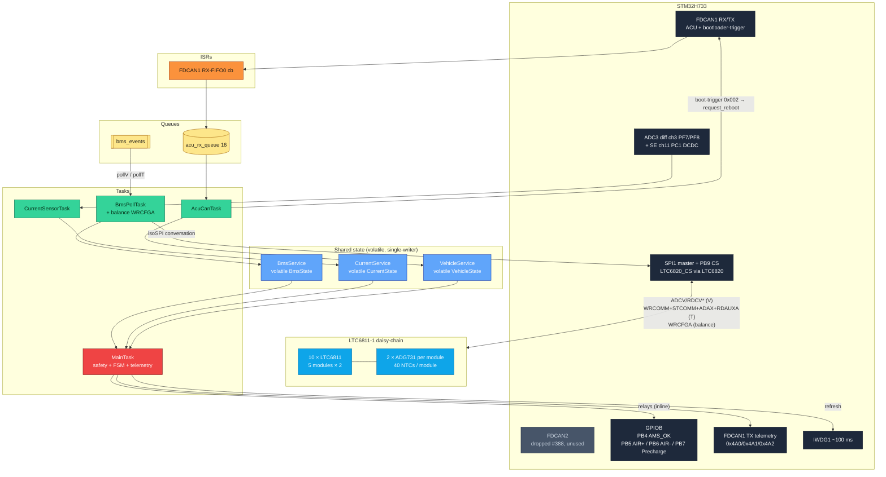
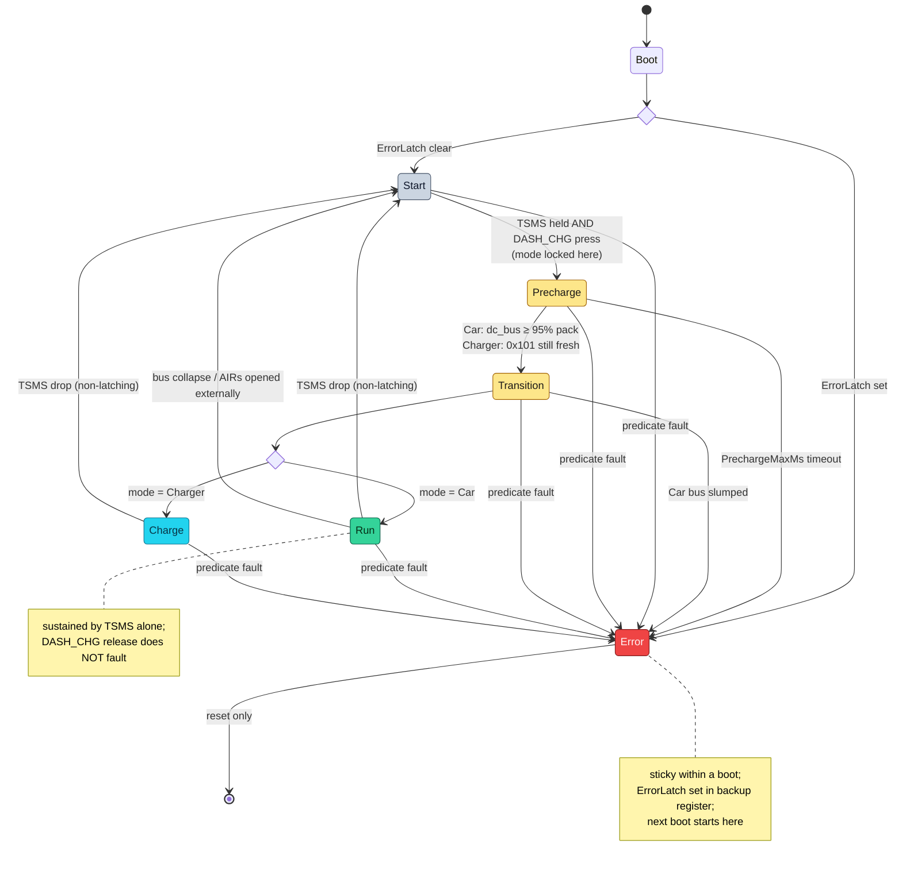
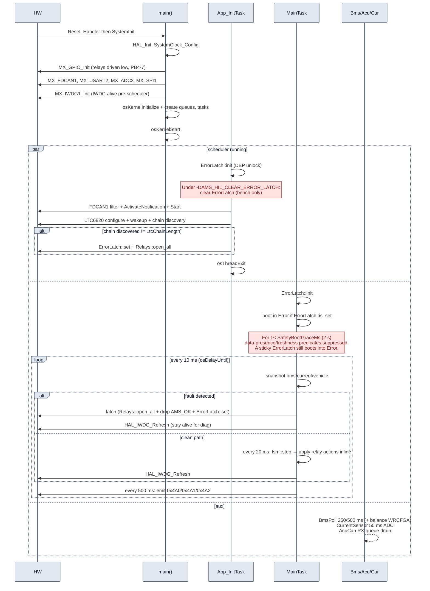

# AMS firmware architecture

Target hardware: STM32H733ZGTx (Cortex-M7 @ 528 MHz core, 264 MHz
AHB/HCLK, 1 MB Flash, ~1 MB RAM). RTOS: FreeRTOS via CMSIS-RTOS v2
(1000 Hz tick).
Language: C++17 for application code (no exceptions, no RTTI, no
thread-safe statics) on top of CubeMX-generated C for the HAL/RTOS
boilerplate.

This document is the **as-built** reference. The reverse-engineered
legacy protocol is in [`CAN_MAP.md`](CAN_MAP.md); the bench /
on-vehicle calibration procedure is in
[`COMMISSIONING.md`](COMMISSIONING.md).

---

## 1. Safety invariants

Everything else exists to enforce these:

1. **If the pack is unsafe, AIRs open within one safety period
   (10 ms).** "Unsafe" = any of the predicates in
   [`safety_predicates.hpp`](../Core/Inc/app/safety_predicates.hpp).
2. **Relays default to open** on any reset, fault, or uninitialised
   state. CubeMX-generated `MX_GPIO_Init` writes `PIN_RESET` to
   PB5 / PB6 / PB7 **before** configuring them as outputs.
3. **No single stuck task can prevent an AIR open.** `MainTask`
   runs at `osPriorityRealtime`, has direct GPIO write access via
   `ams::Relays`, and owns the watchdog refresh. The same task
   owns FSM step, predicate evaluation, relay drive, and
   telemetry emission — one timeline, no cross-task race.
4. **The watchdog is fed only on `MainTask`'s clean path** (and on
   the latched-fault path; see invariant 5). A stuck supervisor →
   IWDG timeout (≈100 ms) → hardware reset → relays default open.
5. **ERROR is latched across resets** via `RTC->BKP1R` (magic
   `0xA115EE51`). It survives every **warm** reset (software /
   `NVIC_SystemReset`, IWDG, reset pin) — so a fault that watchdog-resets
   the chip comes back up in `Error`. This carrier has **no VBAT** (#324),
   so the backup domain is powered only from VDD: a full LV **power-cycle**
   (or a brown-out collapsing VDD) clears the latch. That is **accepted by
   design** — a deliberate power-cycle is the manual reset, and a
   *persistent* fault re-latches on the next post-grace evaluation. The
   latch is **not** flash-backed; do not rely on it surviving a power-off.
   `BKP0R` is reserved for the bootloader's boot-request handshake
   (`0xB00710AD`), `BKP2R` is reserved for the jump-reason ASCII
   tag; no two registers share a word. Once latched, MainTask keeps
   refreshing the watchdog (relays already open, latch persists) so
   the chip stays alive for diagnosis instead of self-resetting in a
   100 ms loop. See PR #107 for the loop bug this avoids.
6. **Shared sensor state has one writer per service.** Single-writer
   / many-reader contract — Cortex-M7 32-bit aligned loads/stores
   are atomic. Multi-field reads can briefly observe a mid-update
   snapshot, but the predicate and telemetry are tolerant of
   one-cycle staleness. No mutex required; the old per-service
   mutex was retired in refactor/19 phase 1 (PR #119).
7. **Boot-grace window suppresses data-presence predicates for
   `SafetyBootGraceMs` (2 s) after `osKernelStart`.** At t = 0
   every service's `last_*_tick` is 0; without a grace the first
   MainTask iteration would fault on freshness and withhold the
   watchdog refresh, triggering an IWDG reset within ~100 ms. The
   window covers BmsPollTask's first voltage poll (250 ms),
   CurrentSensorTask's first ADC sample (50 ms), and AcuCanTask's
   first VCU 0x100 (uncontrolled but typically present).
   The grace suppresses only the **data-presence / freshness**
   predicates; a sticky `ErrorLatch` from a prior boot, and the
   reserved hard force-error hook (`force_error_set`, currently
   `constexpr false` — no live setter), are unaffected. See
   [`safety_predicates.hpp`](../Core/Inc/app/safety_predicates.hpp)
   and the inline comment on `SafetyBootGraceMs` in
   [`ams_config.hpp`](../Core/Inc/app/ams_config.hpp).
8. **The AMS does not sense the SDC line.** It IS part of the SDC
   via the ``AMS_OK`` output (PB4, active-high) — driving that output
   LOW opens the SDC. SafetyTask drives it every 10 ms tick (#299):
   HIGH only once the boot grace has passed AND no ERROR is latched;
   LOW during grace (predicates are suppressed, so the SDC must not be
   enabled against unverified inputs) and the instant a fault latches.
   The decision is the pure ``safety::ams_ok_asserted(now, latched)``.
   The legacy ``DIGITAL1`` (PE9) input was retired in PR #117 because
   the v1.2 daughterboard doesn't route it; the ``sdc_closed``
   predicate is gone.

> The HIL bench rig drives a real LTC6820/LTC6811 chain via the Pi
> Pico emulator (IFS08_HIL `feat/pico-ltc-emulator`, on MLC2 J8), so
> flight and bench run the **same BMS path** — same isoSPI traffic,
> same PEC validation, same predicate inputs. The only HIL-only build
> flag left is `AMS_HIL_CLEAR_ERROR_LATCH`, which auto-wipes the
> sticky `ErrorLatch` BKP register on boot so a faulted bench session
> starts clean. It is **never compiled into a flight build**. Full
> detail in [`HIL_BUILD.md`](HIL_BUILD.md).

---

## 2. Build model

CubeMX 6.17 generates a **CMake-based** project (not Eclipse-managed-
make). The boundary between generated and hand-written code:

```mermaid
flowchart LR
    subgraph Gen["CubeMX-owned (regenerated from AMS.ioc)"]
        G1[Core/Src/main.c<br/>Core/Src/freertos.c<br/>Core/Src/stm32h7xx_*.c]
        G2[Drivers/STM32H7xx_HAL_Driver/]
        G3[Middlewares/Third_Party/FreeRTOS/]
        G4[cmake/stm32cubemx/CMakeLists.txt]
    end
    subgraph Hand["Hand-written (lives forever)"]
        H1[Core/Inc/app/*.hpp + *.h]
        H2[Core/Src/app/*.cpp]
        H3[CMakeLists.txt<br/>top-level, edited once]
        H4[tests/unit/<br/>host CMake + Unity]
    end
    Gen -. "USER CODE BEGIN ... END blocks<br/>call ams_*_task_run trampolines" .-> Hand

    classDef gen  fill:#fde68a,stroke:#a16207,color:#1c1917
    classDef hand fill:#34d399,stroke:#065f46,color:#052e16
    class G1,G2,G3,G4 gen
    class H1,H2,H3,H4 hand
```



C++ code never modifies the generated `main.c`. Instead it provides
`extern "C"` trampolines (`ams_safety_task_run`,
`ams_bms_poll_task_run`, etc.) that the CubeMX-preserved
`USER CODE BEGIN … END` blocks call. Every regen keeps the
trampolines.

Cross-compile uses `arm-none-eabi-gcc 14.x`; host tests use the
system toolchain (Clang on macOS, GCC on Linux/CI).

---

## 3. Task architecture

**6 live tasks** post-refactor/19 (PRs #119 + #120 + #121), plus
CMSIS `defaultTask` and the FreeRTOS timer-service daemon. Task,
queue, and mutex creation lives in `main()` (CubeMX emits it directly
into `main.c`, not into an `MX_FREERTOS_Init` function). The collapsed
`StateTask` and `TelemetryTask` were fully removed in refactor/19 — no
thread is created for them and neither handle nor entry point survives
in the generated set (their empty header stubs were deleted too; § 12).

| Task | Priority (enum / value) | Period | Stack (words) | Implementation |
|---|---|---|---|---|
| `App_InitTask` | High (40) | once | 512 | [`app_init_task.cpp`](../Core/Src/app/app_init_task.cpp) |
| `MainTask` *(thread name still "SafetyTask")* | Realtime (48) | 10 ms | 512 | [`safety_task.cpp`](../Core/Src/app/safety_task.cpp) |
| `BmsPollTask` | Normal (24) | 250 ms / 500 ms (isoSPI poll + balance WRCFGA) | 1024 | [`bms_poll_task.cpp`](../Core/Src/app/bms_poll_task.cpp) |
| `AcuCanTask` | AboveNormal (32) | RX-queue-driven (FDCAN1; dispatches boot-trigger 0x002) | 512 | [`acu_can_task.cpp`](../Core/Src/app/acu_can_task.cpp) |
| `CurrentSensorTask` | AboveNormal (32) | 50 ms | 256 | [`current_task.cpp`](../Core/Src/app/current_task.cpp) |
| `defaultTask` | Low (8) | — | 128 | (CMSIS placeholder) |
| Timer service | Normal | callback-driven | 256 | FreeRTOS daemon |

### MainTask body

One timeline, tick-gated cadences:

```cpp
for (;;) {
    osDelayUntil(last_wake += 10);
    snapshot bms / current / vehicle
    fault = error_latched || evaluate_fault(...)
    if (fault) {
        if (!error_latched) latch (open relays + drop AMS_OK + set ErrorLatch)
        refresh watchdog                       // stay alive for diag
    } else {
        every 20 ms: fsm::step() → apply relay actions inline
        refresh watchdog
    }
    every 500 ms: emit telemetry frames 0x4A0/0x4A1/0x4A2
}
```

No event-flag ping-pong: the FSM's output bitmask is consumed
inline by the same task that produced it. The old `safety_events`
event group is still declared by CubeMX (cosmetic cleanup
deferred) but no one reads or writes it.

### BmsPollTask body

Owns the LTC6811 isoSPI conversation end-to-end and the balance
DCC writes (`maybe_run_balance_update` runs every
`BalanceUpdatePolls` voltage cycles, inline after RDCV[A-D],
sharing the same `LTC6820::Bus`). Single owner of the chain — no
bus mutex, no producer/consumer queue. Runs on every build flavour —
flight and HIL run the same LTC path; the bench drives a Pi Pico
LTC6820/LTC6811 emulator on MLC2 J8. See
[`HIL_BUILD.md`](HIL_BUILD.md) for the one remaining bench-only build
flag (`AMS_HIL_CLEAR_ERROR_LATCH`).

The legacy `BmsRxTask` was retired in v1.2.0 (#73) once the BMS
data path moved off FDCAN2; the bootloader-trigger frame it used
to dispatch now rides on FDCAN1 and is handled inside `AcuCanTask`.

### Why MainTask is realtime

`MainTask` is the only Realtime-priority task in the system. Its
period of 10 ms is the hard contract: worst-case latency from
"sensor reads out of range" to "AIRs open" is bounded by
`producer_period + 10 ms + GPIO_write < 15 ms` for the
immediate-danger predicates (force-error, current over-limit, BMS
module offline / stale, VCU stale). The producer tasks
(`BmsPollTask`, `CurrentSensorTask`, `AcuCanTask`) all run at
strictly lower priority, so they cannot preempt MainTask.

The cell voltage / temperature **range** predicates are the one
exception: they are debounced by `CellFaultConfirmTicks` (~300 ms,
spanning more than one 250 ms voltage poll) before latching ERROR
(#279). A cell cannot leave its valid window for a single 10 ms tick
and return, so a transient one is a glitch — a torn read of the
lock-free `BmsState` snapshot, or an unsettled first poll at boot —
not a real condition, and must not latch the sticky ERROR. Cell
under/over-voltage and over-temperature are slow-developing faults
(seconds), so the ~300 ms confirmation is well within their response
budget; the fast immediate-danger predicates above keep the < 15 ms
bound.

---

## 4. Data flow



**Legend** — hardware (slate, FDCAN2 dimmed because the app no longer
drives it) · LTC6811 chain + ADG731 mux (cyan) · ISRs (orange) ·
queues & event groups (amber) · shared state (blue) · tasks (green) ·
`MainTask` (red, the only realtime-priority task in the system).

What changed from pre-refactor/19:

- **No service mutexes.** Single-writer / many-reader → `volatile`
  state, atomic 32-bit accesses. Old `bms_mutex` / `current_mutex` /
  `vehicle_mutex` handles still declared by CubeMX but unused.
- **No `safety_events` event group consumer.** FSM output bitmask
  is consumed inline by MainTask. Handle still created in
  `ams_app_globals_init` (app_globals.cpp) but unused.
- **One realtime task instead of two-cooperating-tasks.**
  Safety + FSM + Telemetry collapsed; no ping-pong, no priority
  race surface.
- **HIL stub lives in `BmsPollTask`**, not in the predicate. The
  safety predicate is HIL-agnostic — same code on flight and bench.

Arrows are direction of value flow. The only direct GPIO writes
happen in `MainTask` (relays + `AMS_OK` + watchdog) and `App_InitTask`
(one-shot driver bring-up + LTC chain wakeup / length discovery). The
fan is hard-wired permanently on (fix/48) — no PWM, no GPIO drive.

The BMS transport is now isoSPI end-to-end; see
[`BMS_LTC6811.md`](BMS_LTC6811.md) for the LTC6811-1 wire protocol,
register-group layout, daisy-chain semantics, PEC15 rules, and the
ADG731 channel mapping that drives the temperature sweep.

---

## 5. Finite state machine

Six states. Transitions live in pure code at
[`state_machine.hpp`](../Core/Inc/app/state_machine.hpp) so they're
unit-tested in isolation; `MainTask` calls `fsm::step()` every 20 ms
on its 10 ms cadence and consumes the returned relay-action bitmask
inline (the old event-flag handoff to a separate `SafetyTask` was
retired in PR #120).

### Operator inputs and the two run contexts

The FSM is driven by **two GPIO inputs** plus the CAN-derived state.
Both are active-high with an external pull-down on the carrier, read by
MainTask every 10 ms:

| Input | Pin | Kind | Role |
|---|---|---|---|
| **TSMS** | PF9 | **held level** (master switch) | Gates `Start → Precharge`; **sustains** `Run`/`Charge`. Its drop is a **non-latching** de-energise → back to `Start` (#327), so the TS can be re-armed from the cockpit without a reset. |
| **DASH_CHG** | PF10 | **momentary press** (rising edge) | One press = one action. With TSMS, drives `Start → Precharge`. MainTask edge-detects PF10 at 10 ms and latches the rising edge until the 20 ms FSM step consumes it (a press landing between FSM steps is never lost; a level held from boot fires no edge). |

The two terminal contexts:

- **Run** = pack installed in the car. Reached via
  `Start → Precharge → Transition → Run`.
- **Charge** = pack on the charging station. Reached via the **same**
  `Start → Precharge → Transition → Charge` path — there is no direct
  `Start → Charge` edge. The only difference is which branch `Transition`
  takes, decided by the **mode locked at `Start → Precharge`**.

#### Mode lock (Car vs Charger)

At the exact tick `Start → Precharge` fires, MainTask captures an
immutable `Mode` (`Undecided`/`Car`/`Charger`) from two freshness checks
and never re-evaluates it for the rest of the boot — a pack cannot move
between car and charger while the AMS is alive:

```cpp
mode = (charge_req_fresh && !vcu_fresh) ? Mode::Charger : Mode::Car;
```

- `vcu_fresh` — a VCU `0x100` heartbeat heard within `VcuFreshMs` (1000 ms).
- `charge_req_fresh` — an operator `0x101` "CHRG" charge-mode request
  (magic `43 48 52 47`) heard within `ChargeReqFreshMs` (1000 ms). On the
  bench/charger this frame is emitted automatically while connected.

So: VCU present → **Car**. VCU absent **and** a fresh charge request →
**Charger**. VCU absent with **no** charge request → **Car** (and it then
faults on `VcuStale`, the fail-safe for a dead-VCU car — it never silently
charges). A stray `0x101` while the VCU is live cannot flip a running car
into Charger. See [`CAN_MAP.md`](CAN_MAP.md) § `0x101` for the wire detail.

#### Precharge completion is mode-specific

`Precharge` is **bounded** by `PrechargeMaxMs` (5000 ms): if it doesn't
complete in time, the FSM latches `Error` and opens every contactor —
capping how long the precharge resistor is held closed for *any* stuck
cause. What "complete" means depends on the locked mode:

- **Car** — the inverter DC-link must reach the target,
  `dc_bus_V ≥ PrechargeRatio (95%) × pack_voltage` (VCU-measured), before
  closing AIR+.
- **Charger** — there is no VCU `dc_bus_V` during a charge and the charger
  soft-starts its own output, so there is nothing to voltage-gate on.
  Instead the proceed is gated on the `0x101` charge request **still being
  fresh** (the charger's "connected and ready" signal). A single DASH_CHG
  press entered Precharge; the still-fresh `0x101` authorises closing AIR+.

`Transition` is a **one-step passthrough**, not a dwell: the contactor
swap (`CloseAirP | OpenPrecharge`) was already emitted on the
`Precharge → Transition` edge, and this step commits to `Run`/`Charge`
on the locked mode. A Car-only "bus still up" guard re-checks
`precharge_target_reached` so a failed contactor swap lands in `Error`
rather than energising the tractive system on a slumped bus (Charger skips
it — no `dc_bus_V`).



**Legend** — idle (slate) · bring-up (amber) · running (green) ·
charging (cyan) · error (red).

Edge-transition relay actions (bits in `Output::safety_flags`,
consumed inline by MainTask):

| Transition | bits set in `Output::safety_flags` |
|---|---|
| Start → Precharge | `CloseAirN`, `ClosePrecharge` |
| Precharge → Transition | `CloseAirP`, `OpenPrecharge` |
| Transition → Run / Charge | _(none — contactor swap already done on the edge above)_ |
| any → Error | `ForceError`, `OpenAirN`, `OpenAirP`, `OpenPrecharge` |

**Key properties:**

- **`Run`/`Charge` are sustained by TSMS alone.** DASH_CHG is a momentary
  press — low for most of `Run`/`Charge` — so it is **not** level-checked
  there. A TSMS drop is a **non-latching** de-energise to `Start` (#327), **not** a fault — it never latches `Error` and never touches `AMS_OK`, so the driver can re-arm from the cockpit unaided. (Level-checking DASH_CHG in
  `Run` would fault instantly the moment the operator released it.)
- **AIRs opened externally → `Run` de-energises to `Start` (#330).** The
  cockpit SDC shutdown opens the AIRs without the AMS sensing it; the VCU
  keeps reporting `dc_bus_V`, so a **sustained collapse** of the bus below
  `BusCollapsePercent` of the pack (debounced over `BusCollapseConfirmTicks`
  in Car mode) means the contactors are physically open while the FSM still
  thinks it's in `Run`. The FSM falls back to `Start` (non-latching, AMS_OK
  untouched) so a re-arm re-runs precharge instead of reclosing AIR+ onto a
  discharged DC-link when the shutdown is released. Car/`Run` only — Charge
  has no VCU `dc_bus_V` and the charger soft-starts.
- **ERROR is sticky within a boot.** Even if the underlying fault clears,
  the FSM stays in `Error` until reset. `ErrorLatch::set()` fires on every
  `Error` entry so the next boot also starts in `Error` until
  backup-domain power is cycled.
- **The FSM consumes an already-debounced fault decision.** MainTask is the
  single fault authority: it evaluates the predicate set (debouncing the
  cell V/T range checks, § 3) and passes the result into `fsm::step()` as
  `predicate_fault`. The FSM does **not** re-run the predicates — doing so
  once bypassed the debounce (#279). On a fault tick MainTask latches and
  skips the FSM step; the any-state→`Error` branch in the FSM is a kept
  backstop.
- **AIR / Precharge actions are driven inline by MainTask.** The FSM's
  `safety_flags` bitmask is interpreted by `apply_relay_actions` in the
  same iteration the FSM ran — no event-flag indirection, no cross-task
  race window. The faulted path skips relay actions but the relays are
  already open from `latch_error_()`.
- **`AMS_OK` (PB4) tracks the live safety state**, driven separately every
  10 ms (§ 1, invariant 8): LOW during boot grace, HIGH once past grace
  with no `Error` latched, LOW the instant a fault latches.

---

## 6. Boot sequence



`App_InitTask` self-deletes once peripheral bring-up is done; its
TCB and stack return to the heap. The retired `StateTask` and
`TelemetryTask` were removed entirely in refactor/19 — no thread is
created for them, so there is nothing to exit or reclaim.

---

## 7. Shared state

Three domain services. Each is a singleton wrapping a `volatile`
struct. **Single-writer / many-reader**, lock-free.

| Service | Writer | Readers |
|---|---|---|
| [`BmsService`](../Core/Inc/app/bms_service.hpp) | `BmsPollTask` (LTC6811 isoSPI sweeps; `update_from_ltc_response` + `update_temperature`) | MainTask, AcuCanTask, BalanceController |
| [`CurrentService`](../Core/Inc/app/current_service.hpp) | `CurrentSensorTask` (ADC: `update_from_adc` + `update_dcdc_from_adc`) | MainTask, AcuCanTask |
| [`VehicleService`](../Core/Inc/app/vehicle_service.hpp) | `AcuCanTask` (VCU `0x100` heartbeat + operator `0x101` charge-mode request) | MainTask |

Concurrency model: Cortex-M7 32-bit aligned loads/stores are atomic.
Multi-field reads from a non-writer task can briefly observe a
mid-update snapshot — the predicate + telemetry are tolerant of
one-cycle staleness (any inconsistency causes at worst one extra
predicate evaluation that corrects on the next 10 ms iteration).
The mutex handles (`bms_mutexHandle` etc.) are still created by
CubeMX in `main()` (CubeMX emits `osMutexNew` inline there, not in an
`MX_FREERTOS_Init` function) but no one acquires them anymore;
cleanup deferred to a future `.ioc` pass.

`BmsState` shape:

| Field | Type | Notes |
|---|---|---|
| `cell_mV` | `uint16_t [5][19]` | 95 cells; populated by `update_from_ltc_response`. |
| `cell_tempC` | `int16_t [5][40]` | 200 NTC slots; populated by `update_temperature`. Ctor-initialised to 25 °C so unpopulated channels don't dominate `max_tempC`. |
| `pack_voltage_mV`, `min/max_cell_mV`, `min/max/avg_tempC` | summaries | recomputed inside `recompute_summaries_` after every write. |
| `last_rx_tick[5]` | `uint32_t` | advances only on a poll where BOTH LTCs of the module passed PEC. |
| `module_online_mask` | `uint8_t` | sticky (once-online); compared against `AllModulesMask`. |
| `ltc_online_mask` | `uint16_t` | non-sticky per-cycle per-IC PEC-OK mask (10 bits). |

---

## 8. Inter-task signalling

Two primitives, nothing else.

**Queues** ([`AMS.ioc`](../AMS.ioc) `FREERTOS.Queues01`):

| Queue | Depth | Item | Producer | Consumer |
|---|---:|---|---|---|
| `acu_rx_queue` | 16 | `CanFrame` | FDCAN1 RX ISR | AcuCanTask |
| `acu_tx_queue` | 16 | `CanFrame` | (reserved) | (reserved) |

`bms_rx_queue` was retired in v1.2.0 (#73) along with `BmsRxTask`.
`acu_tx_queue` is declared in the .ioc but currently unused —
`AcuCanTask` and `MainTask` are sole producers on FDCAN1 TX and
call HAL directly.

`AcuCanTask` also owns **FDCAN1 Bus-Off recovery**: each loop pass it
reads `HAL_FDCAN_GetProtocolStatus` (a cheap PSR read) and, if the M_CAN
has latched Bus-Off (sustained TX errors → `CCCR.INIT` set → both TX and
RX halted, no self-clear), issues a rate-limited `HAL_FDCAN_Stop`/`Start`
to rejoin — at most once per `FdcanBusOffRetryMs` (100 ms) so the M_CAN's
automatic recovery isn't restarted before it completes. The pure
rate-limit policy is host-tested in
[`can_busoff_recovery.hpp`](../Core/Inc/app/can_busoff_recovery.hpp);
the unwedge of a `Stop`/`Start` timeout (forcing `State` back to `READY`)
mirrors the bootloader's `Bootloader_FdcanBusOffRecover`. This is a
robustness path, not a safety predicate — it keeps telemetry, the VCU
heartbeat RX, and the CAN boot-trigger alive across a transient bus
fault; a genuinely dead bus still fails safe (Car-mode `VcuStale` latches
ERROR on schedule). It runs outside `MainTask`, so it cannot affect the
10 ms AIR-open path (invariant 1/3).

**Event groups** (managed by
[`app_globals.cpp`](../Core/Src/app/app_globals.cpp) because
CubeMX 6.17 doesn't emit them from .ioc):

| Group | Bit | Set by | Cleared by |
|---|---|---|---|
| `bms_events` | `PollVDue` | osTimer 250 ms | BmsPollTask (ADCV + RDCV[A-D] over isoSPI) |
|  | `PollTDue` | osTimer 500 ms | BmsPollTask (20-channel ADG731 mux sweep) |

The `safety_events` event group was retired in refactor/19 phase 3
(PR #120): the FSM's relay-action bitmask is now consumed inline by
`MainTask` in the same iteration the FSM produced it. The handle is
still created in `ams_app_globals_init` (app_globals.cpp, alongside
`bms_events`) but no one reads or writes it; cleanup deferred.

---

## 9. Memory budget (as built)

| Region | Used | Capacity | % used | Notes |
|---|---:|---:|---:|---|
| FLASH | ~78 KB | 768 KB | ~10 % | app region only (sectors 1..6). Sector 0 reserved for the bootloader, sector 7 for BL NVM + app metadata. Cross-compile run summary on each CI build reports the exact byte count. |
| DTCMRAM | ~46 KB | 128 KB | ~36 % | stacks, TCBs, BSS, FreeRTOS heap_4. |
| ITCMRAM | 0 B | 64 KB | 0 % | unused. |
| RAM_D1/D2/D3 | 0 B | — | — | unused. |

The 768 KB ceiling is enforced both at link time (`STM32H733XG_FLASH.ld`
`FLASH` region is sized for the app range) and in CI (the
[`check_flash_layout.py`](../scripts/check_flash_layout.py) step in
`build-tests.yml` rejects any image that lands in sector 0 or
overflows sector 6).

FreeRTOS heap (`configTOTAL_HEAP_SIZE = 65 536`, i.e. 64 KB): task
TCBs + stacks (`BmsPollTask` alone is 1024 words) come out of `heap_4`,
with comfortable headroom left free. Newlib reentrant structs account
for ~1 KB. The load-bearing tasks (`App_InitTask`, `MainTask`) were
originally planned as `Static` allocation; CubeMX UI workflow makes
that brittle, so they ship `Dynamic` for now. Heap has enough headroom
that this is fine; revisitable post-commissioning.

---

## 10. C++ rules

Compiler flags (top-level [`CMakeLists.txt`](../CMakeLists.txt)):

```cmake
-std=c++17
-fno-exceptions
-fno-rtti
-fno-threadsafe-statics
-fno-use-cxa-atexit
-Wall -Wextra -Wpedantic
```

**Required patterns:**

- One service / task per `.hpp` + `.cpp` pair, named
  `<thing>_service` or `<thing>_task`.
- Singletons via `static` local in `instance()`. Construction order
  controlled by explicit `init()` calls from `App_InitTask`.
- Task entry points are `extern "C"` trampolines that call into
  the implementation TU.
- `enum class` for state types (`fsm::State`, `CanBus`).
- `constexpr` for every threshold, ID, period — collected in
  [`ams_config.hpp`](../Core/Inc/app/ams_config.hpp). Anything
  needing on-vehicle tuning is tagged `COMMISSION` (see
  [`COMMISSIONING.md`](COMMISSIONING.md)).
- **Single-writer per shared struct.** No mutexes in app code —
  Cortex-M7 atomic 32-bit accesses + the producer/consumer
  contract make them unnecessary. If you find yourself wanting a
  mutex, the design is wrong; talk to the safety reviewer.
- No `new` / `delete` in steady state. FreeRTOS allocates at task /
  queue / event-group creation only.

**Banned:** `std::string`, `std::vector`, `<iostream>`, `<thread>`,
heap allocation after `osKernelStart`.

---

## 11. Testing

Two layers, both in [`tests/unit/`](../tests/unit/) (the SIL
"scenarios" are pure-FSM multi-step tests; they don't need a
separate harness):

| Layer | Files | Coverage |
|---|---|---|
| Unit (single-step) | `test_bms_service`, `test_current_service`, `test_vehicle_service`, `test_safety_predicates`, `test_state_machine`, `test_bootloader`, `test_ltc6811_decode`, `test_telemetry_encoders`, `test_balance_controller`, `test_acu_tx_encoders`, `test_pit_diag_emitter`, `test_can_busoff_recovery`, `test_dsl_parity`, `test_dsl_dbc_consistency` | LTC6811 PEC15 + register decoders + chain-length walker, ADG731 channel packing, balancing policy, BMS / current / vehicle service decode + freshness (incl. the `0x101` charge-request magic gate), ADC scaling, each safety predicate in isolation (incl. the cell V/T debounce and VcuStale Car-only gate), every FSM transition (incl. DASH_CHG momentary edge, Charger `0x101`-fresh proceed, `PrechargeMaxMs` timeout), telemetry + pit-diag encoders, FDCAN1 Bus-Off recovery rate-limit policy (§ 8), the code-first CAN DSL parity + DBC consistency, boot-trigger frame matcher |
| SIL (multi-step) | `test_sil_scenarios` | nominal Car startup → Run, BMS dropout → Error, charger path (one press + fresh `0x101`) → Charge, stale-`0x101` mid-precharge → timeout → Error, TSMS-drop → Start → re-arm (non-latching) |

**The full host suite passes on every push** via
`.github/workflows/build-tests.yml`, which also cross-compiles the
firmware with `arm-none-eabi-gcc` and reports flash/RAM sizes in
the run summary.

The pure-logic separation (FSM, predicates, decoders, scaling) is
the key design decision that keeps the test surface large without
mocking HAL or FreeRTOS — only `osMutexAcquire/Release` and the
mutex-handle externs are stubbed in
[`tests/unit/mocks/`](../tests/unit/mocks/).

---

## 12. File layout

```
IFS08-CE-AMS/
├── AMS.ioc                          # CubeMX (source of truth for HW)
├── CMakeLists.txt                   # firmware build (CMake)
├── README.md
├── ROADMAP.md                       # auto-generated, do not edit
├── CONTRIBUTING.md
├── STM32H733XG_FLASH.ld
├── startup_stm32h733xx.s
├── Core/
│   ├── Inc/                         # CubeMX-owned C headers
│   │   ├── FreeRTOSConfig.h, main.h, stm32h7xx_*.h
│   │   └── app/                     # HAND-WRITTEN
│   │       ├── acu_can_task.h
│   │       ├── acu_tx_encoders.hpp     # ACU-bound frame encoders
│   │       ├── ams_config.hpp       # ALL constexpr (incl. LTC/NTC tunables)
│   │       ├── ams_events.hpp       # event-group bits
│   │       ├── app_globals.h
│   │       ├── app_init_task.h
│   │       ├── balance_controller.hpp  # pure-logic balancing policy (#74)
│   │       ├── bms_poll_task.h
│   │       ├── bms_service.hpp
│   │       ├── bootloader.hpp
│   │       ├── can_busoff_recovery.hpp # pure FDCAN1 Bus-Off rate-limit policy
│   │       ├── can_frame.{h,hpp}
│   │       ├── current_service.hpp
│   │       ├── current_task.h
│   │       ├── error_latch.hpp
│   │       ├── ltc6811.hpp          # pure-logic LTC6811 wire layer (#67)
│   │       ├── ltc6820.hpp          # SPI/CS isoSPI master wrapper (#68)
│   │       ├── pit_diag_emitter.hpp    # pit-diag frame emitter
│   │       ├── relay_driver.hpp
│   │       ├── safety_predicates.hpp
│   │       ├── safety_task.{h,hpp}      # MainTask body lives here (rename pending)
│   │       ├── scoped_mutex.hpp         # orphaned since refactor/19 phase 1
│   │       ├── state_machine.hpp
│   │       ├── telemetry_encoders.hpp   # telemetry frame encoders (0x4A0..)
│   │       ├── vehicle_service.hpp
│   │       └── watchdog.{h,hpp}
│   ├── Src/
│   │   ├── main.c, freertos.c       # CubeMX-owned; USER CODE blocks
│   │   │                              call ams_*_task_run trampolines
│   │   ├── stm32h7xx_*.c, sysmem.c, syscalls.c
│   │   ├── stm32h7xx_hal_timebase_tim.c
│   │   └── app/                     # HAND-WRITTEN
│   │       ├── acu_can_task.cpp     # also dispatches boot-trigger on FDCAN1
│   │       ├── app_globals.cpp
│   │       ├── app_init_task.cpp
│   │       ├── bms_poll_task.cpp    # LTC6811 isoSPI driver (V + T + balance)
│   │       ├── bms_service.cpp
│   │       ├── bootloader.cpp
│   │       ├── can_isr.cpp           # HAL_FDCAN_RxFifo0Callback (FDCAN1 only)
│   │       ├── current_service.cpp
│   │       ├── current_task.cpp
│   │       ├── error_latch.cpp
│   │       ├── firmware_info.cpp
│   │       ├── ltc6811.cpp           # PEC15 + register-group decoders + WRCFGA
│   │       ├── ltc6820.cpp           # HAL_SPI wrapper, wakeup, STCOMM
│   │       ├── relay_driver.cpp
│   │       ├── safety_task.cpp          # MainTask (safety + FSM + telemetry)
│   │       ├── vehicle_service.cpp
│   │       └── watchdog.cpp
│   └── Startup/startup_stm32h733zgtx.s
├── Drivers/                          # STM32H7 HAL + CMSIS
├── Middlewares/Third_Party/FreeRTOS/
├── cmake/
│   ├── gcc-arm-none-eabi.cmake       # toolchain file
│   ├── starm-clang.cmake
│   └── stm32cubemx/CMakeLists.txt    # regenerated by CubeMX
├── docs/
│   ├── ONBOARDING.md                 # START HERE — Day-1 guide + reading order
│   ├── GLOSSARY.md                   # domain terms (AIR, SDC, TSMS, isoSPI, PEC, …)
│   ├── ARCHITECTURE.md               # this file — as-built reference
│   ├── DEEP_DIVE.md                  # end-to-end codebase walkthrough
│   ├── FSM_OVERVIEW.md               # gate-by-gate safety FSM reference
│   ├── BMS_LTC6811.md                # isoSPI BMS wire protocol
│   ├── CAN_MAP.md                    # vehicle / ACU CAN protocol
│   ├── COMMISSIONING.md              # bench / on-vehicle calibration
│   ├── HIL_BUILD.md                  # AMS_HIL_CLEAR_ERROR_LATCH build flag (bench only)
│   ├── AMS_2025_VS_2026.html         # season-over-season rewrite narrative
│   └── dbc/                          # generated CAN database (ams.dbc) + gen notes
├── tests/
│   └── unit/
│       ├── CMakeLists.txt            # host CMake (FetchContent Unity)
│       ├── mocks/                    # cmsis_os2 stub for host
│       ├── test_*.cpp                # host tests (Unity)
│       └── unity_runner.cpp
└── .github/
    ├── roadmap.yaml                  # phase plan
    ├── scripts/render_roadmap.py
    └── workflows/
        ├── branch-issue.yml
        ├── build-tests.yml           # CI: cross-compile + host tests
        ├── close-on-dev-merge.yml
        └── roadmap.yml
```

---

## 13. Where to start reading

Different entry points by goal:

- **Adding a new CAN frame**:
  [`CONTRIBUTING.md`](../CONTRIBUTING.md) § "Adding a new CAN frame".
  Declare the ID in `ams_config.hpp`, write encode/decode + unit
  tests, update `CAN_MAP.md`.
- **Adding a new task**:
  [`CONTRIBUTING.md`](../CONTRIBUTING.md) § "Adding a new task".
  Touches `AMS.ioc` (`Tasks01` line), one `<task>.h` C-callable
  header, one `<task>.cpp` implementation, one `main.c` USER CODE
  trampoline.
- **Modifying MainTask / predicates / relays**: this is the
  `safety-critical` review bar. Read § 1 and § 5 of this file; then
  follow [`CONTRIBUTING.md`](../CONTRIBUTING.md) § "Modifying the
  safety supervisor".
- **Bringing up new hardware**:
  [`COMMISSIONING.md`](COMMISSIONING.md).
- **Working on the LTC6811 / isoSPI path**:
  [`BMS_LTC6811.md`](BMS_LTC6811.md) is the source of truth for the
  wire protocol, cell + temp mappings, PEC15, and balancing.
- **Setting up the HIL bench rig**:
  [`HIL_BUILD.md`](HIL_BUILD.md) explains the
  `AMS_HIL_CLEAR_ERROR_LATCH` build flag and why it must never reach a
  flight build.

---

## 14. Cross-reference to ECU

For team members coming from
[`isc-fs/IFS08-CE-ECU`](https://github.com/isc-fs/IFS08-CE-ECU):

| ECU pattern | AMS equivalent | Reason for delta |
|---|---|---|
| `g_in` + `g_inMutex` (single shared struct) | 3 services, no mutex (volatile, single-writer) | Distinct domains; lock-free single-writer contract |
| `ControlTask` 10 ms | `MainTask` 10 ms (safety + FSM 20 ms + telemetry 500 ms inline) | Refactor/19 collapsed to one timeline |
| `CanRxTask` 5 ms single bus | `AcuCanTask` (FDCAN1 only) | BMS moved off CAN onto isoSPI in v1.2.0 (#67–#74); `BmsRxTask` retired (#73). |
| `CanTxTask` drains queue | Merged into `AcuCanTask` / `BmsPollTask` | Fewer context switches |
| legacy AMS CAN polling on FDCAN2 | LTC6811-1 isoSPI broadcast (ADCV / RDCV[A-D] / WRCOMM / ADAX / RDAUXA / WRCFGA) via LTC6820 master on SPI1 | Hardware swap to BMS_LITE in v1.2.0; protocol details in [`BMS_LTC6811.md`](BMS_LTC6811.md). |
| (none) | `MainTask` realtime + watchdog discipline | AMS has direct safety output |
| `AppRuntime_*Step` factoring | Pure helpers (`fsm::step`, `safety::evaluate_fault`, `adc_to_mA`, `classify`, `telemetry::encode_*`) | Larger host-testable surface |
| C only | C++ for app, C for CubeMX-owned | Legacy AMS was already C++; classes simplify the service pattern |
