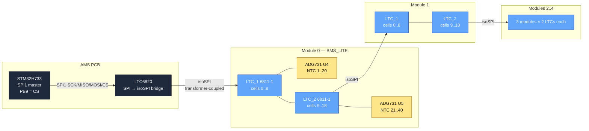
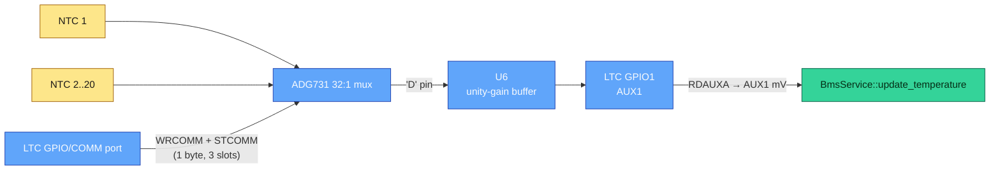
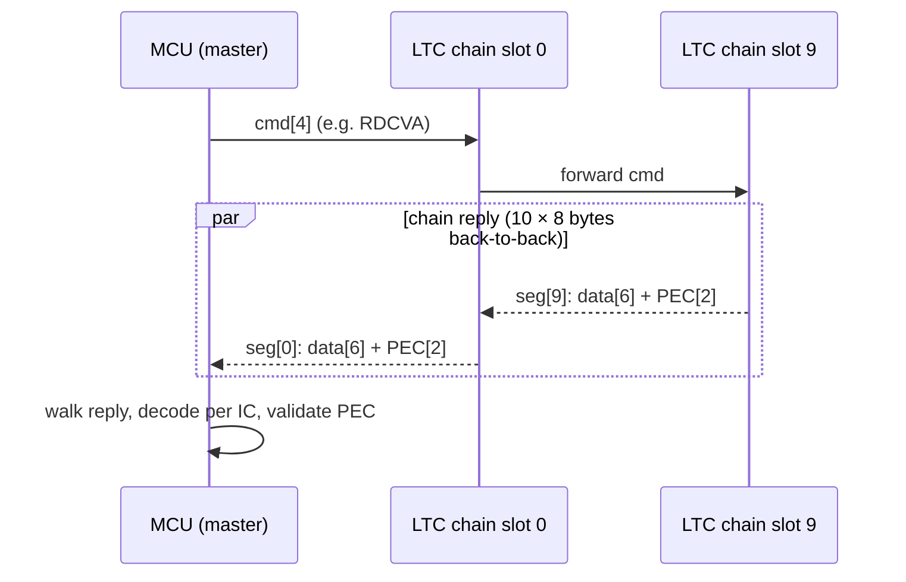

# BMS wire protocol — LTC6811-1 / isoSPI

Source-of-truth for the BMS transport, mirroring the role
[`CAN_MAP.md`](CAN_MAP.md) plays for the accumulator and vehicle CAN
buses. Living spec: any change to the LTC6811 driver, the chain
topology, or the BMS_LITE board mapping must update this document
in the same PR.

**Hardware reference — not in this repo.** `/pcb/` and `/pcbs/` are
gitignored (see `.gitignore`): the firmware repo is not the canonical store
for schematics or datasheets. The paths below name files in a *local*
reference checkout, so a fresh clone will not have them. If you need the
schematic to settle a question, get the PCB repo.

- LTC6811-1 datasheet → `pcbs/BMS_LITE/Datasheets/LTC6811HG-1.pdf`
- LTC6820 datasheet → analog.com (isoSPI master)
- ADG731 datasheet → `pcbs/BMS_LITE/Datasheets/ADG731.pdf`
- BMS_LITE schematic → `pcbs/BMS_LITE/{BMS_LITE,LTC_1,LTC_2}.kicad_sch`

Firmware reference:
- Pure-logic wire layer → [`ltc6811.{hpp,cpp}`](../Core/Inc/app/ltc6811.hpp)
- SPI / CS driver → [`ltc6820.{hpp,cpp}`](../Core/Inc/app/ltc6820.hpp)
- Data ingestion → [`bms_service.{hpp,cpp}`](../Core/Inc/app/bms_service.hpp)
- Poll cadence → [`bms_poll_task.cpp`](../Core/Src/app/bms_poll_task.cpp)
- Balancing policy → [`balance_controller.hpp`](../Core/Inc/app/balance_controller.hpp)
- Open-wire detector → [`open_wire.hpp`](../Core/Inc/app/open_wire.hpp)

---

## 1. Topology

One LTC6820 isoSPI master on the AMS PCB drives a daisy-chain of ten
LTC6811-1 monitors — two per BMS_LITE module, five modules total.
Each LTC owns a 32:1 ADG731 mux; **20 of its 32 inputs are populated**
with NTC thermistors (12 unused — see §3).



**Chain indexing.** The daisy-chain has no addressing, so "which IC is
this?" is purely positional: the *i*-th 8-byte segment of a chain reply
is IC *i*. Everything downstream derives from that one index:

```
module   = ic / config::LtcsPerModule      // = ic / 2
is_upper = (ic % config::LtcsPerModule) == 0
```

(`bms_service.cpp::update_from_ltc_response`, and identically in
`update_open_wire` and `capture_adow_raw`.)

| Chain slot | Module | Role |
|---:|:---:|---|
| 0 | 0 | LTC_1 (upper, **9** cells) |
| 1 | 0 | LTC_2 (lower, **10** cells) |
| 2 | 1 | LTC_1 |
| 3 | 1 | LTC_2 |
| 4 | 2 | LTC_1 |
| 5 | 2 | LTC_2 |
| 6 | 3 | LTC_1 |
| 7 | 3 | LTC_2 |
| 8 | 4 | LTC_1 |
| 9 | 4 | LTC_2 |

`config::LtcChainLength = 10` is the source of this count; any change has
to land in `ams_config.hpp` first.

> **What is assumed here.** Which *physical* board sits at segment 0 is a
> wiring fact the firmware cannot check — nothing in the source proves
> "segment 0 is the module nearest the master". The firmware only assumes
> the ordering is *stable* and that even/odd alternates upper/lower. The
> nearest thing to evidence is the bench ADOW capture in
> `tests/unit/test_open_wire.cpp`, recorded as coming from a named module's
> upper LTC with a named sense wire physically disconnected — consistent
> with this map, but not a deliberate test of it. If a module is ever
> re-cabled into a different chain position, every per-module number in
> telemetry moves with it and nothing will complain.

---

## 2. Cell mapping

Each module is 19 series cells, split **9 on LTC_1 (upper) and 10 on
LTC_2 (lower)** — `config::CellsPerLtcUpper = 9`,
`config::CellsPerLtcLower = 10`. The split is asymmetric, and swapping the
two halves is the classic bug in this area: it silently zeroes one cell and
drops another while every PEC still passes.

An LTC6811 always returns 12 cell channels in four register groups of
three. Which of them are real depends on the IC's role:

| Module cell | LTC | RDCV\* group | Group slot |
|---:|:---:|:---:|---:|
| 0, 1, 2 | LTC_1 | RDCVA | 0, 1, 2 |
| 3, 4, 5 | LTC_1 | RDCVB | 0, 1, 2 |
| 6, 7, 8 | LTC_1 | RDCVC | 0, 1, 2 |
| — | LTC_1 | RDCVD | **read and discarded** (C10..C12 unconnected) |
| 9, 10, 11 | LTC_2 | RDCVA | 0, 1, 2 |
| 12, 13, 14 | LTC_2 | RDCVB | 0, 1, 2 |
| 15, 16, 17 | LTC_2 | RDCVC | 0, 1, 2 |
| 18 | LTC_2 | RDCVD | 0 (the IC's C10) |
| — | LTC_2 | RDCVD | slots 1..2 discarded (C11, C12 unconnected) |

RDCVD is still *read* on both ICs even though the upper IC has nothing in
it — the four groups are read unconditionally into one contiguous
320-byte buffer (4 groups × 10 ICs × 8 bytes) that
`BmsService::update_from_ltc_response` walks in one pass.

Two consequences you must carry into any new code that touches the chain:

- **The per-IC cell count is never uniform.** ADOW decoding
  (`update_open_wire`), the raw diagnostic dump (`capture_adow_raw`) and
  the balancing DCC packing all take `n_cells = 9` for even chain indices
  and `10` for odd ones. Feeding the upper IC's unused RDCVD registers to
  the open-wire detector would false-flag conductors that do not exist.
- **PEC validity is per IC, not per group.** All four groups of an IC must
  PEC-clean; one bad group drops that IC's *entire* slice for the cycle
  (its cell slots keep their previous values) and increments
  `g_ltc_pec_err_count[ic]`. The decode is done in two passes precisely so
  a half-updated module is never observable through `snapshot()`. See §6.

Anti-regression test:
`tests/unit/test_bms_service.cpp::test_bms_ltc_clean_response_decodes_all_cells`
asserts all 19 cells of a module populate contiguously with no interior
hole. `open_wire.hpp` restates the same map at the top of the file as a
poll-integration contract; keep the three in lockstep.

---

## 3. Temp mapping

200 NTCs total: 5 modules × 40 (`config::TempsPerModule`), i.e. 20 per LTC
(`config::TempsPerLtc`). Each LTC owns one ADG731 32:1 mux on its
`GPIO/COMM` port; the selected channel is fed through a unity-gain buffer
into `GPIO1` and read with `ADAX(Gpio1) → RDAUXA` as AUX1.

Storage slots follow the same even/odd rule as cells:
**upper LTC → `cell_tempC[m][0..19]`, lower LTC → `cell_tempC[m][20..39]`**
(`BmsService::update_temperature`).



### ADG731 channel ↔ NTC mapping

The mux has 32 inputs; only 20 are populated, and the populated ones are
**not contiguous**:

| ADG731 channel (0-indexed) | Schematic pin | Wired to |
|---:|---|---|
| 0..9 | S1..S10 | NTC_1..NTC_10 |
| 10..15 | S11..S16 | unused |
| 16..25 | S17..S26 | NTC_11..NTC_20 |
| 26..31 | S27..S32 | unused |

`config::Adg731ChannelMap[20]` is exactly this lookup, and the sweep in
`run_temperature_poll` walks it by index:

```cpp
{ 0, 1, 2, 3, 4, 5, 6, 7, 8, 9,           // NTC_1..NTC_10
  16, 17, 18, 19, 20, 21, 22, 23, 24, 25 } // NTC_11..NTC_20
```

Both muxes on a board use the same map — LTC_1's mux carries NTC_1..20
(slots 0..19), LTC_2's carries NTC_21..40 (slots 20..39). All 40 slots on
all 5 modules are listed in `config::RequiredTempSlots`, which means an
open on **any** of them latches ERROR (§9). That is a strong claim about
the harness: if a channel is genuinely unpopulated in copper, the pack
will refuse to arm until it is either wired or removed from
`RequiredTempSlots`.

> **Unresolved.** The comment on `config::BalanceMinValidTempCh` still says
> the fitted channel count is unknown and "the LTC_2 half may not be wired
> at all", which contradicts `RequiredTempSlots`' claim that all 40 are
> populated. Only a bench sweep settles it — see
> [`COMMISSIONING.md`](COMMISSIONING.md) §3b. Until then, treat the count
> as measured-by-nobody.

### Mux first-select warm-up — do not remove

`run_temperature_poll` starts each sweep with a throwaway `WRCOMM`/`STCOMM`
selecting channel 31 (**S32, unpopulated on every mux**), then sleeps 1 ms
before the real channel 0.

The first COMM transaction after the voltage poll's cell-read burst can be
dropped: slaves re-sync on CS edges after a multi-ms idle, so the sweep's
first real select never latches and every mux stays on its previous
channel. The symptom is temp slot 0 railing to ~VREF2 on *all* modules at
once — a false open on every sweep. Confirmed on the bench with a
32-channel raw dump: 9 of 10 muxes' S1 came alive the instant the warm-up
was added (the tenth was a genuine hardware open). Targeting an
unpopulated address means a *dropped warm-up* can never cost a real
temperature. Since slot 0 is a required channel, removing this warm-up
would false-fault every module at boot.

The sweep is **resumable**: after each channel it checks whether a voltage
poll is due and, if so, re-arms its own event flag and returns. That bounds
the voltage poll's jitter to ~one channel (~3 ms) instead of a whole
sweep, which is the precondition that makes `BmsStaleMs = 350` safe from
nuisance trips.

### NTC voltage-to-temperature conversion

Each NTC sits between the ADG731 `S` input and ground; a pull-up to
LTC6811 `VREF2` forms the divider. Recovering temperature is a two-step:

```
R_ntc  = NtcPullupOhm * V_aux / (NtcVrefMv - V_aux)
T_degC = reverse-interpolate(ntc::ResistanceOhm, R_ntc)
```

The part is a **Fenghua CMFB103F3950FANT** (R25 = 10 kΩ, B25/50 = 3950 K,
B25/85 = 4021 K). Temperature comes from the manufacturer's **R-T table**
([`ntc_table.hpp`](../Core/Inc/app/ntc_table.hpp), generated from
[`ntc_rt_table.csv`](ntc_rt_table.csv)) by reverse interpolation, *not*
from a single-beta Steinhart fit — beta is only accurate near its fitting
interval and this part quotes two different betas.

| Constant | Value | Meaning |
|---|---:|---|
| `NtcPullupOhm` | 6 800 Ω | BMS_LITE R145 / R170 pull-up to VREF2 |
| `NtcVrefMv` | 3 000 | LTC6811 VREF2 nominal |
| `NtcOpenMv` | 2 800 | at or above this AUX mV ⇒ **open**, not cold |
| `NtcMinValidC` / `NtcMaxValidC` | −40 / +150 °C | plausibility gate |
| `NtcNoReading` | INT16_MIN | "this channel produced no data" sentinel |

> **The two constants are not independent.** A wrong pull-up and a wrong
> beta partially cancel, so fixing either one *alone* makes the reading
> worse than leaving both wrong. If you ever re-derive this path, change
> the divider value and the conversion model together and re-check against
> `tests/unit/test_ntc_table.cpp`.

**Why `NtcOpenMv` sits below `NtcVrefMv`.** A disconnected NTC leaves the
node pulled up toward VREF2, but a *partially*-railed open (mux leakage, a
damp harness, a high-impedance fault) settles a few hundred mV below the
rail. Read literally, 2.9 V decodes to roughly −35 °C — cold but in range,
so a bare `>= NtcVrefMv` test would let a real disconnect masquerade as a
plausible cold cell. 2 800 mV maps to about −20 °C, colder than any
operating cell, leaving margin both ways.

**"No data" is not "cool".** Every temp slot is seeded to `NtcNoReading`,
not to a plausible room temperature. `recompute_summaries_` skips
sentinels entirely and counts what survives in
`BmsState::valid_temp_channels`. This matters because `max_tempC` is the
*only* thermal guard on balancing: seeded at 25 °C an unpopulated or
mis-muxed channel reports comfortable room temperature forever, defeating
every threshold built on it no matter how accurate the conversion is; left
as INT16_MIN it would compare as "wonderfully cool". Hence consumers must
check `valid_temp_channels` before trusting `min/max_tempC`
(`balance::compute_mask` refuses below `config::BalanceMinValidTempCh`).

**Disconnect is a fault, not a skip.** `ntc_mV_to_tempC` returns the
sentinel for 0 mV (short), `>= NtcOpenMv` (open), a failed table lookup,
or a temperature outside the plausibility gate. `update_temperature` then
splits two cases that look identical on the wire:

- the channel has **never** read valid → unpopulated, leave it at the
  sentinel, no fault;
- the channel **has** read valid → candidate disconnect. Keep its last good
  value while the open run is short, and once the run reaches
  `config::TempDisconnectPolls` (= 1) store `NtcNoReading`, which raises
  `temp_disconnect_mask` and latches `FaultReason::TempSensorDisconnected`.

Required slots (all 40) skip the "seen valid once" latch, so a channel that
is already open at power-on is caught too — that is what makes the
disconnect deterministic for scrutineering.

---

## 4. SPI / isoSPI parameters

| Layer | Parameter | Value | Source |
|---|---|---|---|
| MCU SPI1 | Master / full-duplex / 8-bit / MSB-first | — | `AMS.ioc` |
| MCU SPI1 | Mode | 0 (CPOL=LOW, CPHA=1EDGE) | `AMS.ioc` (`SPI_POLARITY_LOW` / `SPI_PHASE_1EDGE`) |
| MCU SPI1 | Baud | 515.625 kHz (prescaler 256 on the 132 MHz SPI123 kernel clock) | `AMS.ioc` (`CalculateBaudRate`, `RCC.SPI123Freq_Value`) |
| MCU SPI1 | NSS | software, on **PB9** (`LTC6820_CS`) | `AMS.ioc`, `main.h` |
| CS line | Wakeup pulse | 20 µs LOW, 30 µs HIGH | `ltc6820.cpp` `WakePulseUs` / `WakeGapUs` |
| Chain | t_WAKE (per IC) | ≥ 10 µs LOW | LTC6811 datasheet §"Core LTC6811 State Transitions" |
| Chain | Idle drain (T_SLEEP) | ~2 s | LTC6811 datasheet, same section |
| Bus | Length | 10 ICs | `config::LtcChainLength` |
| Bus | HAL transfer timeout | 10 ms | `ltc6820.cpp` `SpiTimeoutMs` |

At 515.625 kbit/s a byte is 15.5 µs. The two frame sizes that dominate
every budget in this document:

- **84 bytes** (4-byte command + 10 × 8-byte segment) ≈ **1.30 ms** — every
  register read and every broadcast write.
- **34 bytes** (STCOMM: command + 3 dummy bytes per IC) ≈ 0.53 ms.

Note the `ltc6820.hpp` header comment still describes a *required* CubeMX
setup of PA4/CS and SPI mode 3. The `.ioc` is the truth: PB9 and mode 0.

### Wakeup, and why it happens more than once

`Bus::wakeup()` issues one CS-low pulse per IC. Each pulse propagates along
the isoSPI return path; an IC consumes one pulse to leave IDLE and only
forwards subsequent pulses once it is awake. Ten pulses at 20 µs + 30 µs
land the whole chain in ~500 µs.

There are **two** call sites:

1. `App_InitTask`, once at boot, immediately before chain-length discovery.
2. `bms_poll_task.cpp::recover_chain()`, after
   `RecoverAfterFailedPolls` (= 2) consecutive failed voltage polls.

The second one exists because a single boot wakeup is not enough. The
LTC6811 drops into T_SLEEP ~2 s after its last *valid* command, and a
sleeping IC ignores everything except the CS pulse train. Any disturbance
longer than T_SLEEP — inverter switching noise corrupting commands through
a torque event, say — would otherwise put the chain to sleep permanently
with no way back. Recovery retries on *every* subsequent poll rather than
once, because while the disturbance lasts the wake will not take and we
want the chain back on the first poll after it clears. Waking an
already-awake chain is harmless (CS pulses carry no command), so a false
positive costs ~500 µs, not correctness. `g_ltc_chain_recover_count`
(pit-diag) is zero on a healthy bus.

**Recovery must reconfigure, not just wake.** Sleeping resets CFGR to
defaults, which re-enables the GPIO pull-downs — those would load the
ADG731 mux output and the NTC divider that the ADAX path reads — and drops
REFON. So `recover_chain` re-sends `WRCFGA` with `DCC = 0`, and
deliberately **drops** the cached balancing mask rather than restoring it:
a slept chain is not discharging, and re-asserting pre-sleep bits the
controller has not re-derived would be wrong. The next balance window
recomputes.

### Idle CS state

PB9 is held HIGH at boot by CubeMX (`PB9.PinState=GPIO_PIN_SET`) so the
chain never sees a stray CS-low edge before `Bus::configure()` has bound
the singleton to `hspi1`. The singleton reaches that state by being
**default-constructed and inert** — `Bus() = default` touches no HAL, and
`cs_high()` (which would dereference a null GPIO port) first runs inside
`configure()`, after HAL is up. Only the two-argument constructor asserts
CS in its body, and nothing uses it.

---

## 5. Command set

Every LTC6811 command the firmware emits.

| Command | Encoding | Direction | Used by |
|---|---|---|---|
| `RDCFGA` | 0x0002 | read 6 B per IC | chain-length discovery (`App_InitTask`); no-op warm-up before every RDCV burst |
| `ADCV` | 0x0260 \| MD\<\<7 \| DCP\<\<4 \| CH | broadcast, no reply | `attempt_voltage_poll` |
| `ADOW` | 0x0228 \| MD\<\<7 \| **PUP\<\<6** \| DCP\<\<4 \| CH | broadcast, no reply | `adow_pass` (open-wire, §9) |
| `RDCVA..D` | 0x0004 / 0x0006 / 0x0008 / 0x000A | read 6 B per IC | `attempt_voltage_poll`, `adow_pass` |
| `WRCOMM` | 0x0721 + per-IC 6 B + PEC | broadcast write | `run_temperature_poll` (mux select) |
| `STCOMM` | 0x0723 + 3 dummy bytes per IC | broadcast trigger | `run_temperature_poll` |
| `ADAX` | 0x0460 \| MD\<\<7 \| CHG | broadcast, no reply | `run_temperature_poll` |
| `RDAUXA` | 0x000C | read 6 B per IC | `run_temperature_poll` |
| `WRCFGA` | 0x0001 + per-IC 6 B + PEC | broadcast write | balance update, quiesce/restore, `recover_chain` |

Mode and channel defaults: `MD = Norm7kHz` (`config::AdcMode = 2`)
everywhere. ADCV uses `DCP = 0`, `CH = All`. ADAX uses `CHG = Gpio1` —
AUX1 only, because that is where the mux output lands. ADOW uses
`DCP = 0`, `CH = All`, and is issued **twice per PUP polarity**: the first
conversion settles the pull-up/pull-down current, the second is the one the
RDCV\* reads pick up (datasheet §"Open Wire Check"). That is the cell-domain
twin of the mux first-select warm-up in §3.

**The ADOW bit layout is the part that bites.** ADCV and ADOW share a
family but not a base:

```
ADCV = 0 1 MD1 MD0  1  1 DCP 0 CH2 CH1 CH0   -> base 0x0260
ADOW = 0 1 MD1 MD0 PUP 1 DCP 1 CH2 CH1 CH0   -> base 0x0228
```

PUP rides **bit 6** and bit 5 is a fixed 1. Swapping the two (base 0x0248
with `PUP<<5`) leaves the PUP=1 pass correct by coincidence — still
0x0368 — while PUP=0 emits 0x0348, which has b6 set (still pull-*up*) and
the fixed b5 clear. The LTC does not accept that, so the second conversion
never runs and RDCV re-returns the pull-up result. The observable symptom
is `PU == PD` bit-for-bit on all 95 cells, a PU−PD delta of identically
zero, and an open-wire check that can never fire. That is exactly what a
raw bench dump showed. `tests/unit/test_open_wire.cpp::test_adow_cmd_encoding`
pins 0x0368 / 0x0328 / 0x0378 so it cannot regress silently.

### Cadence

| Trigger | Period | Constant |
|---|---:|---|
| Voltage poll (`PollVDue`) | 200 ms | `config::BmsPollVoltMs` |
| Temperature sweep (`PollTDue`) | 250 ms | `config::BmsPollTempMs` |
| Balance mask recompute | every 4th voltage poll = 800 ms | `config::BalanceUpdatePolls` |

Both cadences are osTimer callbacks setting event-flag bits;
`BmsPollTask` is the single owner of the SPI bus, so no mutex guards the
HAL calls.

### One voltage poll, end to end

`run_voltage_poll()`:

1. If the last `RecoverAfterFailedPolls` polls failed → `recover_chain()`.
2. `quiesce_balancing()` — clear DCC and wait, so nothing is bleeding while
   we measure (§8). No-op when nothing is discharging.
3. Up to `1 + config::VoltPollRetries` (= 3) attempts of
   `ADCV → 3 ms settle → RDCFGA warm-up → RDCVA..D → digest`. Each attempt
   digests whatever ICs came back clean, so retries give stragglers more
   chances; stop early once all 10 are clean.
4. If `config::CellOpenWireCheck` → `attempt_open_wire_poll()`, *while
   still quiesced*, up to `1 + config::OpenWireRetries` (= 2) two-pass
   scans.
5. Restore the balancing mask if step 2 cleared it.
6. Count the poll as failed iff no module came back fresh in any attempt.

**The RDCFGA warm-up is not decoration.** After the multi-ms idle between
`ADCV` + settle and the first `RDCV`, MOSI drifts toward its idle-high
level long enough that slaves which re-sync on CS edges sample a stray HIGH
as bit 7 of byte 0 of RDCVA — and then PEC mismatches for *every* IC. A
no-op RDCFGA burns that stale-MOSI sample into a command whose reply is
discarded; the RDCV\* reads then come back-to-back with MOSI continuously
driven and bit-sync holds. `adow_pass` does the same thing for the same
reason. Cost: 1.3 ms.

### Wire-time budget

Worth doing yourself, because the poll must finish well inside its 200 ms
period and the 350 ms `BmsStaleMs` window. `osDelay` quantises to the 1 ms
FreeRTOS tick, so each delay can cost one tick more than nominal.

| Phase | Arithmetic | Time |
|---|---|---:|
| One voltage attempt | 4 B + 3 ms + 84 B + 4 × 84 B | ~9.6 ms |
| 3 attempts (worst) | ×3 | ~29 ms |
| One ADOW pass | 2 × (4 B + 3 ms) + 84 B + 4 × 84 B | ~12.7 ms |
| PU + PD × 2 attempts (worst) | ×4 | ~51 ms |
| Quiesce + restore | 2 × 84 B + 2 ms + 84 B | ~6 ms |
| **Typical (clean, not balancing)** | 1 attempt + 1 ADOW scan | **~36 ms** |
| **Worst case** | all retries + balancing | **~90 ms** |

The measured truth is `g_bms_volt_poll_ms` / `g_bms_volt_poll_max`,
published on pit-diag `0x6C1` — the timer brackets `run_voltage_poll()`
*and* `maybe_run_balance_update()`. Graph it rather than trusting the table
above; that is what it is there for.

The temperature sweep is 20 channels of
`WRCOMM → STCOMM → 1 ms → ADAX → 1 ms → RDAUXA`, i.e. 84 B + 34 B + 1 ms +
4 B + 1 ms + 84 B ≈ 6 ms per channel ≈ **120 ms per sweep** against a
250 ms cadence. It is not separately instrumented — only the per-channel
failure bitset is (`0x6C1` bytes 4..7). The sweep yields to a due voltage
poll after any channel and resumes where it left off, so it never
head-of-line-blocks the 200 ms voltage cadence.

---

## 6. PEC15

15-bit CRC the LTC6811 appends to every transaction.

| Parameter | Value |
|---|---|
| Polynomial | `0x4599` = x¹⁵ + x¹⁴ + x¹⁰ + x⁸ + x⁷ + x⁴ + x³ + 1 |
| Seed | `0x0010` |
| On-wire encoding | 15-bit remainder shifted left by 1 (LSB always 0) |

`ltc6811::pec15` uses a 256-entry lookup table built by `constexpr`, so the
binary ships one read-only blob in flash with no runtime init.

### Datasheet test vectors

Validated by `tests/unit/test_ltc6811_decode.cpp`:

| Input | Expected PEC | Notes |
|---|---|---|
| `{0x00, 0x01}` (WRCFGA cmd) | `0x3D6E` | LTC6811 datasheet §"Packet Error Code" worked example |
| empty (len 0) | `0x0020` | seed shifted left by 1 |
| any input | LSB = 0 | invariant from the left-shift on the wire |

### PEC-failure policy

Per-IC failures do **not** trip `FORCE_ERROR`. Transient bus noise is real;
one bad PEC inside a 320-byte poll should not dump the pack. Instead:

1. The affected IC's whole slice for that cycle is dropped — all four
   groups, since one bad group fails the IC (§2). Its cell or temp slots
   keep their previous values.
2. `g_ltc_pec_err_count[ic]` increments, saturating-u8 per IC on pit-diag
   `0x6C7` / `0x6C8`.
3. `last_rx_tick[m]` advances **only** when *both* of a module's LTCs were
   clean, so a sustained PEC-error storm ages the module out of
   `module_online_mask` and the safety supervisor takes the pack down
   through `BmsModuleOffline` / the freshness path that already exists.

There **are** bounded in-poll retries — an isolated glitch should not cost
a whole 200 ms cycle:

| Retry | Budget | Why |
|---|---:|---|
| Voltage read | `VoltPollRetries` = 2 extra attempts | absorb an EMI burst before a module drifts toward stale |
| Open-wire scan | `OpenWireRetries` = 1 extra attempt | ADOW needs *both* passes clean per IC; a skipped IC would otherwise slip the fault a whole poll and blow the < 500 ms budget |
| Quiesce `WRCFGA` | 1 extra attempt | WRCFGA is idempotent (absolute mask, not a delta) and costs 1.3 ms, against the alternative of measuring the whole pack under bleed |

Beyond those, no retry: the next periodic poll gets a fresh shot.

---

## 7. Chain-aware framing

The LTC6811-1 daisy-chain has no addressing. The master issues a 4-byte
command that propagates to every IC; the slaves shift their replies back as
concatenated 8-byte segments (6 data + 2 PEC each).



### Broadcast vs read

| Operation | Master writes | Slaves reply |
|---|---|---|
| **Broadcast cmd** (ADCV, ADAX, ADOW, STCOMM) | cmd + PEC | nothing |
| **Read** (RDCV\*, RDAUX\*, RDCFGA, RDSTAT\*) | cmd + PEC | N × (data[6] + PEC[2]) |
| **Broadcast write** (WRCFGA, WRCOMM) | cmd + PEC + N × (data[6] + PEC[2]) | nothing |

For broadcast writes the MCU attaches a separate 6-byte payload per IC;
`ltc6811::build_write_frame()` packs the whole 84-byte frame (and refuses
to write anything into an undersized buffer) and
`Bus::write_chain_command()` ships it.

**Reads are a single 84-byte `HAL_SPI_TransmitReceive` inside one CS pulse**
(`Bus::read_register_group`), not a 4-byte transmit followed by an 80-byte
exchange. Splitting them leaves a few-µs gap while the peripheral changes
mode, and slaves that re-sync on every CS edge sample the command phase
garbled — PECs come back mismatched for the whole chain. MISO from the
command phase is discarded.

### Chain-length discovery

`App_InitTask` issues `RDCFGA` immediately after the wakeup pulse train —
a read that never triggers an ADC and just shifts back every IC's
configuration register plus its PEC. `ltc6811::count_pec_valid_segments`
walks the reply in 8-byte chunks, stops at the first PEC failure, and
returns the count of consecutive clean ICs in front of it.

Any mismatch with `LtcChainLength` calls `ErrorLatch::set()` and
`Relays::open_all()`; MainTask then boots already latched via
`ErrorLatch::is_set()`. The reasoning is blunt: we cannot reason about cell
voltages we cannot observe, so a missing or PEC-noisy module makes the pack
unsafe to drive. The latch lives in a backup register and survives the
reset, so this is not something the board shakes off by rebooting.

On the HIL bench this needs the Pi Pico LTC6820/LTC6811 emulator wired and
running; without it, discovery fails and the bench comes up in Error —
which is correct behaviour, not a bench bug.

---

## 8. Balancing

`WRCFGA` carries 12 DCC bits per IC; setting `DCC[i] = 1` closes the
LTC's S-pin switch for cell channel `i+1`. **On BMS_LITE the S pin does not
carry the bleed current** — it drives an external TSM2323 PMOS switching
R71 ‖ R72 = 47 Ω ‖ 47 Ω = 23.5 Ω. At 4.2 V that is 179 mA and 0.75 W per
cell, split across two 2512 parts at ~0.37 W each — under a fifth of their
2 W rating. The binding constraint is not the resistors but heat *out of
the sealed accumulator box*: at `BalanceMaxActive = 8` per module that is
6.0 W per module and 30 W across the pack.

The policy lives in `balance::compute_mask` (pure logic, header-only); the
chain traffic lives in `BmsPollTask`.

### CFGR register layout

| Byte | Field | What the firmware writes |
|---|---|---|
| 0 | GPIO5..1 / REFON / SWTRD / ADCOPT | `0xFC` — GPIO1..5 pull-downs OFF, REFON = 1 |
| 1 | VUV[7:0] | `0x00` |
| 2 | VOV[3:0] : VUV[11:8] | `0xF0` |
| 3 | VOV[11:4] | `0xFF` |
| 4 | DCC8..DCC1 | bit `i` = mask for cell channel `i+1` |
| 5 | DCTO[3:0] : DCC12..DCC9 | DCTO = 0, DCC9..12 in the low nibble |

The GPIO pull-downs must stay **off** or they load the buffered mux output
and the NTC divider — which is why a chain that sleeps (CFGR back to
defaults) must be reconfigured, not merely woken (§4).

VUV = 0 / VOV = 0xFFF disables the LTC's onboard UV/OV comparators. The
safety predicates do that job in software with thresholds from
`ams_config.hpp`, so commissioning can tune them without re-flashing the
LTC config every cycle.

`DCTO = 0` disables the LTC's own discharge timer, so **the DCC bits
persist on the chain until something rewrites them**. Two things do:
the firmware re-sends `WRCFGA` every balance window, and a firmware that
stops talking altogether lets the chain fall into T_SLEEP (~2 s), which per
the datasheet resets CFGR to defaults — the assumption `recover_chain`
already relies on. Neither path has been bench-measured as a *discharge
stop*; if you need "the FETs are definitely off", get evidence.

### Mask → DCC mapping per chain slot

Follows the §2 cell split exactly. Getting this backwards bleeds the wrong
cells:

| Chain slot | Module cells | DCC bits used |
|---:|---|---|
| 2m (LTC_1, upper) | 0..8 | DCC1..DCC**9** |
| 2m+1 (LTC_2, lower) | 9..18 | DCC1..DCC**10** |

`maybe_run_balance_update` packs each half with
`ltc6811::pack_cfga_payload` and ships one `write_chain_command`. It also
publishes `g_balance_dcc_bits[m]` = `dcc_upper | (dcc_lower << 9)`, so a
single u32 mirrors the module's cell indexing and the pit can see *which
cell is bleeding right now* (`0x6C2` / `0x6C3`) without a probe.

### Quiescing before a measurement

The mask is recomputed every 800 ms but **persists on the chain** between
writes, so an ordinary 200 ms voltage poll would otherwise measure while
cells are bleeding. `run_voltage_poll` therefore clears DCC, waits
`BalanceQuiesceMs`, measures (cells *and* ADOW), and restores the cached
mask:

```
WRCFGA(DCC=0) → wait 2 ms → [voltage attempts] → [ADOW scan] → WRCFGA(cached mask)
```

**`ADCV`'s `DCP=0` bit is not sufficient on this board — for two
independent reasons.**

1. Per LTC6811 datasheet Table 53, DCP=0 suppresses discharge only on the
   cell being measured *and its immediate neighbours*. During the CELL1/7
   window S1/S2 are off but S3/S4/S5 stay ON. Roughly half the selected
   cells keep bleeding through the whole conversion.
2. BMS_LITE does not bleed through the LTC's switch at all. The external
   TSM2323 gate sits behind R167 (10 kΩ) / C32 (10 nF), τ ≈ 100 µs. The
   conversion starts immediately on ADCV and the first channels finish in a
   few hundred microseconds — the same order as the gate turn-off — so the
   earliest cells can be sampled while current is still flowing.

**Why it matters numerically.** The bleed current does not return through
the board's sense path (on-board sensing is close to Kelvin) — it returns
through the harness. 179 mA across a plausible 50–200 mΩ of
tap/connector/fuse impedance is **9–36 mV**, with *opposite sign* on the
bled cell (reads low) and both its neighbours (read **high**, because the
shared tap node moves). Against `BalanceDeltaMv = 50 mV` that corrupts the
very signal the selection rule uses, and it was observed on the bench as
neighbouring cells reading high whenever balancing was active. The same
displacement corrupts the ADOW pull-up/pull-down delta, which is why the
open-wire scan runs inside the quiesced window too.

2 ms is ~20× the gate RC and costs under 1 % of balancing duty.

**When the quiesce fails.** `quiesce_balancing` retries the WRCFGA once; if
both attempts fail it sets a flag, increments
`g_balance_quiesce_fail_count`, and lets the poll measure anyway. That
split is deliberate:

- the **safety predicates still get the reading** — stale cell data starves
  them, which is worse than a noisy sample;
- the **balance selector skips that window** (`maybe_run_balance_update`
  returns early), because re-ranking on voltages known to carry the
  9–36 mV bleed artifact inverts the very comparison it exists to make.
  Holding the previous mask for one 800 ms window is immaterial here:
  179 mA against an 18 Ah series element is roughly C/101, so a full
  balancing pass is a ~100-hour proposition and nothing about it is urgent.

`g_balance_quiesce_count` / `_fail_count` are published on pit-diag
`0x6CB`, so the bench can confirm from CAN alone that the sequence runs.

### Policy summary

`balance::compute_mask` returns an all-zero mask if **any** of these hold,
in order:

1. `op_cmd == Off` — the 0x103 operator master switch, already
   freshness-resolved (a stale or absent WarioCharger link arrives as Off).
2. `op_cmd == Auto` and the FSM is not in `Charge`. (`On` is the operator's
   override of the Charge-only default and runs in any state.)
3. A latched **cell-data** fault: `CellOpenWire`, `CellOverVoltage`,
   `CellUnderVoltage`. This binds `On` as well as `Auto` — the operator
   overrides the *enable* decision, never the guards. Faults elsewhere
   (current sensor, VCU link, contactors) leave cell data intact and stay
   overridable, so the pit keeps its manual-rebalance path.
4. `!temps_trusted` (`config::BalanceTempsTrusted`).
5. `valid_temp_channels < BalanceMinValidTempCh` — a dead temperature path
   must not read as "cool" (§3).
6. `max_tempC > BalanceTempMax` (50 °C) — bang-bang, no hysteresis, because
   the function is stateless by design and pack thermal time-constants make
   threshold chatter unrealistic.

`BalanceTempsTrusted` is deliberately **separate** from
`TempFaultsTrusted`. They ask different questions: "do we trust these temps
enough to *open the contactors*?" versus "…enough to let balancing run?"
Coupling them meant the 0x103 toggle was accepted and then produced an
all-zero mask forever. Read the residual-risk block on
`BalanceTempsTrusted` before enabling balancing on a car.

When the gates pass, per module (skipping modules disabled by the 0x104
per-module mask):

- **Floor is the SECOND-lowest cell in the pack, not the lowest.** A
  disconnected tap reads spuriously low; with the true minimum as the
  floor, that one bad cell would drop it far below the pack, every real
  cell would sit more than `BalanceDeltaMv` above it, and the *whole stack*
  would start bleeding off a single faulty reading. Ignoring exactly one
  outlier costs a genuinely weak cell one deadband of balancing — the right
  trade. The true minimum still drives the UV predicate and telemetry.
- **Hysteresis.** A cell already discharging keeps its slot until it comes
  within `BalanceStopDeltaMv` (20 mV) of the floor; a cell that was not
  must clear the wider `BalanceDeltaMv` (50 mV) to earn one. The 30 mV band
  is wider than the 9–36 mV harness-IR artifact, so a cell does not drop
  out merely because its own bleed displaces the shared tap. Previous-mask
  state is passed *in* rather than cached inside, so `compute_mask` stays a
  pure function. An incumbent also wins ties at equal excess, because the
  `BalanceMaxActive` cap could otherwise evict a bleeding cell in favour of
  one a millivolt higher.
- **Greedy top-K, never two physically adjacent cells**
  (`BalanceSpreadNoAdjacent`). Adjacency = consecutive index within the
  same LTC half; the two halves are separate board rows with a wide gap, so
  index 8 and 9 are *not* neighbours. Measured pad temperature is ~71 °C at
  8/module concentrated, so spreading bounds the local hot spot over a
  multi-hour session. This may select fewer than the cap when imbalanced
  cells cluster — that is the intended outcome; the skipped cells bleed on
  later cycles.

Tuning constants live in `ams_config.hpp`; bench procedure in
[`COMMISSIONING.md`](COMMISSIONING.md) §3c. Policy tests:
`tests/unit/test_balance_controller.cpp`.

---

## 9. Failure modes

| Failure | Detection | Reaction |
|---|---|---|
| Chain length ≠ `LtcChainLength` on boot | `count_pec_valid_segments` after RDCFGA | `App_InitTask` → `ErrorLatch::set` + `Relays::open_all`; MainTask boots already latched. Survives the follow-up reset (backup register). |
| PEC error on one IC | any of its four groups fails `decode_cell_voltage_group` | drop that IC's whole slice, `++g_ltc_pec_err_count[ic]`, continue. Retried in-poll (`VoltPollRetries`); sustained errors age the module out of `module_online_mask` → `BmsModuleOffline`. |
| Bus-level SPI failure (`HAL_SPI_*` non-OK) | `Bus::transfer` / `read_register_group` returns false | abort the attempt, `++g_ltc_spi_err_count`, `last_rx_tick` does not advance. |
| Chain dropped to T_SLEEP | ≥ `RecoverAfterFailedPolls` (2) consecutive failed voltage polls | `recover_chain()`: wake pulse train + `WRCFGA(DCC=0)`, balance cache dropped, `++g_ltc_chain_recover_count`. Retried every poll until it takes. |
| Balance quiesce could not be proven | both `WRCFGA(DCC=0)` attempts failed | measure anyway (safety needs the data) but **skip the balance update**; `++g_balance_quiesce_fail_count`, visible on `0x6CB`. |
| NTC open / disconnected | `V_aux ≥ NtcOpenMv` or 0 mV → sentinel, for `TempDisconnectPolls` (1) polls on a channel that read valid, or on any `RequiredTempSlots` entry | `temp_disconnect_mask` → `FaultReason::TempSensorDisconnected` → ERROR. Budget: 250 ms cadence + ~120 ms sweep + a 10 ms safety tick ≈ 380 ms, inside the < 500 ms rule. |
| Whole mux sweep channel fails on the wire | WRCOMM / STCOMM / ADAX / RDAUXA returns false | that channel's bit set in `g_temp_sweep_last_mask` (per-sweep) and `g_temp_sweep_sticky_mask` (since boot); slot keeps its previous value. |
| **Cell open-wire (LTC6811 ADOW)** | **LIVE** — `config::CellOpenWireCheck = true`. Two-pass ADOW (PUP=1, PUP=0) inside the quiesced window of every 200 ms voltage poll → `update_open_wire` (per-IC 9/10 decode) → `open_wire::detect_open_conductors` | `cell_open_mask` → `FaultReason::CellOpenWire` in **any** FSM state, and blocks balancing even under operator `On`. |

**The temp-disconnect debounce is one poll, and that is a trade.**
`TempDisconnectPolls = 1` is what buys the < 500 ms budget above, but it
means a single anomalous mux read at or above `NtcOpenMv` can latch ERROR.
The mitigations are the mux first-select warm-up (§3) and the `NtcOpenMv` /
plausibility gates, which reject the transients we know about — not a
general debounce. Watch for spurious `TempSensorDisconnected` trips on the
bench; if a real glitch source appears, the fix is more headroom in
`BmsPollTempMs` plus a 2-poll debounce that still fits inside 500 ms, not a
wider open threshold.

**Why ADOW is not optional.** It is the only predicate that can see a
broken cell tap. An open node floats, so the two cells sharing it split —
one rails high, the other low — with their **sum conserved**. That is
exactly the signature the tap-artifact guard in `recompute_summaries_`
averages back into range, so cell over/under-voltage *cannot* fire on an
open tap: on the bench a cell reading 2364 mV reached the FSM as 3823 mV.
Margins on a live pack are wide — in the recorded bench capture a real open
moved the affected cell's PU−PD delta to about −4 200 mV against the 400 mV
`CellOpenWireDeltaMv` threshold (~10×), while every healthy cell in the same
capture stayed inside −127..+48 mV.

**What is validated, and what is not.**

- *Validated on hardware:* the command encoding and the **interior**
  conductor rule. `tests/unit/test_open_wire.cpp` carries two vectors
  captured over pit-diag from a live ~356 V pack — one healthy, one with a
  sense wire physically disconnected — and they are the ground truth the
  encoding fix was checked against. Note the healthy vector: the *last*
  cell of an LTC sits at −127 mV because the pull current has no cell above
  it. That is a structural artifact, not an open; it leaves only ~3.1×
  margin, so dropping `CellOpenWireDeltaMv` below ~130 mV would false-fault
  the last cell of every LTC in the pack.
- *Not validated on hardware:* the **endpoint** conductors. C(0) is tested
  via `CELL_PU(1) == 0` and C(N) via `CELL_PD(N) == 0` — **exact zero**.
  Those branches have only ever run in host tests. An endpoint open that
  reads a few millivolts instead of 0 would be missed, and that is roughly
  2 of every 10 conductors per IC. Treat endpoint coverage as unproven.

**Debugging ADOW on a real chain.** `config::AdowRawDiag` (off on
dev/flight; the code stays compiled and is dead-code-eliminated) runs its
own two-pass scan **independent of `CellOpenWireCheck`** and dumps the raw
per-cell PU and PD readings over pit-diag — PU at `0x6D0`, PD at `0x6E8`,
24 frames of 4 cells each, big-endian u16, `0xFFFF` = PEC-skipped. Comparing
PU against PD on a known open is how the encoding bug above was found; it
is the first thing to reach for if open-wire ever misbehaves again.

**Conductor → cell.** Conductor *k* is the node between IC-local cells
*k−1* and *k*, so an interior open corrupts both and `cell_open_cells[m]`
flags both; the endpoints border a single cell each. Neither half of a
flagged pair can be recovered individually — the node potential is
unknowable once the wire is gone — so the pit-diag grid emits
`PitDiagCellSentinel` for them rather than publishing a number that is not
a measurement. `cell_mV` itself is left alone so the tap-artifact average
keeps `pack_voltage_mV` exact.

The unifying principle for everything else in the table: a single anomalous
frame is bookkeeping, a sustained anomaly is a freshness expiry → the
safety supervisor takes the pack down through the path that already exists.
No bespoke "BMS faulted" predicate.

---

## 10. Bench diagnostics

Two flag-gated diagnostics publish raw per-cell grids over pit-diag. Both are
`false` on dev and flight builds; the code still compiles either way, so CI
type-checks it. Each uses the same 24-frame, 4-cell, big-endian-u16 window as the
`0x680` cell grid, so one decoder reads all of them:

```
cell_index = 4 * (id - base) + slot;  module = cell_index / 19; cell = cell_index % 19
0xFFFF = no cell, or that IC PEC-failed on this scan
```

| Flag | Block | What it dumps |
|---|---|---|
| `AdowRawDiag` | `0x6D0` (PU), `0x6E8` (PD) | Raw ADOW pull-up / pull-down readings. Runs its own two-pass scan independent of `CellOpenWireCheck`, so the ADOW encoding and timing can be debugged while live detection is off. A cell is reported only if **both** passes were PEC-clean — the diagnostic is the PU−PD delta, and half a pair has no delta. |
| `AdcModeCrossCheck` | `0x700` | The same 95 cells re-measured in `AdcXCheckAdcMode` (default `Filt26Hz`) instead of the live `AdcMode` (`Norm7kHz`). |

### Reading the ADC-mode cross-check

Each cell input sits behind an RC filter at the LTC pin. Series resistance in the
tap conductor — a cold crimp, a corroded ring terminal, a cracked joint — raises
that time constant. A fast conversion samples before the input has settled and the
cell reads low; a slow one settles and reads true. Charge state is not a function
of conversion time, so:

| `0x700` vs `0x680` | Meaning |
|---|---|
| agree | tap is fine; if the cell reads low, it **is** low |
| `0x700` reads higher | settling-limited tap — a wiring fault, not a discharged cell |

This is the discriminator `RDSTATA` cannot provide. Sum-of-cells is referenced to
the same `C0` node as cell 1, so an offset there shifts `SC` and cell 1 by equal
amounts and the sum still reconciles. Comparing modes does not depend on `C0` —
which matters, because the bottom cell of each LTC segment (module cells 1 and 10)
is exactly where a `C0` problem shows up.

The sweep runs on its own slow cadence (`AdcXCheckPolls`, default 25 polls ≈ 5 s)
because a filtered conversion costs ~201 ms. It is issued **after** the live read
lands, so module freshness is never delayed by it — only the next poll starts
late. `AdcXCheckPollBodyBudgetMs` bounds that against `BmsStaleMs` at compile
time; confirm the real figures against `PitDiagTimingId` (`0x6C1`) on the bench
rather than trusting the allowance.

Both diagnostics run inside the balance quiesce window. Bleed current displaces
these measurements exactly as it displaces the live one, and a displaced
comparison would invent a tap fault that isn't there.

---

## 11. References

- LTC6811-1 datasheet:
  - §"Packet Error Code (PEC)" — polynomial + worked example used in the unit tests
  - §"Memory Map" / Table 39 — CFGR layout
  - §"Cell Voltage Register Group" — wire format for RDCVA..D
  - §"Auxiliary Register Group" — wire format for RDAUXA/B
  - §"Open Wire Check (ADOW Command)" — the two-pass algorithm in `open_wire.hpp`
  - Table 53 — what DCP actually suppresses during a conversion (§8)
  - §"Bus Protocol" — STCOMM dummy-byte count
  - §"Core LTC6811 State Transitions" — T_IDLE, T_SLEEP, wakeup timing
- LTC6820 datasheet (Analog Devices) — isoSPI transformer-coupling
  electrical specs; figure 10 caps SCK at 1 MHz for full daisy-chain
  operation (we run at ~0.52 MHz for cable-run headroom).
- ADG731 datasheet:
  - §"Serial Interface" — the 3-wire format the LTC's COMM port bit-bangs
  - Table II / figure 3 — EN is **active-low**; EN = CS = 0 plus the 5-bit
    address selects a switch, so the select byte is just the channel number
- BMS_LITE schematic — per-LTC NTC routing (extracted into
  `Adg731ChannelMap`), per-cell bleed path, top-level isoSPI interconnect.
- Pure-logic test vectors:
  - `tests/unit/test_ltc6811_decode.cpp` — PEC15 fixtures, command builders,
    decoder round-trips, chain-length discovery walker, ADG731 channel-pack
    vectors.
  - `tests/unit/test_open_wire.cpp` — ADOW encoding, detector rules,
    conductor→cell mapping, and the two real bench vectors.
  - `tests/unit/test_bms_service.cpp` — full-chain decode, per-IC PEC
    behaviour, freshness/staleness, temp disconnect + required-slot rules,
    tap-artifact guard, detection-budget timing.
  - `tests/unit/test_ntc_table.cpp` — R-T table interpolation.
  - `tests/unit/test_balance_controller.cpp` — balance-policy rules.
