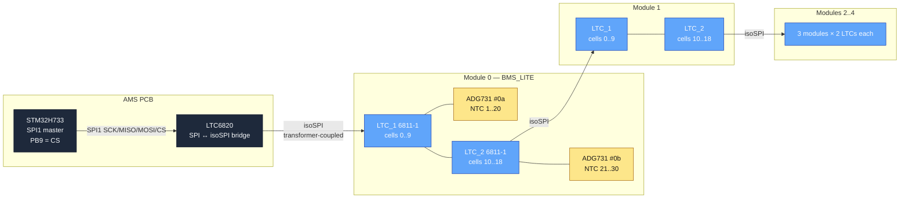
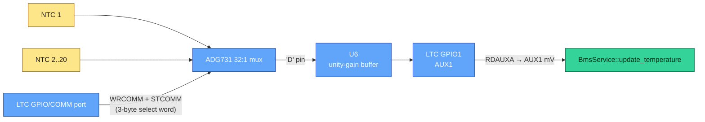
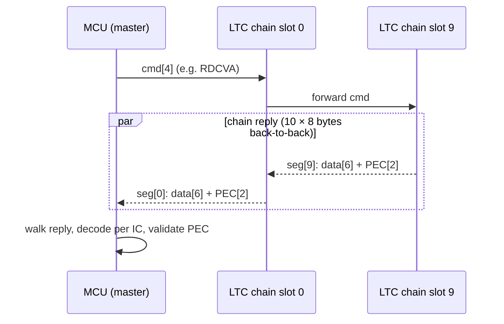

# BMS wire protocol — LTC6811-1 / isoSPI

Source-of-truth for the v1.2.0 BMS transport, mirroring the role
[`CAN_MAP.md`](CAN_MAP.md) plays for the accumulator and vehicle CAN
buses. Living spec: any change to the LTC6811 driver, the chain
topology, or the BMS_LITE board mapping must update this document
in the same PR.

Hardware reference:
- LTC6811-1 datasheet → `pcbs/BMS_LITE/Datasheets/LTC6811HG-1.pdf`
- LTC6820 datasheet → analog.com (isoSPI master)
- ADG731 datasheet → `pcbs/BMS_LITE/Datasheets/ADG731.pdf`
- BMS_LITE schematic → `pcbs/BMS_LITE/{BMS_LITE,LTC_1,LTC_2}.kicad_sch`

Firmware reference:
- Pure-logic wire layer → [`ltc6811.{hpp,cpp}`](../Core/Inc/app/ltc6811.hpp)
- SPI / CS driver → [`ltc6820.{hpp,cpp}`](../Core/Inc/app/ltc6820.hpp)
- Data ingestion → [`bms_service.{hpp,cpp}`](../Core/Inc/app/bms_service.hpp)
- Poll cadence → [`bms_poll_task.cpp`](../Core/Src/app/bms_poll_task.cpp)
- Balancing policy → [`balance_controller.hpp`](../Core/Inc/app/balance_controller.hpp)

---

## 1. Topology

One LTC6820 isoSPI master on the AMS PCB drives a daisy-chain of ten
LTC6811-1 monitors — two per BMS_LITE module, five modules total.
Each LTC owns a 32:1 ADG731 mux exposing up to 20 NTC thermistor
inputs (10 wired channels + 10 unused on the current rev — see §3).



**Chain indexing.** Chain slot 0 is the LTC closest to the master on
the isoSPI return path; slot 9 is at the bottom. Convention used
throughout the firmware:

| Chain slot | Module | Role |
|---:|:---:|---|
| 0 | 0 | LTC_1 (upper, 10 cells) |
| 1 | 0 | LTC_2 (lower, 9 cells) |
| 2 | 1 | LTC_1 |
| 3 | 1 | LTC_2 |
| 4 | 2 | LTC_1 |
| 5 | 2 | LTC_2 |
| 6 | 3 | LTC_1 |
| 7 | 3 | LTC_2 |
| 8 | 4 | LTC_1 |
| 9 | 4 | LTC_2 |

`config::LtcChainLength = 10` is the source of this count; any
change has to land in `ams_config.hpp` first.

---

## 2. Cell mapping

Each module is 19 series cells. The BMS_LITE wiring splits them
across its two LTCs as **10 cells on LTC_1, 9 cells on LTC_2**.
Within each LTC the cells map onto register-group slots in the
obvious order; unused slots are read but discarded.

| Module cell index | LTC | LTC slot | RDCV* group | Group offset |
|---:|:---:|---:|:---:|---:|
| 0 | LTC_1 | C1 | RDCVA | 0 |
| 1 | LTC_1 | C2 | RDCVA | 1 |
| 2 | LTC_1 | C3 | RDCVA | 2 |
| 3 | LTC_1 | C4 | RDCVB | 0 |
| 4 | LTC_1 | C5 | RDCVB | 1 |
| 5 | LTC_1 | C6 | RDCVB | 2 |
| 6 | LTC_1 | C7 | RDCVC | 0 |
| 7 | LTC_1 | C8 | RDCVC | 1 |
| 8 | LTC_1 | C9 | RDCVC | 2 |
| 9 | LTC_1 | C10 | RDCVD | 0 |
| — | LTC_1 | C11, C12 | RDCVD | 1..2 (unused) |
| 10 | LTC_2 | C1 | RDCVA | 0 |
| 11 | LTC_2 | C2 | RDCVA | 1 |
| 12 | LTC_2 | C3 | RDCVA | 2 |
| 13 | LTC_2 | C4 | RDCVB | 0 |
| 14 | LTC_2 | C5 | RDCVB | 1 |
| 15 | LTC_2 | C6 | RDCVB | 2 |
| 16 | LTC_2 | C7 | RDCVC | 0 |
| 17 | LTC_2 | C8 | RDCVC | 1 |
| 18 | LTC_2 | C9 | RDCVC | 2 |
| — | LTC_2 | C10..C12 | RDCVD | 0..2 (entirely unused) |

`BmsService::update_from_ltc_response` walks the 320-byte chain
reply (4 register groups × 10 ICs × 8 bytes) in this order and
deposits every cell mV into `cell_mV[module][cell_idx]`. PEC errors
on a group leave the affected IC's slice untouched (the slots keep
their last-known value); see §6 + §9.

---

## 3. Temp mapping

200 NTCs total (5 modules × 40 NTCs per module = 20 per LTC × 2 LTCs).
Each LTC owns one ADG731 32:1 mux on its `GPIO/COMM` port; the
selected channel is fed through an op-amp unity-gain buffer (U6 on
BMS_LITE) into `GPIO1`, then read with `ADAX(Gpio1) → RDAUXA` as
AUX1.



### ADG731 channel ↔ NTC mapping

Extracted from `pcbs/BMS_LITE/LTC_1.kicad_sch` (#71). The mux has 32
inputs; only 20 are populated, and the populated ones are **not
contiguous**:

| ADG731 channel (0-indexed) | Schematic pin | Wired to |
|---:|---|---|
| 0..9 | S1..S10 | NTC_1..NTC_10 |
| 10..15 | S11..S16 | unused |
| 16..25 | S17..S26 | NTC_11..NTC_20 |
| 26..31 | S27..S32 | unused |

`config::Adg731ChannelMap[20]` encodes this as the lookup the
BmsPollTask sweep uses:

```cpp
{ 0, 1, 2, 3, 4, 5, 6, 7, 8, 9,           // NTC_1..NTC_10
  16, 17, 18, 19, 20, 21, 22, 23, 24, 25 } // NTC_11..NTC_20
```

LTC_2 mirrors LTC_1 in firmware. The current schematic only shows
labels on S1..S10 of U5 (the LTC_2 mux); S17..S26 are unlabelled. If
LTC_2 doesn't mirror LTC_1 in copper, the second half of
`cell_tempC[m][20..39]` reads open-circuit on every sweep and stays
at the 25 °C ctor default. **Verify with a continuity meter** before
flashing v1.0.0 — see [`COMMISSIONING.md`](COMMISSIONING.md) §3b.

### NTC voltage-to-temperature conversion

Each NTC sits between the ADG731 `S` input and ground; a 10 kΩ
pull-up to LTC6811 `VREF2` (~3.0 V) forms the divider. Recovering
temperature is a two-step:

```
R_ntc = R_series * V_aux / (V_ref - V_aux)
1/T   = 1/T0 + (1/B) * ln(R_ntc / R_25)
T_°C  = T - 273.15
```

Placeholder calibration constants (`ams_config.hpp`, all tagged
`COMMISSION`):

| Constant | Default | Source |
|---|---:|---|
| `NtcBeta` | 3380 K | Murata NCP15XH103J datasheet |
| `NtcR25` | 10 000 Ω | BMS_LITE BOM |
| `NtcSeriesR` | 10 000 Ω | BMS_LITE BOM |
| `NtcVrefMv` | 3000 | LTC6811 VREF2 nominal |
| `NtcT0Kelvin` | 298.15 | 25 °C |

`BmsService::update_temperature` rejects readings outside
`[NtcMinValidC, NtcMaxValidC] = [-40, +150]` °C as
"channel not populated" so unpopulated mux inputs can never push
`max_tempC` past the safety predicate.

---

## 4. SPI / isoSPI parameters

| Layer | Parameter | Value | Source |
|---|---|---|---|
| MCU SPI1 | Master / full-duplex / 8-bit / MSB-first | — | `AMS.ioc` |
| MCU SPI1 | Mode | 0 (CPOL=LOW, CPHA=1EDGE) | `AMS.ioc` (`SPI_POLARITY_LOW` / `SPI_PHASE_1EDGE`) |
| MCU SPI1 | Baud | ~516 kHz (prescaler 256 on 132 MHz APB2) | `AMS.ioc` (`CalculateBaudRate=515.625 KBits/s`) |
| MCU SPI1 | NSS | software, on PB9 | `AMS.ioc` |
| CS line | Wakeup pulse | 20 µs LOW, 30 µs HIGH | `ltc6820.cpp::WakePulseUs` |
| Chain | t_WAKE (per IC) | ≥ 10 µs LOW | LTC6811 datasheet §"Wakeup" |
| Chain | Idle drain (T_SLEEP) | ~2 s | LTC6811 datasheet §"Core LTC6811 State Transitions" |
| Bus | Length | 10 ICs | `config::LtcChainLength` |

### Wakeup sequence

`Bus::wakeup()` issues one CS-low pulse per IC. Each pulse propagates
along the isoSPI return path; an IC consumes one pulse to leave
T_IDLE and only forwards subsequent pulses once it's awake. Ten
pulses with 30 µs gaps land the whole chain in ~500 µs.

`App_InitTask` runs this once on boot — the only `Bus::wakeup()` call
site. After boot nothing re-issues the pulse train; the ~250/500 ms
voltage and temperature poll traffic itself keeps the chain out of the
~2 s T_SLEEP window.

### Idle CS state

PB9 is held HIGH at boot by CubeMX (`PB9.PinState=GPIO_PIN_SET` in
`AMS.ioc`) so the chain never sees a stray CS-low edge before `Bus::configure()`
has bound the singleton to `hspi1`. `Bus::cs_high()` in the ctor is
a no-op when called pre-`configure()` (HAL handles are null) and a
guaranteed-HIGH write afterwards.

---

## 5. Command set

Every LTC6811 command the firmware emits, in order of first use.

| Command | Encoding | Direction | Used by | Cadence |
|---|---|---|---|---|
| `RDCFGA` | 0x0002 + PEC + chain × (data + PEC) | read 6 B per IC | `App_InitTask` chain-length discovery; `run_voltage_poll` warm-up | once on boot + every voltage poll (250 ms, discarded warm-up read before RDCVA per the #214 bit-sync fix) |
| `ADCV` (Norm) | 0x0260 + MD\|DCP\|CH bits | broadcast, no reply | `BmsPollTask::run_voltage_poll` | 250 ms |
| `RDCVA..D` | 0x0004 / 0x0006 / 0x0008 / 0x000A | read 6 B per IC | `BmsPollTask::run_voltage_poll` | 250 ms × 4 groups |
| `WRCOMM` | 0x0721 + per-IC 6 B + PEC | broadcast write | `BmsPollTask::run_temperature_poll` | 500 ms × 20 channels |
| `STCOMM` | 0x0723 + 30 dummy bytes | broadcast trigger | `BmsPollTask::run_temperature_poll` | 500 ms × 20 channels |
| `ADAX` (Gpio1) | 0x0460 + MD\|CHG bits | broadcast | `BmsPollTask::run_temperature_poll` | 500 ms × 20 channels |
| `RDAUXA` | 0x000C | read 6 B per IC | `BmsPollTask::run_temperature_poll` | 500 ms × 20 channels |
| `WRCFGA` | 0x0001 + per-IC 6 B + PEC | broadcast write | `BmsPollTask::maybe_run_balance_update` | 1 Hz in Charge |

ADCV defaults: `MD = Norm7kHz`, `DCP = 0` (no discharge during the
read), `CH = All`. ADAX defaults: `MD = Norm7kHz`, `CHG = Gpio1`
(AUX1 only — that's where the mux output lands).

Worst-case voltage-poll budget on the wire: ADCV (4 B) → 3 ms ADC →
4 × RDCV* (4 + 80 B each) ≈ 10 ms total at 516 kHz SCK. The
per-cycle round-trip is recorded in `g_bms_volt_poll_ms` for the
HIL acceptance check.

---

## 6. PEC15

15-bit CRC the LTC6811 appends to every transaction.

| Parameter | Value |
|---|---|
| Polynomial | `0x4599` = x¹⁵ + x¹⁴ + x¹⁰ + x⁸ + x⁷ + x⁴ + x³ + 1 |
| Seed | `0x0010` |
| On-wire encoding | 15-bit remainder shifted left by 1 (LSB always 0) |

Implementation in `ltc6811::pec15` uses a compile-time 256-entry
lookup table (`Pec15Table`) generated by `constexpr` so the binary
ships exactly one read-only blob in flash, no runtime init cost.

### Datasheet test vectors

Validated by `tests/unit/test_ltc6811_decode.cpp`:

| Input | Expected PEC | Notes |
|---|---|---|
| `{0x00, 0x01}` (WRCFGA cmd) | `0x3D6E` | LTC6811 datasheet §"Packet Error Code" worked example |
| empty (len 0) | `0x0020` | seed shifted left by 1 |
| any non-empty input | LSB = 0 | invariant from the left-shift on the wire |

### PEC-failure policy

Per-IC, per register-group failures do **not** trip `FORCE_ERROR`.
Transient bus noise is real; one bad PEC inside a 320-byte poll
shouldn't dump the pack. Instead:

1. The affected IC's data slice for that cycle is dropped (the cell
   or temp slots keep their previous value).
2. `g_ltc_pec_err_count[ic]` increments — telemetry-visible.
3. `last_rx_tick[module]` only advances on a clean poll, so a
   sustained PEC-error storm naturally trips `BmsStaleMs` and the
   safety supervisor takes the pack down via the freshness
   predicate that already exists.

No retries inside the task — the next periodic poll gets a fresh
shot at the chain.

---

## 7. Chain-aware framing

The LTC6811-1 daisy-chain has no addressing. The master issues a
4-byte command that propagates to every IC; the slaves shift their
replies back as concatenated 8-byte segments (6 data + 2 PEC each).



### Broadcast vs read

| Operation | Master writes | Slaves reply |
|---|---|---|
| **Broadcast cmd** (ADCV, ADAX, STCOMM) | cmd + PEC | nothing |
| **Read** (RDCV*, RDAUX*, RDCFGA, RDSTAT*) | cmd + PEC | N × (data[6] + PEC[2]) |
| **Broadcast write** (WRCFGA, WRCOMM) | cmd + PEC + N × (data[6] + PEC[2]) | nothing |

For broadcast writes the MCU has to attach a separate 6-byte payload
per IC (in chain order); `ltc6811::build_write_frame()` packs the
whole 84-byte frame and `Bus::write_chain_command()` ships it.

### Chain-length discovery

`App_InitTask` issues `RDCFGA` immediately after the wakeup pulse
train. `ltc6811::count_pec_valid_segments` walks the reply in 8-byte
chunks, stops at the first PEC failure, and reports the count of
consecutive clean ICs. Mismatch with `LtcChainLength` latches
`ErrorLatch` and opens all relays; MainTask then boots already latched
via `ErrorLatch::is_set()`. See §9.

---

## 8. Balancing

`WRCFGA` carries 12 DCC bits per IC; setting `DCC[i] = 1` enables
the per-cell discharge FET on channel `i+1`. The policy lives in
`balance::compute_mask` (pure logic, header-only) and runs at 1 Hz
piggybacked on the voltage poll.

### CFGR register layout

| Byte | Field | What the firmware writes |
|---|---|---|
| 0 | GPIO5..1 / REFON / SWTRD / ADCOPT | `0xFC` (GPIO1..5 inputs, REFON=1) |
| 1 | VUV[7:0] | `0x00` (UV detection disabled) |
| 2 | VOV[3:0] : VUV[11:8] | `0xF0` (VOV=0xFFF, VUV=0) |
| 3 | VOV[11:4] | `0xFF` |
| 4 | DCC8..DCC1 | bit `i` = mask for cell `i+1` |
| 5 | DCTO[3:0] : DCC12..DCC9 | DCTO=0, DCC9..12 in low nibble |

We keep the LTC's onboard UV/OV detection effectively disabled
because the safety predicates do this in software with thresholds
that come from `ams_config.hpp` (so commissioning can tune them
without re-flashing the LTC config every cycle). `DCTO = 0`
deliberately — each cycle re-sends WRCFGA, so a stuck firmware can't
latch discharge beyond one balancing window.

### Mask → DCC mapping per chain slot

| Chain slot | Module cells | DCC bits used |
|---:|---|---|
| 2m (LTC_1) | 0..9 | DCC1..DCC10 |
| 2m+1 (LTC_2) | 10..18 | DCC1..DCC9 |

`BmsPollTask::maybe_run_balance_update` computes the mask, walks the
chain, packs each IC's DCC into `ltc6811::pack_cfga_payload`, ships
the frame with `Bus::write_chain_command(CmdWRCFGA, ...)`.

### Policy summary

`balance::compute_mask(state, fsm_state)` returns an all-zero mask
unless **all** of:

1. `fsm_state == fsm::State::Charge`
2. `state.max_tempC <= BalanceTempMax`

When permitted, per module the policy:

3. Marks any cell with `v > min_cell_mV + BalanceDeltaMv` as a
   candidate.
4. Keeps at most `BalanceMaxActive` candidates per module, picking
   the largest-excess set (top-K).

Tuning constants live in `ams_config.hpp` and are documented for
bench calibration in
[`COMMISSIONING.md`](COMMISSIONING.md) §3c.

---

## 9. Failure modes

| Failure | Detection | Reaction |
|---|---|---|
| Chain length ≠ `LtcChainLength` on boot | `count_pec_valid_segments` after RDCFGA | `App_InitTask` → `ErrorLatch::set` + `Relays::open_all`; MainTask boots already latched via `ErrorLatch::is_set()`. ERROR latch persists across the follow-up watchdog reset. |
| PEC error on one IC, one register group | `decode_cell_voltage_group` / `decode_aux_voltage_group` returns false | drop slot, ++`g_ltc_pec_err_count[ic]`, continue. Sustained errors trip via freshness window (`BmsStaleMs`). |
| Bus-level SPI failure (`HAL_SPI_*` non-OK) | `Bus::transfer` / `Bus::read_register_group` returns false | abort the cycle, ++`g_ltc_spi_err_count`, `last_rx_tick` doesn't advance. |
| Mux SPI lost (open ADG731) | NTC reading rails (`V_aux = 0` or `≥ V_ref`), `ntc_mV_to_tempC` returns sentinel | skip slot, keep previous value. Operator-visible via `cell_tempC` snapshot. |
| Chain dropped to T_SLEEP | next ADCV broadcast lands while ICs are deaf → PEC fails | freshness window catches it within `BmsStaleMs`. The ~250/500 ms poll traffic normally keeps the chain out of the ~2 s T_SLEEP window; there is no post-boot re-wakeup, so a long-paused poll loop can still let it drop. |
| Open-wire detection (LTC ADOL) | **not used** — relying on software cell-mV plausibility instead | low-cell-V predicate trips on an open wire reading 0 mV. |

The unifying principle: a single anomalous frame is bookkeeping, a
sustained anomaly is a freshness expiry → safety supervisor takes
the pack down via the existing path. No bespoke "BMS faulted"
predicate.

---

## 10. References

- LTC6811-1 datasheet (`pcbs/BMS_LITE/Datasheets/LTC6811HG-1.pdf`):
  - §"Packet Error Code (PEC)" — polynomial + worked example used in the unit tests
  - §"Memory Map" — CFGR / register-group layout
  - §"Cell Voltage Register Group" — wire format for RDCVA..D
  - §"Auxiliary Register Group" — wire format for RDAUXA/B
  - §"Bus Protocol" — STCOMM dummy-byte count
  - §"Core LTC6811 State Transitions" — T_IDLE, T_SLEEP, wakeup timing
- LTC6820 datasheet (Analog Devices) — isoSPI transformer-coupling
  electrical specs (CC, slew, SCK ceiling).
- ADG731 datasheet (`pcbs/BMS_LITE/Datasheets/ADG731.pdf`):
  - §"Serial Interface" — 24-bit shift register, 3-wire SPI mode the
    LTC's COMM port bit-bangs
  - §"Truth Table" — EN bit, channel address bit layout
- BMS_LITE schematic (`pcbs/BMS_LITE/`):
  - `LTC_1.kicad_sch` / `LTC_2.kicad_sch` — per-LTC NTC routing,
    extracted into `Adg731ChannelMap`
  - `BMS_LITE.kicad_sch` — top-level isoSPI chain interconnect
- Pure-logic test vectors:
  - `tests/unit/test_ltc6811_decode.cpp` — PEC15 fixtures, command
    builders, decoder round-trips, chain-length discovery walker,
    ADG731 channel-pack vectors.
  - `tests/unit/test_bms_service.cpp` — full-chain response decode,
    PEC-fail behaviour, freshness, temp Beta-model conversion.
  - `tests/unit/test_balance_controller.cpp` — balance-policy rules.
