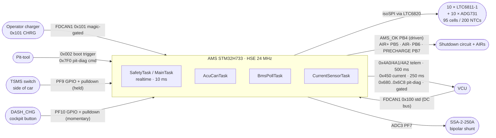
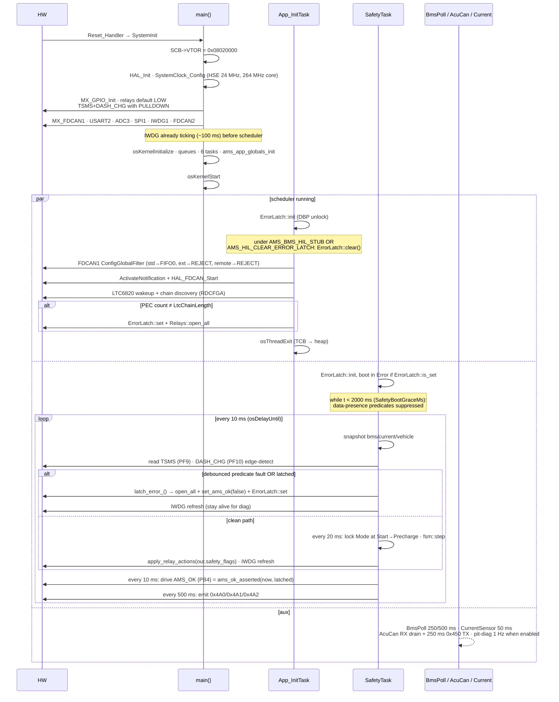
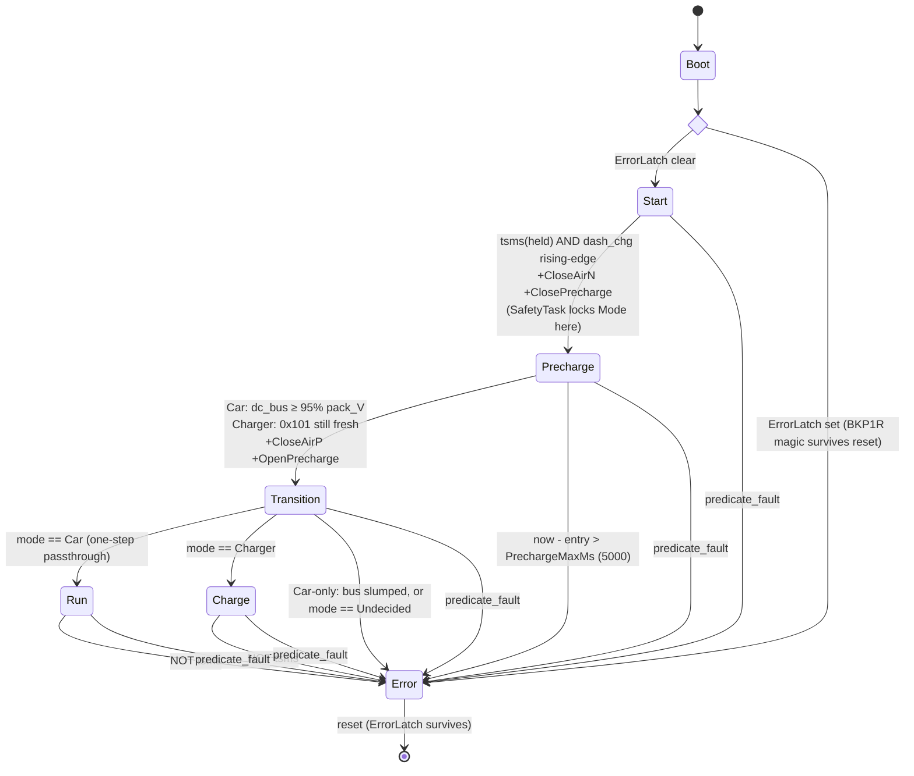
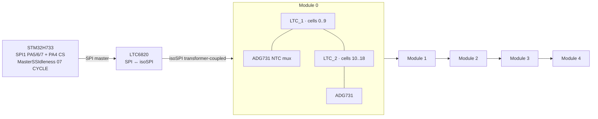

# IFS08-CE-AMS firmware — deep dive

> **Living document** — describes `dev` as of the current onboarding overhaul. Cross-check against the cited source files.

Top-to-bottom walk of the AMS codebase as it actually exists on `dev`. This is onboarding reference material for a new firmware engineer: precise, source-anchored, and kept current with the merged FSM / safety / mode-gating work.

**Target:** STM32H733ZGTx Cortex-M7 @ 264 MHz · FreeRTOS via CMSIS-RTOS v2 · C++17 app · CubeMX-generated CMake. Formula Student EV accumulator / battery-management firmware. `VERSION` = `1.5.0` (v1.6.0 planned).

## Sections

1. [Build system & memory map](#1-build-system--memory-map)
2. [Boot path](#2-boot-path)
3. [The live tasks](#3-the-live-tasks)
4. [Services](#4-services--lock-free-single-writer)
5. [FSM](#5-fsm)
6. [Safety predicates](#6-safety-predicates)
7. [Hardware abstractions](#7-hardware-abstractions)
8. [LTC6811 / isoSPI stack](#8-ltc6811--isospi-stack)
9. [Config knobs](#9-config-knobs)
10. [Telemetry frames](#10-telemetry-frames)
11. [Pit-diag CAN stream](#11-pit-diag-can-stream)
12. [Tests](#12-tests)
13. [CI & automation](#13-ci--automation)
14. [Where this maps in the source](#14-where-this-maps-in-the-source)
15. [Open questions](#15-open-questions)

---

## System view



| Property | Value |
|---|---|
| **Hard-real-time bound** | Worst-case `sensor-fault → AIR open`: `producer_period + 10 ms + GPIO_write < 15 ms` |
| **One realtime task** | `SafetyTask` is the only **realtime** thread. Producers run strictly lower, so they cannot preempt safety. |
| **Lock-free state** | 3 services, each `volatile`, single-writer. Cortex-M7 32-bit aligned R/W are atomic. No mutexes in app code. |

**Constant naming:** the codebase uses plain `Xxx` constants (no Hungarian `kXxx`), all in the single `ams::config` namespace.

---

## 1. Build system & memory map

CubeMX-generated CMake. App sources glob from `Core/Src/app/*.cpp`. HIL flags are CMake `option()`s; the firmware version is read from the `VERSION` file and baked into `firmware_info`.

```cmake
set(CMAKE_C_STANDARD 11)
set(CMAKE_CXX_STANDARD 17)
option(AMS_BMS_HIL_STUB         "Stub BMS data + clear ErrorLatch each boot" OFF)
option(AMS_HIL_CLEAR_ERROR_LATCH "Clear ErrorLatch each boot (no stub)"      OFF)
file(GLOB_RECURSE APP_SOURCES CONFIGURE_DEPENDS "Core/Src/app/*.cpp")
target_compile_options(AMS PRIVATE
    -fno-exceptions -fno-rtti -fno-threadsafe-statics -fno-use-cxa-atexit)

# VERSION file (semver MAJOR.MINOR.PATCH) → AMS_FW_VERSION_{MAJOR,MINOR,PATCH}
# Cross-compile (cmake/gcc-arm-none-eabi.cmake):
#   -mcpu=cortex-m7 -mfpu=fpv5-d16 -mfloat-abi=hard --specs=nano.specs
#   Debug: -O0 -g3   Release: -Os -g0
```

### Memory regions (`STM32H733XG_FLASH.ld`)

| Region | Origin | Size | Notes |
|---|---|---|---|
| **FLASH** | `0x08020000` | 768 KB | sectors 1..6; sector 0 = bootloader |
| **DTCMRAM** | `0x20000000` | 128 KB | stacks · TCBs · BSS · FreeRTOS `heap_4` (64 KB) |
| RAM_D1/D2/D3/ITCMRAM | various | 432 KB | unused |

**Pre-flight check:** `scripts/check_flash_layout.py build/AMS.elf` rejects images that land in sector 0 or overflow sector 6 — runs in CI.

---

## 2. Boot path



> **Two HIL flags.** `AMS_BMS_HIL_STUB` does both "stub the BMS data" AND "clear ErrorLatch each boot." `AMS_HIL_CLEAR_ERROR_LATCH` is the second half on its own — for real-LTC bench rigs against the Pico emulator that need to recover from transient discovery glitches. Either flag triggers the latch clear; only the stub flag fakes BMS data.

> **FDCAN1 is standard-only.** The global filter rejects all extended frames at FIFO entry. Everything the firmware listens for is 11-bit: VCU 0x100, charge-request 0x101, boot-trigger 0x002, pit-diag 0x7F0. Rejecting at the HW gate keeps the RX ISR off junk frames.

---

## 3. The live tasks

| Task | Priority | Stack | Cadence | Real work | File |
|---|---|---|---|---|---|
| `defaultTask` | Low (8) | 128 w | — | CMSIS placeholder, idles | `main.c` |
| `App_InitTask` | High (40) | 512 w | once | FDCAN1 bring-up · LTC chain discovery · self-exit | `app_init_task.cpp` |
| **`SafetyTask`** *(MainTask)* | **Realtime (48)** | 512 w | **10 ms** | snapshot · predicate (10 ms) · FSM step (20 ms) · AMS_OK drive (10 ms) · telemetry (500 ms) · IWDG refresh | `safety_task.cpp` |
| `BmsPollTask` | Normal (24) | 1024 w | 250 / 500 ms | ADCV + RDCV[A–D] · ADAX + RDAUXA · balance WRCFGA · or HIL stub seed | `bms_poll_task.cpp` |
| `AcuCanTask` | AboveNormal (32) | 512 w | RX-queue + 250 ms TX | drain `acu_rx_queue` → VehicleService · 0x450 current TX · boot-trigger · pit-diag emit | `acu_can_task.cpp` |
| `CurrentSensorTask` | AboveNormal (32) | 256 w | 50 ms | ADC3 poll · IIR filter · `CurrentService::update_from_adc` | `current_task.cpp` |

> **Priority discipline.** Only `SafetyTask` writes relay GPIO and drives AMS_OK. Only `SafetyTask` and `App_InitTask` refresh IWDG. Producers run strictly lower, so they cannot preempt the safety supervisor.

### SafetyTask body — one timeline

```cpp
for (;;) {
  osDelayUntil(last_wake += config::SafetyPeriodMs);   // 10 ms
  now = osKernelGetTickCount();

  bms_snap = BmsService::instance().snapshot();
  cur_snap = CurrentService::instance().snapshot();
  veh_snap = VehicleService::instance().snapshot();
  tsms     = HAL_GPIO_ReadPin(TSMS_GPIO_Port, TSMS_Pin) == GPIO_PIN_SET;
  dash_chg = HAL_GPIO_ReadPin(DASH_CHG_GPIO_Port, DASH_CHG_Pin) == GPIO_PIN_SET;

  // DASH_CHG is MOMENTARY: latch a rising edge until the FSM consumes it
  if (dash_chg && !prev_dash_chg) dash_chg_edge_pending = true;
  prev_dash_chg = dash_chg;

  constexpr bool force_error_set = false;               // no live setter on flight
  vcu_required = (mode_locked == Mode::Car);            // VcuStale gated to Car (#304)
  fault_res    = safety::evaluate_fault_detail({bms_snap, cur_snap, veh_snap,
                                                force_error_set, vcu_required, now});

  // Cell V/T range reasons are DEBOUNCED (CellFaultConfirmTicks=30 ≈ 300 ms);
  // every other reason latches immediately.
  cell_confirmed   = cell_debounce_.update(fault_res.reason, CellFaultConfirmTicks);
  predicate_fault  = is_cell_range_reason(fault_res.reason) ? cell_confirmed
                                                            : fault_res.faulted();
  fault = error_latched_ || predicate_fault;

  if (fault) {
    if (!error_latched_) {
      g_fault_reason_telemetry = (uint8_t)fault_res.reason;   // pit-diag 0x6C0[6]
      g_fault_detail_telemetry = fault_res.detail;            // pit-diag 0x6C0[7]
      latch_error_();                                          // open_all + AMS_OK low + ErrorLatch::set
    }
    Watchdog::refresh();
  } else if (now - last_state_tick >= config::StatePeriodMs) {  // 20 ms
    if (state == Start && mode_locked == Undecided && tsms && dash_chg_edge_pending) {
      vcu_fresh   = veh.last_dc_bus_tick != 0 && (now - veh.last_dc_bus_tick) <= VcuFreshMs;
      charge_req  = VehicleService::charge_requested(now, veh.last_charge_req_tick);
      mode_locked = (charge_req && !vcu_fresh) ? Mode::Charger : Mode::Car;   // (#311)
    }
    out = fsm::step({state, bms_snap, cur_snap, veh_snap,
                     tsms, dash_chg_edge_pending, mode_locked, predicate_fault,
                     now, state_entry_tick});
    dash_chg_edge_pending = false;                  // edge is one-shot
    apply_relay_actions(out.safety_flags);
    state = out.next;
    Watchdog::refresh();
  } else {
    Watchdog::refresh();
  }

  // AMS_OK / SDC enable driven EVERY 10 ms tick (#301)
  Relays::set_ams_ok(safety::ams_ok_asserted(now, error_latched_));

  if (now - last_telemetry_tick >= config::TelemetryPeriodMs) {  // 500 ms
    send_telem(0x4A0, encode_status(...));
    send_telem(0x4A1, encode_pack(...));
    send_telem(0x4A2, encode_temps(...));
  }
}
```

---

## 4. Services — lock-free single-writer

Three singletons wrapping `volatile` structs. Cortex-M7 32-bit aligned R/W are atomic. A reader may see a one-iteration-stale snapshot — the predicate tolerates it (`tick_age()` clamps a future-stamped `last` to age 0 to avoid underflow).

| Service | Writer | Readers | Holds |
|---|---|---|---|
| **BmsService** | BmsPollTask | SafetyTask, AcuCanTask, BalanceController | `module_online_mask` (current freshness, not ever-online), `last_rx_tick[5]`, `min/max_cell_mV`, per-module `vmin/vmax`, `min/max_tempC`, `pack_voltage_mV`, `first_full_poll_done` |
| **CurrentService** | CurrentSensorTask | SafetyTask, BmsPollTask, AcuCanTask | `filtered_mA`, `last_update_tick`, `sensor_fault` |
| **VehicleService** | AcuCanTask | SafetyTask, AcuCanTask (pit-diag read) | `dc_bus_V`, `last_dc_bus_tick`, `last_charge_req_tick` |

`VehicleService` decodes two RX frames (`vehicle_service.cpp`):
- **0x100** (`AcuRxDcBusId`) — little-endian `dc_bus_V` from the VCU; stamps `last_dc_bus_tick`.
- **0x101** (`ChargeModeReqId`) — operator charge-mode request, **magic-gated**: the 4-byte payload must equal `ChargeModeReqMagic = {0x43,0x48,0x52,0x47}` ("CHRG") or the frame is dropped, so bus noise can't flip the AMS into a HV charge mode. A valid frame stamps `last_charge_req_tick`. `charge_requested(now, last)` returns true while that tick is within `ChargeReqFreshMs = 1000 ms` (future-tick safe).

---

## 5. FSM

States `Start → Precharge → Transition → Run / Charge`, plus sticky `Error`. Modes `Undecided / Car / Charger`. Pure logic in `state_machine.hpp` — no FreeRTOS, no HAL, fully host-testable. The FSM consumes SafetyTask's **already-debounced** `predicate_fault` decision and never re-evaluates the predicate itself (#296/#279).



### Transition guards in detail

- **Start → Precharge** — `tsms` (PF9, the held master switch) AND a `dash_chg` **rising edge** (PF10 is a momentary press, edge-detected by SafetyTask at 10 ms and latched until the 20 ms step consumes it). Same gate for both car and charger; SafetyTask decides the mode at this exact moment. A button held at boot is seeded into `prev_dash_chg`, so it does not fire a spurious edge. (#316)
- **Mode lock** (#311) — `mode = (charge_req && !vcu_fresh) ? Charger : Car`. `charge_req` is a still-fresh magic-gated 0x101; `vcu_fresh` is a 0x100 within `VcuFreshMs`. A car with a dead VCU does **not** send 0x101, so it locks **Car** and faults on `VcuStale` rather than silently charging. A stray 0x101 while the VCU is live cannot flip a running car into Charger.
- **Precharge → Transition** (mode-specific):
  - **Car** — `precharge_target_reached`: `dc_bus_V × 1000 × 100 ≥ pack_voltage_mV × 95` (≥ 95% of pack), compared entirely in mV; `pack_voltage_mV == 0` is a "no data yet" guard.
  - **Charger** — `dc_bus_V` is VCU-only and absent during a charge, so there is nothing to voltage-gate on. The proceed signal is a **still-fresh 0x101** (`charge_requested`). A single DASH_CHG press entered Precharge; **no second press and no `dc_bus` is required**. If 0x101 goes stale (charger unplugged), Precharge holds and hits the `PrechargeMaxMs` timeout → Error rather than closing AIR+ into a dead charger.
- **Precharge timeout** (#307) — `now - state_entry_tick > PrechargeMaxMs (5000 ms)` latches Error and opens every contactor. This bounds how long the precharge resistor is held in-circuit, for any stuck-precharge cause. (`TransitionHoldMs` stays removed — Transition is a one-step passthrough.)
- **Transition** — one FSM-step passthrough; the contactor swap (`CloseAirP|OpenPrecharge`) was already emitted on the entry edge. A **Car-only** bus-still-up guard re-checks `precharge_target_reached`; if the bus slumped when the precharge contactor opened, it lands in Error rather than energising a degraded bus. Charger commits to `Charge` directly (no VCU-measured bus to check). `Undecided` here is a programming error → Error.
- **Run / Charge** — sustained while `tsms` is held. TSMS drop is the **only** exit (→ Error, sticky). **DASH_CHG is NOT level-checked here** — it is a momentary press and is low most of the time, so checking its level would fault instantly. Releasing the button does not fault Run or Charge. (#316)
- **predicate_fault (any state)** — kept backstop. In normal operation SafetyTask handles the fault before ever calling `step()`, so this branch is false on a clean tick.

---

## 6. Safety predicates

Pure logic in `safety_predicates.hpp`, evaluated every 10 ms by SafetyTask. `evaluate_fault_detail()` returns a `FaultResult { FaultReason reason, uint8_t detail }`; the boolean `evaluate_fault()` wraps it. Boot grace gates everything data-dependent for the first 2 s.

```cpp
if (force_error_set)                          return {ForceError, 0};   // immediate; false on flight
if (now_tick < SafetyBootGraceMs)             return {};                // 2000 ms

// BMS — module_online_mask is *current* freshness
if (bms.module_online_mask != AllModulesMask) return {BmsModuleOffline, mask};
for (m in 0..4) if (tick_age(now, last_rx_tick[m]) > BmsStaleMs=1500) return {BmsStale, m};

// Cell V / T ranges — gated on first_full_poll_done; these reasons are DEBOUNCED by the caller
if (first_full_poll_done) {
  if (min_cell_mV < CellUnderVoltageMv=2800)  return {CellUnderVoltage, mod};
  if (max_cell_mV > CellOverVoltageMv=4200)   return {CellOverVoltage,  mod};
  if (min_tempC   < CellUnderTempC=-10)        return {CellUnderTemp, 0};
  if (max_tempC   > CellOverTempC=60)          return {CellOverTemp,  mod};
}

// Current
if (current.sensor_fault)                                     return {CurrentSensorFault, 0};
if (tick_age(now, last_update_tick) > IStaleMs=200)           return {CurrentStale, 0};
if (|filtered_mA| > CurrentMaxMa=200000)                      return {CurrentOverLimit, 0};

// VCU heartbeat — fault ONLY once committed to Car mode (#304)
if (vcu_required && tick_age(now, last_dc_bus_tick) > VcuStaleMs=200) return {VcuStale, 0};
return {};
```

### `FaultReason` enum (stable wire contract — append only)

| # | Reason | # | Reason |
|---|---|---|---|
| 0 | None | 6 | CellUnderTemp |
| 1 | ForceError | 7 | CellOverTemp |
| 2 | BmsModuleOffline | 8 | CurrentSensorFault |
| 3 | BmsStale | 9 | CurrentStale |
| 4 | CellUnderVoltage | 10 | CurrentOverLimit |
| 5 | CellOverVoltage | 11 | VcuStale |

`12` (`FsmError`) is reserved for the SafetyTask FSM-driven Error path (precharge timeout / TSMS drop), set in `safety_task.cpp`, not in the predicate. Both `reason` and `detail` are surfaced on pit-diag `0x6C0[6]/[7]` (#276).

### Two facts to internalise

- **VcuStale is gated to Car mode** (#304). The predicate only checks VCU staleness when `vcu_required == (mode_locked == Car)`. In Charger and pre-lock Undecided the VCU is absent by design. This is what makes Charger mode reachable: a Charger lock needs the VCU stale > `VcuFreshMs` (1000 ms), but an ungated `VcuStale` (200 ms) would always latch Error first.
- **Cell V/T range reasons are debounced** (#296/#279). A single transient sub-threshold sample — a torn read of the lock-free `BmsState` snapshot, or an unsettled first poll — must not latch the sticky Error. SafetyTask runs `CellFaultDebounce::update()`; a cell-range reason latches only after `CellFaultConfirmTicks = 30` (≈ 300 ms, longer than one 250 ms voltage poll) consecutive evaluations report the **same** reason. All other reasons latch on the first tick. The FSM consumes this debounced decision via `predicate_fault` and does not re-run the predicate.

---

## 7. Hardware abstractions

| File | Owns | Notable |
|---|---|---|
| `relay_driver.cpp` | PB5 AIR+, PB6 AIR-, PB7 Precharge, **PB4 AMS_OK** | `Relays::set_ams_ok(bool)` drives the SDC-enable leg. AMS_OK is **actively driven every 10 ms tick** by SafetyTask (#301). |
| `watchdog.cpp` | `HAL_IWDG_Refresh(&hiwdg1)` | Reload 100 / prescaler 32 → ~100 ms at LSI 32 kHz. Refreshed on every clean iteration *and* the latched-fault path. |
| `error_latch.cpp` | RTC_BKP_DR1 magic `0xA115EE51` | Sticky across resets. Cleared only by VBAT loss in flight, or by `App_InitTask::clear()` under `AMS_BMS_HIL_STUB` OR `AMS_HIL_CLEAR_ERROR_LATCH`. |
| `bootloader.cpp` | `matches_trigger()`, `request_reboot(reason)` | Trigger: 0x002 std, DLC 4, `{0xB0,0x07,0xAD,0x11}`. Reboot writes magic to BKP0R + reason ASCII to BKP2R + `NVIC_SystemReset`. |
| `firmware_info.cpp` | `firmware_info` struct at fixed offset | Populated from CMake — semver (`VERSION`) + git hash + `AmsNodeId = 0x01` baked at build time; the pit-tool reads it. |
| `can_isr.cpp` | `HAL_FDCAN_RxFifo0Callback` | Reads `rxh.DataLength & 0xF` directly; std-only filter keeps the ISR off extended junk. |

### AMS_OK / SDC enable (#301)

`safety::ams_ok_asserted(now, error_latched)` returns `(now >= SafetyBootGraceMs) && !error_latched`. SafetyTask calls it every 10 ms and drives PB4:

- **LOW** during boot grace (predicates suppressed — must not enable the SDC against unverified inputs).
- **HIGH** once past `SafetyBootGraceMs` with no error latched.
- **LOW** the instant an error latches (`latch_error_()` also calls `set_ams_ok(false)` directly, and the boot-in-error path drops it).

The firmware previously never drove this pin; the prior claim that "firmware never drives AMS_OK" is no longer true.

### Backup-register usage

| Reg | Owner | Value | Purpose |
|---|---|---|---|
| `RTC_BKP_DR0` | Bootloader | `0xB00710AD` | Boot-request handshake — set by app, read+cleared by BL on reset |
| `RTC_BKP_DR1` | App | `0xA115EE51` | ErrorLatch — sticky across resets |
| `RTC_BKP_DR2` | App | ASCII 4-char | Jump reason: `'JUMP'` / `'FAUT'` / `'MANU'` |
| DR3+ | reserved | — | — |

---

## 8. LTC6811 / isoSPI stack



### BmsPollTask body

```text
wait on { PollVDue (250 ms) | PollTDue (500 ms) };

if PollVDue:
  ADCV(AdcMode) + settle 3 ms
  RDCVA warm-up before the actual reads (first RDCV after wakeup is junk)
  RDCV[A,B,C,D] → update_from_ltc_response
  every BalanceUpdatePolls=4: maybe_run_balance_update → WRCFGA

if PollTDue:
  for ch in Adg731ChannelMap[0..20]:
    WRCOMM(ch) + STCOMM
    ADAX(1 pair) + settle 1 ms
    RDAUXA → update_temperature
```

### Chain shape

- 5 modules × 2 LTCs = **10 ICs** (`LtcChainLength`). Upper LTC: 10 cells, lower: 9 → **19 cells / module · 95 total**.
- NTCs: 20 per LTC × 10 = **200 slots**. ADG731 ch 1..10, 17..26 populated (11..16, 27..31 unpopulated).
- `AllModulesMask = 0x1F` (5 modules), `BmsModuleCount = 5`.
- **Per-IC PEC counter** — saturating `u8` per chain slot, surfaced via pit-diag `0x6C7` (ICs 0..7) and `0x6C8` (ICs 8..9 + reserved). A byte-0 spike on `0x6C7` = module-0 top LTC misbehaving.

### Balancing policy (`balance_controller.hpp`)

| Knob | Default | Rule |
|---|---|---|
| `BalanceDeltaMv` | 50 | Only cells > 50 mV above pack min are candidates |
| `BalanceMaxActive` | 4 | Per-module simultaneous discharge cap (dissipation budget) |
| `BalanceTempMax` | 50 °C | Whole pack stops balancing if `max_tempC` exceeds this |
| `BalanceUpdatePolls` | 4 | WRCFGA every 4 × 250 ms = 1 Hz |
| state gate | Charge only | Never balance in Run |

> **HIL stub bypass.** Under `-DAMS_BMS_HIL_STUB` the entire `BmsPollTask` body is compiled out and replaced with a 250 ms loop calling `BmsService::seed_for_hil_stub(now)`. No SPI, no LTC, no balancing — the predicate sees seed values and lets the FSM leave Start.

---

## 9. Config knobs

Single namespace `ams::config` (`ams_config.hpp`) — the canonical home for every compile-time constant. `COMMISSION`-tagged items must be measured before sign-off.

### Key safety / timing constants

| Constant | Value | Meaning |
|---|---|---|
| `SafetyPeriodMs` | 10 | SafetyTask tick |
| `StatePeriodMs` | 20 | FSM step cadence |
| `TelemetryPeriodMs` | 500 | 0x4A0/1/2 emit |
| `SafetyBootGraceMs` | 2000 | data predicates suppressed before this |
| `CellFaultConfirmTicks` | 30 | cell V/T debounce (~300 ms) |
| `PrechargeMaxMs` | **5000** | Precharge timeout → Error (re-added, #307) |
| `BmsStaleMs` | 1500 | any module silent |
| `IStaleMs` | 200 | current sensor stale |
| `VcuStaleMs` | 200 | VCU 0x100 stale (Car-only fault) |
| `VcuFreshMs` | 1000 | Car/Charger mode-lock window |
| `ChargeModeReqId` | 0x101 | operator charge request |
| `ChargeModeReqMagic` | `43 48 52 47` ("CHRG") | 0x101 payload gate |
| `ChargeReqFreshMs` | 1000 | 0x101 freshness at mode lock |
| `AmsNodeId` | 0x01 | matches BL NVM |

### COMMISSION-tagged surface

| Pack limits | Current sensor | Balancing + NTC |
|---|---|---|
| `CellUnderVoltageMv` 2800 | `CurrentZeroMv` 1650 (Vref/2, bipolar) | `BalanceDeltaMv` 50 |
| `CellOverVoltageMv` 4200 | `CurrentMvPerAmpe1` (diff-amp scaled) | `BalanceTempMax` 50 °C |
| `CellUnderTempC` -10 °C | `CurrentFilterShift` (IIR) | `BalanceMaxActive` 4 |
| `CellOverTempC` 60 °C | | `NtcBeta` 3380 K |
| `CurrentMaxMa` 200000 | | `NtcR25` 10 kΩ |

> **Note on `PrechargeMaxMs`.** The earlier deadline-removal pass deleted both `PrechargeMaxMs` and `TransitionHoldMs`. `PrechargeMaxMs = 5000` was **re-added** (#307) as a bounded resistor-thermal-limit timeout; `TransitionHoldMs` remains removed (Transition is a one-step passthrough).

---

## 10. Telemetry frames

FDCAN1 TX, every 500 ms, always-on, classic CAN 8-byte frames.

### `0x4A0` — AMS status (`AmsTelemStatusId`)

| Byte | Field |
|---|---|
| [0] | `fsm.state` |
| [1] | `ams_ok` GPIO readback |
| [2] | `online_mask` |
| [3] | `app_init_progress` |
| [4..5] | `min_cell_mV` BE |
| [6..7] | `max_cell_mV` BE |

### `0x4A1` — Pack (`AmsTelemPackId`)

| Byte | Field |
|---|---|
| [0..3] | `pack_voltage_mV` LE u32 |
| [4..7] | `filtered_mA` LE i32 |

### `0x4A2` — Temps + cockpit + diagnostics (`AmsTelemTempsId`)

| Byte | Field |
|---|---|
| [0] | `min_tempC` i8 |
| [1] | `max_tempC` i8 |
| [2] | `avg_tempC` i8 |
| [3..4] | `dc_bus_V` LE u16 |
| [5] | cockpit byte (always-on) |
| [6] | `tx_fail_lo` |
| [7] | heartbeat |

The **cockpit byte** (`0x4A2[5]`) is emitted by both build configs:

```text
bit 7    1   (sentinel — "live byte", distinguishes from an older firmware that elided it)
bits 3:2 mode_locked (00=Undecided, 01=Car, 10=Charger)
bit 1    TSMS readback (PF9)
bit 0    DASH_CHG readback (PF10, live level)
```

---

## 11. Pit-diag CAN stream

A gateable diagnostic stream surfacing the entire pack state on FDCAN1 — used by the pit-debug tool to show real-time cell-V / cell-T / FSM / balance / boot context. Disabled by default; the pit-tool enables it with a magic payload.

### Control protocol

| ID | Dir | DLC | Purpose |
|---|---|---|---|
| `0x7F0` (`PitDiagCmdRxId`) | RX | 4 | Enable `{0xDE,0xAD,0xBE,0xEF}` / disable `{0,0,0,0}` |
| `0x7F1` (`PitDiagAckTxId`) | TX | 1 | ACK / state echo |

### Frame map (1 Hz scan when enabled)

| IDs | Count | Content |
|---|---|---|
| `0x680..0x697` | 24 | **Cells:** 4 cells × u16 mV BE per frame · ceil(95/4)=24; pad slots = `0xFFFF` sentinel |
| `0x6A0..0x6B8` | 25 | **Temps:** 8 channels × i8 °C per frame · 200/8=25 |
| `0x6C0` | 1 | **FSM status:** state, mode_locked, error_latched, ams_ok, tsms/dash_chg, **[6] fault_reason** (FaultReason 0..11, 12=FsmError), **[7] detail** (#276) |
| `0x6C1` | 1 | **Timing:** V-poll last/max ms · last temp-sweep mask |
| `0x6C2` | 1 | **Balance mask A:** DCC bits cells 0..63 |
| `0x6C3` | 1 | **Balance mask B:** DCC bits 64..94 + balance cycle counts |
| `0x6C4` | 1 | **Boot diag:** reset reason + app_init_progress + fdcan1_start_result |
| `0x6C5` | 1 | **Post-mortem:** stack-overflow flag + malloc-fail flag |
| `0x6C6` | 1 | **FW ID:** semver + git hash[0..3] + BL node id |
| `0x6C7` | 1 | **Per-IC PEC (A):** ICs 0..7, saturating u8 |
| `0x6C8` | 1 | **Per-IC PEC (B):** ICs 8..9, bytes 2..7 reserved |

> **Burst pacing.** `AcuCanTask` yields between batches so the 16-deep FDCAN1 TX FIFO can drain; without it a 50+ frame burst would overflow and drop trailing diag frames. The pit-tool shows all 95 cell voltages, 200 NTC temps, boot context, per-IC PEC, and the balance DCC mask live on a stock CAN interface.

---

## 12. Tests

Host-side unit tests run on every push (Unity), in both flight and HIL_STUB build configs. **182 tests total** across these suites (`tests/unit/`):

| File | Coverage |
|---|---|
| `test_ltc6811_decode.cpp` | PEC15 · RDCV decode · chain walker · WRCFGA · ADG731 encode |
| `test_bms_service.cpp` | decode · freshness · online-mask currentness · `seed_for_hil_stub` |
| `test_safety_predicates.cpp` | each predicate · boot grace · cell V/T debounce · VcuStale gating · fault reason/detail |
| `test_state_machine.cpp` | FSM transitions · Mode lock · precharge timeout · DASH_CHG edge / TSMS-only Run/Charge |
| `test_telemetry_encoders.cpp` | encoder signatures · cockpit byte |
| `test_pit_diag_emitter.cpp` | cell/temp frame layout · 0x6C0 fault reason/detail · cmd decode |
| `test_acu_tx_encoders.cpp` | 0x450 current TX encode |
| `test_vehicle_service.cpp` | 0x100 decode · 0x101 magic gate · `charge_requested` freshness |
| `test_bootloader.cpp` | `matches_trigger` happy + reject paths |
| `test_balance_controller.cpp` | selection policy edge cases |
| `test_sil_scenarios.cpp` | multi-step FSM scenarios (Car + Charger paths) |
| `test_current_service.cpp` | ADC scaling · filter · sensor_fault |

`mocks/cmsis_os2_stub.cpp` stubs the minimum FreeRTOS surface; Unity is fetched at configure time.

---

## 13. CI & automation

| Workflow | Trigger | Does |
|---|---|---|
| `build-tests.yml` | push, PR | cross-compile · host tests · flash-layout check · both build configs |
| `release.yml` | tag | builds `AMS.elf/.bin/.hex` · verifies entry @ `0x08020000` · attaches to Release |
| `branch-issue.yml` | push `feat/*` or `fix/*` | auto-opens tracking issue, fills from first commit |
| `close-on-dev-merge.yml` | PR merged to dev | parses `Closes #N` and closes linked issues |
| `roadmap.yml` | dev push touching `.github/roadmap.yaml` | regenerates `ROADMAP.md` |

---

## 14. Where this maps in the source

| Topic | Primary file(s) |
|---|---|
| 10 ms supervisor loop, AMS_OK drive, mode lock | `Core/Src/app/safety_task.cpp` |
| Fault predicate set, `FaultReason`, debounce, `ams_ok_asserted` | `Core/Inc/app/safety_predicates.hpp` |
| FSM transitions, precharge target, mode passthrough | `Core/Inc/app/state_machine.hpp` |
| 0x100 / 0x101 decode, charge-request magic + freshness | `Core/Src/app/vehicle_service.cpp`, `Core/Inc/app/vehicle_service.hpp` |
| All constants (thresholds, IDs, magics, timing) | `Core/Inc/app/ams_config.hpp` |
| Relay + AMS_OK GPIO | `Core/Src/app/relay_driver.cpp`, `Core/Inc/app/relay_driver.hpp` |
| LTC poll / decode / balance | `bms_poll_task.cpp`, `bms_service.cpp`, `ltc6811.cpp`, `balance_controller.hpp` |
| Telemetry encoders | `Core/Inc/app/telemetry_encoders.hpp` |
| Pit-diag stream | `Core/Inc/app/pit_diag_emitter.hpp`, `Core/Src/app/acu_can_task.cpp` |
| Boot / chain discovery | `Core/Src/app/app_init_task.cpp` |
| Error latch / bootloader / firmware info | `error_latch.cpp`, `bootloader.cpp`, `firmware_info.cpp` |

---

## 15. Open questions

1. `acu_tx_queue` declared depth-16 in `AMS.ioc`, never used — wire or remove.
2. `CurrentService::set_charger_detected` + `charger_detected` field — dead since fix/48; prunable.
3. `safety_events` event group + 3 mutex handles still allocated by CubeMX — unused; trim on next `.ioc` regen.
4. `scoped_mutex.hpp` — orphaned since the refactor; delete or document.
5. `VehicleService::start_button` legacy path — dead since the GPIO move; the FSM now reads TSMS/DASH_CHG directly.
6. `encode_diag` / `AmsTelemDiagId = 0x4A3` — still defined, never emitted; the pit-diag stream supersedes it. Remove or document the deferred plan.
7. Pit-diag 1 Hz burst is the largest CAN producer (~49 frames/s, ≈25% of FDCAN1 TX at 500 kbps) — budget it before adding another large producer.
