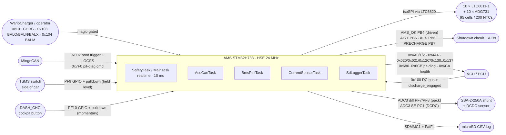
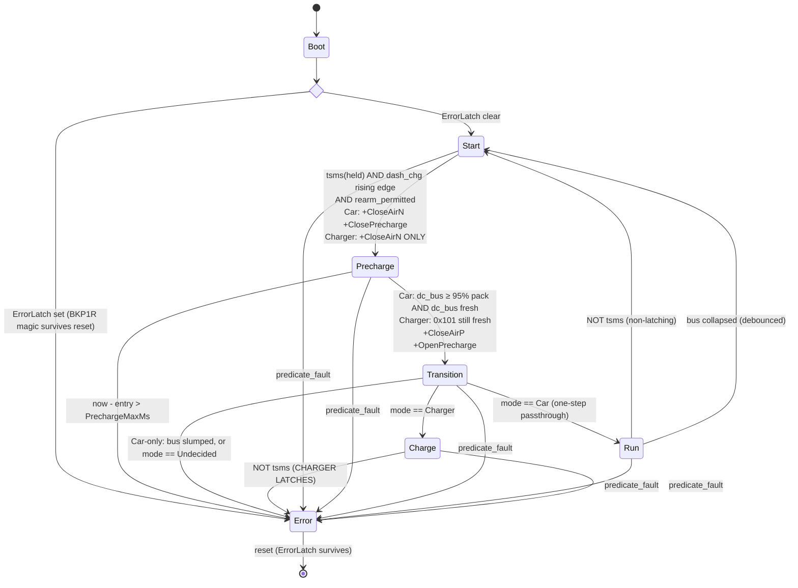
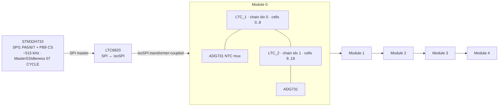

# IFS08-CE-AMS firmware — deep dive

Top-to-bottom walk of the AMS codebase as it exists on `dev`. Onboarding
reference material for a new firmware engineer: every claim here is anchored to
a source file you can open. **Where this document and the source disagree, the
source is right** — fix the document.

**Target:** STM32H733ZGTx · FreeRTOS via CMSIS-RTOS v2 · C++17 app on
CubeMX-generated HAL/CMake. Formula Student EV accumulator management. Firmware
version lives in the `VERSION` file and is baked into `firmware_info` at build
time; this page deliberately does not repeat it.

## Sections

1. [Build system & memory map](#1-build-system--memory-map)
2. [Boot path](#2-boot-path)
3. [The live tasks](#3-the-live-tasks)
4. [Services — lock-free single-writer](#4-services--lock-free-single-writer)
5. [FSM](#5-fsm)
6. [Safety predicates](#6-safety-predicates)
7. [Hardware abstractions](#7-hardware-abstractions)
8. [LTC6811 / isoSPI stack](#8-ltc6811--isospi-stack)
9. [Balancing](#9-balancing)
10. [SoC estimation](#10-soc-estimation)
11. [Config knobs](#11-config-knobs)
12. [Always-on telemetry frames](#12-always-on-telemetry-frames)
13. [ECU TX matrix](#13-ecu-tx-matrix)
14. [Pit-diag stream & firmware health](#14-pit-diag-stream--firmware-health)
15. [Datalogging & the LOGFS diag transport](#15-datalogging--the-logfs-diag-transport)
16. [Tests](#16-tests)
17. [CI & automation](#17-ci--automation)
18. [Where this maps in the source](#18-where-this-maps-in-the-source)
19. [Open questions & known gaps](#19-open-questions--known-gaps)

---

## System view



| Property | Value |
|---|---|
| **One realtime task** | `SafetyTask` (`MainTask`) is the only `osPriorityRealtime` thread. Every producer runs strictly lower, so none can preempt the safety supervisor. |
| **Lock-free state** | 3 services, each a `volatile` struct with exactly one writer task. Cortex-M7 32-bit aligned reads/writes are atomic. No mutex is taken anywhere in app code. |
| **Fault response is not one tick** | The 10 ms loop drives relays inline, but the cell V/T branches are debounced on top of a 200 ms voltage poll: worst case ≈ 460 ms against the < 500 ms rule budget. Immediate-danger predicates latch on the first tick. |

**Naming:** plain `Xxx` constants (no `kXxx`), all in the single `ams::config`
namespace in `ams_config.hpp`.

---

## 1. Build system & memory map

CubeMX-generated CMake. App sources glob from `Core/Src/app/*.cpp`; the include
path carries both `Core/Inc/app` and `Core/Inc` (the latter for the code-first
CAN DSL under `Core/Inc/can`).

```cmake
set(CMAKE_C_STANDARD 11)
set(CMAKE_CXX_STANDARD 17)
option(AMS_HIL_CLEAR_ERROR_LATCH "HIL: wipe RTC->BKP_DR1 ErrorLatch on every boot" OFF)
file(GLOB_RECURSE APP_SOURCES CONFIGURE_DEPENDS "Core/Src/app/*.cpp")
target_compile_options(AMS PRIVATE
    -fno-exceptions -fno-rtti -fno-threadsafe-statics -fno-use-cxa-atexit)
```

`-fno-exceptions -fno-rtti` keep the libstdc++ unwinder out of flash;
`-fno-threadsafe-statics` removes the hidden guard mutex around function-local
statics (the service singletons are function-local statics — see §4).

`VERSION` (semver `MAJOR.MINOR.PATCH`) and the git short hash are read at
configure time and become `AMS_FW_VERSION_*` / `AMS_GIT_HASH_*` compile
definitions, surfaced on pit-diag `0x6C6`. A build with no `.git` tree can pass
`-DGIT_HASH=<hex>` so a CI/tarball/rsync build still carries real provenance.

**There is exactly one build flag: `AMS_HIL_CLEAR_ERROR_LATCH`.** It wipes the
sticky `ErrorLatch` in `App_InitTask` on every boot. It must never reach a
flight image — clearing the latch on boot defeats the whole sticky-error
contract. **There is no BMS data stub**: every build, bench included, talks to a
real LTC chain — on the HIL rig, the Pi Pico LTC6820/LTC6811 emulator. If the
chain is absent, discovery fails and the board comes up in Error, which is the
correct behaviour: the AMS cannot reason about cell voltages it cannot observe.

### Clock tree (`main.c` `SystemClock_Config`)

HSE 24 MHz → PLL1: `M=2` (12 MHz ref) × `N=44` = 528 MHz VCO.

| Output | Divider | Frequency | Feeds |
|---|---|---|---|
| `pll1_p_ck` (SYSCLK) | `P=1`, `SYSCLKDivider = DIV1` | **528 MHz CPU** | Cortex-M7 |
| HCLK | `AHBCLKDivider = DIV2` | **264 MHz** | AHB / peripherals |
| `pll1_q_ck` | `Q=4` | 132 MHz | SPI1 kernel clock |

SPI1 runs at 132 MHz / prescaler 256 ≈ **515.6 kHz** SCK — deliberately slow,
because isoSPI over a transformer-coupled harness is the bandwidth-limited link,
not the MCU. `main.c` makes **no** `HAL_RCCEx_PeriphCLKConfig` call, so FDCAN
stays on its reset-default kernel clock (`hse_ck`, 24 MHz); with
`NominalPrescaler = 3` and 16 time quanta per bit (`1 + TSeg1 10 + TSeg2 5`)
that is **500 kbit/s** on FDCAN1, classic-CAN frame format,
`AutoRetransmission` disabled.

### Memory regions (`STM32H733XG_FLASH.ld`)

| Region | Origin | Size | Notes |
|---|---|---|---|
| **FLASH** | `0x08020000` | 768 KB | sectors 1..6. Sector 0 is the CAN bootloader, sector 7 (`0x080E0000..`) is its NVM. |
| **DTCMRAM** | `0x20000000` | 128 KB | stacks · TCBs · `.data`/`.bss` · FreeRTOS `heap_4` (`configTOTAL_HEAP_SIZE` 64 KB) |
| **RAM_D1** | `0x24000000` | 320 KB | holds `.sd_dma` only — see below |
| RAM_D2 / RAM_D3 / ITCMRAM | — | 32 / 16 / 64 KB | unused |

**Why `.sd_dma` exists.** The SDMMC1 internal DMA cannot address DTCM. Any
buffer it touches must live in an AXI-reachable region, so the `sd_diskio`
bounce buffer is placed in RAM_D1 by a dedicated linker section. Put an SD
buffer on the stack (DTCM) and transfers fail silently.

**Pre-flight check:** `scripts/check_flash_layout.py build/AMS.elf` rejects any
image whose sections land in sector 0 or overflow into sector 7, and asserts
`.isr_vector` starts *exactly* at `0x08020000`. CI runs it on every build.
Growing into either region bricks the CAN update path.

---

## 2. Boot path

```mermaid
sequenceDiagram
  participant HW
  participant main as main()
  participant init as App_InitTask
  participant ST as SafetyTask
  participant aux as BmsPoll / AcuCan / Current / SdLogger

  HW->>main: Reset_Handler → SystemInit
  main->>main: SCB->VTOR = 0x08020000
  main->>main: HAL_Init · SystemClock_Config (HSE 24 MHz → 528 MHz CPU)
  main->>HW: MX_GPIO_Init — AMS_OK + all 3 relays driven LOW<br/>TSMS/DASH_CHG inputs with PULLDOWN
  main->>HW: MX_FDCAN1 · USART2 · ADC3 · SPI1 · IWDG1 · MX_FATFS
  Note over main: IWDG already ticking (~100 ms) before the scheduler exists
  main->>main: osKernelInitialize · queues · 7 tasks · ams_app_globals_init
  main->>main: osKernelStart

  par scheduler running
    init->>init: ErrorLatch::init (backup-domain unlock) → progress 1
    Note over init: under AMS_HIL_CLEAR_ERROR_LATCH: ErrorLatch::clear() → progress 2
    init->>init: fw_health::capture_reset_cause + latch_boot_fault
    init->>HW: FDCAN1 ConfigGlobalFilter (std→FIFO0, ext→REJECT, remote→REJECT) → 3
    init->>HW: ActivateNotification → 4 · HAL_FDCAN_Start → 5, or 6 on HAL_OK
    init->>HW: LTC6820 wakeup + chain discovery (RDCFGA, count PEC-clean segments)
    alt PEC-clean count ≠ LtcChainLength
      init->>HW: ErrorLatch::set + Relays::open_all
    end
    init->>init: progress 7 → osThreadExit (TCB + stack back to heap)
  and
    ST->>ST: ErrorLatch::init; boot straight into Error if ErrorLatch::is_set
    Note over ST: while now < SafetyBootGraceMs (2000):<br/>data-presence predicates suppressed, AMS_OK held LOW
    loop every 10 ms (osDelayUntil)
      ST->>ST: snapshot bms/current/vehicle · fw_health::poke(MainStepped)
      ST->>HW: read TSMS (PF9) level · DASH_CHG (PF10) rising edge
      alt debounced predicate fault OR already latched
        ST->>HW: latch_error_() → open_all + AMS_OK LOW + ErrorLatch::set
        ST->>HW: IWDG refresh (stay alive so the bench can read the fault)
      else clean path
        ST->>ST: every 20 ms: lock Mode at Start→Precharge · fsm::step
        ST->>HW: apply_relay_actions(out.safety_flags) · IWDG refresh
      end
      ST->>HW: every 10 ms: AMS_OK (PB4) = ams_ok_asserted(now, latched)
      ST->>HW: 500 ms 0x4A0/1/2 · 100 ms 0x4A4 · 250 ms sd_log_push
    end
  and aux
    aux-->>aux: BmsPoll 200/250 ms · CurrentSensor 50 ms (+ SoC)<br/>AcuCan RX drain + TX matrix + pit-diag + LOGFS · SdLogger drain
  end
```

> **`g_app_init_progress` is your boot-hang debugger.** `App_InitTask` bumps a
> monotonic milestone byte (0..7) at each step and it is published on pit-diag
> `0x6C4[4]`, with the raw `HAL_FDCAN_Start` return code alongside. If the node
> is silent you cannot read it — but if anything comes out at all, that byte
> tells you exactly how far init got.

> **FDCAN1 is standard-frame-only.** The global filter accepts unmatched
> standard frames into FIFO0 and **rejects all extended frames at the hardware
> gate**, plus remote frames of both kinds. Everything the firmware listens for
> is 11-bit. Rejecting in hardware keeps the RX ISR off junk traffic instead of
> filtering in software.

> **`0x002` is overloaded — and the order of the checks is load-bearing.** The
> bootloader trigger ID is `0x002`, and the LOGFS diag RX ID is
> `0x000 + AmsNodeId` = **also `0x002`** (`AmsNodeId = 0x02`). `AcuCanTask`
> checks `Bootloader::matches_trigger` **first**; that requires DLC 4 and the
> exact payload `B0 07 AD 11`, so a LOGFS frame can never be mistaken for a
> reboot request. Reverse the two checks and a diagnostic session reboots the
> car. Diag replies go out on `0x010 + AmsNodeId` = `0x012`.

---

## 3. The live tasks

Seven threads, created by CubeMX in `main.c`.

| Task | Priority | Stack | Cadence | Real work | File |
|---|---|---|---|---|---|
| `defaultTask` | Low (8) | 128 w | — | CMSIS placeholder, idles | `main.c` |
| `App_InitTask` | High (40) | 512 w | once | FDCAN1 bring-up · LTC chain discovery · self-exit | `app_init_task.cpp` |
| **`SafetyTask`** *(MainTask)* | **Realtime (48)** | 512 w | **10 ms** | snapshot · predicate (10 ms) · FSM step (20 ms) · AMS_OK (10 ms) · 0x4A4 (100 ms) · log sample (250 ms) · 0x4A0/1/2 (500 ms) · IWDG | `safety_task.cpp` |
| `BmsPollTask` | Normal (24) | 1024 w | 200 / 250 ms | ADCV + RDCV[A–D] (+ ADOW open-wire) · ADG731 mux sweep + ADAX/RDAUXA · balance WRCFGA | `bms_poll_task.cpp` |
| `AcuCanTask` | AboveNormal (32) | 512 w | RX-queue + 50/100/250 ms TX | drain `acu_rx_queue` → VehicleService · ECU TX matrix · boot trigger · LOGFS ISO-TP · pit-diag · Bus-Off recovery · 1 Hz `0x6CA` | `acu_can_task.cpp` |
| `CurrentSensorTask` | AboveNormal (32) | 256 w | 50 ms | ADC3 pack (diff) + DCDC (SE) · IIR filter · disconnect debounce · SoC EKF | `current_task.cpp` |
| `SdLoggerTask` | Low (8) | 1024 w | drain loop | lazy SD mount · drain `LogRing` → CSV · rotate/seal · serve LOGFS requests | `sd_logger_task.cpp` |

> **Priority discipline.** Only `SafetyTask` writes relay GPIO and drives
> AMS_OK. Only `SafetyTask` refreshes the IWDG — nothing else in the system
> touches it, so the watchdog supervises that one task and no other. `SdLoggerTask`
> is deliberately at Low so a stalled SD card cannot delay anything that
> matters.

### SafetyTask body — one timeline

Read `safety_task.cpp` alongside this; the shape is what matters.

```cpp
for (;;) {
  osDelayUntil(last_wake += config::SafetyPeriodMs);   // 10 ms
  now = osKernelGetTickCount();
  fw_health::poke(fw_health::MainStepped);

  bms_snap = BmsService::instance().snapshot();
  cur_snap = CurrentService::instance().snapshot();
  veh_snap = VehicleService::instance().snapshot();

  // VCU 0x100 freshness, held to VcuStaleMs (NOT the looser VcuFreshMs):
  // this gates closing AIR+, so the same staleness that raises VcuStale must
  // also make dc_bus_V unreadable. Never-seen (tick 0) is not fresh.
  dc_bus_fresh = veh.last_dc_bus_tick != 0 && (now - veh.last_dc_bus_tick) <= VcuStaleMs;

  tsms = read(PF9);  g_tsms_telemetry = tsms;   // published on 0x021 for the ECU
  dash_chg = read(PF10);
  if (dash_chg && !prev_dash_chg) dash_chg_edge_pending = true;   // MOMENTARY → edge
  prev_dash_chg = dash_chg;

  vcu_required     = (mode_locked == Mode::Car);       // VcuStale gated to Car
  charger_required = (mode_locked == Mode::Charger);   // ChargerStale gated to Charger
  fault_res = safety::evaluate_fault_detail({bms, cur, veh, /*force*/false,
                                             vcu_required, charger_required, now});

  // Two debounces, both driven every tick, both self-gating on the reason:
  cell_confirmed      = cell_debounce_.update(reason, CellFaultConfirmTicks);
  bms_stale_confirmed = bms_stale_debounce_.update(reason, BmsStaleConfirmTicks);
  predicate_fault = is_cell_range_reason(reason) ? cell_confirmed
                  : (reason == BmsStale)         ? bms_stale_confirmed
                  :                                 fault_res.faulted();

  if (error_latched_ || predicate_fault) {
    if (!error_latched_) { publish reason+detail; latch_error_(); state = Error; }
    Watchdog::refresh();
  } else {
    bus_collapsed = debounce(state==Run && mode==Car && fsm::bus_below_collapse(...));
    if (now - last_state_tick >= StatePeriodMs) {           // 20 ms
      if (state==Start && mode==Undecided && tsms && dash_chg_edge_pending)
        mode_locked = (charge_req && !vcu_fresh) ? Charger : Car;
      out = fsm::step({state, bms, cur, veh, tsms, dash_chg_edge_pending,
                       mode_locked, predicate_fault, bus_collapsed,
                       dc_bus_fresh, now, state_entry_tick});
      dash_chg_edge_pending = false;                        // edge is one-shot
      apply_relay_actions(out.safety_flags);
      if (out.next != state) {
        state = out.next; state_entry_tick = now;
        if (state == Error) { ErrorLatch::set(); reason = fsm_error_reason(...); }
        if (state == Start) mode_locked = Undecided;        // re-arm re-locks
      }
    }
    Watchdog::refresh();
  }

  Relays::set_ams_ok(safety::ams_ok_asserted(now, error_latched_));   // EVERY tick
  ... 0x4A0/1/2 @500 ms · 0x4A4 @100 ms · sd_log_push @250 ms ...
}
```

Three details worth internalising:

- **The DASH_CHG edge is latched at 10 ms and consumed at 20 ms.** A press
  landing between FSM steps would otherwise be lost. `prev_dash_chg` is seeded
  from the *live* pin level at task entry, so a button held down at boot does
  not fire a spurious edge.
- **The mode lock is cleared on any return to Start.** A TSMS drop or a bus
  collapse drops you back to Start with `mode_locked = Undecided`, so the next
  arm re-decides Car vs Charger and re-runs precharge from scratch.
- **The watchdog is refreshed on the latched-fault path too.** The relays are
  already open and `ErrorLatch` survives a reset, so staying alive is safe — and
  it is what lets an engineer read the fault reason off CAN instead of watching
  the board reset-loop.

---

## 4. Services — lock-free single-writer

Three singletons wrapping a `volatile` struct. Cortex-M7 32-bit aligned
reads/writes are atomic; each struct has exactly one writer task and many
readers. A reader may see a one-iteration-stale snapshot — the predicate
tolerates that, and `tick_age()` clamps a future-stamped `last` to age 0 so a
producer updating between the `now` sample and the snapshot read cannot underflow
into a spurious staleness fault.

CubeMX still declares `bms_mutex` / `current_mutex` / `vehicle_mutex` in
`main.c`. **No app code takes them.**

| Service | Writer | Readers | Holds |
|---|---|---|---|
| **BmsService** | BmsPollTask | SafetyTask, AcuCanTask, CurrentSensorTask, BalanceController | `cell_mV[5][19]`, `cell_tempC[5][40]`, `pack_voltage_mV`, `min/max_cell_mV`, `min/max/avg_tempC`, `valid_temp_channels`, per-module `vmin/vmax/tmax`, `last_rx_tick[5]`, `module_online_mask` (current freshness, not ever-online), `ltc_online_mask` (per-IC PEC-OK this poll), `temp_disconnect_mask`, `tap_fault_mask`, `cell_open_mask`, `cell_open_cells[5]`, `first_full_poll_done` |
| **CurrentService** | CurrentSensorTask | SafetyTask, BmsPollTask, AcuCanTask | `raw_mA`, `filtered_mA`, `last_update_tick`, `sensor_fault`; independent DCDC set (`dcdc_raw_mA`, `dcdc_filtered_mA`, `last_dcdc_update_tick`, `dcdc_sensor_fault`) |
| **VehicleService** | AcuCanTask | SafetyTask, BmsPollTask, AcuCanTask | `dc_bus_V`, `last_dc_bus_tick`, `discharge_engaged`, `ecu_discharge_capable`, `last_charge_req_tick`, `balance_cmd` + `last_balance_override_tick`, `balance_modules_mask` + `last_balance_modules_tick` |

`+ current = discharge` is the sign convention throughout.

### The RX frames `VehicleService` decodes

- **`0x100` `AcuRxDcBusId`** — little-endian `dc_bus_V` (bytes 0..1), stamps
  `last_dc_bus_tick`. **Byte 2 bit 0 is `discharge_engaged`**, and it is
  *optional on the wire*: a sender at DLC 2 leaves the bit reading 0 and the AMS
  behaves as if the feature did not exist. The first frame at DLC ≥ 3 latches
  `ecu_discharge_capable` permanently (never cleared). See §5 for why that
  latch matters.
- **`0x101` `ChargeModeReqId`** — operator charge-mode request, **magic-gated**:
  the 4-byte payload must equal `"CHRG"` or the frame is dropped, so bus noise
  cannot flip the AMS into a HV charge mode. A valid frame stamps
  `last_charge_req_tick`; `charge_requested(now, last)` is true while that tick
  is within `ChargeReqFreshMs` (future-tick safe).
- **`0x103` `BalanceOverrideReqId`** — operator balance master switch, a
  **three-state** magic: `"BALO"` → Off, `"BALN"` → On (balance in *any* FSM
  state), `"BALX"` → Auto (autonomous, Charge-only). An unrecognised payload is
  ignored and leaves the previous command in place. `effective_balance_cmd()`
  folds in a **dead-man**: never seen, or silent longer than
  `BalanceOverrideFreshMs`, resolves to **Off** — a dead link must never leave
  the pack bleeding.
- **`0x104` `BalanceModulesReqId`** — per-module balancing enable: magic
  `"BALM"` in bytes 0..3, byte 4 is a 5-bit module mask. Its dead-man goes the
  *other* way: stale or never-seen resolves to **all modules enabled**, because
  0x103 is what actually stops balancing, and a lost 0x104 must not silently
  freeze some modules off.

None of 0x103/0x104 is ever on an AIR or safety path.

---

## 5. FSM

States `Start → Precharge → Transition → Run | Charge`, plus sticky `Error`.
Modes `Undecided / Car / Charger`. Pure logic in `state_machine.hpp` — no
FreeRTOS, no HAL, fully host-testable. The FSM consumes SafetyTask's
**already-debounced** `predicate_fault` and never re-evaluates the predicate
itself; doing so once bypassed the debounce and let a transient cell reading
latch Error at the boot-grace edge.



### Transition guards in detail

- **Start → Precharge** — `tsms` (PF9, held master switch) AND a `dash_chg`
  **rising edge** (PF10 momentary, edge-detected at 10 ms, latched until the
  20 ms step consumes it) AND `rearm_permitted` (below). SafetyTask locks the
  mode at exactly this moment.
  **The relay action differs by mode.** Car closes AIR− *and* the precharge
  contactor. **Charger closes AIR− only.** The charger voltage-matches its
  output to the pack before asserting 0x101, so closing AIR+ onto it has no
  inrush; and the precharge contactor sits in *parallel* with AIR+, so closing
  it while the charger sources current would route the full charge current
  through a transient-rated resistor. The resistor never enters the charge loop.
- **Mode lock** — `mode = (charge_req && !vcu_fresh) ? Charger : Car`, where
  `charge_req` is a still-fresh magic-gated 0x101 and `vcu_fresh` is a 0x100
  within `VcuFreshMs`. **Both conditions**: a car with a dead VCU does not send
  0x101, so it locks Car and faults on `VcuStale` rather than silently entering
  a charge mode; a stray 0x101 while the VCU is live cannot flip a running car
  into Charger.
- **`rearm_permitted` — the DC-link discharge interlock.** Two independent
  refusals to leave Start, because they fail differently:
  - `veh.discharge_engaged` set → the ECU says the bleed resistor is
    *connected across the link*. Closing any contactor now puts pack current
    through a transient-duty resistor. Hard interlock; honoured whatever the
    voltage reads.
  - `dc_bus_V > DcBusDischargedV` → the link is still charged, so a precharge
    would be a **no-op**: the 95 % completion criterion is already satisfied on
    entry and the resistor never carries meaningful current. That 95 % check is
    the *only* evidence the AMS has that the precharge path works; satisfied by
    residual charge, it proves nothing. This half is enforced **only once
    `ecu_discharge_capable` has latched**, because an ECU that cannot drain a
    stranded link also cannot clear this block — enforcing it against older
    firmware would brick the car rather than protect it.

  Charger is exempt from both (the inverter is not in the charge loop and
  `dc_bus_V` is VCU-only, absent during a charge; gating it would make Charger
  unarmable). A blocked attempt **holds in Start and consumes the press** — the
  driver waits out the discharge and presses again, no reset. Carrying the press
  forward would let a press made while the link was live arm the car by itself
  seconds later, when nobody expects it.
- **Precharge → Transition** (mode-specific):
  - **Car** — `precharge_target_reached`: `dc_bus_V × 1000 × 100 ≥
    pack_voltage_mV × 95`, compared entirely in mV (a sub-1 V pack truncated to
    volts would bypass the "no data yet" guard), with `pack_voltage_mV == 0`
    rejected as "no data yet". **`dc_bus_fresh` is required, not advisory** —
    see the box below.
  - **Charger** — `dc_bus_V` is VCU-only and absent during a charge, so there
    is nothing to voltage-gate on. The proceed signal is a **still-fresh
    0x101**: the charger auto-emits it at ≥ 2 Hz once connected, the single
    DASH_CHG press was the human "go", and 0x101 freshness authorises closing
    AIR+. No second press and no `dc_bus` required. If 0x101 goes stale
    (charger unplugged), Precharge holds and hits `PrechargeMaxMs` → Error
    rather than closing AIR+ into a dead charger.
- **Precharge timeout** — `now - state_entry_tick > PrechargeMaxMs` latches
  Error and opens every contactor, bounding how long the transient-rated
  resistor is held in circuit for *any* stuck-precharge cause. The case that
  motivates it: a car with a dead VCU locks Charger (VCU absence is ambiguous),
  and since `dc_bus_V` comes only from 0x100 it would otherwise sit in Precharge
  forever. `TransitionHoldMs` does not exist — Transition is a one-step
  passthrough.
- **Transition** — one FSM step; the contactor swap
  (`CloseAirP | OpenPrecharge`) was already emitted on the entry edge. A
  **Car-only** bus-still-up guard re-checks `precharge_target_reached`; if the
  bus slumped when the precharge contactor opened, it lands in Error rather than
  energising a degraded bus. Charger commits to `Charge` directly.
  `Undecided` here is a programming error → Error.
- **TSMS drop — and the one place it latches.** The guard runs *before* any
  per-state branch. In **Car** a TSMS drop is a normal operator de-energise: all
  contactors open, fall back to **Start without latching**, and the driver
  re-arms with a fresh DASH_CHG press that re-runs precharge. This is the FS
  "driver can stop and restart the tractive system unaided" rule, and it is why
  `AMS_OK` stays *health-only* (driven by the predicate set, never by TSMS) — if
  a TSMS drop dropped AMS_OK, the AMS's own upstream SDC relay would open and
  reclosing TSMS could no longer restore the loop.
  In **Charger** mode it is the opposite: scrutineering forbids re-activating
  the charge output once the shutdown circuit has opened, so a TSMS drop in any
  energised charger state **latches Error** (`ChargerTsmsOpen`) and
  re-energising needs a full reset.
  **DASH_CHG is never level-checked in Run/Charge** — it is momentary and low
  most of the time; checking its level would fault instantly.
- **Run → Start on bus collapse** — **Car/Run only.** If the VCU-measured
  `dc_bus_V` sits below `BusCollapsePercent` of the cell-sum pack for
  `BusCollapseConfirmTicks` consecutive 10 ms ticks (SafetyTask debounces this
  into `bus_collapsed`), the AIRs were opened externally — a cockpit SDC
  shutdown the AMS cannot directly sense. Run de-energises to Start
  (non-latching, like a TSMS drop) so a re-arm re-runs precharge rather than
  reclosing AIR+ onto a discharged DC-link when the shutdown is released.
- **predicate_fault (any state)** — kept as a backstop. SafetyTask handles the
  fault before ever calling `step()`, so on a clean tick this is false.

> **Why `precharge_target_reached` demands `dc_bus_fresh`.**
> `VehicleState` holds the **last received** `dc_bus_V` — when the VCU stops
> publishing, the number does not disappear, it **freezes**. Frozen at pack
> voltage it satisfies the 95 % test forever, *including after the link has
> actually bled to zero*, where closing AIR+ means full pack voltage across the
> contactor with nothing limiting the inrush.
> `VcuStale` cannot save you here: it is gated on `vcu_required` (false in
> Start, so the value may already be arbitrarily old when the operator presses)
> and needs `VcuStaleMs` = 200 ms, while the FSM steps every 20 ms — Precharge →
> Transition fires on the frozen reading roughly ten steps before the fault can
> reopen the AIRs. **Freshness has to be part of the criterion, not a separate
> fault racing it.**
> `bus_below_collapse` deliberately does *not* take freshness: it is consumed
> only in Run, where mode is locked to Car, `vcu_required` is true and VcuStale
> bounds staleness at 200 ms — the same 200 ms its own debounce spends. Both of
> its stale outcomes are safe (a false collapse de-energises without latching; a
> missed one is caught by VcuStale), so it has no race to lose.

> **The DC-link discharge interlock, end to end.** The bleed relay is
> normally-closed and wired into the SDC with **no software control**. Opening
> the shutdown circuit de-energises it, the bleed connects, and the link drains.
> Closing the SDC again re-energises the relay, the bleed disconnects, and the
> discharge **stops part-way** — the link is stranded at a voltage nobody can
> predict from how long the SDC was open. The AMS cannot restart it: its own leg
> of the loop, `AMS_OK`, latches in *hardware* (a self-holding relay plus an
> `RST_BMS` button the driver cannot reach), so firmware can never pulse it low.
> So the AMS publishes the two facts only it can observe —
> `0x021 ACU_discharge_interlock` (`fsm_in_start`, `tsms`) at 100 ms — and the
> ECU, which owns both a DC-link measurement and a normally-closed relay in
> series with the bleed relay's coil, makes the decision. The AMS consumes
> `0x100` byte 2 bit 0 and refuses to leave Start while it is set.
> **The ECU half exists on `IFS08-CE-ECU` `dev`** — it mirrors `0x021` field
> for field, supplies the third term from its own DC-link measurement, latches
> the hold and releases at 10 V, below this repo's 60 V gate. So
> `ecu_discharge_capable` latches and both re-arm blocks are live against that
> image. ECU `main` still sends DLC 2 and the interlock is inert against it.
>
> **Gap: the pairing has never run.** The AMS side is verified only by
> `tests/unit/test_state_machine.cpp`, the ECU side only by its SIL, and no
> bench has had both boards on it.

---

## 6. Safety predicates

Pure logic in `safety_predicates.hpp`, evaluated every 10 ms by SafetyTask.
`evaluate_fault_detail()` returns `FaultResult { FaultReason reason, uint8_t
detail }`; `evaluate_fault()` is the boolean wrapper. **Branch order is the
priority order** — the first matching branch wins and its detail byte is what
reaches `0x6C0[7]`.

```cpp
if (force_error_set)                 return {ForceError, 0};   // no live setter on flight
if (now_tick < SafetyBootGraceMs)    return {};                // data predicates suppressed

// --- BMS presence ---
if (bms.module_online_mask != AllModulesMask) return {BmsModuleOffline, mask};
for (m in 0..4) if (tick_age(now, last_rx_tick[m]) > BmsStaleMs) return {BmsStale, m};

// --- sensor PRESENCE checks (independent of calibration trust) ---
if (TempSensorPresenceCheck && temp_disconnect_mask) return {TempSensorDisconnected, mask};
if (CellOpenWireCheck       && cell_open_mask)       return {CellOpenWire,           mask};

// --- cell V / T ranges: gated on first_full_poll_done; DEBOUNCED by the caller ---
if (first_full_poll_done) {
  if (min_cell_mV < CellUnderVoltageMv) return {CellUnderVoltage, offending_module};
  if (max_cell_mV > CellOverVoltageMv)  return {CellOverVoltage,  offending_module};
  if (TempFaultsTrusted) {                       // currently FALSE — see below
    if (min_tempC < CellUnderTempC)     return {CellUnderTemp, 0};
    if (max_tempC > CellOverTempC)      return {CellOverTemp,  offending_module};
  }
}

// --- pack current ---
if (current.sensor_fault)                             return {CurrentSensorFault, 0};
if (tick_age(now, last_update_tick) > IStaleMs)       return {CurrentStale, 0};
if (|filtered_mA| > CurrentMaxMa)                     return {CurrentOverLimit, 0};

// --- link heartbeats, each gated to the mode that needs it ---
if (vcu_required     && tick_age(now, last_dc_bus_tick)     > VcuStaleMs)     return {VcuStale, 0};
if (charger_required && tick_age(now, last_charge_req_tick) > ChargerStaleMs) return {ChargerStale, 0};
return {};
```

The AMS has **no SDC-feedback input**: it *is* part of the shutdown circuit via
`AMS_OK`, and the v1.2 daughterboard routes no dedicated digital input for
reading the loop back.

### `FaultReason` enum (stable wire contract — append only, never renumber)

| # | Reason | # | Reason |
|---|---|---|---|
| 0 | None | 9 | CurrentStale |
| 1 | ForceError | 10 | CurrentOverLimit |
| 2 | BmsModuleOffline | 11 | VcuStale |
| 3 | BmsStale | 12 | *(reserved: `FsmError`, not an enumerator)* |
| 4 | CellUnderVoltage | 13 | TempSensorDisconnected |
| 5 | CellOverVoltage | 14 | ChargerStale |
| 6 | CellUnderTemp | 15 | ChargerTsmsOpen |
| 7 | CellOverTemp | 16 | CellOpenWire |
| 8 | CurrentSensorFault | | |

`12` (`FsmErrorReason`) is a bare constant, not an enumerator: it marks an Error
the FSM reached with **no** predicate fault (precharge timeout, Transition
bus-slump). `fsm_error_reason(charger_mode, tsms)` refines it — the FSM
evaluates its TSMS guard before any per-state branch, so losing TSMS while
committed to Charger is unambiguously `ChargerTsmsOpen (15)`; every other
FSM-driven Error is `12`. A Car TSMS drop and a bus collapse are *non-latching*
(they return to Start) and therefore never set either.

Both `reason` and `detail` are published on pit-diag `0x6C0[6]/[7]` and written
into every SD log row.

### Detail bytes worth knowing

`module_below` / `module_above_*` return `NoOffendingModule = 0xFF` when the
summary `min_cell_mV`/`max_*` crossed a threshold but **no per-module aggregate
agrees**. That is the fingerprint of a torn lock-free snapshot read — the
summary and the per-module arrays were copied from different poll cycles.
Distinguishing it from a real module index 0..4 lets the bench tell "module N is
genuinely low" from "inconsistent snapshot".

### Four facts to internalise

- **VcuStale is gated to Car, ChargerStale to Charger.** In Charger mode the
  VCU is absent by design, and in Car mode the charger is. Gating `VcuStale` is
  what makes Charger mode *reachable at all*: a Charger lock needs the VCU stale
  beyond `VcuFreshMs` (1000 ms), but an ungated `VcuStale` (200 ms) would always
  latch Error first.
- **Cell V/T range reasons are debounced; `BmsStale` is too.** A single
  transient sub-threshold sample — a torn snapshot read, an unsettled first
  poll — must not latch the sticky Error. `CellFaultDebounce::update()` requires
  `CellFaultConfirmTicks` consecutive evaluations reporting the **same** reason.
  `BmsStaleDebounce` does the same for `BmsStale`, so a far module that flickers
  just past the window on an EMI burst and reports on its next poll does not
  open the contactors. Everything else latches on the first tick.
  Note `BmsStale`'s debounce does **not** slow module-loss detection: a
  genuinely lost module is caught faster by `BmsModuleOffline`, which is
  immediate.
- **Temperature *presence* and temperature *range* are different questions.**
  `TempSensorDisconnected` is armed (`TempSensorPresenceCheck = true`) because
  an open NTC reads the rail regardless of calibration, and the FS rules require
  a disconnected temp sensor to open the SDC. Temperature *range* faults are
  gated behind `TempFaultsTrusted`, which is **false**: the ADG731 mux select
  word was wrong and the corrected path is not yet validated end-to-end on
  flight hardware. Voltage protection is unaffected. Balancing has its own,
  separate trust flag (`BalanceTempsTrusted`, currently true) — "trust these
  temps enough to balance on" is not the same question as "trust them enough to
  open the contactors on".
- **`CellOpenWire` is the only predicate that can see a broken cell tap.** An
  open node floats: one of the two cells sharing it rails high, the other low,
  and their *sum* is conserved — which is exactly the signature the tap-artifact
  guard in `recompute_summaries_` averages back into range. So over/under-voltage
  *cannot* fire on an open tap (measured on the bench: a cell reading 2364 mV
  reached the FSM as 3823 mV). ADOW is the answer, and it faults in any state.

---

## 7. Hardware abstractions

| File | Owns | Notable |
|---|---|---|
| `relay_driver.cpp` | PB5 AIR+, PB6 AIR−, PB7 Precharge, **PB4 AMS_OK** | `open_all()` is a single BSRR mask write across all three relay pins — atomic, interrupt-safe, no IRQ disable. **Invariant: all three must share one GPIO port**; the code references `RELAY_AIR_N_GPIO_Port` as the canonical port so an `.ioc` relocation follows automatically. Also exposes `is_*_closed()` ODR read-backs and a C-callable `ams_relays_open_all_c()` for the FreeRTOS hooks. |
| `watchdog.cpp` | `HAL_IWDG_Refresh(&hiwdg1)` | Prescaler 32, reload 100, LSI 32 kHz → **~100 ms**. Started by `MX_IWDG1_Init` *before* the scheduler. Refreshed on every clean iteration *and* on the latched-fault path. |
| `error_latch.cpp` | `RTC_BKP_DR1`, magic `0xA115EE51` | Sticky across resets. Cleared only by backup-domain power loss, or `App_InitTask` under `AMS_HIL_CLEAR_ERROR_LATCH`. |
| `fw_health.cpp` | RCC reset flags, `RTC_BKP_DR3`, task-liveness bitfield, heap stats | Captured at boot, published ungated on `0x6CA`. `map_reset_cause()` is pure and host-tested. |
| `bootloader.cpp` | `matches_trigger()`, `request_reboot(reason)` | Trigger: `0x002` std, DLC 4, `{0xB0,0x07,0xAD,0x11}`. Reboot opens all relays, writes the magic to BKP0R + a 4-char ASCII reason to BKP2R, then `NVIC_SystemReset`. |
| `firmware_info.cpp` | `bl_fwinfo_t` record at a fixed offset | semver + git hash + `AmsNodeId = 0x02`, all baked from CMake. The bootloader and MingoCAN read it. |
| `can_isr.cpp` | `HAL_FDCAN_RxFifo0Callback` | Pushes into `acu_rx_queue`; the std-only hardware filter keeps the ISR off extended junk. |

### AMS_OK / SDC enable

`safety::ams_ok_asserted(now, error_latched)` returns
`(now >= SafetyBootGraceMs) && !error_latched`. SafetyTask calls it **every
10 ms tick** and drives PB4 (active-high, HIGH = AMS not blocking the SDC):

- **LOW** during boot grace — the data predicates are suppressed there, so the
  SDC must not be enabled against unverified inputs. `MX_GPIO_Init` also drives
  it (and all three relays) LOW before the scheduler starts.
- **HIGH** once past the grace with no error latched.
- **LOW** the instant an error latches (`latch_error_()` drops it directly, and
  the boot-in-error path drops it too).

**Hardware caveat that changes how you reason about it:** the AMS's leg of the
shutdown loop latches in hardware — a self-holding relay plus an `RST_BMS`
button the driver cannot reach. Driving PB4 low opens the loop; driving it high
again does **not** close it. Never treat `AMS_OK` as a momentary or recoverable
interlock.

### Backup-register usage

| Reg | Owner | Value | Purpose |
|---|---|---|---|
| `RTC_BKP_DR0` | Bootloader | `0xB00710AD` | Boot-request handshake — written by the app, read + cleared by the BL on reset |
| `RTC_BKP_DR1` | App | `0xA115EE51` | `ErrorLatch` — sticky across resets |
| `RTC_BKP_DR2` | App | 4-char ASCII | Jump reason (`JumpReason` enum) |
| `RTC_BKP_DR3` | App | `LastFault` sentinel | Sticky last-fault for `0x6CA`; latched to RAM and cleared at boot |

Backup registers survive a warm reset always, but a power cycle only with a VBAT
source on the carrier. The MLC bench carrier has none; flight VBAT is
unconfirmed — so "sticky error across a power cycle" is an **unverified**
property today.

---

## 8. LTC6811 / isoSPI stack



### Chain shape — memorise this mapping

- 5 modules × 2 LTCs = **10 ICs** (`LtcChainLength`), `AllModulesMask = 0x1F`.
- **The cell split is asymmetric.** `LTC_1` (chain index **even**, `2m`) carries
  module cells **0..8** — `CellsPerLtcUpper = 9`. `LTC_2` (chain index **odd**,
  `2m+1`) carries **9..18** — `CellsPerLtcLower = 10`. **19 cells per module,
  95 total.** RDCV decode: upper IC uses RDCVA→0,1,2 / RDCVB→3,4,5 /
  RDCVC→6,7,8 and **ignores RDCVD entirely**; lower IC uses RDCVA→9,10,11 /
  RDCVB→12,13,14 / RDCVC→15,16,17 / RDCVD[0]→18. Feeding the upper IC's unused
  RDCVD registers to the open-wire detector would false-flag conductors that do
  not exist.
- NTCs: 20 per LTC × 10 ICs = **200 slots**, 40 per module. ADG731 channels
  `S1..S10` and `S17..S26` are populated → `Adg731ChannelMap = {0..9, 16..25}`
  (the 0-indexed channel is one less than the schematic's `S<n>`). All 40 module
  slots are populated and **required** (`RequiredTempSlots`), so any open
  cell-temp sensor opens the SDC — which means the harness must be healthy for
  the pack to arm at all.
- **Temperature comes from an R-T table, not a beta fit.** Each NTC sits between
  an ADG731 `S` input and ground with a pull-up to the LTC's VREF2, read through
  GPIO1 via RDAUXA in 100 µV units;
  `R_ntc = NtcPullupOhm × V_aux / (NtcVrefMv − V_aux)`, then the manufacturer
  R-T table in `ntc_table.hpp` (generated from `docs/ntc_rt_table.csv`). A
  single-beta Steinhart approximation was not accurate enough across the range.
  An AUX reading at or above `NtcOpenMv` means *open*, not *cold*.
- **Per-IC PEC counters** — saturating, one per chain slot, published on
  `0x6C7` (ICs 0..7) and `0x6C8` (ICs 8..9). A byte-0 spike on `0x6C7` means
  module 0's upper LTC is misbehaving; the summed count on `0x6C0[4..5]` only
  tells you the chain is unhealthy.

### BmsPollTask — two osTimers, one SPI owner

```text
osEventFlagsWait { PollVDue (BmsPollVoltMs) | PollTDue (BmsPollTempMs) }

PollVDue → run_voltage_poll():
  0.  if consecutive failures ≥ threshold: recover_chain()  (T_SLEEP wake + reconfigure)
  0b. quiesce_balancing()      — WRCFGA all-zero DCC, retried once, then settle
  1.  up to (1 + VoltPollRetries) attempts:
        ADCV(AdcMode, DCP=0, All) → settle AdcvSettleMs
        RDCFGA warm-up (throwaway) → RDCVA/B/C/D → update_from_ltc_response
        stop early once all 10 ICs read PEC-clean
  1b. if CellOpenWireCheck: attempt_open_wire_poll()  (ADOW PUP=1 then PUP=0, ×2 each)
  2.  restore_balancing()
  then maybe_run_balance_update() every BalanceUpdatePolls polls
       (4 × BmsPollVoltMs = 800 ms; a no-op outside Charge unless the
        operator forced balancing On)

PollTDue → run_temperature_poll():
  warm-up select to UNPOPULATED S32 (start of sweep only)
  for ch in Adg731ChannelMap[0..19]:
    WRCOMM(select) + STCOMM → settle → ADAX → settle AdaxSettleMs → RDAUXA
    the sweep may PAUSE between channels to let a due voltage poll run
```

Three non-obvious mechanisms you will otherwise rediscover the hard way:

- **The RDCFGA warm-up before the first RDCV.** After the multi-millisecond
  idle of ADCV + settle, MOSI drifts toward idle-high. Slaves that re-sync on CS
  edges (notably the Pi Pico LTC6820 emulator) sample that stray HIGH as bit 7
  of RDCVA byte 0, and PEC then fails for *every* IC. A no-op RDCFGA burns the
  stale sample; the RDCV commands then run back-to-back with MOSI continuously
  driven.
- **The mux warm-up select to unpopulated S32.** The same effect in the mux
  domain: the first WRCOMM/STCOMM after the cell-read burst can be dropped, so
  the sweep's first real channel never latches and every mux stays on its
  previous selection — temp slot 0 then reads the rail on all modules at once, a
  false open on every sweep. Bench-confirmed via a 32-channel raw dump. The
  throwaway select targets S32, which is NC on every mux, so a dropped warm-up
  can never cost a real temperature.
- **The temperature sweep yields to a due voltage poll.** A whole sweep is
  ~60–100 ms; without the pause it would head-of-line-block the 200 ms voltage
  poll and the tightened `BmsStaleMs` (350 ms) would nuisance-trip. The sweep's
  failure mask accumulates across pauses so it is not lost mid-sweep.

### Open-wire (ADOW) detection

Two conversion passes (pull-up then pull-down, each run **twice** so the PUP
current settles), both read back with RDCV. The decision lives in
`open_wire.hpp` — pure and host-tested:

- interior conductor `n`: `CELL_PU(n+1) - CELL_PD(n+1) < -CellOpenWireDeltaMv`
- bottom conductor `C(0)`: `CELL_PU(1) == 0`
- top conductor `C(N)`: `CELL_PD(N) == 0`

`CellOpenWireCheck` is **true** — this runs on flight. On a live pack a real
open reads about −4000 mV against the 400 mV threshold (≈ 10× margin), and a
healthy pack stays inside −130..+50 mV. Both passes must be PEC-clean on an IC
for it to be judged, so `OpenWireRetries` re-runs the scan **within the same
poll** when any IC was skipped, keeping detection inside the < 500 ms budget.

> **Honest gap:** only **interior** conductors are hardware-validated. The
> endpoint rules test for *exact zero* and have never run on hardware — an
> endpoint open reading a few mV instead of 0 would be missed. That is roughly
> 2 of every 10 conductors per IC.

`AdowRawDiag` (false on flight) dumps the raw per-cell PU/PD grids over
pit-diag `0x6D0` / `0x6E8` for debugging the encoding against a known open. It
is dead-code-eliminated when false, but still type-checked by CI.

### The tap-artifact guard

`recompute_summaries_` detects physically-adjacent cell pairs whose shared tap
node is displaced (one reads impossibly high, the neighbour compensates low,
pair sum conserved — the signature of a high-resistance tap exposed by balancing
current) and feeds the **pair average** to `min/max_cell_mV` and the per-module
aggregates, so the artifact cannot false-trip OV/UV and open the SDC. The raw
`cell_mV` is left untouched, so the pit-diag grid still shows the split for
diagnosis. `CellImplausibleMinMv`/`MaxMv` are deliberately *wider* than the
OV/UV limits: a genuine over-voltage has a *normal* neighbour (the pair sum runs
high rather than staying conserved) and is never masked.

---

## 9. Balancing

Policy lives in `balance_controller.hpp` — pure, host-tested. `BmsPollTask` only
packs the resulting mask into WRCFGA payloads.

**Gates, in order — any one yields an all-zero mask:**

1. `op_cmd == Off` (including the dead-man fallback from a silent 0x103)
2. `op_cmd == Auto` and the FSM is not in `Charge` (`On` runs in any state — the
   operator's explicit override of the *enable* decision)
3. a latched **cell-data** fault: `CellOpenWire`, `CellOverVoltage`,
   `CellUnderVoltage`. This binds `On` as well as `Auto`.
4. cell temperatures not trusted (`BalanceTempsTrusted`), or fewer than
   `BalanceMinValidTempCh` valid channels
5. `max_tempC > BalanceTempMax`

The operator overrides the *enable* decision, never the guards.

**Why the cell-data gate binds `On` too.** The selector reads **raw**
`s.cell_mV`; the tap-artifact guard's corrected pair average lives in a local
inside `recompute_summaries_` and never reaches it. So a split tap (one half
reading 4600 mV, the other 3000 mV) is masked for the OV predicate but still
presents 4600 mV here — and the greedy picks it first, forever, while the
no-adjacent rule locks out its genuinely-imbalanced neighbour.

**Selection, per module, once the gates pass:**

- the floor is the **second-lowest** cell in the pack, not the lowest
- **hysteresis**: a cell already discharging stays a candidate while it is more
  than `BalanceStopDeltaMv` above the floor; a cell not yet discharging must
  exceed the wider `BalanceDeltaMv` to become one. Without this the selection
  toggles, because the policy is stateless and re-derived from scratch every
  window.
- greedily take the highest excess, **never two physically adjacent cells**
  (`BalanceSpreadNoAdjacent`), up to `BalanceMaxActive` per module
- per-module enable mask from 0x104 is layered underneath

`physically_adjacent()` encodes a **board fact**: each LTC drives one horizontal
row of cell positions and the firmware cell index maps monotonically onto that
row, so two cells share a board edge iff they are consecutive indices **in the
same LTC half**. Indices 8 and 9 are in different rows and are *not* neighbours.
Bench-verified: forcing local indices 0..7 lit exactly 8 contiguous 2512 pads on
one row with the other row cold on IR.

### The quiesce-before-measure rule

Before every voltage poll, `quiesce_balancing()` writes an all-zero DCC mask and
waits `BalanceQuiesceMs`.

**Why ADCV's `DCP=0` is not enough.** Per the LTC6811 datasheet (Table 53),
`DCP=0` suppresses discharge only on the cell being measured *and its immediate
neighbours*. During the CELL1/7 window S1/S2 are off but S3/S4/S5 stay **on**.
So roughly half the selected cells keep pulling bleed current through the shared
tap harness for the whole conversion. The bleed return path is the harness, not
the board, so that current shifts the shared tap node: the bled cell reads low
and **both** its neighbours read high, by 9–36 mV — against a 50 mV
`BalanceDeltaMv`. Left in, the selector chases its own artifact. **The quiesce
is the only full stop; treat it that way.**

If both WRCFGA attempts fail the poll proceeds anyway (stale cell data starves
the safety predicates, which is worse than a noisy read) but flags itself: the
safety path still gets the reading, while the **balance selector skips that
window entirely** and holds the previous mask. `0x6CB` publishes the
success/fail counts so you can confirm from the bus alone that the quiesce is
landing.

---

## 10. SoC estimation

`soc_estimator.hpp`, advanced by `CurrentSensorTask` every 50 ms.

> **SAFETY CONTRACT, quoted from the file's first lines: SoC is TELEMETRY ONLY.**
> No safety predicate reads it, and nothing in it can influence the FSM, the
> contactors or `AMS_OK`. If the whole file produced garbage the AMS would
> behave exactly as it does today. **This must stay true.** A charge estimate is
> an operator convenience, not a protection.

Method: an EKF over an equivalent-circuit model.

- **Predict** — Coulomb counting, `SoC(t) = SoC(t0) − (1/Q)∫I dt`. Exact over
  short horizons, unbounded drift over long ones because sensor offset
  integrates linearly.
- **Correct** — a voltage residual through the ECM against `min_cell_mV`
  (usable pack charge is set by the weakest element), with `R_int` scheduled on
  SoC and `avg_tempC`. The gain schedules itself off the **OCV curve slope**, so
  there is no rest gate and no hand-written blend: the filter leans on voltage
  where the curve is steep and on the integral where it is flat.
- **Why that matters numerically** — the VTC6 OCV curve is nearly flat
  mid-pack (3.4676 → 3.6551 V spans SoC 0.30 → 0.50, ~9.4 mV per point) and
  steepens near the top (~2.3 mV per point over 0.90 → 1.00). A millivolt of
  measurement error costs ~0.1 SoC points in the middle but ~0.04 near full.
- **Correction requires trustworthy cells** — the whole chain online and
  `first_full_poll_done`. Without them it keeps predicting, degrading gracefully
  to plain Coulomb counting rather than to nothing.
- **Invalidation** — a pack-current sensor fault or a stale current reading
  invalidates the filter and publishes `soc::Unknown` (`0xFF`). Charge that
  moved while it could not be measured is genuinely unknown; predicting through
  it would fabricate it.

`0xFF` is the sentinel published on `0x130`, distinct from a real 0 %.

---

## 11. Config knobs

Single namespace `ams::config` in `ams_config.hpp` — the canonical home for
every compile-time constant, and the file carries the numeric reasoning for each
one. `COMMISSION`-tagged items must be measured before sign-off. **When a number
here disagrees with the header, the header is right.**

### Key safety / timing constants

| Constant | Value | Meaning |
|---|---|---|
| `SafetyPeriodMs` | 10 | SafetyTask tick |
| `StatePeriodMs` | 20 | FSM step cadence |
| `SafetyBootGraceMs` | 2000 | data predicates suppressed, AMS_OK held low |
| `BmsPollVoltMs` | 200 | voltage poll (sized so a cell fault lands < 500 ms) |
| `BmsPollTempMs` | 250 | mux sweep (sized for the temp-disconnect budget) |
| `CellFaultConfirmTicks` | 25 | cell V/T debounce ≈ 250 ms |
| `BmsStaleConfirmTicks` | 25 | BmsStale confirm ≈ 250 ms |
| `BmsStaleMs` | 350 | any module silent — tolerates one missed poll, trips on two |
| `IStaleMs` / `DcdcIStaleMs` | 200 / 500 | pack current stale (safety) / DCDC stale (informational) |
| `VcuStaleMs` | 200 | 0x100 stale (Car-only fault; also the `dc_bus_fresh` window) |
| `VcuFreshMs` | 1000 | Car-vs-Charger mode-lock window |
| `ChargerStaleMs` | 1000 | 0x101 stale in Charger mode (charger sends ≥ 2 Hz) |
| `PrechargeMaxMs` | 5000 | precharge deadline → Error (resistor thermal ceiling) |
| `BusCollapsePercent` / `ConfirmTicks` | 50 % / 20 | Run bus-collapse detector ≈ 200 ms |
| `DcBusDischargedV` | 60 | re-arm gate: link must be at/below this |
| `TelemetryPeriodMs` | 500 | 0x4A0/1/2 |
| `RelayStatusPeriodMs` | 100 | 0x4A4 |
| `LogSamplePeriodMs` | 250 | SD log row |
| `EcuFast/Mid/SlowTxMs` | 50 / 100 / 250 | ECU TX matrix |
| `AmsNodeId` | 0x02 | role map ECU = 1, AMS = 2; also fixes the diag IDs |

### The fault-response arithmetic — redo it if you change a number

An out-of-range cell must open the SDC in **< 500 ms**:

```
worst case = BmsPollVoltMs (200, observe the condition)
           + CellFaultConfirmTicks × SafetyPeriodMs (250, confirm)
           + SafetyPeriodMs (10, the tick that acts)
           ≈ 460 ms
```

and the confirm window (250 ms) still spans **more** than one poll cycle
(200 ms), so a single anomalous poll cannot latch. A lost module:
`BmsStaleMs` 350 ms crossed at the second poll after loss (~400 ms) + a 10 ms
tick ≈ 410 ms, via the **immediate** `BmsModuleOffline` branch. A disconnected
temp sensor: one 250 ms sweep cadence + the ~100 ms sweep + 10 ms ≈ 360 ms.
Change any of these constants and redo this arithmetic — the comments in
`ams_config.hpp` carry it.

### Trust flags currently gating behaviour

| Flag | Value | Effect |
|---|---|---|
| `CellOpenWireCheck` | true | ADOW runs on flight; `CellOpenWire` can latch |
| `TempSensorPresenceCheck` | true | a disconnected NTC opens the SDC |
| `TempFaultsTrusted` | **false** | cell over/under-**temperature** does not fault |
| `BalanceTempsTrusted` | true | temps are trusted enough to *balance* on |
| `AdowRawDiag` | false | raw ADOW grid dump off |

### COMMISSION-tagged surface (measure before sign-off)

| Pack limits | Current sensing | Balancing / NTC / SoC |
|---|---|---|
| `CellUnderVoltageMv` 2800 | `CurrentZeroCount` 2054 (flight carrier; bench read 2050) | `BalanceDeltaMv` 50 / `BalanceStopDeltaMv` 20 |
| `CellOverVoltageMv` 4200 | `CurrentMvPerAmpe1` 46 (≈ 5.4 mV/A ×10 after gain trim) | `BalanceTempMax` 50 °C |
| `CellUnderTempC` −10 °C | `DcdcCurrentZeroMv` 1650 / `DcdcCurrentMvPerAmpe1` 264 | `BalanceMaxActive` 8 |
| `CellOverTempC` 60 °C | `CurrentLegPlausMinMv/MaxMv` 700 / 2300 | `NtcPullupOhm` 6800 Ω / `NtcVrefMv` 3000 / `NtcOpenMv` 2800 |
| `CurrentMaxMa` 185000 (6P continuous) | `CurrentFilterShift` 4 (τ ≈ 16 samples) | `PackCapacityMah` 18000 (6P × 3.0 Ah), `RIntNomMicroOhm`, all `SocEkf*` |
| `PrechargeMaxMs`, `BusCollapse*`, `DcBusDischargedV`, `BmsStaleMs`, `BmsStaleConfirmTicks` | | |

---

## 12. Always-on telemetry frames

FDCAN1 TX, classic CAN, emitted by `SafetyTask` regardless of state or diag arm.
Byte layouts are generated from the code-first DSL in
`Core/Inc/can/messages/*.def` — the adapters in `telemetry_encoders.hpp` only
map service fields and apply value transforms (int8 temp clip, AMS_OK
normalise, cockpit-byte assembly).

### `0x4A0` — AMS status (500 ms)

| Byte | Field |
|---|---|
| [0] | `fsm_state` |
| [1] | `ams_ok` (PB4 GPIO read-back) |
| [2] | `module_online_mask` |
| [3] | reserved (`0x00`) |
| [4..5] | `min_cell_mV` **BE** |
| [6..7] | `max_cell_mV` **BE** |

### `0x4A1` — Pack (500 ms)

| Byte | Field |
|---|---|
| [0..3] | `pack_voltage_mV` LE u32 |
| [4..7] | `filtered_mA` LE i32 (+ = discharge) |

### `0x4A2` — Temps + cockpit + diagnostics (500 ms)

| Byte | Field |
|---|---|
| [0] | `min_tempC` i8 |
| [1] | `max_tempC` i8 |
| [2] | `avg_tempC` i8 |
| [3..4] | `dc_bus_V` LE u16 |
| [5] | cockpit byte |
| [6] | `tx_fail_count_lo` |
| [7] | heartbeat (8-bit wrap, intentional) |

Cockpit byte (`0x4A2[5]`):

```text
bit 7    1   (sentinel — "this byte is live", distinguishes it from an
              older firmware that elided it)
bits 3:2 mode_locked (00 Undecided, 01 Car, 10 Charger)
bit 1    TSMS readback (PF9)
bit 0    DASH_CHG readback (PF10, live level, not the latched edge)
```

### `0x4A4` — Relay status (100 ms)

Byte 0 bits 0..3: `air_negative`, `air_positive`, `precharge`, `ams_ok`. Bytes
1..7 reserved. Emitted on its own faster cadence so an external logger can watch
the whole AIR/precharge sequence **without arming pit-diag**.

> These are **ODR read-backs**. They confirm what the firmware is driving the
> relay coils to — not that a contactor physically closed. There is no contactor
> feedback input on this board.

---

## 13. ECU TX matrix

`AcuCanTask` drives three cadence buckets. The ECU's FDCAN2 is wired to AMS
FDCAN1, so these frames reach the wider vehicle through the ECU. Cadence comes
from `osMessageQueueGet` with a timeout computed to expire at the nearest TX
deadline, which keeps RX latency low and TX jitter bounded.

| Cadence | IDs |
|---|---|
| **50 ms** (`EcuFastTxMs`) | `0x135` currents (BE i16 deciamps × 2: pack, DCDC) |
| **100 ms** (`EcuMidTxMs`) | `0x020` ok_precharge (1 iff state ∈ {Run, Charge}) · `0x021` discharge interlock · `0x12C` pack-wide `v_cell_min` · `0x131`/`0x132` vmin per module · `0x133`/`0x134` vmax per module |
| **250 ms** (`EcuSlowTxMs`) | `0x136`/`0x137` tmax per module (+ DCDC temp stub on `0x137`) · `0x130` SoC % |
| **1000 ms, ungated** | `0x6CA` firmware health — see §14 |

`0x131`/`0x133`/`0x136` carry modules 0..2, `0x132`/`0x134` carry modules 3..4,
`0x137` carries modules 3, 4 and the DCDC stub.

The ECU-matrix sends are **non-blocking**: a transient TX-FIFO-full bump
increments `g_acu_tx_fail` (surfaced on `0x6C9`) rather than stalling the
cadence. Only the pit-diag burst uses the blocking variant.

### FDCAN1 Bus-Off recovery

Polled every loop pass (a cheap `GetProtocolStatus` PSR read), rate-limited
internally by `can_busoff_recovery.hpp`.

The STM32H7 M_CAN latches Bus_Off after sustained TX errors and sets
`CCCR.INIT`, which halts **both TX and RX** — the node stops ACKing, goes
silent, and does **not** self-clear. Only a software Stop→Start re-arms it. The
poll runs unconditionally precisely because a Bus_Off node receives nothing, so
the queue-get just times out at the next TX deadline and the loop keeps
spinning.

One subtlety worth knowing: a Stop/Start **timeout** latches
`hfdcan1.State = HAL_FDCAN_STATE_ERROR`, after which every later HAL Stop/Start
silently no-ops (they gate on `State`) and the bus would wedge permanently deaf.
The recovery therefore forces the HAL back to `READY` on failure so the next
attempt genuinely retries. Stop/Start touches neither the message-RAM filter nor
the interrupt enables, so the boot-time configuration survives and
interrupt-driven RX resumes on rejoin.

---

## 14. Pit-diag stream & firmware health

A gateable diagnostic stream surfacing the entire pack state on FDCAN1 — used by
MingoCAN to show live cell-V / cell-T / FSM / balance / boot context on a stock
CAN interface. **Disabled at power-up** (the flag lives in `.bss`), so the
engineer must enable it after every reboot.

### Control protocol

| ID | Dir | DLC | Purpose |
|---|---|---|---|
| `0x7F0` `PitDiagCmdRxId` | RX | 4 | enable `{DE,AD,BE,EF}` / disable `{00,00,00,00}` |
| `0x7F1` `PitDiagAckTxId` | TX | 1 | ACK / state echo |

An enable command resets the scan clock so a scan appears within one scan period
rather than after whatever residual delay was on the timer.

### Frame map (1 Hz scan when enabled)

| IDs | Count | Content |
|---|---|---|
| `0x680..0x697` | 24 | **Cells:** 4 × u16 mV BE per frame, `ceil(95/4)`; pad slots and cells straddling a confirmed open tap are `PitDiagCellSentinel` (`0xFFFF`) |
| `0x6A0..0x6B8` | 25 | **Temps:** 8 × i8 °C per frame, exactly 200/8 |
| `0x6C0` | 1 | **FSM status:** [0] state · [1] mode_locked · [2] bits {dash_chg, tsms, balance_override} · [3] ams_ok GPIO · [4..5] `pec_err_total` BE u16 saturating · [6] fault_reason · [7] fault detail |
| `0x6C1` | 1 | **Timing:** V-poll last/max ms (BE u16, clipped) + last temp-sweep failure mask |
| `0x6C2` | 1 | **Balance mask A:** DCC bits, cells 0..63 |
| `0x6C3` | 1 | **Balance mask B:** DCC bits 64..94 + balance cycle counts |
| `0x6C4` | 1 | **Boot diag:** jump reason + `app_init_progress` + `fdcan1_start_result` |
| `0x6C5` | 1 | **Post-mortem:** stack-overflow task addr + watermark + malloc-fail count |
| `0x6C6` | 1 | **FW ID:** semver + git hash[0..3] + BL node id |
| `0x6C7` | 1 | **Per-IC PEC (A):** ICs 0..7, saturating u8 |
| `0x6C8` | 1 | **Per-IC PEC (B):** ICs 8..9 + reserved |
| `0x6C9` | 1 | **Comms health:** FDCAN1 Bus-Off recovery count (LE u32) + ECU-TX enqueue-fail count (LE u32) |
| `0x6CB` | 1 | **Balance-quiesce health:** successful DCC clears vs polls measured under bleed. The **ratio** is the diagnostic — a climbing fail count means cell voltages are being sampled while cells bleed, corrupting both the balance selector and the SoC correction. |
| `0x6D0..`, `0x6E8..` | 2×24 | **Raw ADOW PU / PD grids** — only when `AdowRawDiag` is enabled (off on flight) |

**60 frames per scan** in the normal configuration (24 + 25 + 11).

> **Burst pacing.** The FDCAN1 TX FIFO is 16 deep. Without flow control, frames
> 17+ get NACKed silently and the engineer sees only the front of the burst on
> the wire. Every pit-diag send uses the **blocking** variant: yield 1 ms while
> the FIFO is full. Worst case ~6 ms of task time per scan at 500 kbit/s, which
> at 1 Hz is under 1 % of the task budget and still leaves every 50/100/250 ms
> ECU deadline met. Bus cost is roughly 60 frames × ~130 bits ≈ 7.8 kbit/s, ~1.5 %
> of a 500 kbit/s bus — budget it before adding another large producer.

### `0x6CA` firmware health — ungated, 1 Hz

Emitted **regardless of the pit-diag arm**, so a passive listener sees AMS
liveness with the stream off. Non-blocking send.

| Byte | Field |
|---|---|
| [0..1] | `free_heap` BE u16 (bytes) |
| [2..3] | `min_free_heap` BE u16 (min-ever) |
| [4] | task-liveness bitfield |
| [5] | `reset_cause` |
| [6] | `uptime_s` (wraps at 256) |
| [7] | `last_fault` sentinel |

The **liveness bitfield** is a sample-and-clear: each critical task pokes its
bit every pass, the 1 Hz emit reads and clears the field, so a set bit means
"this task stepped in the last second" and a clear bit means it stalled.
bit 0 `MainStepped` (SafetyTask 10 ms loop) · bit 1 `CanRx` (AcuCanTask serviced
its RX queue) · bit 2 `CanTx` (periodic TX scheduler ran) · bit 3 `Housekeeping`
(BmsPollTask isoSPI sweep).

`reset_cause` is picked by the pure `map_reset_cause()`: the specific causes
(IWDG, WWDG, low-power, software) win over the generic Pin/POR that a reset
usually also asserts, and POR beats Pin because a cold boot raises both.

---

## 15. Datalogging & the LOGFS diag transport

### Producer side (SafetyTask, 250 ms)

One `LogRecord` per `LogSamplePeriodMs`, built from the snapshots the safety
tick already took: scalars (tick, pack mV, raw/filtered/DCDC current, cell
extremes, `dc_bus_V`, temp extremes, FSM state, mode, fault reason + detail,
online mask, AMS_OK / TSMS / DASH_CHG pin read-backs) plus the **full**
`cell_mV[5][19]` and `cell_tempC[5][40]` matrices. It lives in a file-static
scratch buffer, not on the SafetyTask stack, which already holds a large
`BmsState` snapshot.

`sd_log_push()` is **wait-free and never faults**: a full ring (SD stall, card
pulled) simply drops the record and counts it. The only cost on the 10 ms loop
is a bounded struct copy at 4 Hz.

### Consumer side (`SdLoggerTask`, Low priority)

Lazy, non-fatal mount with retry — `MX_SDMMC1_SD_Init` is deliberately decoupled
in CubeMX so an absent card cannot brick the node. Drains the ring, formats CSV
rows, rotates on `LogFileMaxBytes` / `LogFileMaxMs`, and seals a finished file by
renaming `LOGnnnn.TMP` → `LOGnnnn.CSV` and writing a `LOGnnnn.CRC` sidecar.
Health (`rows`, `dropped`, `files`, `state`) is available via `sd_log_stats()`.

### LOGFS over ISO-TP

Log extraction rides a faithful port of the bootloader's ISO-TP transport
(`isotp.hpp`), because the host tooling already speaks it — **the wire format is
not ours to choose, and a divergence is a silent interop break, not a compile
error**. Single Frame / First Frame + Consecutive Frames, the receiver answers
FF with FC(CTS, BS=0, STmin=0), one reassembly at a time, bounded by a total
timeout.

Commands arrive as **`MsgType::AppCtrl` (0x06), not `Cmd` (0x00)**. Under `Cmd`
the app and the bootloader would share one opcode registry; `AppCtrl` is defined
by the bootloader as "application traffic, BL silently drops", which makes the
opcode space below entirely ours and collision-proof against future bootloader
opcodes. Consequence to know: a LOGFS command sent while the node sits in the
*bootloader* is silently dropped, so the host sees a timeout — hosts
disambiguate by probing with a real bootloader command.

Opcodes: `0x01` CONNECT · `0x02` DISCONNECT · `0x21` LIST · `0x22` OPEN ·
`0x23` READ · `0x24` CRC · `0x25` CLOSE · `0x27` FINALIZE (seal the active log
so the run that just faulted is retrievable without waiting for rotation). There
is deliberately **no DELETE** — v1 is read-only.

**Vehicle-state gate.** `logfs_allowed_in(state)` permits extraction only in
**Start** or **Error**; anything else answers `NackVehicleState (0x15)`. Both
permitted states have the contactors open. Error is not a grudging exception —
it is the case the feature exists for: a faulted car sits in Error, `ErrorLatch`
is sticky, so a power-cycled post-fault car boots straight back into Error, and
refusing it would make the log unreachable exactly when it matters.

All filesystem work happens on **one thread**. The CAN task reassembles, posts
via `sd_diag_submit()` (non-blocking; a second request in flight gets
`NackBusy`), and collects the reply with `sd_diag_collect()` — so the SD card can
never stall `AcuCanTask`. While a reply is going out, the task's queue timeout
drops to 1 tick so it tops up the TX FIFO every tick; otherwise a ~76-frame
message would trickle at the slowest telemetry cadence and take seconds.

---

## 16. Tests

Host-side Unity tests, run in CI on every push and PR.

```bash
cmake -B build-tests -S tests/unit && cmake --build build-tests
ctest --test-dir build-tests --output-on-failure     # reports 1/1 — that is the RUNNER
./build-tests/ams_unit_tests                          # the real count
```

`ctest` shows `1/1 Test ... Passed` because there is a single Unity runner
target. Run the binary directly for the case count; it currently ends
**`473 Tests 0 Failures 0 Ignored`**.

| File | Coverage |
|---|---|
| `test_state_machine.cpp` | FSM transitions · mode lock · precharge timeout · DASH_CHG edge · TSMS-only Run/Charge · Charger TSMS latch · `rearm_permitted` / discharge interlock |
| `test_safety_predicates.cpp` | each predicate · branch order · boot grace · cell V/T + BmsStale debounce · VcuStale / ChargerStale gating · reason + detail |
| `test_sil_scenarios.cpp` | multi-step FSM scenarios (Car + Charger paths) |
| `test_bms_service.cpp` | RDCV decode · 9/10 cell split · freshness · online-mask currentness · tap-artifact guard |
| `test_ltc6811_decode.cpp` | PEC15 · RDCV decode · chain walker · WRCFGA · ADG731 select encode |
| `test_open_wire.cpp` | ADOW interior + endpoint conductor rules |
| `test_ntc_table.cpp` | NTC resistance→°C table, open/short sentinels |
| `test_balance_controller.cpp` | gates · second-lowest floor · hysteresis · no-adjacent · module mask · cell-data fault gate |
| `test_soc_estimator.cpp` | OCV curve · predict/correct · invalidation · `Unknown` sentinel |
| `test_current_service.cpp` | differential + single-ended ADC scaling · filter · leg-plausibility |
| `test_vehicle_service.cpp` | 0x100 decode + discharge bits · 0x101/0x103/0x104 magic gates · freshness dead-men |
| `test_telemetry_encoders.cpp` | 0x4A0/1/2/4 hardcoded bytes · cockpit byte |
| `test_acu_tx_encoders.cpp` | ECU TX matrix byte layouts |
| `test_pit_diag_emitter.cpp` | cell/temp frame layout · `0x6C0` reason/detail · cmd decode |
| `test_fw_health.cpp` | `map_reset_cause` precedence · liveness sample-and-clear |
| `test_can_busoff_recovery.cpp` | recovery rate-limit cadence · tick-wrap |
| `test_isotp.cpp` / `test_diag_proto.cpp` / `test_diag_dispatch.cpp` | transport framing · protocol shapes · routing, session and vehicle-state policy |
| `test_logfs_server.cpp` / `test_log_rotation.cpp` / `test_datalogging.cpp` | LOGFS ops · rotation/seal rules · CSV row + ring behaviour |
| `test_crc32.cpp` | CRC sidecar |
| `test_bootloader.cpp` | `matches_trigger` happy + reject paths |
| `test_dsl_parity.cpp` | encoder ↔ `.def` DSL byte-for-byte parity |
| `test_dsl_dbc_consistency.cpp` | `docs/dbc/ams.dbc` matches the code-first generator |

`mocks/cmsis_os2_stub.cpp` stubs the minimum FreeRTOS surface; Unity is fetched
at configure time. Because the FSM, predicates, balancing policy, SoC estimator,
LTC decode, open-wire detector and every CAN encoder are HAL-free pure logic,
none of these tests need hardware or RTOS mocks.

---

## 17. CI & automation

| Workflow | Trigger | Does |
|---|---|---|
| `build-tests.yml` | push, PR to `dev` | cross-compile · report sizes · **flash-layout check** · host unit tests · regenerate the DBC and `diff` it against the committed one |
| `dbc-bot.yml` | PR to `dev`/`main` | regenerates `docs/dbc/ams.dbc` from the DSL, pushes it onto the PR branch, posts a wire-contract diff comment (fork PRs skipped) |
| `release.yml` | tag push | builds `AMS.elf/.bin/.hex` · verifies the entry point at `0x08020000` · attaches to the Release |
| `branch-issue.yml` | push `feat/*` / `fix/*` | opens the tracking issue from the branch name |
| `close-on-dev-merge.yml` | PR merged to `dev` | parses `Closes #N` from the PR body and closes linked issues |
| `roadmap.yml` | `dev` push touching `.github/roadmap.yaml` | regenerates `ROADMAP.md` |

`docs/dbc/ams.dbc` and `ROADMAP.md` are **generated** — never hand-edit them.

---

## 18. Where this maps in the source

| Topic | Primary file(s) |
|---|---|
| 10 ms supervisor loop, AMS_OK drive, mode lock, log sampling | `Core/Src/app/safety_task.cpp` |
| Fault predicate set, `FaultReason`, debounces, `ams_ok_asserted` | `Core/Inc/app/safety_predicates.hpp` |
| FSM transitions, precharge target, re-arm interlock, bus collapse | `Core/Inc/app/state_machine.hpp` |
| 0x100/0x101/0x103/0x104 decode, magics, freshness dead-men | `Core/Src/app/vehicle_service.cpp`, `Core/Inc/app/vehicle_service.hpp` |
| All constants + their numeric reasoning | `Core/Inc/app/ams_config.hpp` |
| Relays + AMS_OK GPIO | `Core/Src/app/relay_driver.cpp`, `Core/Inc/app/relay_driver.hpp` |
| LTC poll, chain recovery, quiesce, mux sweep | `Core/Src/app/bms_poll_task.cpp` |
| RDCV decode, summaries, tap guard, per-IC PEC | `Core/Src/app/bms_service.cpp`, `Core/Inc/app/bms_service.hpp` |
| LTC command/PEC encoding, isoSPI bus | `Core/Inc/app/ltc6811.hpp`, `Core/Src/app/ltc6811.cpp`, `ltc6820.*` |
| Open-wire decision | `Core/Inc/app/open_wire.hpp` |
| Balancing policy | `Core/Inc/app/balance_controller.hpp` |
| SoC EKF (telemetry only) | `Core/Inc/app/soc_estimator.hpp`, driven by `Core/Src/app/current_task.cpp` |
| Telemetry encoders (0x4A_) | `Core/Inc/app/telemetry_encoders.hpp` |
| ECU TX matrix encoders | `Core/Inc/app/acu_tx_encoders.hpp` |
| CAN wire layouts (single source of truth) | `Core/Inc/can/messages/*.def` → `tools/dbc_dump.cpp` |
| Pit-diag + fw-health frames | `Core/Inc/app/pit_diag_emitter.hpp`, `Core/Src/app/acu_can_task.cpp` |
| Firmware health glue | `Core/Inc/app/fw_health.hpp`, `Core/Src/app/fw_health.cpp` |
| Datalogging + LOGFS server | `Core/Src/app/sd_logger_task.cpp`, `Core/Inc/app/{log_record,log_ring,log_rotation,logfs_server}.hpp` |
| Diag transport + protocol + routing | `Core/Inc/app/{isotp,diag_proto,diag_dispatch}.hpp` |
| Boot / chain discovery | `Core/Src/app/app_init_task.cpp` |
| Error latch / bootloader / firmware info | `error_latch.cpp`, `bootloader.cpp`, `firmware_info.cpp` |

---

## 19. Open questions & known gaps

**Verified-open code questions:**

1. `acu_tx_queue` — declared depth-16 in `AMS.ioc`/`main.c`, referenced by
   nothing. Wire it or remove it from the `.ioc`.
2. `safety_eventsHandle` — allocated in `app_globals.cpp`; no code sets or waits
   on it, because SafetyTask consumes the FSM's `safety_flags` bitmask inline in
   the same iteration that produced it. The **bit definitions** in
   `ams_events.hpp` are still live (`fsm::Output::safety_flags` reuses that
   layout) — only the event-group handle is dead. `bms_events` *is* live
   (`PollVDue` / `PollTDue`).
3. `scoped_mutex.hpp` — no reference anywhere in `Core/` or `tests/`. Delete it
   or document why it stays.
4. `bms_mutex` / `current_mutex` / `vehicle_mutex` — created by CubeMX in
   `main.c`, taken by nothing. Trim on the next `.ioc` regeneration.
5. `AmsTelemDiagId = 0x4A3` — the constant is defined, no encoder exists, and
   the pit-diag stream supersedes it. (Note the doc comment above
   `encode_relay_status` in `telemetry_encoders.hpp` says "0x4A3"; the ID
   actually used is `AmsRelayStatusId = 0x4A4`.) Drop the leftover or document
   the plan.
6. `AcuTxCurrentWarnId 0x500` / `AcuTxCurrentOverLimitId 0x501` /
   `AcuTxCurrentNormalId 0x502` — defined in `ams_config.hpp`, transmitted by
   nothing.

**Honest safety gaps — what is *not* validated:**

- **The discharge interlock has never run end to end.** Both halves exist —
  this one and `IFS08-CE-ECU` `dev`'s — but each is verified only by its own
  host tests and the two have never been on a bus together. Against ECU `main`,
  which still sends `0x100` at DLC 2, the interlock is inert by design.
- **ADOW endpoint conductors are bench-unvalidated.** Interior conductors are
  validated on hardware; the `C(0)` / `C(N)` exact-zero rules have never run on
  a real chain. ≈ 2 of every 10 conductors per IC.
- **Cell temperature range faults are disabled** (`TempFaultsTrusted = false`)
  pending end-to-end validation of the ADG731 mux path on flight hardware.
  Temperature *disconnect* detection is armed; temperature *limits* are not.
- **`ErrorLatch` across a power cycle is unverified.** The backup domain needs a
  VBAT source; the bench carrier has none and flight VBAT is unconfirmed.
- **Contactors have no position feedback.** `0x4A4` and `Relays::is_*_closed()`
  are ODR read-backs of what firmware drives, not proof that a contactor moved.
- **Many `COMMISSION` constants are first-principles, not measured** — notably
  the whole `SocEkf*` set, `BusCollapsePercent`, `DcBusDischargedV`,
  `BmsStaleMs` / `BmsStaleConfirmTicks`, and `PrechargeMaxMs`. See
  `docs/COMMISSIONING.md`.
- **BmsPollTask timing under the full load** (200 ms voltage poll + two ADOW
  passes + a 250 ms mux sweep on one task) is flagged in the source as needing
  HIL confirmation.
