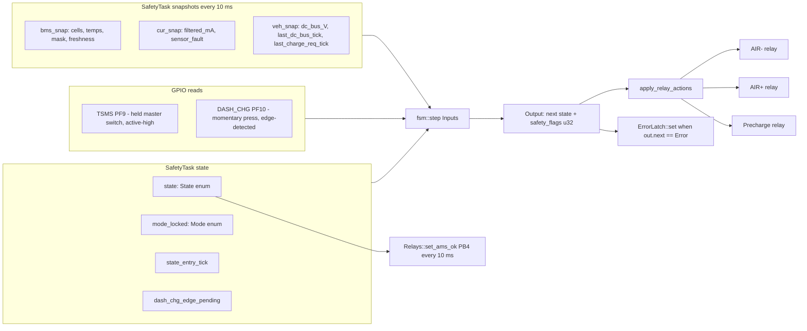
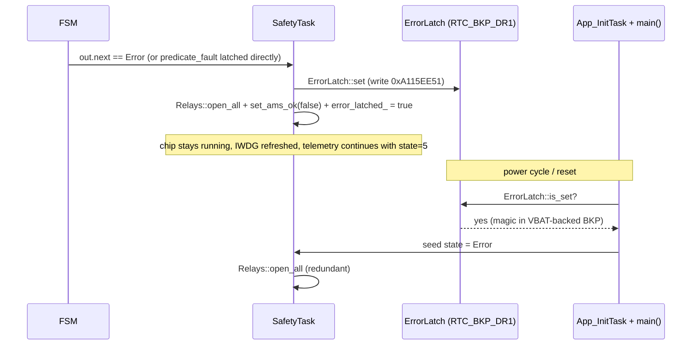

# AMS finite state machine — full overview

> **Living document** — matches `dev` as of the onboarding overhaul. Cross-check
> against `Core/Inc/app/state_machine.hpp` and `Core/Src/app/safety_task.cpp`
> if anything here looks stale; those two files are the ground truth.

The FSM is **stateless C++**, header-only, no FreeRTOS/HAL dependency, fully
host-unit-tested. `SafetyTask` calls `fsm::step(Inputs) → Output` every 20 ms
and acts on the returned relay-action bitmask inline. State lives in
`SafetyTask`'s stack frame, never in the FSM itself.

Sources: `Core/Inc/app/state_machine.hpp`, `Core/Inc/app/safety_predicates.hpp`,
`Core/Src/app/safety_task.cpp`, `Core/Inc/app/ams_config.hpp`,
`Core/Inc/app/ams_events.hpp`.

## Contents

1. [Where the FSM sits in the system](#1-where-the-fsm-sits-in-the-system)
2. [State alphabet — 6 states](#2-state-alphabet--6-states)
3. [The Mode enum — locked once per boot](#3-the-mode-enum--locked-once-per-boot)
4. [Inputs struct — what the FSM consumes](#4-inputs-struct--what-the-fsm-consumes)
5. [Output — next state + relay-action bitmask](#5-output--next-state--relay-action-bitmask)
6. [Two guards before the state switch](#6-two-guards-before-the-state-switch)
7. [Per-state transition logic](#7-per-state-transition-logic)
8. [Full state diagram](#8-full-state-diagram)
9. [Boot-time entry into the FSM](#9-boot-time-entry-into-the-fsm)
10. [Cadence interaction in SafetyTask](#10-cadence-interaction-in-safetytask)
11. [Sticky Error across reset](#11-sticky-error-across-reset)
12. [What you see on the wire per state](#12-what-you-see-on-the-wire-per-state)
13. [Unit-test coverage](#13-unit-test-coverage)
14. [Gotchas worth knowing](#14-gotchas-worth-knowing)

---

## 1. Where the FSM sits in the system

A single pure function. Inputs are gathered by `SafetyTask` once per 10 ms tick;
the FSM is stepped every 20 ms (every other tick); the output bitmask is applied
inline to the relay GPIOs in the same iteration. `SafetyTask` is the single
fault authority and the single owner of `state`, `mode_locked`, and
`state_entry_tick`.



`SafetyTask` also drives **AMS_OK (PB4)** — its leg of the shutdown circuit —
every 10 ms, independent of the 20 ms FSM cadence (see §12).

---

## 2. State alphabet — 6 states

| # | State | Meaning | AIR− | AIR+ | Precharge |
|---|-------|---------|------|------|-----------|
| 0 | `Start` | Idle. Pack present, AIRs open. Waiting for operator inputs. | open | open | open |
| 1 | `Precharge` | AIR− + Precharge closed. DC link charging through the precharge resistor. | CLOSED | open | CLOSED |
| 2 | `Transition` | AIR+ just closed, Precharge just opened. One-step passthrough to Run / Charge. | CLOSED | CLOSED | open |
| 3 | `Run` | Live, in the car. Terminal until reset/fault. | CLOSED | CLOSED | open |
| 4 | `Charge` | Live, on the charging station. Terminal until reset/fault. Balancing eligible here. | CLOSED | CLOSED | open |
| 5 | `Error` | Sticky fault. All relays open. Survives reset via ErrorLatch in `RTC_BKP_DR1` (magic `0xA115EE51`). | open | open | open |

> **Two mutually-exclusive contexts.** Run and Charge are *physically identical*
> in relay configuration (AIR−, AIR+ closed, Precharge open). Only the FSM state
> byte distinguishes them. Downstream policies — `BalanceController` in
> particular — gate on the FSM state, so reading `g_state_telemetry` is the
> contract, not the relay state.

---

## 3. The Mode enum — locked once per boot

```cpp
enum class Mode : std::uint8_t {
    Undecided = 0,    // before Start -> Precharge has fired
    Car       = 1,    // VCU 0x100 fresh at the trigger (Run target)
    Charger   = 2,    // fresh 0x101 charge request AND VCU absent (Charge target)
};
```

**Mode is set by `SafetyTask`, not by the FSM** — the FSM only consumes it.
Capture happens at the exact 20 ms iteration about to fire `Start → Precharge`:

```cpp
if (state == fsm::State::Start &&
    mode_locked == fsm::Mode::Undecided &&
    tsms && dash_chg_edge_pending) {
    const bool vcu_fresh =
        veh_snap.last_dc_bus_tick != 0u &&
        (now - veh_snap.last_dc_bus_tick) <= config::VcuFreshMs;     // 1000 ms
    const bool charge_req = VehicleService::charge_requested(
        now, veh_snap.last_charge_req_tick);                          // fresh 0x101 "CHRG"
    mode_locked = (charge_req && !vcu_fresh) ? fsm::Mode::Charger
                                             : fsm::Mode::Car;
}
```

- **`vcu_fresh`** — a `0x100` DC-bus heartbeat heard within `VcuFreshMs = 1000`.
- **`charge_req`** — a `0x101` charge-mode request (4-byte magic `"CHRG"`) heard
  within `ChargeReqFreshMs = 1000`.
- **Charger requires BOTH** an explicit fresh `0x101` request AND VCU absence.
  This removes the dead-VCU-car ambiguity: a car with a dead VCU never emits the
  request, so it locks **Car** and later faults on `VcuStale` rather than
  silently charging. A stray `0x101` while the VCU is live cannot flip a running
  car into Charger.

**Why decide externally?** Mode reflects a physical fact (is this pack wired into
a car or on a charger?). A pack can't move between the two while the AMS is
alive, so re-evaluating during Run/Charge would only let CAN noise mis-route the
FSM. Lock once, never re-evaluate.

**Why 1000 ms?** `VcuFreshMs` is looser than `VcuStaleMs = 200` (the predicate's
freshness gate) so a slow VCU bring-up doesn't misclassify a Car-wired pack as
Charger.

---

## 4. Inputs struct — what the FSM consumes

```cpp
struct Inputs {
    State               current;            // current FSM state
    const BmsState&     bms;                // single-writer snapshot from BmsService
    const CurrentState& current_sensor;     // single-writer snapshot from CurrentService
    const VehicleState& vehicle;            // single-writer snapshot from VehicleService
    bool                tsms;               // PF9 LEVEL readback (held master switch)
    bool                dash_chg_edge;      // PF10 one-shot RISING EDGE (momentary press)
    Mode                mode_locked;        // set by SafetyTask at Start -> Precharge
    bool                predicate_fault;    // SafetyTask's ALREADY-DEBOUNCED fault decision
    std::uint32_t       now_tick;
    std::uint32_t       state_entry_tick;   // tick the current state was entered
};
```

- **`tsms`** is a *level* — the held side-of-car master switch (PF9). It sustains
  Run/Charge; its drop exits them.
- **`dash_chg_edge`** is a **one-shot rising edge**, NOT a level. PF10 is a
  *momentary press button* (cockpit / charger "go"). `SafetyTask` edge-detects
  PF10 at the 10 ms cadence and latches the edge (`dash_chg_edge_pending`) until
  the 20 ms FSM step consumes it, so a press landing between FSM steps is never
  lost. The edge is cleared right after `fsm::step` runs. Run/Charge do **not**
  look at it — releasing it does not fault.
- **`predicate_fault`** is SafetyTask's already-debounced fault decision (#279).
  The FSM must **not** re-evaluate predicates itself (doing so bypassed the cell
  V/T debounce and latched `Error` at the boot-grace edge). `SafetyTask` only
  calls `step()` on a no-fault tick, so this is `false` in normal operation; the
  any-state→Error branch in the FSM is a kept backstop.
- **`now_tick − state_entry_tick`** is the dwell time in the current state. Used
  by `Precharge` for its `PrechargeMaxMs` deadline. `state_entry_tick` is updated
  atomically with `state` in `SafetyTask`, so the FSM always sees a
  self-consistent pair.

---

## 5. Output — next state + relay-action bitmask

```cpp
struct Output {
    State         next;
    std::uint32_t safety_flags;  // bitmask of events::safety::*
};
```

| Bit | Name | Effect |
|-----|------|--------|
| `1 << 0` | `ForceError` | Telemetry / latch marker. The safety effect comes from the `Open*` bits. |
| `1 << 1` | `CloseAirN` | close AIR− |
| `1 << 2` | `CloseAirP` | close AIR+ |
| `1 << 3` | `ClosePrecharge` | close precharge relay |
| `1 << 4` | `OpenAirN` | open AIR− |
| `1 << 5` | `OpenAirP` | open AIR+ |
| `1 << 6` | `OpenPrecharge` | open precharge relay |

`apply_relay_actions(out.safety_flags)` interprets each bit independently. There
is no atomic "all open" macro — the three `Open*` bits are set together on every
fault path. Open + close in the same mask for the same relay would be a bug; the
code is structured so no transition emits both.

---

## 6. Two guards before the state switch

### Guard 1 — sticky Error

```cpp
if (in.current == State::Error) {
    return { State::Error, events::safety::ForceError };
}
```

Once in Error, you stay. Returns *only* `ForceError` — no `Open*` bits, because
the relays were already opened at the original fault iteration. No point
re-issuing GPIO writes every 20 ms.

### Guard 2 — predicate fault trap

```cpp
if (in.predicate_fault) {
    return { State::Error,
             ForceError | OpenAirN | OpenAirP | OpenPrecharge };
}
```

Any predicate fault preempts the normal transition logic, from any state. Note
the FSM **consumes** SafetyTask's already-debounced `predicate_fault` flag — it
does **not** re-run the predicate. In normal operation `SafetyTask` latches the
fault and never calls `step()` on that tick, so this branch is a backstop.

### The predicate set (see `safety_predicates.hpp`)

Evaluated by `SafetyTask` every 10 ms via `safety::evaluate_fault_detail`:

- `force_error_set` — immediate, even during boot grace. **No live setter**
  (`constexpr bool force_error_set = false`); compiled out in flight builds.
- `now_tick < SafetyBootGraceMs (2000)` short-circuits the data-presence
  predicates to "no fault" while services warm up.
- BMS `module_online_mask != AllModulesMask (0x1F)` → `BmsModuleOffline`.
- Any module silent > `BmsStaleMs (1500)` → `BmsStale`.
- Cell V outside `[CellUnderVoltageMv = 2800, CellOverVoltageMv = 4200]` mV →
  `CellUnderVoltage` / `CellOverVoltage`. **Debounced.**
- Cell T outside `[CellUnderTempC = -10, CellOverTempC = 60]` °C →
  `CellUnderTemp` / `CellOverTemp`. **Debounced.**
- Current `sensor_fault` → `CurrentSensorFault`.
- Current stale > `IStaleMs (200)` → `CurrentStale`.
- `|filtered_mA| > CurrentMaxMa (200 A)` → `CurrentOverLimit`.
- VCU `0x100` stale > `VcuStaleMs (200)` → `VcuStale`, **only when committed to
  Car mode** (`vcu_required`). In Charger / pre-lock Undecided the VCU is
  expected absent, so its staleness is not a fault.

**Debounce:** the cell V/T *range* reasons must persist for
`CellFaultConfirmTicks = 30` consecutive evaluations (~300 ms, > one 250 ms
voltage poll) before they latch. A single torn-snapshot / unsettled-poll sample
never reaches the count. Immediate-danger predicates (force-error, BMS
offline/stale, current over-limit, VCU stale) latch on the first tick.

---

## 7. Per-state transition logic

### Start — waiting for operator

```cpp
if (in.tsms && in.dash_chg_edge) {
    return { State::Precharge, CloseAirN | ClosePrecharge };
}
return { State::Start, 0u };
```

- **Trigger:** TSMS *held* (level) **AND** a DASH_CHG *press* (rising edge), in
  both Car and Charger. The press is edge-detected, so the operator must
  deliberately press — not merely hold a level — to energise.
- **Action:** AIR− closes + Precharge closes → current flows through the
  precharge resistor into the DC link.
- **Mode capture is external.** `SafetyTask` locks `mode_locked` *before* calling
  `fsm::step()` on this exact iteration (see §3), so the FSM body sees the mode
  already locked when `Start → Precharge` fires.

### Precharge — charging the DC link

```cpp
// Bounded precharge (PrechargeMaxMs deadline).
if (in.now_tick - in.state_entry_tick > config::PrechargeMaxMs) {
    return { State::Error, ForceError | OpenAirN | OpenAirP | OpenPrecharge };
}
const bool precharge_done =
    (in.mode_locked == Mode::Charger)
        ? VehicleService::charge_requested(in.now_tick, in.vehicle.last_charge_req_tick)
        : precharge_target_reached(in.bms, in.vehicle);
if (precharge_done) {
    return { State::Transition, CloseAirP | OpenPrecharge };
}
return { State::Precharge, 0u };
```

Two exits:

1. **Deadline → Error.** If the bus doesn't reach the proceed criterion within
   `PrechargeMaxMs = 5000`, latch Error and open every contactor. This caps how
   long the precharge contactor + resistor are held closed (the resistor is rated
   for transient duty only) for *any* stuck-precharge cause — stuck contactor, no
   charger, bus fault, or a dead-VCU car that locked Charger and could otherwise
   sit forever. A normal precharge completes well under 1 s.
2. **Proceed → Transition** (AIR+ closes, precharge relay opens), via a
   **mode-specific** criterion:
   - **Car:** `precharge_target_reached` — the VCU-measured DC bus reached
     ≥ 95 % of pack voltage.
   - **Charger:** a **still-fresh `0x101` charge request**
     (`VehicleService::charge_requested`). The charger isn't in the inverter
     voltage loop and `dc_bus_V` is VCU-only (absent during a charge), so there
     is nothing to voltage-gate on; the charger auto-emits `0x101` at ≥ 2 Hz
     while connected. The single DASH_CHG press is the human "go"; `0x101`
     freshness is "charger connected and ready". If `0x101` goes stale before we
     proceed (charger unplugged / aborted), precharge holds and hits the
     `PrechargeMaxMs` deadline → Error, rather than closing AIR+ into a
     disconnected charger.

> **Note:** the `PrechargeMaxMs = 5000` deadline was re-added (#307). The
> Transition *hold timer* (`TransitionHoldMs`) stays removed — Transition is a
> one-step passthrough.

#### Precharge target math (Car)

```cpp
inline bool precharge_target_reached(const BmsState& bms,
                                     const VehicleState& veh) noexcept {
    if (bms.pack_voltage_mV == 0u) return false;                 // no-data guard
    const std::uint64_t bus_mV  = veh.dc_bus_V * 1000u;          // V -> mV
    const std::uint64_t pack_mV = bms.pack_voltage_mV;
    return bus_mV * 100u >= pack_mV * 95u;                       // bus >= 0.95 * pack
}
```

Entirely in mV with `uint64_t` intermediates — overflow-safe. The 0-mV guard
handles the boot case where `BmsPollTask` hasn't written yet; without it, a
zero-data pack would trivially satisfy `bus·100 ≥ 0·95` and jump straight to
Transition with no actual precharge.

### Transition — single-step passthrough

```cpp
// Car-only bus-still-up guard.
if (in.mode_locked == Mode::Car &&
    !precharge_target_reached(in.bms, in.vehicle)) {
    return { State::Error, ForceError | OpenAirN | OpenAirP | OpenPrecharge };
}
if (in.mode_locked == Mode::Car)     return { State::Run,    0u };
if (in.mode_locked == Mode::Charger) return { State::Charge, 0u };
return { State::Error, ForceError | OpenAirN | OpenAirP | OpenPrecharge };
```

- **Bus-still-up guard (Car only):** dc_bus must STILL be ≥ 95 % of pack on this
  exact step. A momentary droop right after the contactor swap (precharge opened,
  AIR+ closed) lands in Error rather than energising the tractive system on a
  degraded bus. The guard is **Car-only** because it relies on the VCU-measured
  `dc_bus_V`, which is absent during a charge; Charger commits to Charge directly.
- **Dispatch on `mode_locked`:** Car → Run, Charger → Charge. Both are zero-bit
  (AIR+ already closed, precharge already open on the entry edge).
- **One-step passthrough:** no hold timer. The next FSM tick (20 ms later)
  commits to Run or Charge.
- **`Undecided` here is a programming error** (Transition reached without going
  through Start). Treated as fault for safety.

### Run / Charge — sustained by TSMS alone

```cpp
// Run (Charge is identical):
if (!in.tsms) {
    return { State::Error, ForceError | OpenAirN | OpenAirP | OpenPrecharge };
}
return { State::Run /* or Charge */, 0u };
```

- **Only a TSMS drop exits Run/Charge.** TSMS is the held run interlock. Its drop
  latches a sticky Error and opens all relays (survives the power cycle).
- **DASH_CHG is NOT checked here.** It is a *momentary press* — low most of the
  time — so level-checking it would fault Run/Charge instantly. Releasing the
  DASH_CHG button does **not** fault.

### Error — defensive default

```cpp
case State::Error:
default:
    // Already handled at function entry; defensive default.
    return { State::Error, events::safety::ForceError };
```

Reached only if an out-of-enum-range `State` ever appears. Belt-and-braces
against undefined behaviour.

---

## 8. Full state diagram

```mermaid
stateDiagram-v2
    [*] --> Boot
    state boot_check <<choice>>
    Boot --> boot_check
    boot_check --> Start : ErrorLatch clear
    boot_check --> Error : ErrorLatch set (BKP1R magic survives reset)

    Start --> Precharge : tsms (held) AND dash_chg edge (press) / CloseAirN + ClosePrecharge ; mode locked by SafetyTask

    Precharge --> Transition : Car: dc_bus >= 95% pack_V ; Charger: fresh 0x101 request / CloseAirP + OpenPrecharge
    Precharge --> Error : now - entry > PrechargeMaxMs (5000)

    Transition --> Run : mode == Car (one-step passthrough)
    Transition --> Charge : mode == Charger (one-step passthrough)
    Transition --> Error : Car bus dropped, or mode == Undecided

    Run --> Error : NOT tsms (TSMS drop only)
    Charge --> Error : NOT tsms (TSMS drop only)

    Start --> Error : predicate fault
    Precharge --> Error : predicate fault
    Transition --> Error : predicate fault
    Run --> Error : predicate fault
    Charge --> Error : predicate fault

    Error --> [*] : reset (ErrorLatch survives)
```



Every transition to `Error` sets `ForceError | OpenAirN | OpenAirP |
OpenPrecharge`. Every other transition emits only the bits actually listed (most
are no-op zero-mask).

---

## 9. Boot-time entry into the FSM

```cpp
// SafetyTask::run() — init
const bool boot_in_error = ErrorLatch::is_set();
if (boot_in_error) {
    Relays::open_all();
    Relays::set_ams_ok(false);   // keep the SDC open at boot
    error_latched_ = true;
}
fsm::State state       = boot_in_error ? fsm::State::Error : fsm::State::Start;
fsm::Mode  mode_locked = fsm::Mode::Undecided;
```

| Latch state | FSM entry | Relays | Exit condition |
|-------------|-----------|--------|----------------|
| clean | `Start` | open | TSMS held + DASH_CHG pressed |
| set | `Error` | open (redundant-safe) | backup-domain power loss |
| set (HIL bench) | latch cleared at boot by `App_InitTask` under `-DAMS_HIL_CLEAR_ERROR_LATCH` → next boot enters `Start` | — | — |

> **HIL build deliberately violates the sticky-latch invariant.** On flight
> builds the ErrorLatch is sticky — once set, only physical backup-domain power
> loss clears it. Under `-DAMS_HIL_CLEAR_ERROR_LATCH` the latch is wiped on every
> boot (VBAT-backed BKP1R outlives bench power cycles for tens of seconds).
> **Never compile the latch-clear flag into a flight image.**

DASH_CHG edge tracking is seeded at boot from the live PF10 level so a button
held at boot doesn't fire a spurious edge:

```cpp
bool prev_dash_chg = (HAL_GPIO_ReadPin(DASH_CHG_GPIO_Port, DASH_CHG_Pin) == GPIO_PIN_SET);
bool dash_chg_edge_pending = false;
```

---

## 10. Cadence interaction in SafetyTask

- **Predicate** runs every 10 ms (`SafetyPeriodMs`) — every iteration.
- **`fsm::step`** runs every 20 ms (`StatePeriodMs`) — every other iteration.
- **DASH_CHG edge detect** runs every 10 ms; the edge is latched until the next
  20 ms FSM step consumes and clears it.
- **AMS_OK (PB4)** is driven every 10 ms — tracks the live latch state.
- **IWDG** refreshes on every clean iteration — including the latched-Error path,
  so the chip stays alive for diagnosis.
- **Telemetry** bursts every 500 ms (`TelemetryPeriodMs`), regardless of state.

```
tick (ms)   0    10    20    30    40    50    60    70    80    90   100
predicate   x     x     x     x     x     x     x     x     x     x     x
fsm::step   x           x           x           x           x           x
edge detect x     x     x     x     x     x     x     x     x     x     x
AMS_OK      x     x     x     x     x     x     x     x     x     x     x
IWDG        x     x     x     x     x     x     x     x     x     x     x
```

> **Predicate fires twice as fast as the FSM.** A sensor going out of range (and
> past its debounce, for cell V/T) causes relay-open within 10 ms, regardless of
> where in the 20 ms FSM cycle we are.

---

## 11. Sticky Error across reset



There are **two paths into Error**, both of which set the latch:

- **Predicate fault** — `SafetyTask` latches via `latch_error_()`, recording
  `g_fault_reason_telemetry` (the offending `FaultReason`) and
  `g_fault_detail_telemetry`.
- **FSM-driven Error** — precharge timeout or TSMS drop. When the FSM returns
  `Error`, `SafetyTask` sets the latch and, if no predicate reason was recorded,
  stamps `g_fault_reason_telemetry = 12` (`FsmError`).

VBAT keeps the backup domain alive across software resets, watchdog resets, and
brown-outs (so long as the VBAT cap holds). Only **full backup-domain power
loss** clears the latch in flight. On the bench, `App_InitTask` wipes it on every
boot under the HIL latch-clear flag.

---

## 12. What you see on the wire per state

`0x4A0[0]` (FSM state byte, via `g_state_telemetry`) is emitted every 500 ms in
the status frame:

| Byte | State | Bench-observable behaviour |
|------|-------|----------------------------|
| `0x00` | `Start` | idle; relays open; AMS_OK PB4 = HIGH (past grace, no error) |
| `0x01` | `Precharge` | DC bus rising toward 0.95·pack_V (Car) or awaiting fresh `0x101` (Charger); AIR− + Precharge closed; holds until proceed criterion or `PrechargeMaxMs` (5 s) → Error |
| `0x02` | `Transition` | one FSM step only; AIR− + AIR+ closed; precharge open |
| `0x03` | `Run` | steady state; live in car |
| `0x04` | `Charge` | steady state; on charging station; balancing eligible |
| `0x05` | `Error` | sticky; relays open; AMS_OK PB4 = LOW; telemetry continues for diagnosis |

### AMS_OK (PB4) — the AMS leg of the shutdown circuit (#301)

Driven actively every 10 ms:

```cpp
inline bool ams_ok_asserted(std::uint32_t now_tick, bool error_latched) noexcept {
    return (now_tick >= config::SafetyBootGraceMs) && !error_latched;
}
```

- **LOW during boot grace** (`now_tick < SafetyBootGraceMs = 2000`) — predicates
  are suppressed, so the SDC must not be enabled against unverified inputs.
- **HIGH when healthy** — past grace, no Error latched.
- **LOW the instant Error latches** — deasserts with the AIRs.

This is a behavioural change: the firmware previously never drove PB4, so the SDC
enable just decayed from its boot-default level.

### `fault_reason` on the pit-diag stream

When the AMS latches Error, the branch is surfaced on pit-diag `0x6C0`:

- `0x6C0[6]` = `FaultReason` (see `safety_predicates.hpp`):

  | Value | Reason | Value | Reason |
  |-------|--------|-------|--------|
  | 0 | None | 6 | CellUnderTemp |
  | 1 | ForceError | 7 | CellOverTemp |
  | 2 | BmsModuleOffline | 8 | CurrentSensorFault |
  | 3 | BmsStale | 9 | CurrentStale |
  | 4 | CellUnderVoltage | 10 | CurrentOverLimit |
  | 5 | CellOverVoltage | 11 | VcuStale |

  **`12` = `FsmError`** — reserved for FSM-driven Error (precharge timeout / TSMS
  drop), stamped by `SafetyTask`, not by the predicate.

- `0x6C0[7]` = detail byte (e.g. offending module index for BMS/cell faults,
  `0xFF` = `NoOffendingModule` / torn-snapshot fingerprint).

The cockpit input byte at `0x4A2[5]` carries a live snapshot: bit 7 sentinel,
bits 3:2 `mode_locked`, bit 1 TSMS readback, bit 0 DASH_CHG live level.

> **Diagnostic discrimination.** Byte `0x05` *and* sensible cell-V → chip alive,
> post-fault diag path. Byte `0x05` then telemetry goes silent → SafetyTask stuck
> (HardFault / stack overflow, not the latch). Different debug procedures.

---

## 13. Unit-test coverage

All tests run host-side (Unity), no FreeRTOS/HAL dependency. **182 host tests**
total across the suite; the FSM-specific files below were reworked for the
edge-detect / mode-specific-precharge behaviour.

### `tests/unit/test_state_machine.cpp`

Covers the pure `fsm::step` transitions:

- **Start gating (edge-aware):** stays in Start without TSMS or without the
  DASH_CHG edge; with TSMS only; with the edge only. Fires `Start → Precharge`
  (with `CloseAirN | ClosePrecharge`) only when TSMS is held AND the DASH_CHG
  edge is present.
- **Precharge (Car):** reaches target → Transition (`CloseAirP | OpenPrecharge`);
  stays below target.
- **Precharge (Charger):** `test_fsm_precharge_charger_proceeds_on_fresh_request`
  (fresh `0x101` → Transition) and
  `test_fsm_precharge_charger_holds_without_fresh_request` (stale → stays).
- **Precharge deadline:** `test_fsm_precharge_times_out_to_error` (past
  `PrechargeMaxMs` → Error + all `Open*`) and
  `test_fsm_precharge_holds_within_deadline`.
- **Transition:** commits to Run in Car mode, Charge in Charger mode; `Undecided`
  → Error (defensive); Car bus-drop → Error.
- **Run / Charge (TSMS-only interlock):**
  `test_fsm_run_to_error_on_tsms_drop`, `test_fsm_charge_to_error_on_tsms_drop`,
  and the release-tolerance tests `test_fsm_run_stays_on_dash_chg_release` /
  `test_fsm_charge_stays_on_dash_chg_release` (proving DASH_CHG release does NOT
  fault).
- **Guards:** `test_fsm_any_state_to_error_on_fault` (predicate fault from any
  state preempts) and `test_fsm_error_is_sticky`.

### `tests/unit/test_sil_scenarios.cpp`

End-to-end scenario harness driving multi-step runs:

- `test_sil_nominal_startup_to_run` — Start → Precharge → Transition → Run.
- `test_sil_bms_dropout_in_run` — BMS dropout mid-Run → Error.
- `test_sil_charger_path` — Start → Precharge → Transition → Charge via fresh
  `0x101`.
- `test_sil_charger_stale_request_times_out` — Charger precharge with a stale
  request hits `PrechargeMaxMs` → Error.
- `test_sil_tsms_drop_in_run_latches_error` — TSMS drop in Run latches Error with
  all `Open*` bits.

(The predicate, debounce, AMS_OK, and ErrorLatch logic are additionally covered
by their own dedicated unit-test files in `tests/unit/`.)

---

## 14. Gotchas worth knowing

1. **DASH_CHG is an edge, not a level.** `Start → Precharge` needs a *press*
   (rising edge of PF10) while TSMS is held. The edge is latched by `SafetyTask`
   between FSM steps and cleared after one step, so a single press drives at most
   one transition. Run/Charge ignore it entirely — releasing it does not fault.
2. **TSMS alone sustains Run/Charge.** Only a TSMS *level* drop exits Run/Charge.
   This is the run interlock; DASH_CHG is not level-checked in those states.
3. **Precharge has a deadline again.** `PrechargeMaxMs = 5000` (#307) caps the
   precharge-contactor hold time for any stuck cause. The Transition hold timer
   stays removed — Transition is a one-step passthrough.
4. **Charger precharge proceeds on a fresh `0x101`, not a second press and not
   `dc_bus`.** The Car path uses `dc_bus_V ≥ 95 % pack`; the Transition
   bus-still-up guard is Car-only.
5. **The FSM does not re-evaluate predicates.** It consumes SafetyTask's
   already-debounced `predicate_fault`. There is no live `force_error_set` setter
   (`constexpr false`, compiled out in flight). Cell V/T faults debounce over
   `CellFaultConfirmTicks = 30` (~300 ms).
6. **AMS_OK (PB4) is now actively driven** every 10 ms: LOW in boot grace, HIGH
   when healthy, LOW the instant Error latches.
7. **`Mode::Undecided` reaching Transition is a fault.** Defensive: any future
   path that skips Start force-Errors rather than silently defaulting to Car.
8. **The FSM doesn't know about boot grace.** That lives inside the predicate
   evaluation in `SafetyTask`. Bypass the predicate trap and the FSM will happily
   transition on garbage data.
9. **Run and Charge are physically identical in relay configuration.** Only the
   state byte distinguishes them. Downstream policies (`BalanceController`) gate
   on the FSM state — `g_state_telemetry` is the contract, not relay GPIO state.
10. **The 0-mV guard in `precharge_target_reached` is load-bearing.** Without it,
    a zero-data pack would trivially satisfy `bus·100 ≥ 0·95` and jump straight
    to Transition.
11. **State transitions are atomic with `state_entry_tick`.** `SafetyTask`
    updates both in the same iteration, so the FSM always sees a self-consistent
    pair — which the `PrechargeMaxMs` subtraction relies on (no underflow).
12. **`fault_reason = 12` (`FsmError`) flags FSM-driven Error** (precharge
    timeout / TSMS drop) on pit-diag `0x6C0[6]`, distinct from predicate faults
    `0..11`.
