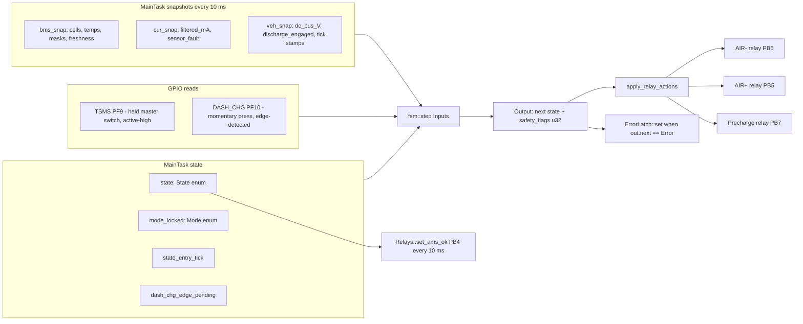

# AMS finite state machine — full overview

> **The code is the contract.** `Core/Inc/app/state_machine.hpp` is the FSM;
> `Core/Src/app/safety_task.cpp` is everything around it (inputs, mode lock,
> latching, relays). If this page and those files disagree, they are right.
> Every number quoted here lives in `Core/Inc/app/ams_config.hpp`.

The FSM is **stateless C++**, header-only, no FreeRTOS/HAL dependency, fully
host-unit-tested. `MainTask` calls `fsm::step(Inputs) → Output` every 20 ms and
acts on the returned relay-action bitmask inline. State lives in `MainTask`'s
stack frame, never in the FSM itself — `fsm::step` is a pure function of its
`Inputs`, which is exactly why the whole state graph can be tested on a laptop.

> **Naming.** The CubeMX thread is still called `SafetyTask` in `main.c` and
> `AMS.ioc`; the C++ class is `ams::SafetyTask`; the architecture docs call the
> collapsed 10 ms loop `MainTask`. All three are the same thread. This page says
> `MainTask` for the loop and `SafetyTask` for the class.

Sources: `Core/Inc/app/state_machine.hpp`, `Core/Inc/app/safety_predicates.hpp`,
`Core/Src/app/safety_task.cpp`, `Core/Inc/app/ams_config.hpp`,
`Core/Inc/app/ams_events.hpp`, `Core/Inc/app/vehicle_service.hpp`.

## Contents

1. [Where the FSM sits in the system](#1-where-the-fsm-sits-in-the-system)
2. [State alphabet — 6 states](#2-state-alphabet--6-states)
3. [The Mode enum — locked at arm, cleared at Start](#3-the-mode-enum--locked-at-arm-cleared-at-start)
4. [Inputs struct — what the FSM consumes](#4-inputs-struct--what-the-fsm-consumes)
5. [Output — next state + relay-action bitmask](#5-output--next-state--relay-action-bitmask)
6. [Three guards before the state switch](#6-three-guards-before-the-state-switch)
7. [The predicate set — the other way into Error](#7-the-predicate-set--the-other-way-into-error)
8. [The three FSM helper predicates](#8-the-three-fsm-helper-predicates)
9. [Per-state transition logic](#9-per-state-transition-logic)
10. [Full state diagram](#10-full-state-diagram)
11. [Boot-time entry into the FSM](#11-boot-time-entry-into-the-fsm)
12. [Cadence interaction in MainTask](#12-cadence-interaction-in-maintask)
13. [Sticky Error across reset](#13-sticky-error-across-reset)
14. [What you see on the wire per state](#14-what-you-see-on-the-wire-per-state)
15. [Unit-test coverage](#15-unit-test-coverage)
16. [Gotchas worth knowing](#16-gotchas-worth-knowing)

---

## 1. Where the FSM sits in the system

A single pure function. Inputs are gathered by `MainTask` once per 10 ms tick;
the FSM is stepped every 20 ms (every other tick); the output bitmask is applied
inline to the relay GPIOs in the same iteration. `MainTask` is the single fault
authority and the single owner of `state`, `mode_locked`, and `state_entry_tick`.



`MainTask` also drives **AMS_OK (PB4)** — its leg of the shutdown circuit —
every 10 ms, independent of the 20 ms FSM cadence (see §14).

---

## 2. State alphabet — 6 states

| # | State | Meaning | AIR− | AIR+ | Precharge |
|---|-------|---------|------|------|-----------|
| 0 | `Start` | Idle. Pack present, AIRs open. Waiting for operator inputs. | open | open | open |
| 1 | `Precharge` | AIR− closed. **Car:** precharge closed → DC link charges through the resistor. **Charger:** precharge stays open (resistor skipped — the charger voltage-matches). | CLOSED | open | CLOSED (Car) / open (Charger) |
| 2 | `Transition` | AIR+ just closed, Precharge just opened. One-step passthrough to Run / Charge. | CLOSED | CLOSED | open |
| 3 | `Run` | Live, in the car. | CLOSED | CLOSED | open |
| 4 | `Charge` | Live, on the charging station. Balancing eligible here. | CLOSED | CLOSED | open |
| 5 | `Error` | Sticky fault. All relays open, `AMS_OK` LOW. Survives a warm reset via `ErrorLatch` in `RTC_BKP_DR1` (magic `0xA115EE51`). | open | open | open |

> **Two mutually-exclusive contexts.** Run and Charge are *physically identical*
> in relay configuration (AIR−, AIR+ closed, Precharge open). Only the FSM state
> byte distinguishes them, and they exit differently: Run de-energises to Start
> on a TSMS drop, Charge **latches Error** (§6, Guard 3). Downstream policies
> read the state byte — `BmsPollTask` casts `g_state_telemetry` back to
> `fsm::State` and hands it to `balance::compute_mask`, so the *state byte* is
> the contract, not the relay GPIOs.

---

## 3. The Mode enum — locked at arm, cleared at Start

```cpp
enum class Mode : std::uint8_t {
    Undecided = 0,    // before Start -> Precharge has fired
    Car       = 1,    // Run target
    Charger   = 2,    // Charge target
};
```

**Mode is set by `MainTask`, not by the FSM** — the FSM only consumes it.
Capture happens at the exact 20 ms iteration about to fire `Start → Precharge`,
*before* `fsm::step` is called, so the FSM body already sees the locked mode:

```cpp
if (state == fsm::State::Start &&
    mode_locked == fsm::Mode::Undecided &&
    tsms && dash_chg_edge_pending) {
    const bool vcu_fresh =
        veh_snap.last_dc_bus_tick != 0u &&
        (now - veh_snap.last_dc_bus_tick) <= config::VcuFreshMs;     // 1000 ms
    const bool charge_req = VehicleService::charge_requested(
        now, veh_snap.last_charge_req_tick);                          // fresh 0x101 "CHRG"
    mode_locked = (charge_req && !vcu_fresh) ? fsm::Mode::Charger
                                             : fsm::Mode::Car;
}
```

- **`vcu_fresh`** — a `0x100` DC-bus heartbeat heard within `VcuFreshMs = 1000`.
- **`charge_req`** — a `0x101` charge-mode request (4-byte magic `"CHRG"`) heard
  within `ChargeReqFreshMs = 1000`.
- **Charger requires BOTH** an explicit fresh `0x101` request AND VCU absence.
  That removes the dead-VCU-car ambiguity: a car with a dead VCU never emits the
  request, so it locks **Car** and later faults on `VcuStale` rather than
  silently charging; and a stray `0x101` while the VCU is live cannot flip a
  running car into Charger.

> **Stale comment in the source.** The `Mode` enum comments in
> `state_machine.hpp` still describe Charger as "VCU `0x100` silent at the
> trigger" — i.e. VCU absence alone. That is not what `safety_task.cpp` does;
> the `0x101` request is also required. Trust `safety_task.cpp`.

**Why decide externally?** Mode reflects a physical fact — is this pack wired
into a car or sitting on a charger? A pack cannot move between the two while the
AMS is powered, so re-evaluating during Run/Charge would only let CAN noise
mis-route the FSM.

**Why is `VcuFreshMs` (1000) looser than `VcuStaleMs` (200)?** The mode lock has
to tolerate a slow VCU bring-up; the precharge criterion and the `VcuStale`
predicate must not. Using the tight window at the lock would classify a
still-booting car as a charger.

**Cleared on every return to Start.** When `out.next == State::Start` and the
state actually changed, `MainTask` resets `mode_locked = Undecided`. So a
re-arm after a TSMS drop or a bus collapse re-locks Car/Charger from scratch and
re-runs precharge — it never inherits the previous decision.

> **The one case where it is not cleared:** a *blocked* arm attempt (§9, Start).
> The mode lock has already run, but `fsm::step` returns `Start` — the same
> state — so `MainTask`'s "state changed" branch never executes and the mode
> stays locked. Consequence: `vcu_required` becomes true one tick later, so the
> `VcuStale` predicate arms while the car is still idle in Start. If the block
> was caused by a stale `0x100` in the first place, that latches Error rather
> than holding in Start. Unreachable today (see §8, `rearm_permitted`) but it is
> the first thing to check when the ECU half lands.

---

## 4. Inputs struct — what the FSM consumes

```cpp
struct Inputs {
    State               current;            // current FSM state
    const BmsState&     bms;                // single-writer snapshot from BmsService
    const CurrentState& current_sensor;     // single-writer snapshot from CurrentService
    const VehicleState& vehicle;            // single-writer snapshot from VehicleService
    bool                tsms;               // PF9 LEVEL (held master switch)
    bool                dash_chg_edge;      // PF10 one-shot RISING EDGE (momentary press)
    Mode                mode_locked;        // set by MainTask at Start -> Precharge
    bool                predicate_fault;    // MainTask's ALREADY-DEBOUNCED fault decision
    bool                bus_collapsed;      // MainTask-debounced dc_bus collapse (Car/Run only)
    bool                dc_bus_fresh;       // 0x100 heard within VcuStaleMs
    std::uint32_t       now_tick;
    std::uint32_t       state_entry_tick;   // tick the current state was entered
};
```

- **`tsms`** is a *level* — the held side-of-car master switch (PF9). It is also
  the AMS's only view of the shutdown circuit: any open SDC element pulls it low.
  It sustains every energised state; its drop exits them.
- **`dash_chg_edge`** is a **one-shot rising edge**, NOT a level. PF10 is a
  *momentary press button* (cockpit / charger "go"). `MainTask` edge-detects PF10
  at the 10 ms cadence and latches the edge (`dash_chg_edge_pending`) until the
  20 ms FSM step consumes it, so a press landing between FSM steps is never lost.
  The edge is cleared right after `fsm::step` runs — one press, at most one
  transition. Run/Charge do **not** look at it; releasing it does not fault.
- **`predicate_fault`** is `MainTask`'s already-debounced fault decision. The FSM
  must **not** re-evaluate predicates itself — doing so bypassed the cell V/T
  debounce and latched `Error` at the boot-grace edge. `MainTask` only calls
  `step()` on a no-fault tick, so this is `false` in normal operation; the
  any-state→Error branch in the FSM is a kept backstop.
- **`bus_collapsed`** is likewise pre-debounced, and `MainTask` only ever computes
  it in `Run` + `Car`; it is `false` in every other state.
- **`dc_bus_fresh`** is `last_dc_bus_tick != 0 && (now − last_dc_bus_tick) ≤
  VcuStaleMs (200)`. Note this is the *tight* window, not `VcuFreshMs`: it gates
  closing AIR+, so the same staleness that would raise `VcuStale` must also make
  `dc_bus_V` unreadable.
- **`now_tick − state_entry_tick`** is the dwell time in the current state, used
  by `Precharge` for its `PrechargeMaxMs` deadline. `state_entry_tick` is updated
  in the same iteration as `state`, so the FSM always sees a self-consistent
  pair and the subtraction can never underflow.

---

## 5. Output — next state + relay-action bitmask

```cpp
struct Output {
    State         next;
    std::uint32_t safety_flags;  // bitmask of events::safety::*
};
```

| Bit | Name | Effect |
|-----|------|--------|
| `1 << 0` | `ForceError` | Telemetry / latch marker. The safety effect comes from the `Open*` bits. |
| `1 << 1` | `CloseAirN` | close AIR− (PB6) |
| `1 << 2` | `CloseAirP` | close AIR+ (PB5) |
| `1 << 3` | `ClosePrecharge` | close precharge relay (PB7) |
| `1 << 4` | `OpenAirN` | open AIR− |
| `1 << 5` | `OpenAirP` | open AIR+ |
| `1 << 6` | `OpenPrecharge` | open precharge relay |

`apply_relay_actions(out.safety_flags)` interprets each bit independently, in the
order close-N, close-P, close-PRE, open-N, open-P, open-PRE. There is no atomic
"all open" macro — the three `Open*` bits are simply set together on every fault
path. Open + close in the same mask for the same relay would be a bug (the open
would win, by ordering); no transition emits both.

---

## 6. Three guards before the state switch

These run in order, before `switch (in.current)`. Order *is* the priority.

### Guard 1 — sticky Error

```cpp
if (in.current == State::Error) {
    return { State::Error, events::safety::ForceError };
}
```

Once in Error, you stay. Returns *only* `ForceError` — no `Open*` bits, because
the relays were already opened at the original fault iteration. Re-issuing the
GPIO writes every 20 ms would buy nothing.

### Guard 2 — predicate fault trap

```cpp
if (in.predicate_fault) {
    return { State::Error,
             ForceError | OpenAirN | OpenAirP | OpenPrecharge };
}
```

A predicate fault preempts the normal transition logic from any state. The FSM
**consumes** `MainTask`'s already-debounced flag; it does not re-run the
predicate set. In normal operation `MainTask` latches the fault and never calls
`step()` on that tick, so this branch is a backstop.

### Guard 3 — TSMS held: de-energise in Car, **latch in Charger**

```cpp
if (in.current != State::Start && in.current != State::Error && !in.tsms) {
    if (in.mode_locked == Mode::Charger) {
        return { State::Error,
                 ForceError | OpenAirN | OpenAirP | OpenPrecharge };
    }
    return { State::Start, OpenAirN | OpenAirP | OpenPrecharge };
}
```

TSMS (PF9) is the held master enable for **every energised state**
(`Precharge` / `Transition` / `Run` / `Charge`). What happens on its drop depends
on the locked mode, and the asymmetry is deliberate:

- **Car → `Start`, non-latching.** `AMS_OK` is untouched, `ErrorLatch` is not
  written. This is the FS rule that the driver must be able to stop and restart
  the tractive system from the cockpit, unaided. `AMS_OK` is the AMS's own SDC
  relay and sits **upstream** of TSMS in the loop: if a TSMS drop latched Error
  it would drop `AMS_OK`, opening that upstream relay, and re-closing TSMS could
  no longer restore the loop without a reset. So `AMS_OK` stays health-only and a
  TSMS drop just disarms. The driver re-arms with a DASH_CHG press, which
  re-locks the mode and re-runs precharge.
- **Charger → `Error`, latching.** The scrutineering sheet forbids re-activating
  the charger output once the shutdown circuit has opened, so the very property
  the Car case avoids is the one we want here: `AMS_OK` drops, the upstream SDC
  relay opens, and re-energising the charge path requires a full reset. This
  applies across every energised Charger state (`Precharge`, `Transition`,
  `Charge`). The latch is attributed as `ChargerTsmsOpen (15)`, not the generic
  `FsmError (12)` — see `safety::fsm_error_reason`.

Guard 3 sits *below* the predicate trap, so a genuine pack fault on the same tick
still wins and latches with its real reason.

---

## 7. The predicate set — the other way into Error

Evaluated by `MainTask` every 10 ms via `safety::evaluate_fault_detail`. **First
match wins**, so the reported `FaultReason` is the first branch in this order:

| # | Check | Reason | Debounced? |
|---|---|---|---|
| 0 | `force_error_set` — evaluated even during boot grace | `ForceError (1)` | no |
| — | `now_tick < SafetyBootGraceMs (2000)` → return "no fault" for **everything below** | — | — |
| 1 | `module_online_mask != AllModulesMask (0x1F)` | `BmsModuleOffline (2)` | no |
| 2 | any module silent > `BmsStaleMs (350)` | `BmsStale (3)` | **yes**, `BmsStaleConfirmTicks = 25` |
| 3 | `TempSensorPresenceCheck && temp_disconnect_mask != 0` | `TempSensorDisconnected (13)` | no |
| 4 | `CellOpenWireCheck && cell_open_mask != 0` | `CellOpenWire (16)` | no |
| 5 | `min_cell_mV < CellUnderVoltageMv (2800)` | `CellUnderVoltage (4)` | **yes**, `CellFaultConfirmTicks = 25` |
| 6 | `max_cell_mV > CellOverVoltageMv (4200)` | `CellOverVoltage (5)` | **yes**, same |
| 7 | `TempFaultsTrusted && min_tempC < CellUnderTempC (-10)` | `CellUnderTemp (6)` | **yes**, same |
| 8 | `TempFaultsTrusted && max_tempC > CellOverTempC (60)` | `CellOverTemp (7)` | **yes**, same |
| 9 | `current.sensor_fault` | `CurrentSensorFault (8)` | no |
| 10 | current stale > `IStaleMs (200)` | `CurrentStale (9)` | no |
| 11 | `abs(filtered_mA) > CurrentMaxMa (185 A)` | `CurrentOverLimit (10)` | no |
| 12 | `vcu_required` && `0x100` stale > `VcuStaleMs (200)` | `VcuStale (11)` | no |
| 13 | `charger_required` && `0x101` stale > `ChargerStaleMs (1000)` | `ChargerStale (14)` | no |

Things a newcomer gets wrong here:

- **Boot grace suppresses *everything* except `force_error_set`,** not just the
  freshness checks. Every service starts with `last_*_tick == 0`; without the
  grace, the first 10 ms iteration would fault, withhold the watchdog refresh,
  and IWDG-reset the chip before `BmsPollTask` had polled once.
- **Cell *temperature* faults are compiled out today.** `TempFaultsTrusted` is
  `false` because the NTC path runs through the ADG731 mux whose select word was
  wrong and is not yet validated on the flight harness. Cell *voltage*
  protection is unaffected, and the separate `TempSensorDisconnected` presence
  check is armed independently (an open NTC reads the rail regardless of
  calibration).
- **`VcuStale` and `ChargerStale` are mode-gated.** `vcu_required` is true only
  in Car mode, `charger_required` only in Charger. Both read the *previous*
  tick's `mode_locked` (the lock runs later in the loop), so each arms one tick
  after its mode is taken — harmless, because the corresponding heartbeat is
  fresh by construction at the moment of the lock. Without the `vcu_required`
  gate Charger mode would be unreachable: the lock needs the VCU silent for
  `VcuFreshMs (1000)`, but an ungated `VcuStale (200)` would latch Error first.
- **`ChargerStale` is the fault that ends a charge session** when the charger is
  unplugged. It is the only way out of `Charge` that is not a TSMS drop.
- **Debounce arithmetic.** Cell V/T range reasons must persist for
  `CellFaultConfirmTicks = 25` consecutive evaluations (~250 ms), which spans
  more than one `BmsPollVoltMs = 200` voltage poll — so a torn lock-free snapshot
  or one unsettled poll can never latch. Worst-case detection is therefore
  ~200 ms (next poll) + ~250 ms (confirm) + 10 ms (tick) ≈ **460 ms**, sized
  against the < 500 ms FS budget. Change either number and redo that arithmetic.
- **`BmsStale` is also debounced now** (`BmsStaleConfirmTicks = 25`), but it is
  the *secondary* path: a genuinely lost module drops off `module_online_mask`
  first and fires the undebounced `BmsModuleOffline` at ~410 ms worst case.

---

## 8. The three FSM helper predicates

All three live in `state_machine.hpp` and are pure — they are the interesting
part of the FSM, and each exists because of a specific way the naive version
fails.

### `precharge_target_reached(bms, veh, dc_bus_fresh)`

```cpp
if (!dc_bus_fresh) return false;
if (bms.pack_voltage_mV == 0u) return false;                 // no-data guard
const std::uint64_t bus_mV  = veh.dc_bus_V * 1000u;          // V -> mV
const std::uint64_t pack_mV = bms.pack_voltage_mV;
return bus_mV * 100u >= pack_mV * 95u;                       // bus >= 0.95 * pack
```

Three separate things are load-bearing:

1. **Freshness is part of the criterion, not a separate fault.** `VehicleState`
   holds the *last received* `dc_bus_V`, so when the VCU stops publishing `0x100`
   the number does not disappear — it **freezes**. Frozen at pack voltage it
   satisfies the 95 % test forever, including after the link has actually bled to
   zero, where closing AIR+ means full pack voltage across the contactor with
   nothing limiting the inrush. `VcuStale` does catch a dead VCU but cannot catch
   it *in time*: it is gated on `vcu_required` (false in Start, so the value may
   already be arbitrarily old when the operator presses) and needs 200 ms, while
   the FSM steps every 20 ms — the frozen reading would fire
   `Precharge → Transition` roughly ten steps before the fault could reopen the
   AIRs.
2. **The 0 mV pack guard.** `pack_voltage_mV` is 0 until `BmsPollTask` has
   written one cycle; without the guard, a zero-data pack trivially satisfies
   `bus·100 ≥ 0·95` and jumps straight to Transition with no actual precharge. A
   real pack can never read 0 mV in service, so 0 reliably means "no data".
3. **Everything in mV, `uint64_t` intermediates.** Comparing in volts would
   truncate a sub-1 V pack to 0 and silently bypass the no-data guard.

> The 95 % ratio is a **literal in this function**. `config::PrechargeRatio`
> (0.95f) exists but is read by nothing in `Core/` — editing it changes no
> behaviour. Change the literal, or wire the constant up.

### `rearm_permitted(veh, dc_bus_fresh, mode_locked)`

```cpp
if (mode_locked == Mode::Charger)      return true;
if (veh.discharge_engaged)             return false;
if (!veh.ecu_discharge_capable)        return true;
return dc_bus_fresh && veh.dc_bus_V <= config::DcBusDischargedV;   // 60 V
```

The DC-link discharge is a **hardware** interlock the AMS cannot drive. The bleed
relay is normally-closed and wired into the SDC with no software control: opening
the shutdown circuit de-energises it, the bleed connects, and the link drains —
but closing the SDC again re-energises the relay and the discharge **stops
part-way**, stranding the link at a voltage nobody can predict from how long ago
the SDC was cycled. The AMS cannot restart it: `AMS_OK` latches in *hardware*
(a self-holding relay plus an `RST_BMS` button the driver cannot reach), so
firmware can never pulse its own leg of the loop low.

So the AMS publishes what only it can see and lets the ECU act:

- **`0x021 ACU_discharge_interlock`** (bit 0 `fsm_in_start`, bit 1 `tsms`) at
  `EcuMidTxMs = 100` ms. Raw observations, not a request — the ECU owns the
  decision because it owns the DC-link measurement that decides it, and shipping
  a pre-computed request would put a stale CAN value in the middle of that
  judgement. The ECU secures the discharge on
  `fsm_in_start AND tsms AND (its own dc_bus > threshold)`, **latched** on entry:
  securing the discharge connects the bleed, which is what `tsms` reports on, so
  evaluating it continuously would let the action falsify its own trigger.
- **`0x100` byte 2 bit 0 `discharge_engaged`** is consumed back, and it is the
  hard interlock: with the SDC closed and the bleed connected, closing any AIR
  puts pack current through a resistor rated for transient duty only.

The two refusal reasons are separate because they fail differently:

| reason | why |
|---|---|
| `discharge_engaged` | the bleed resistor is **connected**. Honoured whatever the voltage reads. |
| `dc_bus_V > DcBusDischargedV (60 V)` | the link is still charged, so a precharge would be a **no-op**: the 95 % criterion is already true on entry and the resistor never does anything. That 95 % check is the AMS's only evidence that the precharge resistor and contactor work; satisfied by residual charge it proves nothing. |

`DcBusDischargedV` is absolute volts, not a fraction of pack, because it is the
touch-safe DC limit from the rulebook and does not scale with pack voltage. It
must sit at or above the ECU's own release threshold, or the two ends disagree
about the boundary and the AMS waits on a link the ECU stopped draining.

Two escape hatches, both deliberate:

- **The voltage block is only enforced once `ecu_discharge_capable` latches** —
  set the first time an `0x100` arrives with DLC ≥ 3. An ECU that predates the
  protocol can neither report the bleed state nor drain a stranded link, so
  enforcing the block against it would brick the car rather than protect it.
- **A stale `0x100` blocks on the voltage reason but not on the bleed reason.**
  An unknown voltage is not a discharged one; an unknown bleed state is better
  left to the normal fault path than to refusing to arm forever.
- **Charger is exempt entirely** — the inverter is not in the charge loop and
  `dc_bus_V` is VCU-only, absent during a charge, so gating it would make Charger
  unarmable.

> **Whether `rearm_permitted` can refuse depends on the ECU image.**
> `IFS08-CE-ECU` `dev` sends `0x100` at DLC 3, so `ecu_discharge_capable`
> latches and both refusals are live. ECU `main` still sends DLC 2: the bit
> reads 0, the latch never sets, and `rearm_permitted` returns `true`
> unconditionally. **Watch the DLC of `0x100` on the bus** — DLC 2 means the
> interlock is inert.
>
> Neither path has been exercised on hardware. The AMS side is verified only by
> `tests/unit/test_state_machine.cpp` and the ECU side only by its SIL.

### `bus_below_collapse(bms, veh)`

```cpp
if (bms.pack_voltage_mV == 0u) return false;
return bus_mV * 100u < pack_mV * config::BusCollapsePercent;      // 50 %
```

Same mV comparison as the precharge target, against the much looser
`BusCollapsePercent = 50`. `MainTask` calls it only when `state == Run &&
mode_locked == Car`, counts consecutive collapsed 10 ms ticks up to
`BusCollapseConfirmTicks = 20` (~200 ms), and hands the FSM the confirmed
boolean. Any non-qualifying tick resets the count.

It deliberately does **not** take `dc_bus_fresh`, and the reasoning is worth
internalising: it only runs in Run, where mode is locked to Car, so
`vcu_required` is true and `VcuStale` bounds the staleness at 200 ms — the same
200 ms its own debounce already spends. Both of its stale outcomes are safe (a
false collapse de-energises to Start without latching; a missed one is caught by
`VcuStale`), so unlike `precharge_target_reached` it has no race to lose.

Both percentages are `COMMISSION`: 50 % must sit below the worst-case loaded sag
of `dc_bus_V` against the cell sum (false-trip immunity) yet high enough to trip
before the link discharges enough to make an unprecharged reclose damaging.

---

## 9. Per-state transition logic

### Start — waiting for operator

```cpp
if (in.tsms && in.dash_chg_edge) {
    if (!rearm_permitted(in.vehicle, in.dc_bus_fresh, in.mode_locked)) {
        return { State::Start, 0u };
    }
    const std::uint32_t connect =
        (in.mode_locked == Mode::Charger)
            ? CloseAirN                       // charger: skip the resistor
            : (CloseAirN | ClosePrecharge);   // car: resistor precharge
    return { State::Precharge, connect };
}
return { State::Start, 0u };
```

- **Trigger:** TSMS *held* (level) **AND** a DASH_CHG *press* (rising edge), in
  both Car and Charger. The press is edge-detected so the operator must
  deliberately press — not merely leave a level high — to energise.
- **Blocking holds in Start, it does not latch.** The driver waits out the
  discharge and presses again; no reset. But **the press is consumed on a blocked
  attempt**, deliberately: carrying it forward would let a press made while the
  link was live arm the car by itself seconds later, when the discharge finally
  completes and nobody is expecting it.
- **Action (Car):** AIR− closes + Precharge closes → current flows through the
  precharge resistor into the inverter DC link.
- **Action (Charger):** AIR− closes **only** — the resistor is *skipped*. The
  charger voltage-matches its output to the pack before it asserts `0x101`, so
  closing AIR+ on the proceed has no inrush; and because the precharge contactor
  sits in **parallel with AIR+**, closing it while the charger sources current
  would route the full charge current through the transient-rated resistor.
  `Undecided` (which should never reach here) falls back to the conservative
  resistor path.

### Precharge — charging the DC link

```cpp
if (in.now_tick - in.state_entry_tick > config::PrechargeMaxMs) {   // 5000 ms
    return { State::Error, ForceError | OpenAirN | OpenAirP | OpenPrecharge };
}
const bool precharge_done =
    (in.mode_locked == Mode::Charger)
        ? VehicleService::charge_requested(in.now_tick, in.vehicle.last_charge_req_tick)
        : precharge_target_reached(in.bms, in.vehicle, in.dc_bus_fresh);
if (precharge_done) {
    return { State::Transition, CloseAirP | OpenPrecharge };
}
return { State::Precharge, 0u };
```

Three exits (the third is Guard 3, above the switch): TSMS drop → `Start` in Car
/ `Error` in Charger.

1. **Deadline → Error.** If the proceed criterion is not met within
   `PrechargeMaxMs = 5000`, latch Error and open every contactor. This bounds how
   long the precharge contactor + resistor are held closed for *any* stuck cause
   — stuck contactor, no charger, bus fault, or a dead-VCU car that locked
   Charger and could otherwise sit here forever (`dc_bus_V` only ever comes from
   the VCU's `0x100`). A normal precharge completes well under 1 s; 5 s is the
   failsafe ceiling and is `COMMISSION`-tagged against the resistor's thermal
   limit.
2. **Proceed → Transition** (AIR+ closes, precharge relay opens), via a
   **mode-specific** criterion:
   - **Car:** `precharge_target_reached` — VCU-measured DC bus ≥ 95 % of pack,
     on a *fresh* `0x100`.
   - **Charger:** a **still-fresh `0x101` charge request**. The charger is not in
     the inverter voltage loop and `dc_bus_V` is VCU-only, so there is nothing to
     voltage-gate on; the charger soft-starts its own output, and the
     charger-side tool re-sends `0x101` at ≥ 2 Hz while it is connected. The
     single DASH_CHG press is the human
     "go"; `0x101` freshness is "charger connected and ready". If `0x101` goes
     stale before we proceed (unplugged / aborted), precharge holds and hits the
     deadline → Error, rather than closing AIR+ into a disconnected charger.

### Transition — single-step passthrough

```cpp
if (in.mode_locked == Mode::Car &&
    !precharge_target_reached(in.bms, in.vehicle, in.dc_bus_fresh)) {
    return { State::Error, ForceError | OpenAirN | OpenAirP | OpenPrecharge };
}
if (in.mode_locked == Mode::Car)     return { State::Run,    0u };
if (in.mode_locked == Mode::Charger) return { State::Charge, 0u };
return { State::Error, ForceError | OpenAirN | OpenAirP | OpenPrecharge };
```

- **Bus-still-up guard (Car only):** the bus must *still* be ≥ 95 % of pack on
  this exact step. A failed contactor swap — the bus slumps the moment the
  precharge contactor opens and AIR+ takes over — lands in Error instead of
  energising the tractive system on a degraded bus. Car-only because it relies on
  the VCU-measured `dc_bus_V`, absent during a charge; Charger commits directly.
- **One-step passthrough:** no hold timer. The relay swap was already emitted on
  the `Precharge → Transition` edge, so the dispatch here is zero-bit.
- **`Undecided` here is a programming error** (Transition reached without going
  through Start). Treated as a fault rather than silently defaulting to Car.

### Run — sustained by TSMS, watched for external AIR opening

```cpp
if (in.bus_collapsed) {
    return { State::Start, OpenAirN | OpenAirP | OpenPrecharge };  // non-latching
}
return { State::Run, 0u };
```

- **AIRs opened externally → de-energise to Start.** A cockpit SDC shutdown opens
  the AIRs without the AMS sensing it — but the VCU keeps reporting `dc_bus_V`,
  so a sustained collapse below `BusCollapsePercent` of pack means the contactors
  are physically open while the FSM still thinks it is in Run. Falling back to
  `Start` (non-latching, `AMS_OK` untouched) means a re-arm re-runs precharge
  instead of re-closing AIR+ onto a discharged DC link when the shutdown is
  released.
- **A TSMS drop** is handled by Guard 3 above the switch → `Start`, non-latching.
- **DASH_CHG is NOT checked here.** It is a momentary press — low most of the
  time — so level-checking it would fault Run instantly.

### Charge — sustained by TSMS and the charger heartbeat

```cpp
return { State::Charge, 0u };
```

The FSM body does nothing. Beyond the generic predicate trap (Guard 2), Charge
has two exits of its own — and neither is in this function:

- **TSMS drop → `Error`, latching** (Guard 3, Charger branch; reason
  `ChargerTsmsOpen = 15`).
- **`0x101` stale > `ChargerStaleMs (1000)` → `Error`** via the `ChargerStale`
  predicate (reason 14) — the charger was unplugged mid-charge. 1000 ms tolerates
  one missed heartbeat from a ≥ 2 Hz sender; charging is not a 10 ms-critical
  response, so this trades reaction time for immunity to a single dropped frame.

`bus_collapsed` is never true in Charge — `MainTask` only computes it in Run+Car.

### Error — defensive default

```cpp
case State::Error:
default:
    return { State::Error, events::safety::ForceError };
```

Reached only if an out-of-enum-range `State` ever appears. Belt-and-braces
against undefined behaviour.

---

## 10. Full state diagram

```mermaid
stateDiagram-v2
    [*] --> Boot
    state boot_check <<choice>>
    Boot --> boot_check
    boot_check --> Start : ErrorLatch clear
    boot_check --> Error : ErrorLatch set (BKP1R magic survives warm reset)

    Start --> Precharge : tsms held AND dash_chg edge AND rearm_permitted / CloseAirN (+ClosePrecharge in Car) ; mode locked by MainTask
    Start --> Start : rearm_permitted false (press consumed, no latch)

    Precharge --> Transition : Car: fresh 0x100 AND dc_bus >= 95% pack ; Charger: fresh 0x101 / CloseAirP + OpenPrecharge
    Precharge --> Error : now - entry > PrechargeMaxMs (5000)

    Transition --> Run : mode == Car (one-step passthrough)
    Transition --> Charge : mode == Charger (one-step passthrough)
    Transition --> Error : Car bus dropped, or mode == Undecided

    Run --> Start : NOT tsms (non-latching de-energise, mode cleared)
    Run --> Start : bus_collapsed (AIRs opened externally, non-latching)

    Charge --> Error : NOT tsms (LATCHES -- ChargerTsmsOpen)
    Charge --> Error : 0x101 stale > ChargerStaleMs (ChargerStale predicate)

    Precharge --> Start : NOT tsms in Car mode
    Precharge --> Error : NOT tsms in Charger mode
    Transition --> Start : NOT tsms in Car mode
    Transition --> Error : NOT tsms in Charger mode

    Start --> Error : predicate fault
    Precharge --> Error : predicate fault
    Transition --> Error : predicate fault
    Run --> Error : predicate fault
    Charge --> Error : predicate fault

    Error --> [*] : reset (ErrorLatch survives a warm reset)
```



Every transition to `Error` sets `ForceError | OpenAirN | OpenAirP |
OpenPrecharge` (the sticky-Error guard, which re-enters Error from Error, is the
one exception — it emits `ForceError` alone). Every other transition emits only
the bits listed; most are a zero mask.

---

## 11. Boot-time entry into the FSM

```cpp
// SafetyTask::run() — init
const bool boot_in_error = ErrorLatch::is_set();
if (boot_in_error) {
    Relays::open_all();
    Relays::set_ams_ok(false);   // keep the SDC open at boot
    error_latched_ = true;
}
fsm::State state       = boot_in_error ? fsm::State::Error : fsm::State::Start;
fsm::Mode  mode_locked = fsm::Mode::Undecided;
```

| Latch state | FSM entry | Relays | Exit condition |
|-------------|-----------|--------|----------------|
| clean | `Start` | open | TSMS held + DASH_CHG pressed |
| set | `Error` | open (redundant-safe) | backup-domain power loss |
| set (HIL bench) | latch cleared at boot by `App_InitTask` under `-DAMS_HIL_CLEAR_ERROR_LATCH` → comes up in `Start` | — | — |

> **The HIL build deliberately violates the sticky-latch invariant.** On flight
> builds the `ErrorLatch` is sticky — once set, only a loss of the backup-domain
> rail clears it. Under `-DAMS_HIL_CLEAR_ERROR_LATCH` the latch is wiped on every
> boot. **Never compile that flag into a flight image.** See `docs/HIL_BUILD.md`.

DASH_CHG edge tracking is seeded at boot from the live PF10 level, so a button
held down at boot does not fire a spurious edge:

```cpp
bool prev_dash_chg = (HAL_GPIO_ReadPin(DASH_CHG_GPIO_Port, DASH_CHG_Pin) == GPIO_PIN_SET);
bool dash_chg_edge_pending = false;
```

---

## 12. Cadence interaction in MainTask

- **Predicate** runs every 10 ms (`SafetyPeriodMs`) — every iteration.
- **`fsm::step`** runs every 20 ms (`StatePeriodMs`) — every other iteration.
- **DASH_CHG edge detect** runs every 10 ms; the edge is latched until the next
  20 ms FSM step consumes and clears it.
- **AMS_OK (PB4)** is driven every 10 ms — tracks the live latch state.
- **IWDG** refreshes on every iteration, fault path included, so a latched board
  stays alive for diagnosis instead of watchdog-looping.
- **Telemetry** bursts every 500 ms (`TelemetryPeriodMs`), `0x4A4` relay status
  every 100 ms (`RelayStatusPeriodMs`), and a datalog record is pushed every
  250 ms (`LogSamplePeriodMs`) — all regardless of state.

```
tick (ms)   0    10    20    30    40    50    60    70    80    90   100
predicate   x     x     x     x     x     x     x     x     x     x     x
fsm::step   x           x           x           x           x           x
edge detect x     x     x     x     x     x     x     x     x     x     x
AMS_OK      x     x     x     x     x     x     x     x     x     x     x
IWDG        x     x     x     x     x     x     x     x     x     x     x
```

> **The predicate fires twice as fast as the FSM.** A sensor going out of range
> (and past its debounce, for cell V/T) opens the relays within 10 ms, regardless
> of where in the 20 ms FSM cycle we are — the fault path does not wait for a
> step.

---

## 13. Sticky Error across reset


There are **three** paths that set the latch:

- **Predicate fault** — `MainTask` calls `latch_error_()`, first recording
  `g_fault_reason_telemetry` (the offending `FaultReason`) and
  `g_fault_detail_telemetry` (offending module index or mask).
- **FSM-driven Error** — precharge timeout, a Transition guard, or a Charger
  TSMS drop. When `fsm::step` returns `Error` and no predicate reason was already
  recorded, `MainTask` stamps `safety::fsm_error_reason(charger_mode, tsms)`,
  which yields `ChargerTsmsOpen (15)` for the Charger TSMS case and
  `FsmError (12)` otherwise.
- **Boot-time LTC chain discovery failure** — `App_InitTask` reads `RDCFGA` over
  isoSPI and counts PEC-valid segments; if that is not the full
  `LtcChainLength`, it sets the latch and opens all relays *before* `MainTask`
  ever runs, so the FSM comes up already in Error.

The VDD-fed backup domain keeps the flag across **warm** resets (software/NVIC,
watchdog, reset-pin) but **NOT** across a full LV power-cycle or a VDD-collapsing
brown-out: this carrier has no VBAT source. That is accepted by design — a latch
must outlive the watchdog reset a fault may cause, while a deliberate
power-cycle is the manual reset, and a persistent fault simply re-latches on the
next post-grace evaluation.

---

## 14. What you see on the wire per state

`0x4A0[0] AMS_status.fsm_state` (from `g_state_telemetry`) is emitted every
500 ms:

| Byte | State | Bench-observable behaviour |
|------|-------|----------------------------|
| `0x00` | `Start` | idle; relays open; AMS_OK PB4 = HIGH (past grace, no error) |
| `0x01` | `Precharge` | Car: DC bus rising toward 0.95·pack; Charger: awaiting fresh `0x101`. AIR− closed (+ precharge in Car); holds until proceed or `PrechargeMaxMs` (5 s) → Error |
| `0x02` | `Transition` | one FSM step only; AIR− + AIR+ closed; precharge open |
| `0x03` | `Run` | steady state; live in car |
| `0x04` | `Charge` | steady state; on the charging station; balancing eligible |
| `0x05` | `Error` | sticky; relays open; AMS_OK PB4 = LOW; telemetry continues for diagnosis |

Related frames, all driven off the same state byte:

- **`0x020 ACU_ok_precharge`** — 1 iff the state byte is `Run` or `Charge`.
- **`0x021 ACU_discharge_interlock`** — bit 0 `fsm_in_start` (state byte == 0),
  bit 1 `tsms`, at 100 ms. See §8.
- **`0x4A4 AMS_relay_status`** at 100 ms — AIR−/AIR+/precharge/AMS_OK read-backs.
  These are **ODR read-backs**: they confirm what the firmware drives the coils
  to, not that a contactor physically closed.
- **`0x4A2[5]`** — cockpit input snapshot: bit 7 sentinel (always 1, so a
  consumer can tell "live byte" from "elided by older firmware"), bits 3:2
  `mode_locked`, bit 1 TSMS readback, bit 0 DASH_CHG *live level*.

### AMS_OK (PB4) — the AMS leg of the shutdown circuit

Driven actively every 10 ms:

```cpp
inline bool ams_ok_asserted(std::uint32_t now_tick, bool error_latched) noexcept {
    return (now_tick >= config::SafetyBootGraceMs) && !error_latched;
}
```

- **LOW during boot grace** (`now_tick < SafetyBootGraceMs = 2000`) — the
  predicates are suppressed there, so the SDC must not be enabled against
  unverified inputs.
- **HIGH when healthy** — past grace, no Error latched.
- **LOW the instant Error latches** — deasserts with the AIRs.

Note it is driven by *health only*: no FSM state and no TSMS level appears in
that expression. That is the property Guard 3 relies on (§6).

### `fault_reason` on the pit-diag stream

`0x6C0 PIT_fsm_status` byte 6 carries the `FaultReason`, byte 7 the detail:

| Value | Reason | Value | Reason |
|-------|--------|-------|--------|
| 0 | None | 9 | CurrentStale |
| 1 | ForceError | 10 | CurrentOverLimit |
| 2 | BmsModuleOffline | 11 | VcuStale |
| 3 | BmsStale | 12 | **FsmError** (no enum slot — bare constant) |
| 4 | CellUnderVoltage | 13 | TempSensorDisconnected |
| 5 | CellOverVoltage | 14 | ChargerStale |
| 6 | CellUnderTemp | 15 | ChargerTsmsOpen |
| 7 | CellOverTemp | 16 | CellOpenWire |
| 8 | CurrentSensorFault | | |

Values are an **append-only wire contract** — never renumber them. `12` is
reserved for the FSM-driven path and is stamped by `MainTask`, not by the
predicate set; `15` is the FSM-driven Charger-TSMS latch. The detail byte is the
offending module index (BmsStale), a module mask (BmsModuleOffline,
TempSensorDisconnected, CellOpenWire), or `0xFF` = `NoOffendingModule` — which,
when a summary threshold *did* trip, is the fingerprint of a torn lock-free
snapshot read rather than a real module.

The rest of `0x6C0`: byte 0 fsm_state, byte 1 mode_locked, byte 2 bits
dash_chg / tsms / balance_override, byte 3 AMS_OK GPIO, bytes 4-5 PEC error total.

> **Diagnostic discrimination.** State byte `0x05` *and* sensible cell voltages →
> the chip is alive on the post-fault diagnostic path. State byte `0x05` and then
> telemetry goes silent → `MainTask` is stuck (HardFault / stack overflow), not
> the latch. Different debug procedures; `0x6CA` firmware-health is ungated and
> answers "is the app alive?" without arming pit-diag.

---

## 15. Unit-test coverage

All tests run host-side (Unity), no FreeRTOS/HAL dependency. Running
`./build-tests/ams_unit_tests` directly prints the real total — currently
**473 Tests 0 Failures 0 Ignored**. (`ctest` reports `1/1 Test ... Passed`;
that is the single Unity *runner*, not the case count.)

### `tests/unit/test_state_machine.cpp`

Covers the pure `fsm::step` transitions:

- **Start gating (edge-aware):** stays in Start without TSMS, without the edge,
  or with only one of the two; fires `Start → Precharge` with `CloseAirN`
  (+ `ClosePrecharge` in Car, *not* in Charger) only when both are present.
- **Precharge (Car):** reaches target → Transition (`CloseAirP | OpenPrecharge`);
  stays below target; `test_fsm_precharge_rejects_stale_bus_reading` proves a
  frozen `dc_bus_V` does **not** satisfy the criterion.
- **Precharge (Charger):** proceeds on a fresh `0x101`, holds without one, and
  `test_fsm_charger_precharge_unaffected_by_stale_bus` proves the bus freshness
  requirement is Car-only.
- **Precharge deadline:** times out to Error with all `Open*`; holds within it.
- **Transition:** commits to Run/Charge by mode; `Undecided` → Error; Car bus
  drop → Error; `test_fsm_transition_rejects_stale_bus_reading`.
- **TSMS asymmetry:** `test_fsm_run_to_start_on_tsms_drop`,
  `test_fsm_precharge_to_start_on_tsms_drop` (Car, non-latching) versus
  `test_fsm_charge_to_error_on_tsms_drop`,
  `test_fsm_charger_precharge_to_error_on_tsms_drop` (Charger, latching), plus
  `test_fsm_tsms_drop_still_yields_to_predicate_fault` for the guard ordering.
- **Release tolerance:** `test_fsm_run_stays_on_dash_chg_release` /
  `test_fsm_charge_stays_on_dash_chg_release`.
- **Bus collapse:** `test_fsm_run_to_start_on_bus_collapse`,
  `test_fsm_run_stays_when_bus_healthy`, `test_bus_below_collapse_thresholds`.
- **Re-arm gate:** `test_fsm_start_blocks_while_bleed_connected`,
  `test_fsm_start_blocks_while_link_charged` (including the stale-`0x100` case),
  `test_fsm_start_not_blocked_by_older_ecu`,
  `test_fsm_charger_arms_regardless_of_discharge_state`.
- **Guards:** `test_fsm_any_state_to_error_on_fault`, `test_fsm_error_is_sticky`.

### `tests/unit/test_sil_scenarios.cpp`

End-to-end scenario harness driving multi-step runs:

- `test_sil_nominal_startup_to_run` — Start → Precharge → Transition → Run.
- `test_sil_bms_dropout_in_run` — BMS dropout mid-Run → Error.
- `test_sil_charger_path` — Start → Precharge → Transition → Charge via `0x101`.
- `test_sil_charger_disconnect_in_charge_faults` — `0x101` goes stale mid-charge
  → Error.
- `test_sil_tsms_drop_in_charge_latches_error` and
  `test_sil_tsms_drop_in_charger_precharge_latches_error`.
- `test_sil_tsms_drop_in_run_rearms` — TSMS drop in Run de-energises to Start
  with all `Open*` and **no** `ForceError`, then re-arms with no reset.
- `test_sil_bus_collapse_in_run_rearms` — sustained collapse de-energises to
  Start, then re-arms and re-runs precharge from scratch.

Predicate, debounce, AMS_OK and ErrorLatch logic have their own files
(`test_safety_predicates.cpp` and friends).

---

## 16. Gotchas worth knowing

1. **A TSMS drop means opposite things in the two modes.** Car: non-latching
   de-energise to Start, `AMS_OK` untouched, driver re-arms unaided. Charger:
   **latches Error**, drops `AMS_OK`, needs a full reset. If you only remember
   one thing from this page, make it this one.
2. **DASH_CHG is an edge, not a level.** `Start → Precharge` needs a *press* of
   PF10 while TSMS is held. `MainTask` latches the edge between FSM steps and
   clears it after one step, so a single press drives at most one transition —
   including a *blocked* one, where the press is consumed and nothing happens.
   Run/Charge ignore DASH_CHG entirely.
3. **Freshness is inside `precharge_target_reached`, not beside it.**
   `VehicleState` keeps the last received `dc_bus_V`, so a dead VCU freezes it;
   frozen at pack voltage it satisfies 95 % forever and would close AIR+ onto an
   already-bled link. `VcuStale` cannot win that race (§8).
4. **`config::PrechargeRatio` is dead.** The 95 % ratio is a literal inside
   `precharge_target_reached`; the config constant is referenced only by docs.
5. **The FSM never re-evaluates predicates.** It consumes `MainTask`'s
   already-debounced `predicate_fault`. There is no live `force_error_set` setter
   (`constexpr false`, dead-code-eliminated in flight builds).
6. **The FSM does not know about boot grace.** That lives in the predicate
   evaluation. Bypass the predicate trap and the FSM will happily transition on
   garbage data.
7. **Cell *temperature* faults are currently suppressed** (`TempFaultsTrusted =
   false`) because the ADG731 mux path is not validated on flight. The
   `TempSensorDisconnected` presence check is separate and *is* armed.
8. **`Mode::Undecided` reaching Transition is a fault**, by design: any future
   path that skips Start force-Errors rather than silently defaulting to Car.
9. **Run and Charge are physically identical in relay configuration.** Only the
   state byte distinguishes them, and `BmsPollTask` casts `g_state_telemetry`
   back into `fsm::State` to gate balancing — so the state byte is the contract.
   (Balancing is Charge-only under the `Auto` operator command; the `"BALN"`
   override balances in any state, still subject to the thermal and cell-data
   guards.)
10. **The 0 mV pack guard is load-bearing.** Without it, a zero-data pack
    trivially satisfies `bus·100 ≥ 0·95` and jumps straight to Transition with no
    precharge at all. The same guard protects `bus_below_collapse` from
    false-firing during bring-up.
11. **State transitions are atomic with `state_entry_tick`.** `MainTask` updates
    both in the same iteration, which is what lets the `PrechargeMaxMs`
    subtraction be written without an underflow check.
12. **`fault_reason` distinguishes the two Error origins.** `0..11`, `13`, `14`,
    `16` are predicate faults; `12` (`FsmError`) and `15` (`ChargerTsmsOpen`) are
    FSM-driven and stamped by `MainTask`.
13. **The DC-link discharge interlock is inert today.** `rearm_permitted` returns
    `true` unconditionally on a real car because no ECU publishes `0x100` at
    DLC ≥ 3. The AMS side is complete and unit-tested; the ECU half is not
    written (§8).
